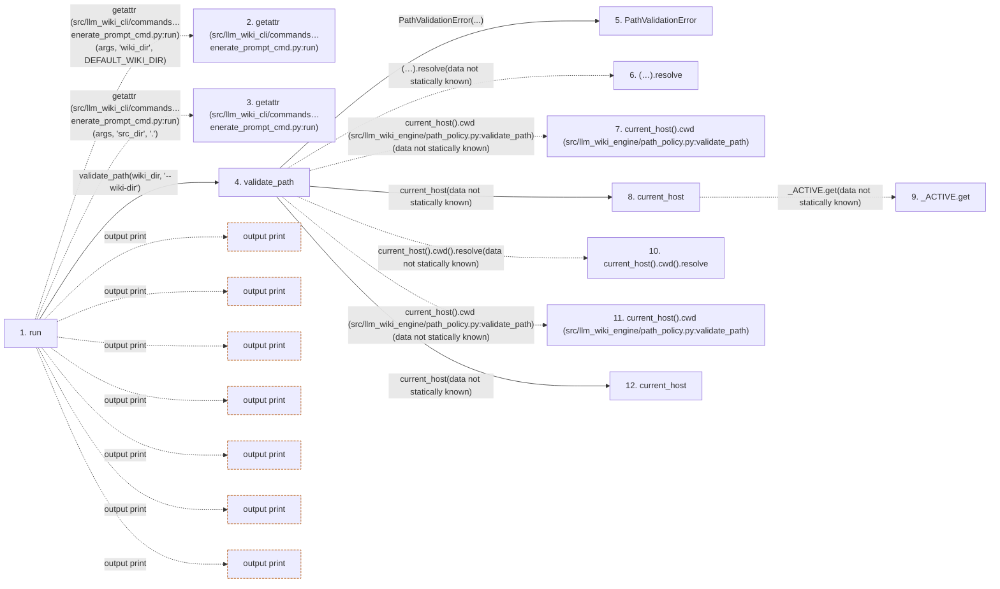

# generate-prompt

**Entry point:** `run` (`cli`)
**Source:** [generate_prompt_cmd](../modules/generate_prompt_cmd.md)
**Modules touched:** [canonical_json](../modules/canonical_json.md), [common](../modules/common.md), [config](../modules/config.md), [documentation_queries](../modules/documentation_queries.md), and 25 more

**Complete modules touched:**

- [canonical_json](../modules/canonical_json.md)
- [common](../modules/common.md)
- [config](../modules/config.md)
- [documentation_queries](../modules/documentation_queries.md)
- [documentation_query_builder](../modules/documentation_query_builder.md)
- [domain_pack](../modules/domain_pack.md)
- [extraction_service](../modules/extraction_service.md)
- [filesystem_guard](../modules/filesystem_guard.md)
- [generate_prompt_cmd](../modules/generate_prompt_cmd.md)
- [gitignore](../modules/gitignore.md)
- [host](../modules/host.md)
- [io](../modules/io.md)
- [knowledge_observability](../modules/knowledge_observability.md)
- [knowledge_storage](../modules/knowledge_storage.md)
- [knowledge_storage_io](../modules/knowledge_storage_io.md)
- [maintenance_state](../modules/maintenance_state.md)
- [manifest_storage](../modules/manifest_storage.md)
- [metrics](../modules/metrics.md)
- [path_policy](../modules/path_policy.md)
- [paths](../modules/paths.md)
- [plugins](../modules/plugins.md)
- [redaction](../modules/redaction.md)
- [secure_file](../modules/secure_file.md)
- [source_selection](../modules/source_selection.md)
- [source_snapshot](../modules/source_snapshot.md)
- [sync_manifest](../modules/sync_manifest.md)
- [team](../modules/team.md)
- [validation](../modules/validation.md)
- [wiki_git_policy](../modules/wiki_git_policy.md)

## Call sequence

> Static overview in presentation order, not runtime execution order. Arrows retain captured callers; representative internal continuations and boundary examples precede repeated helper detail.

<!-- Auto-generated from static call edges. Dashed arrows are external or unresolved calls. Reviewed runtime conditions and side effects belong in Behavior. -->

```mermaid
sequenceDiagram
    participant p0 as run
    participant p1 as validate_path
    participant p2 as validate_source_root
    participant p3 as team_prompt_template_default
    participant p4 as classify_wiki_git_policy
    participant p5 as _validated_prompt_snapshot
    participant p6 as _prompt_git_diff
    participant p7 as _build_prompt
    participant p8 as _redact_prompt_artifact
    participant p9 as resolve_agent
    participant p10 as record_event
    participant p11 as _selected_prompt_diff
    participant p12 as resolve_change_type
    participant p13 as write_private_text
    participant p14 as shell_quote
    participant p15 as load_team_config
    participant p16 as resolve_source_selection
    participant p17 as capture_source_selection_inputs
    participant p18 as read_config
    participant p19 as validate_live_query_source_selection
    participant p20 as _validated_prompt_selection_and_diff
    participant p21 as _indeterminate
    participant p22 as _iso_now
    participant p23 as _sanitize_metrics_value
    participant p24 as _template_values
    participant p25 as _run_git
    participant p26 as build_source_snapshot
    participant p27 as _render_prompt_body
    participant p28 as _render_repository_handoff
    participant p29 as getattr (src/llm_wiki_cli/commands…enerate_prompt_cmd.py:run)
    participant p30 as read_config(…).get
    p0->>p1: validate_path
    p0->>p2: validate_source_root
    p0->>p3: team_prompt_template_default
    p0->>p4: classify_wiki_git_policy
    p0->>p5: _validated_prompt_snapshot
    p0->>p6: _prompt_git_diff
    p0->>p7: _build_prompt
    p0->>p8: _redact_prompt_artifact
    p0->>p9: resolve_agent
    p0->>p10: record_event
    p0->>p11: _selected_prompt_diff
    p0->>p12: resolve_change_type
    p0->>p13: write_private_text
    p0->>p14: shell_quote
    p3->>p15: load_team_config
    p5->>p16: resolve_source_selection
    p5->>p17: capture_source_selection_inputs
    p9->>p18: read_config
    p5->>p19: validate_live_query_source_selection
    p7->>p20: _validated_prompt_selection_and_diff
    p4->>p21: _indeterminate
    p10->>p22: _iso_now
    p10->>p23: _sanitize_metrics_value
    p7->>p24: _template_values
    p4->>p25: _run_git
    p5->>p26: build_source_snapshot
    p7->>p27: _render_prompt_body
    p7->>p28: _render_repository_handoff
    p0-->>p29: getattr (src/llm_wiki_cli/commands…enerate_prompt_cmd.py:run)(args, 'wiki_dir', DEFAULT_WIKI_DIR)
    p9-->>p30: read_config(…).get('agent')
```

> Call sequence diagram shows 30 of 1396 interactions; 1366 omitted to keep the visualization within the 30-interaction and generated-diagram limits, with uncertain identities omitted rather than inferred.

> Captured boundary calls: external 1 of 423 (422 omitted); unresolved 1 of 395 (394 omitted). These counts cover the captured static trace.

Omitted captured detail, grouped by actual caller occurrence and target module:

| Caller | Parent step | Target module | Kind | Omitted interactions |
| --- | --- | --- | --- | --- |
| `src/llm_wiki_cli/commands/generate_prompt_cmd.py:run` | 1 | - | external | 20 |
| `src/llm_wiki_engine/path_policy.py:validate_path` | 4 | [src/llm_wiki_engine/path_policy.py](../modules/path_policy.md) | internal | 2 |
| `src/llm_wiki_engine/path_policy.py:validate_path` | 4 | - | unresolved | 5 |
| `src/llm_wiki_engine/path_policy.py:validate_path` | 4 | [src/llm_wiki_engine/host.py](../modules/host.md) | internal | 2 |
| `src/llm_wiki_engine/host.py:current_host` | 8 | - | unresolved | 1 |
| `src/llm_wiki_engine/path_policy.py:validate_source_root` | 17 | [src/llm_wiki_engine/path_policy.py](../modules/path_policy.md) | internal | 7 |
| `src/llm_wiki_engine/path_policy.py:validate_source_root` | 17 | - | unresolved | 6 |
| `src/llm_wiki_engine/path_policy.py:validate_source_root` | 17 | - | external | 10 |
> Omission summary shows 8 of 400 groups; 392 further groups are not expanded here. Counts above include all omitted interactions.
> Detailed flow queries retain their own coverage and limits; omitted paths may execute at runtime.

> Trace truncated at the depth limit; deeper calls are omitted.

## Data flow

<!-- Auto-generated static analysis. Treat values and boundaries as best-effort hints, not runtime proof. -->

### Analysis coverage

**Effect analysis partially available.** Flow assembly and source effect analysis are separate; empty observations do not prove an empty handler body.

Source steps: 579; effect analysis evaluated: 360, partial: 20, unavailable: 199. Counts include steps omitted from the displayed trace.

Collector observations for 380 source steps with known totals: observed: 2090, emitted: 2017, omitted: 73. Unavailable totals are excluded.

- Callable record unavailable for one or more source steps; those steps have no represented callable body.
- Effect collector omitted observations before flow assembly; displayed effects are partial.
- Effect collector totals unavailable; observed counts cover captured records only.

| Step | Callable record | Effect analysis | Collector totals | Observed | Emitted | Omitted |
|---|---|---|---|---:|---:|---:|
| `run` | `available` | `evaluated` | `available` | `15` | `15` | `0` |
| `getattr (src/llm_wiki_cli/commands…enerate_prompt_cmd.py:run)` | `not_applicable` | `not_applicable` | `not_applicable` | — | — | — |
| `getattr (src/llm_wiki_cli/commands…enerate_prompt_cmd.py:run)` | `not_applicable` | `not_applicable` | `not_applicable` | — | — | — |
| `validate_path` | `available` | `evaluated` | `available` | `3` | `3` | `0` |
| `PathValidationError` | `unavailable` | `unavailable` | `unavailable` | — | — | — |
| `(…).resolve` | `not_applicable` | `not_applicable` | `not_applicable` | — | — | — |
| `current_host().cwd (src/llm_wiki_engine/path_policy.py:validate_path)` | `not_applicable` | `not_applicable` | `not_applicable` | — | — | — |
| `current_host` | `available` | `evaluated` | `available` | `2` | `2` | `0` |
| `_ACTIVE.get` | `not_applicable` | `not_applicable` | `not_applicable` | — | — | — |
| `current_host().cwd().resolve` | `not_applicable` | `not_applicable` | `not_applicable` | — | — | — |
| `current_host().cwd (src/llm_wiki_engine/path_policy.py:validate_path)` | `not_applicable` | `not_applicable` | `not_applicable` | — | — | — |
| `current_host` | `available` | `evaluated` | `available` | `2` | `2` | `0` |

```mermaid
flowchart LR
    s1["1. run"]
    s2["2. getattr (src/llm_wiki_cli/commands…enerate_prompt_cmd.py:run)"]
    s3["3. getattr (src/llm_wiki_cli/commands…enerate_prompt_cmd.py:run)"]
    s4["4. validate_path"]
    s5["5. PathValidationError"]
    s6["6. (…).resolve"]
    s7["7. current_host().cwd (src/llm_wiki_engine/path_policy.py:validate_path)"]
    s8["8. current_host"]
    s9["9. _ACTIVE.get"]
    s10["10. current_host().cwd().resolve"]
    s11["11. current_host().cwd (src/llm_wiki_engine/path_policy.py:validate_path)"]
    s12["12. current_host"]
    s1 -. "getattr (src/llm_wiki_cli/commands…enerate_prompt_cmd.py:run)(args, 'wiki_dir', DEFAULT_WIKI_DIR)" .-> s2
    s1 -. "getattr (src/llm_wiki_cli/commands…enerate_prompt_cmd.py:run)(args, 'src_dir', '.')" .-> s3
    s1 -->|"validate_path(wiki_dir, '--wiki-dir')"| s4
    s4 -->|"PathValidationError(...)"| s5
    s4 -. "(…).resolve(data not statically known)" .-> s6
    s4 -. "current_host().cwd (src/llm_wiki_engine/path_policy.py:validate_path)(data not statically known)" .-> s7
    s4 -->|"current_host(data not statically known)"| s8
    s8 -. "_ACTIVE.get(data not statically known)" .-> s9
    s4 -. "current_host().cwd().resolve(data not statically known)" .-> s10
    s4 -. "current_host().cwd (src/llm_wiki_engine/path_policy.py:validate_path)(data not statically known)" .-> s11
    s4 -->|"current_host(data not statically known)"| s12
    b0["output print"]
    s1 -. "output print" .-> b0
    b1["output print"]
    s1 -. "output print" .-> b1
    b2["output print"]
    s1 -. "output print" .-> b2
    b3["output print"]
    s1 -. "output print" .-> b3
    b4["output print"]
    s1 -. "output print" .-> b4
    b5["output print"]
    s1 -. "output print" .-> b5
    b6["output print"]
    s1 -. "output print" .-> b6
    click s1 "../modules/generate_prompt_cmd.md"
    click s4 "../modules/path_policy.md"
    click s5 "../modules/path_policy.md"
    click s8 "../modules/host.md"
    click s12 "../modules/host.md"
    classDef boundary stroke:#b45309,stroke-dasharray: 4 2
    class b0 boundary
    class b1 boundary
    class b2 boundary
    class b3 boundary
    class b4 boundary
    class b5 boundary
    class b6 boundary
```

### Step data

| Step | Inputs | Reads | Writes | Returns |
|---|---|---|---|---|
| `run` | `args` | `DEFAULT_WIKI_DIR`, `_DEFAULT_PROMPT_FILE`, `TeamConfigError`, `sys`, `PluginError`, `sys` | - | `none` |
| `getattr (src/llm_wiki_cli/commands…enerate_prompt_cmd.py:run)` | - | - | - | - |
| `getattr (src/llm_wiki_cli/commands…enerate_prompt_cmd.py:run)` | - | - | - | - |
| `validate_path` | `path: str`, `label: str` | - | - | `resolved` |
| `PathValidationError` | - | - | - | - |
| `(…).resolve` | - | - | - | - |
| `current_host().cwd (src/llm_wiki_engine/path_policy.py:validate_path)` | - | - | - | - |
| `current_host` | - | `_DEFAULT` | - | `...` |
| `_ACTIVE.get` | - | - | - | - |
| `current_host().cwd().resolve` | - | - | - | - |
| `current_host().cwd (src/llm_wiki_engine/path_policy.py:validate_path)` | - | - | - | - |
| `current_host` | - | `_DEFAULT` | - | `...` |

### Call data

| From | To | Line | Call |
|---|---|---:|---|
| run | getattr (src/llm_wiki_cli/commands…enerate_prompt_cmd.py:run) | 644 | `getattr(args, 'wiki_dir', DEFAULT_WIKI_DIR)` |
| run | getattr (src/llm_wiki_cli/commands…enerate_prompt_cmd.py:run) | 645 | `getattr(args, 'src_dir', '.')` |
| run | validate_path | 646 | `validate_path(wiki_dir, '--wiki-dir')` |
| validate_path | PathValidationError | 100 | `PathValidationError(...)` |
| validate_path | (…).resolve | 101 | `(current_host().cwd() / path).resolve(data not statically known)` |
| validate_path | current_host().cwd (src/llm_wiki_engine/path_policy.py:validate_path) | 101 | `current_host().cwd(data not statically known)` |
| validate_path | current_host | 101 | `current_host(data not statically known)` |
| current_host | _ACTIVE.get | 166 | `_ACTIVE.get(data not statically known)` |
| validate_path | current_host().cwd().resolve | 102 | `current_host().cwd().resolve(data not statically known)` |
| validate_path | current_host().cwd (src/llm_wiki_engine/path_policy.py:validate_path) | 102 | `current_host().cwd(data not statically known)` |
| validate_path | current_host | 102 | `current_host(data not statically known)` |

### Boundary effects

| Kind | Target | Step | Line |
|---|---|---|---:|
| output | `print` | `run` | 663 |
| output | `print` | `run` | 688 |
| output | `print` | `run` | 702 |
| output | `print` | `run` | 735 |
| output | `print` | `run` | 736 |
| output | `print` | `run` | 737 |
| output | `print` | `run` | 738 |

### Static analysis gaps

| Kind | Step | Target | Line |
|---|---|---|---:|
| external_call | `run` | `getattr` | 644 |
| external_call | `run` | `getattr` | 645 |
| unresolved_call | `validate_path` | `(current_host().cwd() / path).resolve` | 101 |
| unresolved_call | `validate_path` | `current_host().cwd` | 101 |
| unresolved_call | `current_host` | `_ACTIVE.get` | 166 |
| unresolved_call | `validate_path` | `current_host().cwd().resolve` | 102 |
| unresolved_call | `validate_path` | `current_host().cwd` | 102 |
| step_limit | `run` | `first 12 steps` | 0 |
| truncated_flow | `run` | `depth limit` | 0 |

## Behavior

This flow starts at `run` and is classified as `cli`. The generated call and data-flow sections are bounded static projections; runtime conditions and side effects require source-level confirmation.
