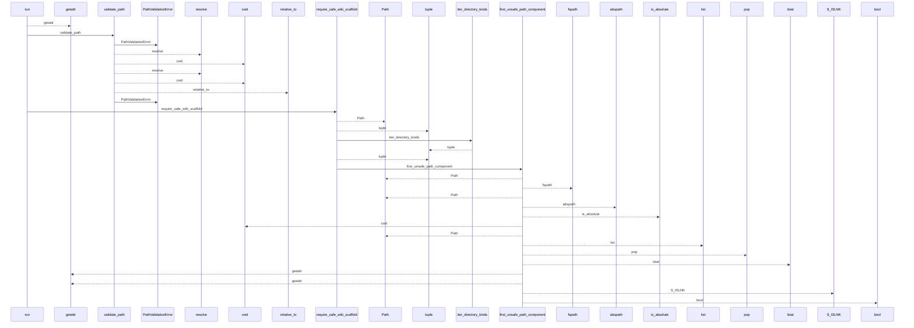
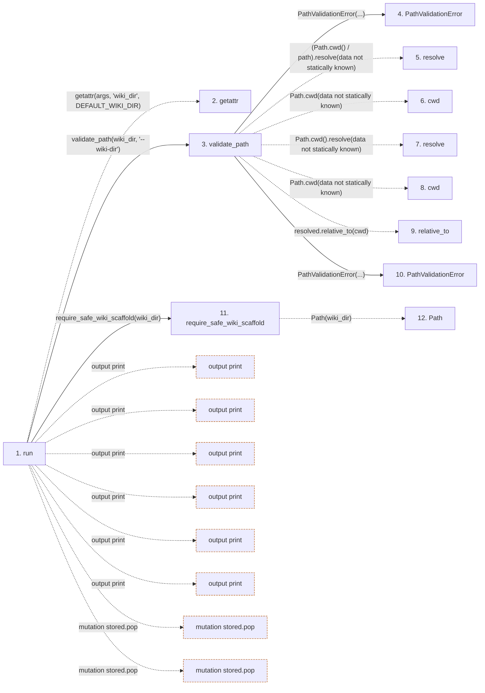

# init

**Entry point:** `run` (`cli`)
**Source:** [init_cmd](../modules/init_cmd.md)
**Modules touched:** [config](../modules/config.md), [filesystem_guard](../modules/filesystem_guard.md), [init_cmd](../modules/init_cmd.md), [io](../modules/io.md), and 9 more

**Complete modules touched:**

- [config](../modules/config.md)
- [filesystem_guard](../modules/filesystem_guard.md)
- [init_cmd](../modules/init_cmd.md)
- [io](../modules/io.md)
- [knowledge_evidence](../modules/knowledge_evidence.md)
- [paths](../modules/paths.md)
- [rendering_lifecycle](../modules/rendering_lifecycle.md)
- [services_schema](../modules/services_schema.md)
- [skills](../modules/skills.md)
- [source_selection](../modules/source_selection.md)
- [validation](../modules/validation.md)
- [wiki_lifecycle](../modules/wiki_lifecycle.md)
- [wiki_surface](../modules/wiki_surface.md)

## Call sequence

<!-- Auto-generated from static call edges. Dashed arrows are external or unresolved calls. Reviewed runtime conditions and side effects belong in Behavior. -->

> Call sequence diagram shows 30 of 1319 interactions; 1289 omitted to keep the visualization within the 30-interaction and generated-diagram limits.

> Trace truncated at the depth limit; deeper calls are omitted.

## Data flow

<!-- Auto-generated static analysis. Treat values and boundaries as best-effort hints, not runtime proof. -->

### Step data

| Step | Inputs | Reads | Writes | Returns |
|---|---|---|---|---|
| `run` | `args` | `DEFAULT_WIKI_DIR`, `WikiScaffoldPathError`, `sys`, `AgentConfigState`, `sys`, `AgentConfigState`, `AgentConfigState`, `sys` | `config[...]` | - |
| `getattr` | - | - | - | - |
| `validate_path` | `path: str`, `label: str` | - | - | `resolved` |
| `PathValidationError` | - | - | - | - |
| `resolve` | - | - | - | - |
| `cwd` | - | - | - | - |
| `resolve` | - | - | - | - |
| `cwd` | - | - | - | - |
| `relative_to` | - | - | - | - |
| `PathValidationError` | - | - | - | - |
| `require_safe_wiki_scaffold` | `wiki_dir: Union[str, Path]` | - | - | - |
| `Path` | - | - | - | - |

### Call data

| From | To | Line | Call |
|---|---|---:|---|
| run | getattr | 94 | `getattr(args, 'wiki_dir', DEFAULT_WIKI_DIR)` |
| run | validate_path | 95 | `validate_path(wiki_dir, '--wiki-dir')` |
| validate_path | PathValidationError | 132 | `PathValidationError(...)` |
| validate_path | resolve | 133 | `(Path.cwd() / path).resolve(data not statically known)` |
| validate_path | cwd | 133 | `Path.cwd(data not statically known)` |
| validate_path | resolve | 134 | `Path.cwd().resolve(data not statically known)` |
| validate_path | cwd | 134 | `Path.cwd(data not statically known)` |
| validate_path | relative_to | 136 | `resolved.relative_to(cwd)` |
| validate_path | PathValidationError | 138 | `PathValidationError(...)` |
| run | require_safe_wiki_scaffold | 97 | `require_safe_wiki_scaffold(wiki_dir)` |
| require_safe_wiki_scaffold | Path | 43 | `Path(wiki_dir)` |

### Boundary effects

| Kind | Target | Step | Line |
|---|---|---|---:|
| output | `print` | `run` | 100 |
| output | `print` | `run` | 113 |
| output | `print` | `run` | 125 |
| output | `print` | `run` | 136 |
| output | `print` | `run` | 144 |
| output | `print` | `run` | 153 |
| mutation | `stored.pop` | `run` | 161 |
| mutation | `stored.pop` | `run` | 162 |

### Static analysis gaps

| Kind | Step | Target | Line |
|---|---|---|---:|
| unresolved_call | `run` | `getattr` | 94 |
| unresolved_call | `validate_path` | `(Path.cwd() / path).resolve` | 133 |
| external_call | `validate_path` | `Path.cwd` | 133 |
| external_call | `validate_path` | `Path.cwd().resolve` | 134 |
| external_call | `validate_path` | `Path.cwd` | 134 |
| unresolved_call | `validate_path` | `resolved.relative_to` | 136 |
| step_limit | `run` | `first 12 steps` | 0 |
| truncated_flow | `run` | `depth limit` | 0 |

## Behavior

This flow starts at `run` and is classified as `cli`. The generated call and data-flow sections are bounded static projections; runtime conditions and side effects require source-level confirmation.
