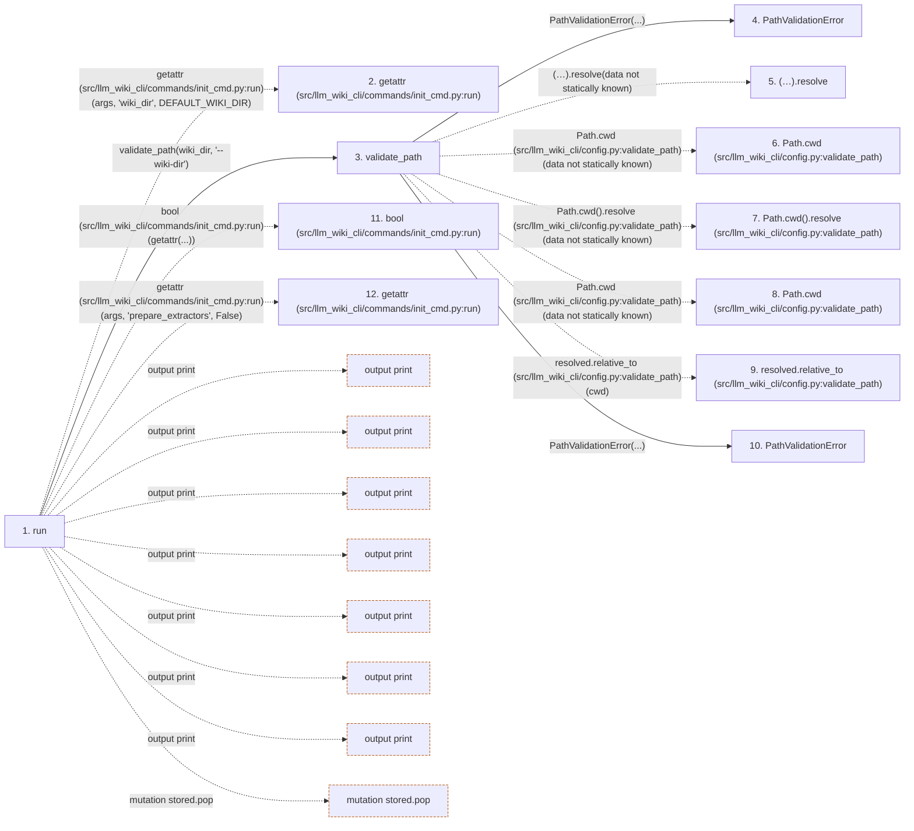

# init

**Entry point:** `run` (`cli`)
**Source:** [init_cmd](../modules/init_cmd.md)
**Modules touched:** [common](../modules/common.md), [config](../modules/config.md), [extractor_helpers](../modules/extractor_helpers.md), [filesystem_guard](../modules/filesystem_guard.md), and 13 more

**Complete modules touched:**

- [common](../modules/common.md)
- [config](../modules/config.md)
- [extractor_helpers](../modules/extractor_helpers.md)
- [filesystem_guard](../modules/filesystem_guard.md)
- [helper_preparation](../modules/helper_preparation.md)
- [init_cmd](../modules/init_cmd.md)
- [io](../modules/io.md)
- [knowledge_evidence](../modules/knowledge_evidence.md)
- [paths](../modules/paths.md)
- [rendering_lifecycle](../modules/rendering_lifecycle.md)
- [services_schema](../modules/services_schema.md)
- [skills](../modules/skills.md)
- [source_selection](../modules/source_selection.md)
- [source_snapshot](../modules/source_snapshot.md)
- [validation](../modules/validation.md)
- [wiki_lifecycle](../modules/wiki_lifecycle.md)
- [wiki_surface](../modules/wiki_surface.md)

## Call sequence

<!-- Auto-generated from static call edges. Dashed arrows are external or unresolved calls. Reviewed runtime conditions and side effects belong in Behavior. -->

```mermaid
sequenceDiagram
    participant p0 as run
    participant p1 as getattr (src/llm_wiki_cli/commands/init_cmd.py:run)
    participant p2 as validate_path
    participant p3 as PathValidationError
    participant p4 as (…).resolve
    participant p5 as Path.cwd (src/llm_wiki_cli/config.py:validate_path)
    participant p6 as Path.cwd().resolve (src/llm_wiki_cli/config.py:validate_path)
    participant p7 as resolved.relative_to (src/llm_wiki_cli/config.py:validate_path)
    participant p8 as bool (src/llm_wiki_cli/commands/init_cmd.py:run)
    participant p9 as print
    participant p10 as SystemExit
    participant p11 as require_safe_wiki_scaffold
    participant p12 as Path (src/llm_wiki_cli/services…equire_safe_wiki_scaffold)
    participant p13 as tuple (src/llm_wiki_cli/services…equire_safe_wiki_scaffold)
    participant p14 as iter_directory_kinds
    participant p15 as tuple (src/llm_wiki_cli/services…e.py:iter_directory_kinds)
    participant p16 as first_unsafe_path_component
    participant p17 as Path (src/llm_wiki_cli/services…rst_unsafe_path_component)
    participant p18 as os.fspath (src/llm_wiki_cli/services…rst_unsafe_path_component)
    participant p19 as os.path.abspath (src/llm_wiki_cli/services…rst_unsafe_path_component)
    participant p20 as lexical.is_absolute
    participant p21 as Path.cwd (src/llm_wiki_cli/services…rst_unsafe_path_component)
    participant p22 as list (src/llm_wiki_cli/services…rst_unsafe_path_component)
    participant p23 as pending_parts.pop
    p0-->>p1: getattr (src/llm_wiki_cli/commands/init_cmd.py:run)
    p0->>p2: validate_path
    p2->>p3: PathValidationError
    p2-->>p4: (…).resolve
    p2-->>p5: Path.cwd (src/llm_wiki_cli/config.py:validate_path)
    p2-->>p6: Path.cwd().resolve (src/llm_wiki_cli/config.py:validate_path)
    p2-->>p5: Path.cwd (src/llm_wiki_cli/config.py:validate_path)
    p2-->>p7: resolved.relative_to (src/llm_wiki_cli/config.py:validate_path)
    p2->>p3: PathValidationError
    p0-->>p8: bool (src/llm_wiki_cli/commands/init_cmd.py:run)
    p0-->>p1: getattr (src/llm_wiki_cli/commands/init_cmd.py:run)
    p0-->>p1: getattr (src/llm_wiki_cli/commands/init_cmd.py:run)
    p0-->>p9: print
    p0-->>p10: SystemExit
    p0->>p11: require_safe_wiki_scaffold
    p11-->>p12: Path (src/llm_wiki_cli/services…equire_safe_wiki_scaffold)
    p11-->>p13: tuple (src/llm_wiki_cli/services…equire_safe_wiki_scaffold)
    p11->>p14: iter_directory_kinds
    p14-->>p15: tuple (src/llm_wiki_cli/services…e.py:iter_directory_kinds)
    p11-->>p13: tuple (src/llm_wiki_cli/services…equire_safe_wiki_scaffold)
    p11->>p16: first_unsafe_path_component
    p16-->>p17: Path (src/llm_wiki_cli/services…rst_unsafe_path_component)
    p16-->>p18: os.fspath (src/llm_wiki_cli/services…rst_unsafe_path_component)
    p16-->>p17: Path (src/llm_wiki_cli/services…rst_unsafe_path_component)
    p16-->>p19: os.path.abspath (src/llm_wiki_cli/services…rst_unsafe_path_component)
    p16-->>p20: lexical.is_absolute
    p16-->>p21: Path.cwd (src/llm_wiki_cli/services…rst_unsafe_path_component)
    p16-->>p17: Path (src/llm_wiki_cli/services…rst_unsafe_path_component)
    p16-->>p22: list (src/llm_wiki_cli/services…rst_unsafe_path_component)
    p16-->>p23: pending_parts.pop
```

> Call sequence diagram shows 30 of 1878 interactions; 1848 omitted to keep the visualization within the 30-interaction and generated-diagram limits.

> Trace truncated at the depth limit; deeper calls are omitted.

## Data flow

<!-- Auto-generated static analysis. Treat values and boundaries as best-effort hints, not runtime proof. -->

```mermaid
flowchart LR
    s1["1. run"]
    s2["2. getattr (src/llm_wiki_cli/commands/init_cmd.py:run)"]
    s3["3. validate_path"]
    s4["4. PathValidationError"]
    s5["5. (…).resolve"]
    s6["6. Path.cwd (src/llm_wiki_cli/config.py:validate_path)"]
    s7["7. Path.cwd().resolve (src/llm_wiki_cli/config.py:validate_path)"]
    s8["8. Path.cwd (src/llm_wiki_cli/config.py:validate_path)"]
    s9["9. resolved.relative_to (src/llm_wiki_cli/config.py:validate_path)"]
    s10["10. PathValidationError"]
    s11["11. bool (src/llm_wiki_cli/commands/init_cmd.py:run)"]
    s12["12. getattr (src/llm_wiki_cli/commands/init_cmd.py:run)"]
    s1 -. "getattr (src/llm_wiki_cli/commands/init_cmd.py:run)(args, 'wiki_dir', DEFAULT_WIKI_DIR)" .-> s2
    s1 -->|"validate_path(wiki_dir, '--wiki-dir')"| s3
    s3 -->|"PathValidationError(...)"| s4
    s3 -. "(…).resolve(data not statically known)" .-> s5
    s3 -. "Path.cwd (src/llm_wiki_cli/config.py:validate_path)(data not statically known)" .-> s6
    s3 -. "Path.cwd().resolve (src/llm_wiki_cli/config.py:validate_path)(data not statically known)" .-> s7
    s3 -. "Path.cwd (src/llm_wiki_cli/config.py:validate_path)(data not statically known)" .-> s8
    s3 -. "resolved.relative_to (src/llm_wiki_cli/config.py:validate_path)(cwd)" .-> s9
    s3 -->|"PathValidationError(...)"| s10
    s1 -. "bool (src/llm_wiki_cli/commands/init_cmd.py:run)(getattr(...))" .-> s11
    s1 -. "getattr (src/llm_wiki_cli/commands/init_cmd.py:run)(args, 'prepare_extractors', False)" .-> s12
    b0["output print"]
    s1 -. "output print" .-> b0
    b1["output print"]
    s1 -. "output print" .-> b1
    b2["output print"]
    s1 -. "output print" .-> b2
    b3["output print"]
    s1 -. "output print" .-> b3
    b4["output print"]
    s1 -. "output print" .-> b4
    b5["output print"]
    s1 -. "output print" .-> b5
    b6["output print"]
    s1 -. "output print" .-> b6
    b7["mutation stored.pop"]
    s1 -. "mutation stored.pop" .-> b7
    click s1 "../modules/init_cmd.md"
    click s3 "../modules/config.md"
    click s4 "../modules/config.md"
    click s10 "../modules/config.md"
    classDef boundary stroke:#b45309,stroke-dasharray: 4 2
    class b0 boundary
    class b1 boundary
    class b2 boundary
    class b3 boundary
    class b4 boundary
    class b5 boundary
    class b6 boundary
    class b7 boundary
```

### Step data

| Step | Inputs | Reads | Writes | Returns |
|---|---|---|---|---|
| `run` | `args` | `DEFAULT_WIKI_DIR`, `sys`, `WikiScaffoldPathError`, `sys`, `AgentConfigState`, `sys`, `AgentConfigState`, `AgentConfigState` | `config[...]` | - |
| `getattr (src/llm_wiki_cli/commands/init_cmd.py:run)` | - | - | - | - |
| `validate_path` | `path: str`, `label: str` | - | - | `resolved` |
| `PathValidationError` | - | - | - | - |
| `(…).resolve` | - | - | - | - |
| `Path.cwd (src/llm_wiki_cli/config.py:validate_path)` | - | - | - | - |
| `Path.cwd().resolve (src/llm_wiki_cli/config.py:validate_path)` | - | - | - | - |
| `Path.cwd (src/llm_wiki_cli/config.py:validate_path)` | - | - | - | - |
| `resolved.relative_to (src/llm_wiki_cli/config.py:validate_path)` | - | - | - | - |
| `PathValidationError` | - | - | - | - |
| `bool (src/llm_wiki_cli/commands/init_cmd.py:run)` | - | - | - | - |
| `getattr (src/llm_wiki_cli/commands/init_cmd.py:run)` | - | - | - | - |

### Call data

| From | To | Line | Call |
|---|---|---:|---|
| run | getattr (src/llm_wiki_cli/commands/init_cmd.py:run) | 96 | `getattr(args, 'wiki_dir', DEFAULT_WIKI_DIR)` |
| run | validate_path | 97 | `validate_path(wiki_dir, '--wiki-dir')` |
| validate_path | PathValidationError | 134 | `PathValidationError(...)` |
| validate_path | (…).resolve | 135 | `(Path.cwd() / path).resolve(data not statically known)` |
| validate_path | Path.cwd (src/llm_wiki_cli/config.py:validate_path) | 135 | `Path.cwd(data not statically known)` |
| validate_path | Path.cwd().resolve (src/llm_wiki_cli/config.py:validate_path) | 136 | `Path.cwd().resolve(data not statically known)` |
| validate_path | Path.cwd (src/llm_wiki_cli/config.py:validate_path) | 136 | `Path.cwd(data not statically known)` |
| validate_path | resolved.relative_to (src/llm_wiki_cli/config.py:validate_path) | 138 | `resolved.relative_to(cwd)` |
| validate_path | PathValidationError | 140 | `PathValidationError(...)` |
| run | bool (src/llm_wiki_cli/commands/init_cmd.py:run) | 98 | `bool(getattr(...))` |
| run | getattr (src/llm_wiki_cli/commands/init_cmd.py:run) | 98 | `getattr(args, 'prepare_extractors', False)` |

### Boundary effects

| Kind | Target | Step | Line |
|---|---|---|---:|
| output | `print` | `run` | 101 |
| output | `print` | `run` | 110 |
| output | `print` | `run` | 123 |
| output | `print` | `run` | 135 |
| output | `print` | `run` | 146 |
| output | `print` | `run` | 154 |
| output | `print` | `run` | 163 |
| mutation | `stored.pop` | `run` | 171 |

### Static analysis gaps

| Kind | Step | Target | Line |
|---|---|---|---:|
| external_call | `run` | `getattr` | 96 |
| unresolved_call | `validate_path` | `(Path.cwd() / path).resolve` | 135 |
| external_call | `validate_path` | `Path.cwd` | 135 |
| unresolved_call | `validate_path` | `Path.cwd().resolve` | 136 |
| external_call | `validate_path` | `Path.cwd` | 136 |
| unresolved_call | `validate_path` | `resolved.relative_to` | 138 |
| external_call | `run` | `getattr` | 98 |
| step_limit | `run` | `first 12 steps` | 0 |
| truncated_flow | `run` | `depth limit` | 0 |

## Behavior

Initialization validates existing workspace and agent state before creating or
refreshing the wiki scaffold and managed instructions. With
`--prepare-extractors`, it first detects selected helper languages and prepares
missing or stale artifacts in the helper cache. A preparation failure reports
the prerequisite and stops before scaffold or configuration changes. A retry
reuses helpers already prepared successfully. Preparation is opt-in for each
invocation and may download dependencies or compile bundled helpers.
