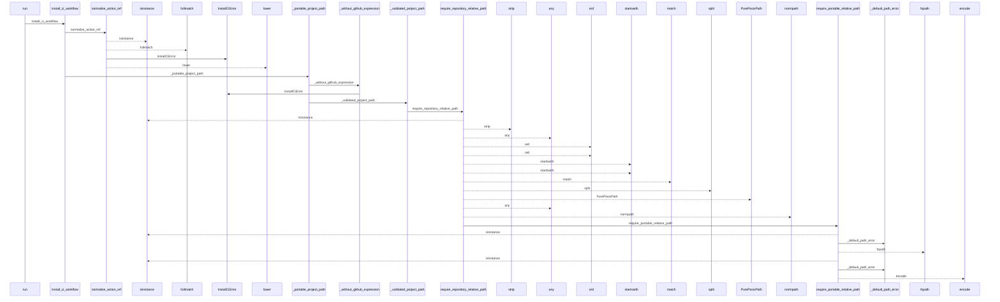
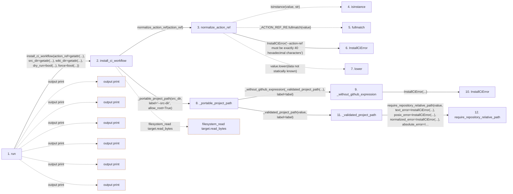

# install-ci

**Entry point:** `run` (`cli`)
**Source:** [install_ci_cmd](../modules/install_ci_cmd.md)
**Modules touched:** [ci_installer](../modules/ci_installer.md), [config](../modules/config.md), [install_ci_cmd](../modules/install_ci_cmd.md), [io](../modules/io.md), and 4 more

**Complete modules touched:**

- [ci_installer](../modules/ci_installer.md)
- [config](../modules/config.md)
- [install_ci_cmd](../modules/install_ci_cmd.md)
- [io](../modules/io.md)
- [source_selection](../modules/source_selection.md)
- [validation](../modules/validation.md)
- [wiki_lifecycle](../modules/wiki_lifecycle.md)
- [wiki_surface](../modules/wiki_surface.md)

## Call sequence

<!-- Auto-generated from static call edges. Dashed arrows are external or unresolved calls. Reviewed runtime conditions and side effects belong in Behavior. -->

> Call sequence diagram shows 30 of 383 interactions; 353 omitted to keep the visualization within the 30-interaction and generated-diagram limits.

> Trace truncated at the depth limit; deeper calls are omitted.

## Data flow

<!-- Auto-generated static analysis. Treat values and boundaries as best-effort hints, not runtime proof. -->

### Step data

| Step | Inputs | Reads | Writes | Returns |
|---|---|---|---|---|
| `run` | `args` | `DEFAULT_WIKI_DIR`, `InstallCiError`, `sys` | - | `none`, `none` |
| `install_ci_workflow` | `action_ref: str`, `src_dir: str`, `wiki_dir: str`, `dry_run: bool`, `force: bool`, `project_root: str \| Path \| None` | `WikiLifecycleState`, `MANIFEST_FILENAME`, `MANAGED_WORKFLOW_PATH`, `MANAGED_WORKFLOW_PATH`, `MANAGED_WORKFLOW_PATH`, `MANAGED_WORKFLOW_PATH`, `MANAGED_WORKFLOW_PATH` | - | `InstallCiResult(...)`, `InstallCiResult(...)` |
| `normalize_action_ref` | `value: object` | - | - | `value.lower(...)` |
| `isinstance` | - | - | - | - |
| `fullmatch` | - | - | - | - |
| `InstallCiError` | - | - | - | - |
| `lower` | - | - | - | - |
| `_portable_project_path` | `value: object`, `label: str`, `allow_root: bool` | - | - | `'.'`, `_without_github_expression(...)` |
| `_without_github_expression` | `path: str`, `label: str` | - | - | `path` |
| `InstallCiError` | - | - | - | - |
| `_validated_project_path` | `value: object`, `label: str` | - | - | `require_repository_relative_path(...)` |
| `require_repository_relative_path` | `value: object`, `text_error: Exception`, `posix_error: Exception`, `normalized_error: Exception`, `absolute_error: Exception \| None`, `separator_error: Exception \| None`, `control_error: Exception \| None`, `reject_delete_character: bool` | - | - | `require_portable_relative_path(...)` |

### Call data

| From | To | Line | Call |
|---|---|---:|---|
| run | install_ci_workflow | 13 | `install_ci_workflow(action_ref=getattr(...), src_dir=getattr(...), wiki_dir=getattr(...), dry_run=bool(...), force=bool(...))` |
| install_ci_workflow | normalize_action_ref | 292 | `normalize_action_ref(action_ref)` |
| normalize_action_ref | isinstance | 63 | `isinstance(value, str)` |
| normalize_action_ref | fullmatch | 63 | `_ACTION_REF_RE.fullmatch(value)` |
| normalize_action_ref | InstallCiError | 64 | `InstallCiError('--action-ref must be exactly 40 hexadecimal characters')` |
| normalize_action_ref | lower | 65 | `value.lower(data not statically known)` |
| install_ci_workflow | _portable_project_path | 293 | `_portable_project_path(src_dir, label='--src-dir', allow_root=True)` |
| _portable_project_path | _without_github_expression | 100 | `_without_github_expression(_validated_project_path(...), label=label)` |
| _without_github_expression | InstallCiError | 93 | `InstallCiError(...)` |
| _portable_project_path | _validated_project_path | 101 | `_validated_project_path(value, label=label)` |
| _validated_project_path | require_repository_relative_path | 69 | `require_repository_relative_path(value, text_error=InstallCiError(...), posix_error=InstallCiError(...), normalized_error=InstallCiError(...), absolute_error=InstallCiError(...), separator_error=InstallCiError(...), control_error=InstallCiError(...), reject_delete_character=True, leading_backslash_is_absolute=True, portability_error=InstallCiError(...))` |

### Boundary effects

| Kind | Target | Step | Line |
|---|---|---|---:|
| output | `print` | `run` | 21 |
| output | `print` | `run` | 25 |
| output | `print` | `run` | 30 |
| output | `print` | `run` | 31 |
| output | `print` | `run` | 35 |
| output | `print` | `run` | 36 |
| filesystem_read | `target.read_bytes` | `install_ci_workflow` | 323 |

### Static analysis gaps

| Kind | Step | Target | Line |
|---|---|---|---:|
| unresolved_call | `normalize_action_ref` | `isinstance` | 63 |
| unresolved_call | `normalize_action_ref` | `_ACTION_REF_RE.fullmatch` | 63 |
| unresolved_call | `normalize_action_ref` | `value.lower` | 65 |
| step_limit | `run` | `first 12 steps` | 0 |
| truncated_flow | `run` | `depth limit` | 0 |

## Behavior

The command requires an initialized managed wiki whose persisted source-selection
identity is compatible with default profile discovery. It accepts only a complete
40-character action commit and portable, exact-case project-relative source and
wiki paths, then writes only `.github/workflows/llm-wiki-integrity.yml`.

An identical workflow is a byte-preserving no-op. A checksum-valid workflow
previously installed by the command can be updated, while an unmanaged or locally
modified target is preserved unless `--force` is explicit. `--dry-run` reports the
planned create or update without writing. Validation and write failures return a
nonzero CLI status.
