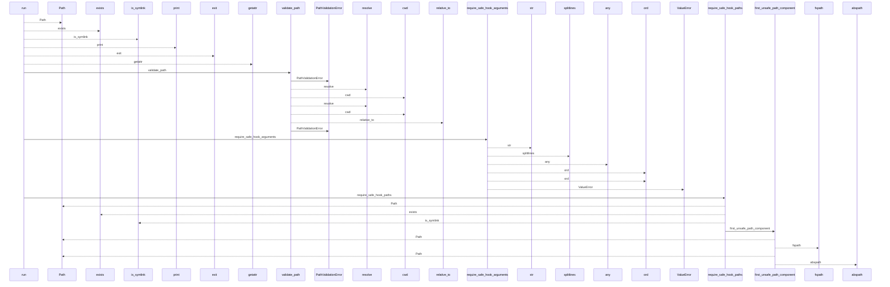
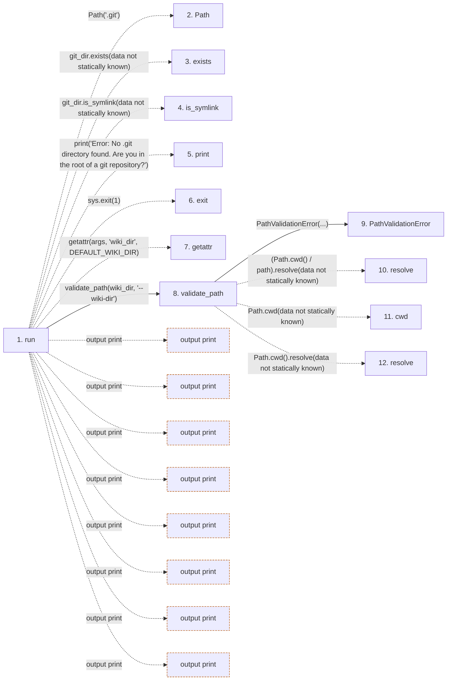

# install-hook

**Entry point:** `run` (`cli`)
**Source:** [hook_cmd](../modules/hook_cmd.md)
**Modules touched:** [config](../modules/config.md), [filesystem_guard](../modules/filesystem_guard.md), [hook_cmd](../modules/hook_cmd.md), [io](../modules/io.md), and 4 more

**Complete modules touched:**

- [config](../modules/config.md)
- [filesystem_guard](../modules/filesystem_guard.md)
- [hook_cmd](../modules/hook_cmd.md)
- [io](../modules/io.md)
- [knowledge_evidence](../modules/knowledge_evidence.md)
- [paths](../modules/paths.md)
- [source_selection](../modules/source_selection.md)
- [validation](../modules/validation.md)

## Call sequence

<!-- Auto-generated from static call edges. Dashed arrows are external or unresolved calls. Reviewed runtime conditions and side effects belong in Behavior. -->

> Call sequence diagram shows 30 of 954 interactions; 924 omitted to keep the visualization within the 30-interaction and generated-diagram limits.

> Trace truncated at the depth limit; deeper calls are omitted.

## Data flow

<!-- Auto-generated static analysis. Treat values and boundaries as best-effort hints, not runtime proof. -->

### Step data

| Step | Inputs | Reads | Writes | Returns |
|---|---|---|---|---|
| `run` | `args` | `DEFAULT_WIKI_DIR`, `sys`, `_EXPECTED_HOOK_UNSET`, `AgentConfigState`, `sys`, `sys`, `AgentConfigState`, `sys` | `stored[...]` | - |
| `Path` | - | - | - | - |
| `exists` | - | - | - | - |
| `is_symlink` | - | - | - | - |
| `print` | - | - | - | - |
| `exit` | - | - | - | - |
| `getattr` | - | - | - | - |
| `validate_path` | `path: str`, `label: str` | - | - | `resolved` |
| `PathValidationError` | - | - | - | - |
| `resolve` | - | - | - | - |
| `cwd` | - | - | - | - |
| `resolve` | - | - | - | - |

### Call data

| From | To | Line | Call |
|---|---|---:|---|
| run | Path | 591 | `Path('.git')` |
| run | exists | 592 | `git_dir.exists(data not statically known)` |
| run | is_symlink | 592 | `git_dir.is_symlink(data not statically known)` |
| run | print | 593 | `print('Error: No .git directory found. Are you in the root of a git repository?')` |
| run | exit | 596 | `sys.exit(1)` |
| run | getattr | 598 | `getattr(args, 'wiki_dir', DEFAULT_WIKI_DIR)` |
| run | validate_path | 599 | `validate_path(wiki_dir, '--wiki-dir')` |
| validate_path | PathValidationError | 132 | `PathValidationError(...)` |
| validate_path | resolve | 133 | `(Path.cwd() / path).resolve(data not statically known)` |
| validate_path | cwd | 133 | `Path.cwd(data not statically known)` |
| validate_path | resolve | 134 | `Path.cwd().resolve(data not statically known)` |

### Boundary effects

| Kind | Target | Step | Line |
|---|---|---|---:|
| output | `print` | `run` | 593 |
| output | `print` | `run` | 604 |
| output | `print` | `run` | 624 |
| output | `print` | `run` | 632 |
| output | `print` | `run` | 660 |
| output | `print` | `run` | 664 |
| output | `print` | `run` | 672 |
| output | `print` | `run` | 678 |

### Static analysis gaps

| Kind | Step | Target | Line |
|---|---|---|---:|
| unresolved_call | `run` | `git_dir.exists` | 592 |
| unresolved_call | `run` | `git_dir.is_symlink` | 592 |
| external_call | `run` | `sys.exit` | 596 |
| unresolved_call | `run` | `getattr` | 598 |
| unresolved_call | `validate_path` | `(Path.cwd() / path).resolve` | 133 |
| external_call | `validate_path` | `Path.cwd` | 133 |
| external_call | `validate_path` | `Path.cwd().resolve` | 134 |
| step_limit | `run` | `first 12 steps` | 0 |
| truncated_flow | `run` | `depth limit` | 0 |

## Behavior

This flow starts at `run` and is classified as `cli`. The generated call and data-flow sections are bounded static projections; runtime conditions and side effects require source-level confirmation.
