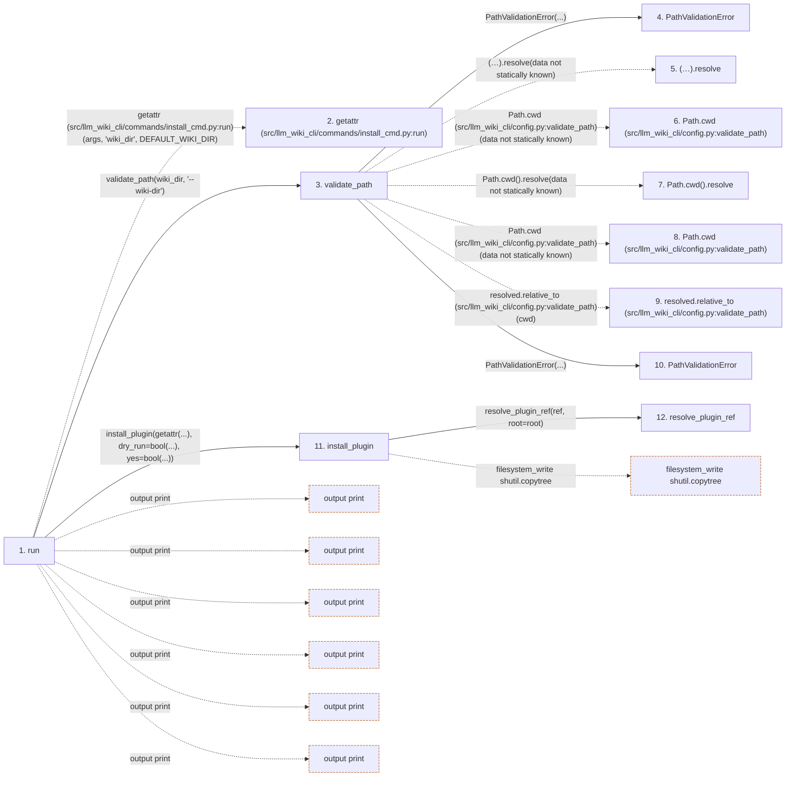

# install

**Entry point:** `run` (`cli`)
**Source:** [install_cmd](../modules/install_cmd.md)
**Modules touched:** [config](../modules/config.md), [install_cmd](../modules/install_cmd.md), [io](../modules/io.md), [plugins](../modules/plugins.md), and 2 more

**Complete modules touched:**

- [config](../modules/config.md)
- [install_cmd](../modules/install_cmd.md)
- [io](../modules/io.md)
- [plugins](../modules/plugins.md)
- [services_schema](../modules/services_schema.md)
- [validation](../modules/validation.md)

## Call sequence

```mermaid
sequenceDiagram
    participant p0 as run
    participant p1 as getattr (src/llm_wiki_cli/commands/install_cmd.py:run)
    participant p2 as validate_path
    participant p3 as PathValidationError
    participant p4 as (…).resolve
    participant p5 as Path.cwd (src/llm_wiki_cli/config.py:validate_path)
    participant p6 as Path.cwd().resolve
    participant p7 as resolved.relative_to (src/llm_wiki_cli/config.py:validate_path)
    participant p8 as install_plugin
    participant p9 as resolve_plugin_ref
    participant p10 as Path(…).expanduser (src/llm_wiki_cli/services….py:resolve_plugin_ref, 1)
    participant p11 as Path (src/llm_wiki_cli/services…ins.py:resolve_plugin_ref)
    participant p12 as direct.exists
    participant p13 as direct.resolve
    participant p14 as Path(…).resolve (src/llm_wiki_cli/services…ins.py:resolve_plugin_ref)
    participant p15 as resolved.relative_to (src/llm_wiki_cli/services…ins.py:resolve_plugin_ref)
    participant p16 as PluginError
    participant p17 as _load_catalog
    participant p18 as path.exists (src/llm_wiki_cli/services/plugins.py:_load_catalog)
    participant p19 as json.loads (src/llm_wiki_cli/services/plugins.py:_load_catalog)
    participant p20 as path.read_text (src/llm_wiki_cli/services/plugins.py:_load_catalog)
    participant p21 as isinstance (src/llm_wiki_cli/services/plugins.py:_load_catalog)
    participant p22 as raw.get (src/llm_wiki_cli/services/plugins.py:_load_catalog)
    p0-->>p1: getattr (src/llm_wiki_cli/commands/install_cmd.py:run)
    p0->>p2: validate_path
    p2->>p3: PathValidationError
    p2-->>p4: (…).resolve
    p2-->>p5: Path.cwd (src/llm_wiki_cli/config.py:validate_path)
    p2-->>p6: Path.cwd().resolve
    p2-->>p5: Path.cwd (src/llm_wiki_cli/config.py:validate_path)
    p2-->>p7: resolved.relative_to (src/llm_wiki_cli/config.py:validate_path)
    p2->>p3: PathValidationError
    p0->>p8: install_plugin
    p8->>p9: resolve_plugin_ref
    p9-->>p10: Path(…).expanduser (src/llm_wiki_cli/services….py:resolve_plugin_ref, 1)
    p9-->>p11: Path (src/llm_wiki_cli/services…ins.py:resolve_plugin_ref)
    p9-->>p12: direct.exists
    p9-->>p13: direct.resolve
    p9-->>p14: Path(…).resolve (src/llm_wiki_cli/services…ins.py:resolve_plugin_ref)
    p9-->>p11: Path (src/llm_wiki_cli/services…ins.py:resolve_plugin_ref)
    p9-->>p15: resolved.relative_to (src/llm_wiki_cli/services…ins.py:resolve_plugin_ref)
    p9->>p16: PluginError
    p9-->>p11: Path (src/llm_wiki_cli/services…ins.py:resolve_plugin_ref)
    p9-->>p11: Path (src/llm_wiki_cli/services…ins.py:resolve_plugin_ref)
    p9->>p17: _load_catalog
    p17-->>p18: path.exists (src/llm_wiki_cli/services/plugins.py:_load_catalog)
    p17-->>p19: json.loads (src/llm_wiki_cli/services/plugins.py:_load_catalog)
    p17-->>p20: path.read_text (src/llm_wiki_cli/services/plugins.py:_load_catalog)
    p17->>p16: PluginError
    p17-->>p21: isinstance (src/llm_wiki_cli/services/plugins.py:_load_catalog)
    p17-->>p21: isinstance (src/llm_wiki_cli/services/plugins.py:_load_catalog)
    p17-->>p22: raw.get (src/llm_wiki_cli/services/plugins.py:_load_catalog)
    p17-->>p21: isinstance (src/llm_wiki_cli/services/plugins.py:_load_catalog)
```

<!-- Auto-generated from static call edges. Dashed arrows are external or unresolved calls. Reviewed runtime conditions and side effects belong in Behavior. -->

> Call sequence diagram shows 30 of 377 interactions; 347 omitted to keep the visualization within the 30-interaction and generated-diagram limits.

> Trace truncated at the depth limit; deeper calls are omitted.

## Data flow

<!-- Auto-generated static analysis. Treat values and boundaries as best-effort hints, not runtime proof. -->

### Step data

| Step | Inputs | Reads | Writes | Returns |
|---|---|---|---|---|
| `run` | `args` | `DEFAULT_WIKI_DIR`, `PluginError`, `sys` | - | `none` |
| `getattr (src/llm_wiki_cli/commands/install_cmd.py:run)` | - | - | - | - |
| `validate_path` | `path: str`, `label: str` | - | - | `resolved` |
| `PathValidationError` | - | - | - | - |
| `(…).resolve` | - | - | - | - |
| `Path.cwd (src/llm_wiki_cli/config.py:validate_path)` | - | - | - | - |
| `Path.cwd().resolve` | - | - | - | - |
| `Path.cwd (src/llm_wiki_cli/config.py:validate_path)` | - | - | - | - |
| `resolved.relative_to (src/llm_wiki_cli/config.py:validate_path)` | - | - | - | - |
| `PathValidationError` | - | - | - | - |
| `install_plugin` | `ref: str`, `root: str \| Path`, `dry_run: bool`, `yes: bool` | `_copy_ignore` | - | `entry`, `entry` |
| `resolve_plugin_ref` | `ref: str`, `root: str \| Path` | `PROJECT_CATALOG`, `USER_CATALOG` | - | `resolved`, `configured.resolve(...)` |

### Call data

| From | To | Line | Call |
|---|---|---:|---|
| run | getattr (src/llm_wiki_cli/commands/install_cmd.py:run) | 20 | `getattr(args, 'wiki_dir', DEFAULT_WIKI_DIR)` |
| run | validate_path | 21 | `validate_path(wiki_dir, '--wiki-dir')` |
| validate_path | PathValidationError | 132 | `PathValidationError(...)` |
| validate_path | (…).resolve | 133 | `(Path.cwd() / path).resolve(data not statically known)` |
| validate_path | Path.cwd (src/llm_wiki_cli/config.py:validate_path) | 133 | `Path.cwd(data not statically known)` |
| validate_path | Path.cwd().resolve | 134 | `Path.cwd().resolve(data not statically known)` |
| validate_path | Path.cwd (src/llm_wiki_cli/config.py:validate_path) | 134 | `Path.cwd(data not statically known)` |
| validate_path | resolved.relative_to (src/llm_wiki_cli/config.py:validate_path) | 136 | `resolved.relative_to(cwd)` |
| validate_path | PathValidationError | 138 | `PathValidationError(...)` |
| run | install_plugin | 24 | `install_plugin(getattr(...), dry_run=bool(...), yes=bool(...))` |
| install_plugin | resolve_plugin_ref | 449 | `resolve_plugin_ref(ref, root=root)` |

### Boundary effects

| Kind | Target | Step | Line |
|---|---|---|---:|
| output | `print` | `run` | 30 |
| output | `print` | `run` | 34 |
| output | `print` | `run` | 37 |
| output | `print` | `run` | 42 |
| output | `print` | `run` | 43 |
| output | `print` | `run` | 45 |
| filesystem_write | `shutil.copytree` | `install_plugin` | 479 |

### Static analysis gaps

| Kind | Step | Target | Line |
|---|---|---|---:|
| external_call | `run` | `getattr` | 20 |
| unresolved_call | `validate_path` | `(Path.cwd() / path).resolve` | 133 |
| external_call | `validate_path` | `Path.cwd` | 133 |
| unresolved_call | `validate_path` | `Path.cwd().resolve` | 134 |
| external_call | `validate_path` | `Path.cwd` | 134 |
| unresolved_call | `validate_path` | `resolved.relative_to` | 136 |
| step_limit | `run` | `first 12 steps` | 0 |
| truncated_flow | `run` | `depth limit` | 0 |

## Behavior

This flow starts at `run` and is classified as `cli`. The generated call and data-flow sections are bounded static projections; runtime conditions and side effects require source-level confirmation.
