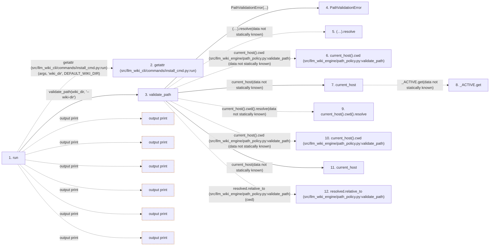

# install

**Entry point:** `run` (`cli`)
**Source:** [install_cmd](../modules/install_cmd.md)
**Modules touched:** [config](../modules/config.md), [host](../modules/host.md), [install_cmd](../modules/install_cmd.md), [io](../modules/io.md), and 5 more

**Complete modules touched:**

- [config](../modules/config.md)
- [host](../modules/host.md)
- [install_cmd](../modules/install_cmd.md)
- [io](../modules/io.md)
- [path_policy](../modules/path_policy.md)
- [plugins](../modules/plugins.md)
- [services_schema](../modules/services_schema.md)
- [validation](../modules/validation.md)
- [wiki_write_basis](../modules/wiki_write_basis.md)

## Call sequence

> Static overview in presentation order, not runtime execution order. Arrows retain captured callers; representative internal continuations and boundary examples precede repeated helper detail.

<!-- Auto-generated from static call edges. Dashed arrows are external or unresolved calls. Reviewed runtime conditions and side effects belong in Behavior. -->

```mermaid
sequenceDiagram
    participant p0 as run
    participant p1 as validate_path
    participant p2 as install_plugin
    participant p3 as read_config
    participant p4 as refresh_skill_blocks
    participant p5 as _component_summary
    participant p6 as resolve_plugin_ref
    participant p7 as validate_plugin
    participant p8 as first_unsafe_path_component
    participant p9 as require_safe_schema_path
    participant p10 as read_lock
    participant p11 as installed_skill_block_contents
    participant p12 as _check_install_collisions
    participant p13 as refresh_skill_blocks_content
    participant p14 as write_bytes_atomic
    participant p15 as plugin_store
    participant p16 as write_lock
    participant p17 as _manifest_root
    participant p18 as lock_path
    participant p19 as _ensure_no_reserved_plugin_sources
    participant p20 as replace_skill_block_content
    participant p21 as iter_components
    participant p22 as _ensure_id
    participant p23 as _load_catalog
    participant p24 as _version_satisfies
    participant p25 as _normalize_component
    participant p26 as build_skill_block
    participant p27 as _ensure_entry_point
    participant p28 as _safe_component_path
    participant p29 as getattr (src/llm_wiki_cli/commands/install_cmd.py:run)
    participant p30 as config.get
    p0->>p1: validate_path
    p0->>p2: install_plugin
    p0->>p3: read_config
    p0->>p4: refresh_skill_blocks
    p0->>p5: _component_summary
    p2->>p6: resolve_plugin_ref
    p2->>p7: validate_plugin
    p3->>p8: first_unsafe_path_component
    p4->>p9: require_safe_schema_path
    p2->>p10: read_lock
    p4->>p11: installed_skill_block_contents
    p2->>p12: _check_install_collisions
    p4->>p13: refresh_skill_blocks_content
    p4->>p14: write_bytes_atomic
    p2->>p15: plugin_store
    p2->>p16: write_lock
    p7->>p17: _manifest_root
    p10->>p18: lock_path
    p7->>p19: _ensure_no_reserved_plugin_sources
    p13->>p20: replace_skill_block_content
    p11->>p21: iter_components
    p7->>p22: _ensure_id
    p6->>p23: _load_catalog
    p7->>p24: _version_satisfies
    p7->>p25: _normalize_component
    p20->>p26: build_skill_block
    p25->>p27: _ensure_entry_point
    p25->>p28: _safe_component_path
    p0-->>p29: getattr (src/llm_wiki_cli/commands/install_cmd.py:run)(args, 'wiki_dir', DEFAULT_WIKI_DIR)
    p0-->>p30: config.get('agent', 'generic')
```

> Call sequence diagram shows 30 of 401 interactions; 371 omitted to keep the visualization within the 30-interaction and generated-diagram limits, with uncertain identities omitted rather than inferred.

> Captured boundary calls: external 1 of 126 (125 omitted); unresolved 1 of 163 (162 omitted). These counts cover the captured static trace.

Omitted captured detail, grouped by actual caller occurrence and target module:

| Caller | Parent step | Target module | Kind | Omitted interactions |
| --- | --- | --- | --- | --- |
| `src/llm_wiki_engine/path_policy.py:validate_path` | 3 | [src/llm_wiki_engine/path_policy.py](../modules/path_policy.md) | internal | 2 |
| `src/llm_wiki_engine/path_policy.py:validate_path` | 3 | - | unresolved | 5 |
| `src/llm_wiki_engine/path_policy.py:validate_path` | 3 | [src/llm_wiki_engine/host.py](../modules/host.md) | internal | 2 |
| `src/llm_wiki_engine/host.py:current_host` | 7 | - | unresolved | 1 |
| `src/llm_wiki_cli/services/plugins.py:resolve_plugin_ref` | 15 | - | unresolved | 9 |
| `src/llm_wiki_cli/services/plugins.py:resolve_plugin_ref` | 15 | - | external | 5 |
| `src/llm_wiki_cli/services/plugins.py:resolve_plugin_ref` | 15 | [src/llm_wiki_cli/services/plugins.py](../modules/plugins.md) | internal | 3 |
| `src/llm_wiki_cli/services/plugins.py:_load_catalog` | 26 | - | unresolved | 5 |
> Omission summary shows 8 of 107 groups; 99 further groups are not expanded here. Counts above include all omitted interactions.
> Detailed flow queries retain their own coverage and limits; omitted paths may execute at runtime.

> Trace truncated at the depth limit; deeper calls are omitted.

## Data flow

<!-- Auto-generated static analysis. Treat values and boundaries as best-effort hints, not runtime proof. -->

### Analysis coverage

**Effect analysis partially available.** Flow assembly and source effect analysis are separate; empty observations do not prove an empty handler body.

Source steps: 113; effect analysis evaluated: 72, partial: 1, unavailable: 40. Counts include steps omitted from the displayed trace.

Collector observations for 73 source steps with known totals: observed: 343, emitted: 333, omitted: 10. Unavailable totals are excluded.

- Callable record unavailable for one or more source steps; those steps have no represented callable body.
- Effect collector omitted observations before flow assembly; displayed effects are partial.
- Effect collector totals unavailable; observed counts cover captured records only.

| Step | Callable record | Effect analysis | Collector totals | Observed | Emitted | Omitted |
|---|---|---|---|---:|---:|---:|
| `run` | `available` | `evaluated` | `available` | `11` | `11` | `0` |
| `getattr (src/llm_wiki_cli/commands/install_cmd.py:run)` | `not_applicable` | `not_applicable` | `not_applicable` | — | — | — |
| `validate_path` | `available` | `evaluated` | `available` | `3` | `3` | `0` |
| `PathValidationError` | `unavailable` | `unavailable` | `unavailable` | — | — | — |
| `(…).resolve` | `not_applicable` | `not_applicable` | `not_applicable` | — | — | — |
| `current_host().cwd (src/llm_wiki_engine/path_policy.py:validate_path)` | `not_applicable` | `not_applicable` | `not_applicable` | — | — | — |
| `current_host` | `available` | `evaluated` | `available` | `2` | `2` | `0` |
| `_ACTIVE.get` | `not_applicable` | `not_applicable` | `not_applicable` | — | — | — |
| `current_host().cwd().resolve` | `not_applicable` | `not_applicable` | `not_applicable` | — | — | — |
| `current_host().cwd (src/llm_wiki_engine/path_policy.py:validate_path)` | `not_applicable` | `not_applicable` | `not_applicable` | — | — | — |
| `current_host` | `available` | `evaluated` | `available` | `2` | `2` | `0` |
| `resolved.relative_to (src/llm_wiki_engine/path_policy.py:validate_path)` | `not_applicable` | `not_applicable` | `not_applicable` | — | — | — |

```mermaid
flowchart LR
    s1["1. run"]
    s2["2. getattr (src/llm_wiki_cli/commands/install_cmd.py:run)"]
    s3["3. validate_path"]
    s4["4. PathValidationError"]
    s5["5. (…).resolve"]
    s6["6. current_host().cwd (src/llm_wiki_engine/path_policy.py:validate_path)"]
    s7["7. current_host"]
    s8["8. _ACTIVE.get"]
    s9["9. current_host().cwd().resolve"]
    s10["10. current_host().cwd (src/llm_wiki_engine/path_policy.py:validate_path)"]
    s11["11. current_host"]
    s12["12. resolved.relative_to (src/llm_wiki_engine/path_policy.py:validate_path)"]
    s1 -. "getattr (src/llm_wiki_cli/commands/install_cmd.py:run)(args, 'wiki_dir', DEFAULT_WIKI_DIR)" .-> s2
    s1 -->|"validate_path(wiki_dir, '--wiki-dir')"| s3
    s3 -->|"PathValidationError(...)"| s4
    s3 -. "(…).resolve(data not statically known)" .-> s5
    s3 -. "current_host().cwd (src/llm_wiki_engine/path_policy.py:validate_path)(data not statically known)" .-> s6
    s3 -->|"current_host(data not statically known)"| s7
    s7 -. "_ACTIVE.get(data not statically known)" .-> s8
    s3 -. "current_host().cwd().resolve(data not statically known)" .-> s9
    s3 -. "current_host().cwd (src/llm_wiki_engine/path_policy.py:validate_path)(data not statically known)" .-> s10
    s3 -->|"current_host(data not statically known)"| s11
    s3 -. "resolved.relative_to (src/llm_wiki_engine/path_policy.py:validate_path)(cwd)" .-> s12
    b0["output print"]
    s1 -. "output print" .-> b0
    b1["output print"]
    s1 -. "output print" .-> b1
    b2["output print"]
    s1 -. "output print" .-> b2
    b3["output print"]
    s1 -. "output print" .-> b3
    b4["output print"]
    s1 -. "output print" .-> b4
    b5["output print"]
    s1 -. "output print" .-> b5
    click s1 "../modules/install_cmd.md"
    click s3 "../modules/path_policy.md"
    click s4 "../modules/path_policy.md"
    click s7 "../modules/host.md"
    click s11 "../modules/host.md"
    classDef boundary stroke:#b45309,stroke-dasharray: 4 2
    class b0 boundary
    class b1 boundary
    class b2 boundary
    class b3 boundary
    class b4 boundary
    class b5 boundary
```

### Step data

| Step | Inputs | Reads | Writes | Returns |
|---|---|---|---|---|
| `run` | `args` | `DEFAULT_WIKI_DIR`, `PluginError`, `sys` | - | `none` |
| `getattr (src/llm_wiki_cli/commands/install_cmd.py:run)` | - | - | - | - |
| `validate_path` | `path: str`, `label: str` | - | - | `resolved` |
| `PathValidationError` | - | - | - | - |
| `(…).resolve` | - | - | - | - |
| `current_host().cwd (src/llm_wiki_engine/path_policy.py:validate_path)` | - | - | - | - |
| `current_host` | - | `_DEFAULT` | - | `...` |
| `_ACTIVE.get` | - | - | - | - |
| `current_host().cwd().resolve` | - | - | - | - |
| `current_host().cwd (src/llm_wiki_engine/path_policy.py:validate_path)` | - | - | - | - |
| `current_host` | - | `_DEFAULT` | - | `...` |
| `resolved.relative_to (src/llm_wiki_engine/path_policy.py:validate_path)` | - | - | - | - |

### Call data

| From | To | Line | Call |
|---|---|---:|---|
| run | getattr (src/llm_wiki_cli/commands/install_cmd.py:run) | 20 | `getattr(args, 'wiki_dir', DEFAULT_WIKI_DIR)` |
| run | validate_path | 21 | `validate_path(wiki_dir, '--wiki-dir')` |
| validate_path | PathValidationError | 102 | `PathValidationError(...)` |
| validate_path | (…).resolve | 103 | `(current_host().cwd() / path).resolve(data not statically known)` |
| validate_path | current_host().cwd (src/llm_wiki_engine/path_policy.py:validate_path) | 103 | `current_host().cwd(data not statically known)` |
| validate_path | current_host | 103 | `current_host(data not statically known)` |
| current_host | _ACTIVE.get | 166 | `_ACTIVE.get(data not statically known)` |
| validate_path | current_host().cwd().resolve | 104 | `current_host().cwd().resolve(data not statically known)` |
| validate_path | current_host().cwd (src/llm_wiki_engine/path_policy.py:validate_path) | 104 | `current_host().cwd(data not statically known)` |
| validate_path | current_host | 104 | `current_host(data not statically known)` |
| validate_path | resolved.relative_to (src/llm_wiki_engine/path_policy.py:validate_path) | 106 | `resolved.relative_to(cwd)` |

### Boundary effects

| Kind | Target | Step | Line |
|---|---|---|---:|
| output | `print` | `run` | 30 |
| output | `print` | `run` | 34 |
| output | `print` | `run` | 37 |
| output | `print` | `run` | 42 |
| output | `print` | `run` | 43 |
| output | `print` | `run` | 45 |

### Static analysis gaps

| Kind | Step | Target | Line |
|---|---|---|---:|
| external_call | `run` | `getattr` | 20 |
| unresolved_call | `validate_path` | `(current_host().cwd() / path).resolve` | 103 |
| unresolved_call | `validate_path` | `current_host().cwd` | 103 |
| unresolved_call | `current_host` | `_ACTIVE.get` | 166 |
| unresolved_call | `validate_path` | `current_host().cwd().resolve` | 104 |
| unresolved_call | `validate_path` | `current_host().cwd` | 104 |
| unresolved_call | `validate_path` | `resolved.relative_to` | 106 |
| step_limit | `run` | `first 12 steps` | 0 |
| truncated_flow | `run` | `depth limit` | 0 |

## Behavior

This flow starts at `run` and is classified as `cli`. The generated call and data-flow sections are bounded static projections; runtime conditions and side effects require source-level confirmation.
