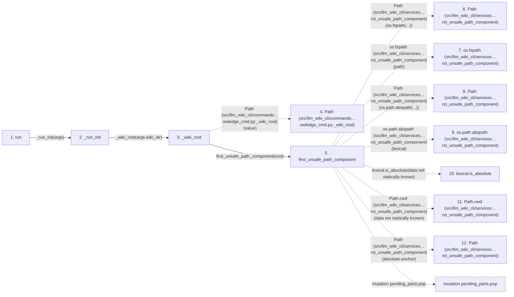

# knowledge

**Entry point:** `run` (`cli`)
**Source:** [knowledge_cmd](../modules/knowledge_cmd.md)
**Modules touched:** [api](../modules/api.md), [common](../modules/common.md), [concept_identity](../modules/concept_identity.md), [config](../modules/config.md), and 39 more

**Complete modules touched:**

- [api](../modules/api.md)
- [common](../modules/common.md)
- [concept_identity](../modules/concept_identity.md)
- [config](../modules/config.md)
- [context_packet](../modules/context_packet.md)
- [context_service](../modules/context_service.md)
- [data_flow](../modules/data_flow.md)
- [dependency_versions](../modules/dependency_versions.md)
- [documentation_queries](../modules/documentation_queries.md)
- [documentation_query_builder](../modules/documentation_query_builder.md)
- [entrypoints](../modules/entrypoints.md)
- [extraction_service](../modules/extraction_service.md)
- [filesystem_guard](../modules/filesystem_guard.md)
- [imports](../modules/imports.md)
- [infrastructure_inventory](../modules/infrastructure_inventory.md)
- [infrastructure_sync](../modules/infrastructure_sync.md)
- [io](../modules/io.md)
- [knowledge_artifacts](../modules/knowledge_artifacts.md)
- [knowledge_cmd](../modules/knowledge_cmd.md)
- [knowledge_consumption](../modules/knowledge_consumption.md)
- [knowledge_coverage](../modules/knowledge_coverage.md)
- [knowledge_envelope](../modules/knowledge_envelope.md)
- [knowledge_evidence](../modules/knowledge_evidence.md)
- [knowledge_freshness](../modules/knowledge_freshness.md)
- [knowledge_governance](../modules/knowledge_governance.md)
- [knowledge_index](../modules/knowledge_index.md)
- [knowledge_loader](../modules/knowledge_loader.md)
- [knowledge_model](../modules/knowledge_model.md)
- [knowledge_observability](../modules/knowledge_observability.md)
- [knowledge_orchestration](../modules/knowledge_orchestration.md)
- [knowledge_verification](../modules/knowledge_verification.md)
- [plugins](../modules/plugins.md)
- [python_calls](../modules/python_calls.md)
- [python_imports](../modules/python_imports.md)
- [services_dependencies](../modules/services_dependencies.md)
- [source_selection](../modules/source_selection.md)
- [source_snapshot](../modules/source_snapshot.md)
- [sync_manifest](../modules/sync_manifest.md)
- [validation](../modules/validation.md)
- [verification_contracts](../modules/verification_contracts.md)
- [wiki_media](../modules/wiki_media.md)
- [wiki_surface](../modules/wiki_surface.md)
- [wiki_surface_index](../modules/wiki_surface_index.md)

## Call sequence

```mermaid
sequenceDiagram
    participant p0 as run
    participant p1 as _run_init
    participant p2 as _wiki_root
    participant p3 as Path (src/llm_wiki_cli/commands…owledge_cmd.py:_wiki_root)
    participant p4 as first_unsafe_path_component
    participant p5 as Path (src/llm_wiki_cli/services…rst_unsafe_path_component)
    participant p6 as os.fspath (src/llm_wiki_cli/services…rst_unsafe_path_component)
    participant p7 as os.path.abspath (src/llm_wiki_cli/services…rst_unsafe_path_component)
    participant p8 as lexical.is_absolute
    participant p9 as Path.cwd (src/llm_wiki_cli/services…rst_unsafe_path_component)
    participant p10 as list (src/llm_wiki_cli/services…rst_unsafe_path_component)
    participant p11 as pending_parts.pop
    participant p12 as current.lstat (src/llm_wiki_cli/services…rst_unsafe_path_component)
    participant p13 as getattr (src/llm_wiki_cli/services…rst_unsafe_path_component)
    participant p14 as stat.S_ISLNK (src/llm_wiki_cli/services…rst_unsafe_path_component)
    participant p15 as bool (src/llm_wiki_cli/services…rst_unsafe_path_component)
    participant p16 as trusted_symlink_owner
    participant p17 as callable (src/llm_wiki_cli/services…rst_unsafe_path_component)
    participant p18 as os.readlink
    participant p19 as link_target.is_absolute
    participant p20 as GovernanceError
    p0->>p1: _run_init
    p1->>p2: _wiki_root
    p2-->>p3: Path (src/llm_wiki_cli/commands…owledge_cmd.py:_wiki_root)
    p2->>p4: first_unsafe_path_component
    p4-->>p5: Path (src/llm_wiki_cli/services…rst_unsafe_path_component)
    p4-->>p6: os.fspath (src/llm_wiki_cli/services…rst_unsafe_path_component)
    p4-->>p5: Path (src/llm_wiki_cli/services…rst_unsafe_path_component)
    p4-->>p7: os.path.abspath (src/llm_wiki_cli/services…rst_unsafe_path_component)
    p4-->>p8: lexical.is_absolute
    p4-->>p9: Path.cwd (src/llm_wiki_cli/services…rst_unsafe_path_component)
    p4-->>p5: Path (src/llm_wiki_cli/services…rst_unsafe_path_component)
    p4-->>p10: list (src/llm_wiki_cli/services…rst_unsafe_path_component)
    p4-->>p11: pending_parts.pop
    p4-->>p12: current.lstat (src/llm_wiki_cli/services…rst_unsafe_path_component)
    p4-->>p13: getattr (src/llm_wiki_cli/services…rst_unsafe_path_component)
    p4-->>p13: getattr (src/llm_wiki_cli/services…rst_unsafe_path_component)
    p4-->>p14: stat.S_ISLNK (src/llm_wiki_cli/services…rst_unsafe_path_component)
    p4-->>p15: bool (src/llm_wiki_cli/services…rst_unsafe_path_component)
    p4-->>p15: bool (src/llm_wiki_cli/services…rst_unsafe_path_component)
    p4-->>p13: getattr (src/llm_wiki_cli/services…rst_unsafe_path_component)
    p4-->>p16: trusted_symlink_owner
    p4-->>p17: callable (src/llm_wiki_cli/services…rst_unsafe_path_component)
    p4-->>p13: getattr (src/llm_wiki_cli/services…rst_unsafe_path_component)
    p4-->>p5: Path (src/llm_wiki_cli/services…rst_unsafe_path_component)
    p4-->>p5: Path (src/llm_wiki_cli/services…rst_unsafe_path_component)
    p4-->>p18: os.readlink
    p4-->>p19: link_target.is_absolute
    p4-->>p5: Path (src/llm_wiki_cli/services…rst_unsafe_path_component)
    p4-->>p10: list (src/llm_wiki_cli/services…rst_unsafe_path_component)
    p2->>p20: GovernanceError
```

<!-- Auto-generated from static call edges. Dashed arrows are external or unresolved calls. Reviewed runtime conditions and side effects belong in Behavior. -->

> Call sequence diagram shows 30 of 2157 interactions; 2127 omitted to keep the visualization within the 30-interaction and generated-diagram limits.

> Trace truncated at the depth limit; deeper calls are omitted.

## Data flow

<!-- Auto-generated static analysis. Treat values and boundaries as best-effort hints, not runtime proof. -->

### Step data

| Step | Inputs | Reads | Writes | Returns |
|---|---|---|---|---|
| `run` | `args` | `Lifecycle`, `Lifecycle`, `Lifecycle`, `Lifecycle` | - | - |
| `_run_init` | `args` | - | - | `none` |
| `_wiki_root` | `value: str \| Path` | - | - | `root` |
| `Path (src/llm_wiki_cli/commands…owledge_cmd.py:_wiki_root)` | - | - | - | - |
| `first_unsafe_path_component` | `path: str \| Path`, `trusted_symlink_uids: Set[int] \| None`, `trusted_symlink_owner: Callable[[Path], bool] \| None` | `stat`, `os` | - | `lexical`, `None`, `current`, `current`, `current`, `current`, `current`, `None` |
| `Path (src/llm_wiki_cli/services…rst_unsafe_path_component)` | - | - | - | - |
| `os.fspath (src/llm_wiki_cli/services…rst_unsafe_path_component)` | - | - | - | - |
| `Path (src/llm_wiki_cli/services…rst_unsafe_path_component)` | - | - | - | - |
| `os.path.abspath (src/llm_wiki_cli/services…rst_unsafe_path_component)` | - | - | - | - |
| `lexical.is_absolute` | - | - | - | - |
| `Path.cwd (src/llm_wiki_cli/services…rst_unsafe_path_component)` | - | - | - | - |
| `Path (src/llm_wiki_cli/services…rst_unsafe_path_component)` | - | - | - | - |

### Call data

| From | To | Line | Call |
|---|---|---:|---|
| run | _run_init | 959 | `_run_init(args)` |
| _run_init | _wiki_root | 420 | `_wiki_root(args.wiki_dir)` |
| _wiki_root | Path (src/llm_wiki_cli/commands…owledge_cmd.py:_wiki_root) | 107 | `Path(value)` |
| _wiki_root | first_unsafe_path_component | 108 | `first_unsafe_path_component(root)` |
| first_unsafe_path_component | Path (src/llm_wiki_cli/services…rst_unsafe_path_component) | 51 | `Path(os.fspath(...))` |
| first_unsafe_path_component | os.fspath (src/llm_wiki_cli/services…rst_unsafe_path_component) | 51 | `os.fspath(path)` |
| first_unsafe_path_component | Path (src/llm_wiki_cli/services…rst_unsafe_path_component) | 59 | `Path(os.path.abspath(...))` |
| first_unsafe_path_component | os.path.abspath (src/llm_wiki_cli/services…rst_unsafe_path_component) | 59 | `os.path.abspath(lexical)` |
| first_unsafe_path_component | lexical.is_absolute | 60 | `lexical.is_absolute(data not statically known)` |
| first_unsafe_path_component | Path.cwd (src/llm_wiki_cli/services…rst_unsafe_path_component) | 66 | `Path.cwd(data not statically known)` |
| first_unsafe_path_component | Path (src/llm_wiki_cli/services…rst_unsafe_path_component) | 67 | `Path(absolute.anchor)` |

### Boundary effects

| Kind | Target | Step | Line |
|---|---|---|---:|
| mutation | `pending_parts.pop` | `first_unsafe_path_component` | 71 |

### Static analysis gaps

| Kind | Step | Target | Line |
|---|---|---|---:|
| external_call | `first_unsafe_path_component` | `os.fspath` | 51 |
| external_call | `first_unsafe_path_component` | `os.path.abspath` | 59 |
| unresolved_call | `first_unsafe_path_component` | `lexical.is_absolute` | 60 |
| external_call | `first_unsafe_path_component` | `Path.cwd` | 66 |
| step_limit | `run` | `first 12 steps` | 0 |
| truncated_flow | `run` | `depth limit` | 0 |

## Behavior

This flow starts at `run` and is classified as `cli`. The generated call and data-flow sections are bounded static projections; runtime conditions and side effects require source-level confirmation.
