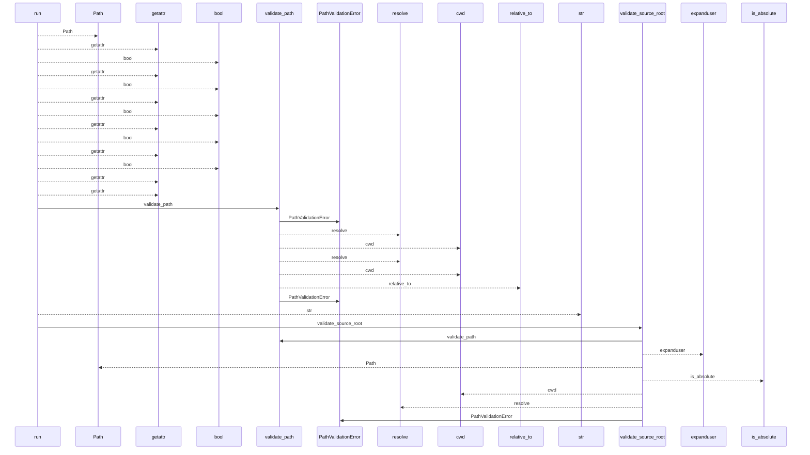
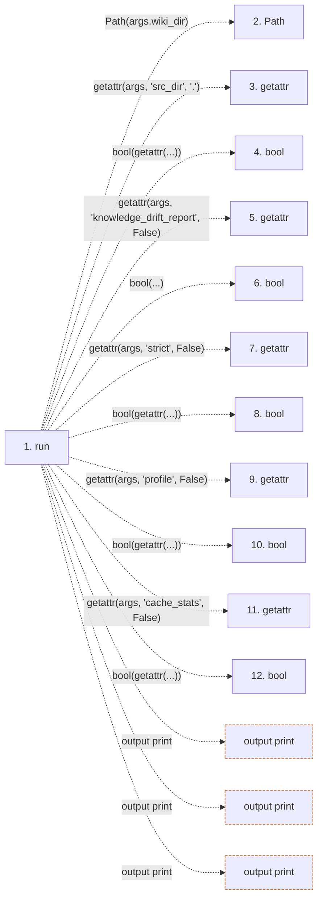

# lint

**Entry point:** `run` (`cli`)
**Source:** [lint_service](../modules/lint_service.md)
**Modules touched:** [bootstrap_runtime](../modules/bootstrap_runtime.md), [common](../modules/common.md), [config](../modules/config.md), [data_flow](../modules/data_flow.md), and 35 more

**Complete modules touched:**

- [bootstrap_runtime](../modules/bootstrap_runtime.md)
- [common](../modules/common.md)
- [config](../modules/config.md)
- [data_flow](../modules/data_flow.md)
- [dependency_versions](../modules/dependency_versions.md)
- [entrypoints](../modules/entrypoints.md)
- [extraction_jobs](../modules/extraction_jobs.md)
- [extraction_service](../modules/extraction_service.md)
- [filesystem_guard](../modules/filesystem_guard.md)
- [imports](../modules/imports.md)
- [infrastructure_inventory](../modules/infrastructure_inventory.md)
- [infrastructure_sync](../modules/infrastructure_sync.md)
- [inventory_cache](../modules/inventory_cache.md)
- [io](../modules/io.md)
- [knowledge_artifacts](../modules/knowledge_artifacts.md)
- [knowledge_consumption](../modules/knowledge_consumption.md)
- [knowledge_envelope](../modules/knowledge_envelope.md)
- [knowledge_evidence](../modules/knowledge_evidence.md)
- [knowledge_freshness](../modules/knowledge_freshness.md)
- [knowledge_generation](../modules/knowledge_generation.md)
- [knowledge_governance](../modules/knowledge_governance.md)
- [knowledge_loader](../modules/knowledge_loader.md)
- [knowledge_model](../modules/knowledge_model.md)
- [knowledge_observability](../modules/knowledge_observability.md)
- [knowledge_orchestration](../modules/knowledge_orchestration.md)
- [knowledge_verification](../modules/knowledge_verification.md)
- [lint_service](../modules/lint_service.md)
- [metrics](../modules/metrics.md)
- [packages](../modules/packages.md)
- [plugins](../modules/plugins.md)
- [services_dependencies](../modules/services_dependencies.md)
- [source_selection](../modules/source_selection.md)
- [source_snapshot](../modules/source_snapshot.md)
- [sync_analysis](../modules/sync_analysis.md)
- [team](../modules/team.md)
- [validation](../modules/validation.md)
- [verification_contracts](../modules/verification_contracts.md)
- [wiki_lifecycle](../modules/wiki_lifecycle.md)
- [wiki_surface](../modules/wiki_surface.md)

## Call sequence

<!-- Auto-generated from static call edges. Dashed arrows are external or unresolved calls. Reviewed runtime conditions and side effects belong in Behavior. -->

> Call sequence diagram shows 30 of 2608 interactions; 2578 omitted to keep the visualization within the 30-interaction and generated-diagram limits.

> Trace truncated at the depth limit; deeper calls are omitted.

## Data flow

<!-- Auto-generated static analysis. Treat values and boundaries as best-effort hints, not runtime proof. -->

### Step data

| Step | Inputs | Reads | Writes | Returns |
|---|---|---|---|---|
| `run` | `args` | `wiki_media`, `print_extraction_job_plan`, `sys` | - | - |
| `Path` | - | - | - | - |
| `getattr` | - | - | - | - |
| `bool` | - | - | - | - |
| `getattr` | - | - | - | - |
| `bool` | - | - | - | - |
| `getattr` | - | - | - | - |
| `bool` | - | - | - | - |
| `getattr` | - | - | - | - |
| `bool` | - | - | - | - |
| `getattr` | - | - | - | - |
| `bool` | - | - | - | - |

### Call data

| From | To | Line | Call |
|---|---|---:|---|
| run | Path | 3056 | `Path(args.wiki_dir)` |
| run | getattr | 3057 | `getattr(args, 'src_dir', '.')` |
| run | bool | 3058 | `bool(getattr(...))` |
| run | getattr | 3059 | `getattr(args, 'knowledge_drift_report', False)` |
| run | bool | 3061 | `bool(...)` |
| run | getattr | 3061 | `getattr(args, 'strict', False)` |
| run | bool | 3062 | `bool(getattr(...))` |
| run | getattr | 3062 | `getattr(args, 'profile', False)` |
| run | bool | 3063 | `bool(getattr(...))` |
| run | getattr | 3063 | `getattr(args, 'cache_stats', False)` |
| run | bool | 3064 | `bool(getattr(...))` |

### Boundary effects

| Kind | Target | Step | Line |
|---|---|---|---:|
| output | `print` | `run` | 3101 |
| output | `print` | `run` | 3104 |
| output | `print` | `run` | 3112 |

### Static analysis gaps

| Kind | Step | Target | Line |
|---|---|---|---:|
| unresolved_call | `run` | `getattr` | 3057 |
| unresolved_call | `run` | `getattr` | 3059 |
| unresolved_call | `run` | `getattr` | 3061 |
| unresolved_call | `run` | `getattr` | 3062 |
| unresolved_call | `run` | `getattr` | 3063 |
| step_limit | `run` | `first 12 steps` | 0 |
| truncated_flow | `run` | `depth limit` | 0 |

## Behavior

Validates the source root and wiki, builds one extraction-backed lint report,
and renders human text or profiling data. Strict mode requires a complete,
consistent managed wiki in addition to link and surface checks. Local metrics
are best effort and never replace the report outcome; blocking findings produce
a nonzero exit status.
