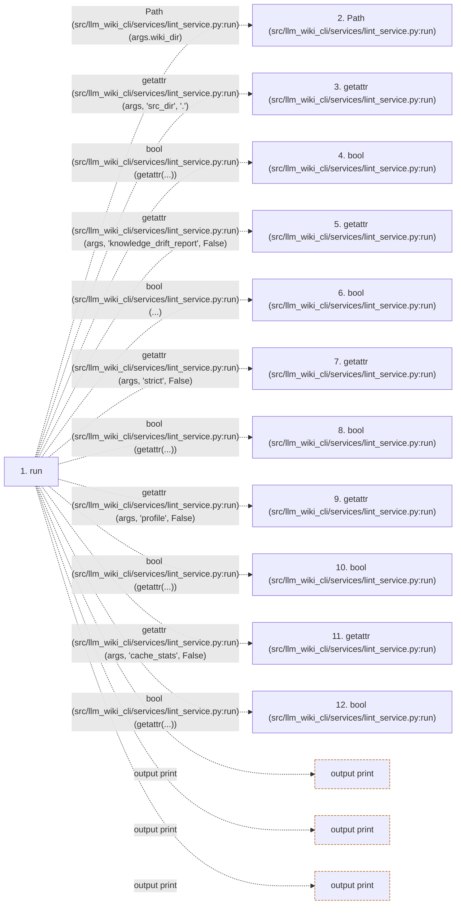

# lint

**Entry point:** `run` (`cli`)
**Source:** [lint_service](../modules/lint_service.md)
**Modules touched:** [analysis_capture](../modules/analysis_capture.md), [analysis_compatibility](../modules/analysis_compatibility.md), [bootstrap_runtime](../modules/bootstrap_runtime.md), and 63 more

**Complete modules touched:**

- [analysis_capture](../modules/analysis_capture.md)
- [analysis_compatibility](../modules/analysis_compatibility.md)
- [bootstrap_runtime](../modules/bootstrap_runtime.md)
- [canonical_pages](../modules/canonical_pages.md)
- [common](../modules/common.md)
- [config](../modules/config.md)
- [current_contracts](../modules/current_contracts.md)
- [data_flow](../modules/data_flow.md)
- [dependency_versions](../modules/dependency_versions.md)
- [entrypoints](../modules/entrypoints.md)
- [extraction_jobs](../modules/extraction_jobs.md)
- [extraction_service](../modules/extraction_service.md)
- [filesystem_guard](../modules/filesystem_guard.md)
- [go_calls](../modules/go_calls.md)
- [health_contract](../modules/health_contract.md)
- [health_details](../modules/health_details.md)
- [immutable](../modules/immutable.md)
- [implementation_evidence](../modules/implementation_evidence.md)
- [imports](../modules/imports.md)
- [infrastructure_inventory](../modules/infrastructure_inventory.md)
- [infrastructure_sync](../modules/infrastructure_sync.md)
- [inventory_cache](../modules/inventory_cache.md)
- [io](../modules/io.md)
- [knowledge_artifacts](../modules/knowledge_artifacts.md)
- [knowledge_consumption](../modules/knowledge_consumption.md)
- [knowledge_envelope](../modules/knowledge_envelope.md)
- [knowledge_evidence](../modules/knowledge_evidence.md)
- [knowledge_freshness](../modules/knowledge_freshness.md)
- [knowledge_generation](../modules/knowledge_generation.md)
- [knowledge_governance](../modules/knowledge_governance.md)
- [knowledge_loader](../modules/knowledge_loader.md)
- [knowledge_model](../modules/knowledge_model.md)
- [knowledge_observability](../modules/knowledge_observability.md)
- [knowledge_orchestration](../modules/knowledge_orchestration.md)
- [knowledge_storage](../modules/knowledge_storage.md)
- [knowledge_storage_io](../modules/knowledge_storage_io.md)
- [knowledge_verification](../modules/knowledge_verification.md)
- [lint_service](../modules/lint_service.md)
- [maintenance_protocol](../modules/maintenance_protocol.md)
- [maintenance_state](../modules/maintenance_state.md)
- [maintenance_status](../modules/maintenance_status.md)
- [manifest_storage](../modules/manifest_storage.md)
- [metrics](../modules/metrics.md)
- [packages](../modules/packages.md)
- [plugins](../modules/plugins.md)
- [progress](../modules/progress.md)
- [python_calls](../modules/python_calls.md)
- [python_contracts](../modules/python_contracts.md)
- [python_implementation](../modules/python_implementation.md)
- [python_imports](../modules/python_imports.md)
- [python_observations](../modules/python_observations.md)
- [runtime_output](../modules/runtime_output.md)
- [services_dependencies](../modules/services_dependencies.md)
- [source_retirement](../modules/source_retirement.md)
- [source_selection](../modules/source_selection.md)
- [source_snapshot](../modules/source_snapshot.md)
- [sync_analysis](../modules/sync_analysis.md)
- [sync_manifest](../modules/sync_manifest.md)
- [team](../modules/team.md)
- [validation](../modules/validation.md)
- [verification_contracts](../modules/verification_contracts.md)
- [wiki_lifecycle](../modules/wiki_lifecycle.md)
- [wiki_media](../modules/wiki_media.md)
- [wiki_surface](../modules/wiki_surface.md)
- [yaml_formats](../modules/yaml_formats.md)
- [yaml_syntax](../modules/yaml_syntax.md)

## Call sequence

> Static overview in presentation order, not runtime execution order. Arrows retain captured callers; representative internal continuations and boundary examples precede repeated helper detail.

<!-- Auto-generated from static call edges. Dashed arrows are external or unresolved calls. Reviewed runtime conditions and side effects belong in Behavior. -->

```mermaid
sequenceDiagram
    participant p0 as run
    participant p1 as validate_path
    participant p2 as validate_source_root
    participant p3 as cache_options_from_args
    participant p4 as extraction_job_request_from_args
    participant p5 as build_report
    participant p6 as _profile_report_to_dict
    participant p7 as render_text
    participant p8 as record_validation_event
    participant p9 as _LintProfiler
    participant p10 as report_to_dict
    participant p11 as _safe_knowledge_summary
    participant p12 as record_event
    participant p13 as _new_lint_report
    participant p14 as _preflight_lint_inputs
    participant p15 as _finalize_lint_report
    participant p16 as prepare_cache_options
    participant p17 as _collect_lint_inputs
    participant p18 as _run_report_checks
    participant p19 as windows_current_user_sid
    participant p20 as resolve_team_policy
    participant p21 as capture_health_details
    participant p22 as _current_windows_user_sid
    participant p23 as _profile_phase
    participant p24 as _coerce_plugin_issue
    participant p25 as resolve_inventory_cache_path
    participant p26 as _check_unsupported_source_diagnostics
    participant p27 as team_config_issue
    participant p28 as _sanitize_metrics_value
    participant p29 as Path (src/llm_wiki_cli/services/lint_service.py:run)
    participant p30 as report.count (src/llm_wiki_cli/services/lint_service.py:run)
    p0->>p1: validate_path
    p0->>p2: validate_source_root
    p0->>p3: cache_options_from_args
    p0->>p4: extraction_job_request_from_args
    p0->>p5: build_report
    p0->>p6: _profile_report_to_dict
    p0->>p7: render_text
    p0->>p8: record_validation_event
    p0->>p9: _LintProfiler
    p6->>p10: report_to_dict
    p8->>p11: _safe_knowledge_summary
    p8->>p12: record_event
    p5->>p13: _new_lint_report
    p5->>p14: _preflight_lint_inputs
    p5->>p15: _finalize_lint_report
    p5->>p16: prepare_cache_options
    p5->>p17: _collect_lint_inputs
    p5->>p18: _run_report_checks
    p2->>p19: windows_current_user_sid
    p14->>p20: resolve_team_policy
    p15->>p21: capture_health_details
    p19->>p22: _current_windows_user_sid
    p17->>p23: _profile_phase
    p14->>p24: _coerce_plugin_issue
    p16->>p25: resolve_inventory_cache_path
    p18->>p26: _check_unsupported_source_diagnostics
    p14->>p27: team_config_issue
    p11->>p28: _sanitize_metrics_value
    p0-->>p29: Path (src/llm_wiki_cli/services/lint_service.py:run)(args.wiki_dir)
    p0-->>p30: report.count (src/llm_wiki_cli/services/lint_service.py:run)('extractor_failure')
```

> Call sequence diagram shows 30 of 3272 interactions; 3242 omitted to keep the visualization within the 30-interaction and generated-diagram limits, with uncertain identities omitted rather than inferred.

> Captured boundary calls: external 1 of 973 (972 omitted); unresolved 1 of 1120 (1119 omitted). These counts cover the captured static trace.

Omitted captured detail, grouped by actual caller occurrence and target module:

| Caller | Parent step | Target module | Kind | Omitted interactions |
| --- | --- | --- | --- | --- |
| `src/llm_wiki_cli/services/lint_service.py:run` | 1 | - | external | 25 |
| `src/llm_wiki_cli/config.py:validate_path` | 15 | [src/llm_wiki_cli/config.py](../modules/config.md) | internal | 2 |
| `src/llm_wiki_cli/config.py:validate_path` | 15 | - | unresolved | 3 |
| `src/llm_wiki_cli/config.py:validate_path` | 15 | - | external | 2 |
| `src/llm_wiki_cli/config.py:validate_source_root` | 24 | [src/llm_wiki_cli/config.py](../modules/config.md) | internal | 7 |
| `src/llm_wiki_cli/config.py:validate_source_root` | 24 | - | unresolved | 5 |
| `src/llm_wiki_cli/config.py:validate_source_root` | 24 | - | external | 11 |
| `src/llm_wiki_cli/services/filesystem_guard.py:windows_current_user_sid` | 36 | [src/llm_wiki_cli/services/filesystem_guard.py](../modules/filesystem_guard.md) | internal | 1 |
> Omission summary shows 8 of 868 groups; 860 further groups are not expanded here. Counts above include all omitted interactions.
> Detailed flow queries retain their own coverage and limits; omitted paths may execute at runtime.

> Trace truncated at the depth limit; deeper calls are omitted.

## Data flow

<!-- Auto-generated static analysis. Treat values and boundaries as best-effort hints, not runtime proof. -->

```mermaid
flowchart LR
    s1["1. run"]
    s2["2. Path (src/llm_wiki_cli/services/lint_service.py:run)"]
    s3["3. getattr (src/llm_wiki_cli/services/lint_service.py:run)"]
    s4["4. bool (src/llm_wiki_cli/services/lint_service.py:run)"]
    s5["5. getattr (src/llm_wiki_cli/services/lint_service.py:run)"]
    s6["6. bool (src/llm_wiki_cli/services/lint_service.py:run)"]
    s7["7. getattr (src/llm_wiki_cli/services/lint_service.py:run)"]
    s8["8. bool (src/llm_wiki_cli/services/lint_service.py:run)"]
    s9["9. getattr (src/llm_wiki_cli/services/lint_service.py:run)"]
    s10["10. bool (src/llm_wiki_cli/services/lint_service.py:run)"]
    s11["11. getattr (src/llm_wiki_cli/services/lint_service.py:run)"]
    s12["12. bool (src/llm_wiki_cli/services/lint_service.py:run)"]
    s1 -. "Path (src/llm_wiki_cli/services/lint_service.py:run)(args.wiki_dir)" .-> s2
    s1 -. "getattr (src/llm_wiki_cli/services/lint_service.py:run)(args, 'src_dir', '.')" .-> s3
    s1 -. "bool (src/llm_wiki_cli/services/lint_service.py:run)(getattr(...))" .-> s4
    s1 -. "getattr (src/llm_wiki_cli/services/lint_service.py:run)(args, 'knowledge_drift_report', False)" .-> s5
    s1 -. "bool (src/llm_wiki_cli/services/lint_service.py:run)(...)" .-> s6
    s1 -. "getattr (src/llm_wiki_cli/services/lint_service.py:run)(args, 'strict', False)" .-> s7
    s1 -. "bool (src/llm_wiki_cli/services/lint_service.py:run)(getattr(...))" .-> s8
    s1 -. "getattr (src/llm_wiki_cli/services/lint_service.py:run)(args, 'profile', False)" .-> s9
    s1 -. "bool (src/llm_wiki_cli/services/lint_service.py:run)(getattr(...))" .-> s10
    s1 -. "getattr (src/llm_wiki_cli/services/lint_service.py:run)(args, 'cache_stats', False)" .-> s11
    s1 -. "bool (src/llm_wiki_cli/services/lint_service.py:run)(getattr(...))" .-> s12
    b0["output print"]
    s1 -. "output print" .-> b0
    b1["output print"]
    s1 -. "output print" .-> b1
    b2["output print"]
    s1 -. "output print" .-> b2
    click s1 "../modules/lint_service.md"
    classDef boundary stroke:#b45309,stroke-dasharray: 4 2
    class b0 boundary
    class b1 boundary
    class b2 boundary
```

### Step data

| Step | Inputs | Reads | Writes | Returns |
|---|---|---|---|---|
| `run` | `args` | `wiki_media`, `print_extraction_job_plan`, `sys` | - | - |
| `Path (src/llm_wiki_cli/services/lint_service.py:run)` | - | - | - | - |
| `getattr (src/llm_wiki_cli/services/lint_service.py:run)` | - | - | - | - |
| `bool (src/llm_wiki_cli/services/lint_service.py:run)` | - | - | - | - |
| `getattr (src/llm_wiki_cli/services/lint_service.py:run)` | - | - | - | - |
| `bool (src/llm_wiki_cli/services/lint_service.py:run)` | - | - | - | - |
| `getattr (src/llm_wiki_cli/services/lint_service.py:run)` | - | - | - | - |
| `bool (src/llm_wiki_cli/services/lint_service.py:run)` | - | - | - | - |
| `getattr (src/llm_wiki_cli/services/lint_service.py:run)` | - | - | - | - |
| `bool (src/llm_wiki_cli/services/lint_service.py:run)` | - | - | - | - |
| `getattr (src/llm_wiki_cli/services/lint_service.py:run)` | - | - | - | - |
| `bool (src/llm_wiki_cli/services/lint_service.py:run)` | - | - | - | - |

### Call data

| From | To | Line | Call |
|---|---|---:|---|
| run | Path (src/llm_wiki_cli/services/lint_service.py:run) | 3306 | `Path(args.wiki_dir)` |
| run | getattr (src/llm_wiki_cli/services/lint_service.py:run) | 3307 | `getattr(args, 'src_dir', '.')` |
| run | bool (src/llm_wiki_cli/services/lint_service.py:run) | 3308 | `bool(getattr(...))` |
| run | getattr (src/llm_wiki_cli/services/lint_service.py:run) | 3308 | `getattr(args, 'knowledge_drift_report', False)` |
| run | bool (src/llm_wiki_cli/services/lint_service.py:run) | 3309 | `bool(...)` |
| run | getattr (src/llm_wiki_cli/services/lint_service.py:run) | 3309 | `getattr(args, 'strict', False)` |
| run | bool (src/llm_wiki_cli/services/lint_service.py:run) | 3310 | `bool(getattr(...))` |
| run | getattr (src/llm_wiki_cli/services/lint_service.py:run) | 3310 | `getattr(args, 'profile', False)` |
| run | bool (src/llm_wiki_cli/services/lint_service.py:run) | 3311 | `bool(getattr(...))` |
| run | getattr (src/llm_wiki_cli/services/lint_service.py:run) | 3311 | `getattr(args, 'cache_stats', False)` |
| run | bool (src/llm_wiki_cli/services/lint_service.py:run) | 3312 | `bool(getattr(...))` |

### Boundary effects

| Kind | Target | Step | Line |
|---|---|---|---:|
| output | `print` | `run` | 3344 |
| output | `print` | `run` | 3347 |
| output | `print` | `run` | 3355 |

### Static analysis gaps

| Kind | Step | Target | Line |
|---|---|---|---:|
| external_call | `run` | `getattr` | 3307 |
| external_call | `run` | `getattr` | 3308 |
| external_call | `run` | `getattr` | 3309 |
| external_call | `run` | `getattr` | 3310 |
| external_call | `run` | `getattr` | 3311 |
| step_limit | `run` | `first 12 steps` | 0 |
| truncated_flow | `run` | `depth limit` | 0 |

## Behavior

Validates the source root and wiki, builds one extraction-backed lint report,
and renders human text or profiling data. Strict mode requires a complete,
consistent managed wiki in addition to link and surface checks. Local metrics
are best effort and never replace the report outcome; blocking findings produce
a nonzero exit status.

Text discloses data-flow and unfamiliar advisory categories with at most five escaped examples per category and explicit preview omissions. Full profile JSON and CI JSON/Markdown retain complete emitted records. Advisory gaps leave integrity exits unchanged and require source inspection when a task depends on missing observations; success reports no blocking issues rather than complete analysis.
