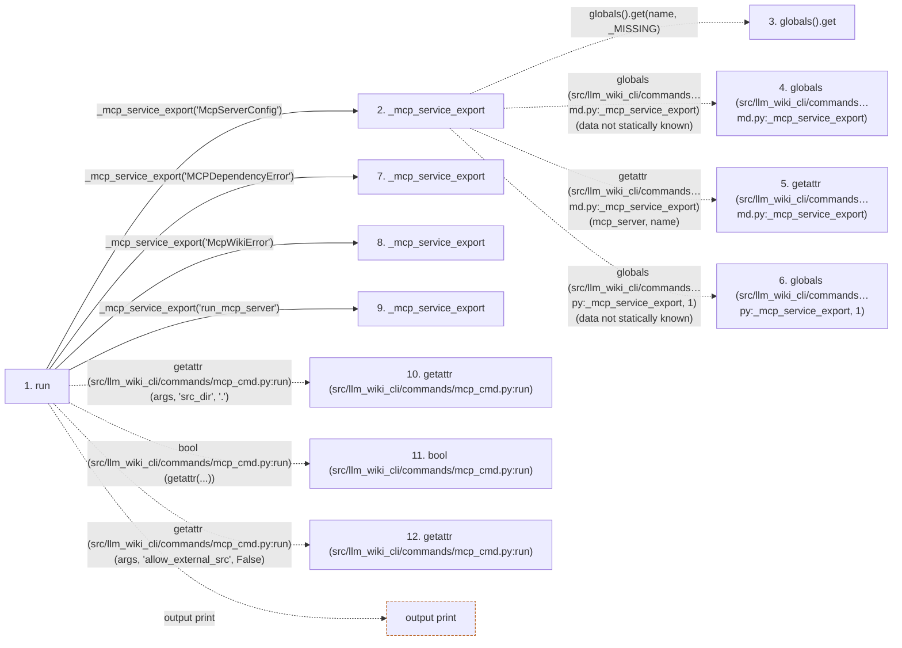

# mcp

**Entry point:** `run` (`cli`)
**Source:** [mcp_cmd](../modules/mcp_cmd.md)
**Modules touched:** [config](../modules/config.md), [filesystem_guard](../modules/filesystem_guard.md), [io](../modules/io.md), [mcp_cmd](../modules/mcp_cmd.md)

## Call sequence

```mermaid
sequenceDiagram
    participant p0 as run
    participant p1 as _mcp_service_export
    participant p2 as globals().get
    participant p3 as globals (src/llm_wiki_cli/commands…md.py:_mcp_service_export)
    participant p4 as getattr (src/llm_wiki_cli/commands…md.py:_mcp_service_export)
    participant p5 as globals (src/llm_wiki_cli/commands…py:_mcp_service_export, 1)
    participant p6 as getattr (src/llm_wiki_cli/commands/mcp_cmd.py:run)
    participant p7 as bool (src/llm_wiki_cli/commands/mcp_cmd.py:run)
    participant p8 as validate_source_root
    participant p9 as validate_path
    participant p10 as PathValidationError
    participant p11 as (…).resolve
    participant p12 as Path.cwd (src/llm_wiki_cli/config.py:validate_path)
    participant p13 as Path.cwd().resolve
    participant p14 as resolved.relative_to
    participant p15 as Path(…).expanduser
    participant p16 as Path (src/llm_wiki_cli/config.py:validate_source_root)
    participant p17 as candidate.is_absolute
    participant p18 as Path.cwd (src/llm_wiki_cli/config.py:validate_source_root)
    participant p19 as candidate.resolve
    participant p20 as resolved.is_dir
    participant p21 as os.path.abspath (src/llm_wiki_cli/config.py:validate_source_root)
    p0->>p1: _mcp_service_export
    p1-->>p2: globals().get
    p1-->>p3: globals (src/llm_wiki_cli/commands…md.py:_mcp_service_export)
    p1-->>p4: getattr (src/llm_wiki_cli/commands…md.py:_mcp_service_export)
    p1-->>p5: globals (src/llm_wiki_cli/commands…py:_mcp_service_export, 1)
    p0->>p1: _mcp_service_export
    p0->>p1: _mcp_service_export
    p0->>p1: _mcp_service_export
    p0-->>p6: getattr (src/llm_wiki_cli/commands/mcp_cmd.py:run)
    p0-->>p7: bool (src/llm_wiki_cli/commands/mcp_cmd.py:run)
    p0-->>p6: getattr (src/llm_wiki_cli/commands/mcp_cmd.py:run)
    p0->>p8: validate_source_root
    p8->>p9: validate_path
    p9->>p10: PathValidationError
    p9-->>p11: (…).resolve
    p9-->>p12: Path.cwd (src/llm_wiki_cli/config.py:validate_path)
    p9-->>p13: Path.cwd().resolve
    p9-->>p12: Path.cwd (src/llm_wiki_cli/config.py:validate_path)
    p9-->>p14: resolved.relative_to
    p9->>p10: PathValidationError
    p8-->>p15: Path(…).expanduser
    p8-->>p16: Path (src/llm_wiki_cli/config.py:validate_source_root)
    p8-->>p17: candidate.is_absolute
    p8-->>p18: Path.cwd (src/llm_wiki_cli/config.py:validate_source_root)
    p8-->>p19: candidate.resolve
    p8->>p10: PathValidationError
    p8-->>p20: resolved.is_dir
    p8->>p10: PathValidationError
    p8-->>p16: Path (src/llm_wiki_cli/config.py:validate_source_root)
    p8-->>p21: os.path.abspath (src/llm_wiki_cli/config.py:validate_source_root)
```

<!-- Auto-generated from static call edges. Dashed arrows are external or unresolved calls. Reviewed runtime conditions and side effects belong in Behavior. -->

> Call sequence diagram shows 30 of 127 interactions; 97 omitted to keep the visualization within the 30-interaction and generated-diagram limits.

## Data flow

<!-- Auto-generated static analysis. Treat values and boundaries as best-effort hints, not runtime proof. -->

### Step data

| Step | Inputs | Reads | Writes | Returns |
|---|---|---|---|---|
| `run` | `args` | `sys` | - | - |
| `_mcp_service_export` | `name: str` | `_MISSING`, `_MISSING` | - | `value`, `value` |
| `globals().get` | - | - | - | - |
| `globals (src/llm_wiki_cli/commands…md.py:_mcp_service_export)` | - | - | - | - |
| `getattr (src/llm_wiki_cli/commands…md.py:_mcp_service_export)` | - | - | - | - |
| `globals (src/llm_wiki_cli/commands…py:_mcp_service_export, 1)` | - | - | - | - |
| `_mcp_service_export` | `name: str` | `_MISSING`, `_MISSING` | - | `value`, `value` |
| `_mcp_service_export` | `name: str` | `_MISSING`, `_MISSING` | - | `value`, `value` |
| `_mcp_service_export` | `name: str` | `_MISSING`, `_MISSING` | - | `value`, `value` |
| `getattr (src/llm_wiki_cli/commands/mcp_cmd.py:run)` | - | - | - | - |
| `bool (src/llm_wiki_cli/commands/mcp_cmd.py:run)` | - | - | - | - |
| `getattr (src/llm_wiki_cli/commands/mcp_cmd.py:run)` | - | - | - | - |

### Call data

| From | To | Line | Call |
|---|---|---:|---|
| run | _mcp_service_export | 45 | `_mcp_service_export('McpServerConfig')` |
| _mcp_service_export | globals().get | 23 | `globals().get(name, _MISSING)` |
| _mcp_service_export | globals (src/llm_wiki_cli/commands…md.py:_mcp_service_export) | 23 | `globals(data not statically known)` |
| _mcp_service_export | getattr (src/llm_wiki_cli/commands…md.py:_mcp_service_export) | 28 | `getattr(mcp_server, name)` |
| _mcp_service_export | globals (src/llm_wiki_cli/commands…py:_mcp_service_export, 1) | 29 | `globals(data not statically known)` |
| run | _mcp_service_export | 46 | `_mcp_service_export('MCPDependencyError')` |
| run | _mcp_service_export | 47 | `_mcp_service_export('McpWikiError')` |
| run | _mcp_service_export | 48 | `_mcp_service_export('run_mcp_server')` |
| run | getattr (src/llm_wiki_cli/commands/mcp_cmd.py:run) | 50 | `getattr(args, 'src_dir', '.')` |
| run | bool (src/llm_wiki_cli/commands/mcp_cmd.py:run) | 51 | `bool(getattr(...))` |
| run | getattr (src/llm_wiki_cli/commands/mcp_cmd.py:run) | 51 | `getattr(args, 'allow_external_src', False)` |

### Boundary effects

| Kind | Target | Step | Line |
|---|---|---|---:|
| output | `print` | `run` | 72 |

### Static analysis gaps

| Kind | Step | Target | Line |
|---|---|---|---:|
| unresolved_call | `_mcp_service_export` | `globals().get` | 23 |
| external_call | `_mcp_service_export` | `globals` | 23 |
| external_call | `_mcp_service_export` | `getattr` | 28 |
| unresolved_call | `_mcp_service_export` | `globals` | 29 |
| external_call | `run` | `getattr` | 50 |
| external_call | `run` | `getattr` | 51 |
| step_limit | `run` | `first 12 steps` | 0 |

## Behavior

Loads the optional MCP service only after command dispatch, validates the
source root, and constructs the server configuration. Stdio is the default;
HTTP configuration is checked again by the service for loopback host, port,
path, and origin safety. Missing optional packages and invalid wiki or
transport state are reported as command errors without changing the wiki.
