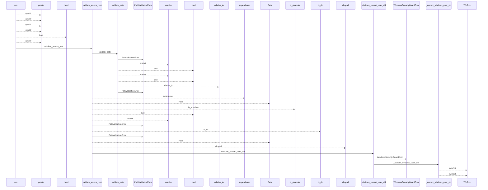
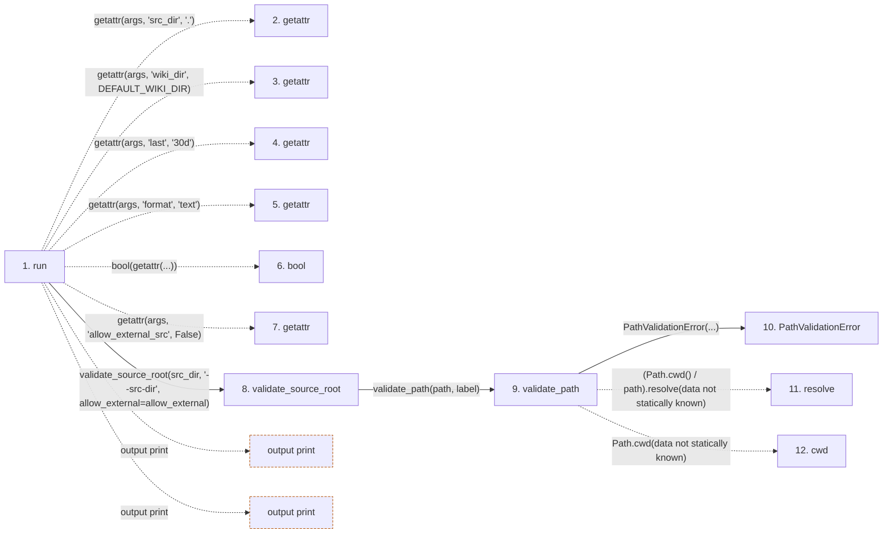

# metrics

**Entry point:** `run` (`cli`)
**Source:** [metrics_cmd](../modules/metrics_cmd.md)
**Modules touched:** [bootstrap_runtime](../modules/bootstrap_runtime.md), [common](../modules/common.md), [config](../modules/config.md), [documentation_queries](../modules/documentation_queries.md), and 15 more

**Complete modules touched:**

- [bootstrap_runtime](../modules/bootstrap_runtime.md)
- [common](../modules/common.md)
- [config](../modules/config.md)
- [documentation_queries](../modules/documentation_queries.md)
- [documentation_query_builder](../modules/documentation_query_builder.md)
- [extraction_jobs](../modules/extraction_jobs.md)
- [extraction_service](../modules/extraction_service.md)
- [filesystem_guard](../modules/filesystem_guard.md)
- [inventory_cache](../modules/inventory_cache.md)
- [io](../modules/io.md)
- [knowledge_observability](../modules/knowledge_observability.md)
- [lint_service](../modules/lint_service.md)
- [metrics](../modules/metrics.md)
- [metrics_cmd](../modules/metrics_cmd.md)
- [packages](../modules/packages.md)
- [plugins](../modules/plugins.md)
- [source_selection](../modules/source_selection.md)
- [source_snapshot](../modules/source_snapshot.md)
- [validation](../modules/validation.md)

## Call sequence

<!-- Auto-generated from static call edges. Dashed arrows are external or unresolved calls. Reviewed runtime conditions and side effects belong in Behavior. -->

> Call sequence diagram shows 30 of 842 interactions; 812 omitted to keep the visualization within the 30-interaction and generated-diagram limits.

> Trace truncated at the depth limit; deeper calls are omitted.

## Data flow

<!-- Auto-generated static analysis. Treat values and boundaries as best-effort hints, not runtime proof. -->

### Step data

| Step | Inputs | Reads | Writes | Returns |
|---|---|---|---|---|
| `run` | `args` | `DEFAULT_WIKI_DIR` | - | - |
| `getattr` | - | - | - | - |
| `getattr` | - | - | - | - |
| `getattr` | - | - | - | - |
| `getattr` | - | - | - | - |
| `bool` | - | - | - | - |
| `getattr` | - | - | - | - |
| `validate_source_root` | `path: str`, `label: str`, `allow_external: bool` | `sys`, `os`, `WindowsSecurityGuardError`, `sys` | - | `validate_path(...)`, `resolved` |
| `validate_path` | `path: str`, `label: str` | - | - | `resolved` |
| `PathValidationError` | - | - | - | - |
| `resolve` | - | - | - | - |
| `cwd` | - | - | - | - |

### Call data

| From | To | Line | Call |
|---|---|---:|---|
| run | getattr | 110 | `getattr(args, 'src_dir', '.')` |
| run | getattr | 111 | `getattr(args, 'wiki_dir', DEFAULT_WIKI_DIR)` |
| run | getattr | 112 | `getattr(args, 'last', '30d')` |
| run | getattr | 113 | `getattr(args, 'format', 'text')` |
| run | bool | 115 | `bool(getattr(...))` |
| run | getattr | 115 | `getattr(args, 'allow_external_src', False)` |
| run | validate_source_root | 116 | `validate_source_root(src_dir, '--src-dir', allow_external=allow_external)` |
| validate_source_root | validate_path | 158 | `validate_path(path, label)` |
| validate_path | PathValidationError | 132 | `PathValidationError(...)` |
| validate_path | resolve | 133 | `(Path.cwd() / path).resolve(data not statically known)` |
| validate_path | cwd | 133 | `Path.cwd(data not statically known)` |

### Boundary effects

| Kind | Target | Step | Line |
|---|---|---|---:|
| output | `print` | `run` | 134 |
| output | `print` | `run` | 136 |

### Static analysis gaps

| Kind | Step | Target | Line |
|---|---|---|---:|
| unresolved_call | `run` | `getattr` | 110 |
| unresolved_call | `run` | `getattr` | 111 |
| unresolved_call | `run` | `getattr` | 112 |
| unresolved_call | `run` | `getattr` | 113 |
| unresolved_call | `run` | `getattr` | 115 |
| unresolved_call | `validate_path` | `(Path.cwd() / path).resolve` | 133 |
| external_call | `validate_path` | `Path.cwd` | 133 |
| step_limit | `run` | `first 12 steps` | 0 |
| truncated_flow | `run` | `depth limit` | 0 |

## Behavior

This flow starts at `run` and is classified as `cli`. The generated call and data-flow sections are bounded static projections; runtime conditions and side effects require source-level confirmation.
