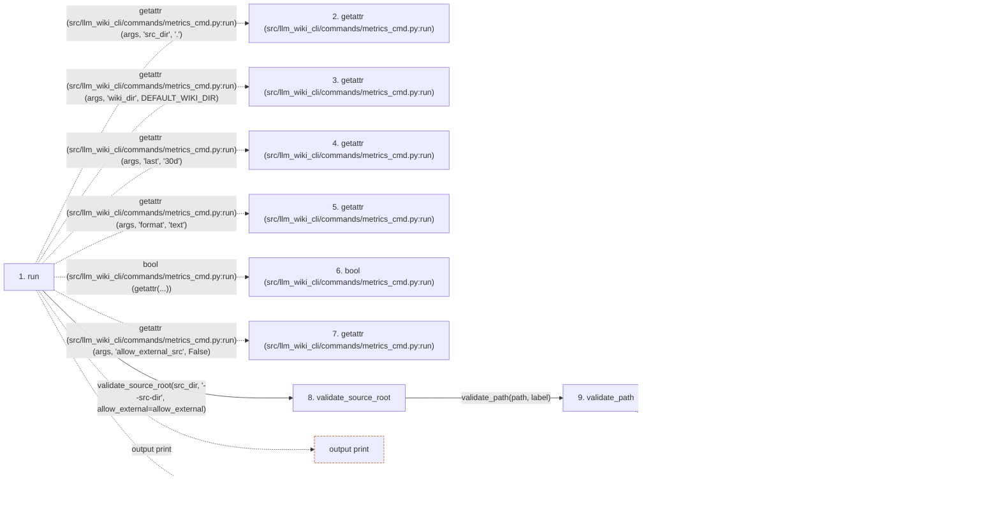

# metrics

**Entry point:** `run` (`cli`)
**Source:** [metrics_cmd](../modules/metrics_cmd.md)
**Modules touched:** [analysis_capture](../modules/analysis_capture.md), [bootstrap_runtime](../modules/bootstrap_runtime.md), [common](../modules/common.md), [config](../modules/config.md), and 27 more

**Complete modules touched:**

- [analysis_capture](../modules/analysis_capture.md)
- [bootstrap_runtime](../modules/bootstrap_runtime.md)
- [common](../modules/common.md)
- [config](../modules/config.md)
- [documentation_queries](../modules/documentation_queries.md)
- [documentation_query_builder](../modules/documentation_query_builder.md)
- [extraction_jobs](../modules/extraction_jobs.md)
- [extraction_service](../modules/extraction_service.md)
- [filesystem_guard](../modules/filesystem_guard.md)
- [go_calls](../modules/go_calls.md)
- [imports](../modules/imports.md)
- [inventory_cache](../modules/inventory_cache.md)
- [io](../modules/io.md)
- [knowledge_observability](../modules/knowledge_observability.md)
- [knowledge_storage](../modules/knowledge_storage.md)
- [knowledge_storage_io](../modules/knowledge_storage_io.md)
- [lint_service](../modules/lint_service.md)
- [maintenance_state](../modules/maintenance_state.md)
- [manifest_storage](../modules/manifest_storage.md)
- [metrics](../modules/metrics.md)
- [metrics_cmd](../modules/metrics_cmd.md)
- [packages](../modules/packages.md)
- [plugins](../modules/plugins.md)
- [progress](../modules/progress.md)
- [python_contracts](../modules/python_contracts.md)
- [python_implementation](../modules/python_implementation.md)
- [python_observations](../modules/python_observations.md)
- [source_selection](../modules/source_selection.md)
- [source_snapshot](../modules/source_snapshot.md)
- [sync_manifest](../modules/sync_manifest.md)
- [validation](../modules/validation.md)

## Call sequence

> Static overview in presentation order, not runtime execution order. Arrows retain captured callers; siblings are shown before deeper helper detail.

<!-- Auto-generated from static call edges. Dashed arrows are external or unresolved calls. Reviewed runtime conditions and side effects belong in Behavior. -->

```mermaid
sequenceDiagram
    participant p0 as run
    participant p1 as getattr (src/llm_wiki_cli/commands/metrics_cmd.py:run)
    participant p2 as bool (src/llm_wiki_cli/commands/metrics_cmd.py:run)
    participant p3 as validate_source_root
    participant p4 as str (src/llm_wiki_cli/commands/metrics_cmd.py:run)
    participant p5 as validate_path
    participant p6 as load_events
    participant p7 as summarize_events
    participant p8 as print
    participant p9 as json.dumps
    participant p10 as render_text
    participant p11 as metrics_path
    participant p12 as event.get (src/llm_wiki_cli/services…trics.py:summarize_events)
    participant p13 as _fmt_percent
    participant p14 as Path(…).expanduser
    participant p15 as path.exists
    participant p16 as Path (src/llm_wiki_cli/config.py:validate_source_root)
    participant p17 as parse_window
    participant p18 as _fmt_ms
    participant p19 as candidate.is_absolute
    participant p20 as _utc_now
    p0-->>p1: getattr (src/llm_wiki_cli/commands/metrics_cmd.py:run)(args, 'src_dir', '.')
    p0-->>p1: getattr (src/llm_wiki_cli/commands/metrics_cmd.py:run)(args, 'wiki_dir', DEFAULT_WIKI_DIR)
    p0-->>p1: getattr (src/llm_wiki_cli/commands/metrics_cmd.py:run)(args, 'last', '30d')
    p0-->>p1: getattr (src/llm_wiki_cli/commands/metrics_cmd.py:run)(args, 'format', 'text')
    p0-->>p2: bool (src/llm_wiki_cli/commands/metrics_cmd.py:run)(getattr(...))
    p0-->>p1: getattr (src/llm_wiki_cli/commands/metrics_cmd.py:run)(args, 'allow_external_src', False)
    p0->>p3: validate_source_root
    p0-->>p4: str (src/llm_wiki_cli/commands/metrics_cmd.py:run)(source_root)
    p0->>p5: validate_path
    p0->>p6: load_events
    p0->>p7: summarize_events
    p0-->>p1: getattr (src/llm_wiki_cli/commands/metrics_cmd.py:run)(args, 'source_selection', None)
    p0-->>p8: print(json.dumps(...))
    p0-->>p9: json.dumps(summary, indent=2, sort_keys=True)
    p0-->>p8: print(render_text(...), end='')
    p0->>p10: render_text
    p3->>p5: validate_path
    p6->>p11: metrics_path
    p7-->>p12: event.get (src/llm_wiki_cli/services…trics.py:summarize_events)('event')
    p10->>p13: _fmt_percent
    p3-->>p14: Path(…).expanduser
    p6-->>p15: path.exists
    p7-->>p12: event.get (src/llm_wiki_cli/services…trics.py:summarize_events)('strict')
    p10->>p13: _fmt_percent
    p3-->>p16: Path (src/llm_wiki_cli/config.py:validate_source_root)(path)
    p6->>p17: parse_window
    p7-->>p12: event.get (src/llm_wiki_cli/services…trics.py:summarize_events)('passed')
    p10->>p18: _fmt_ms
    p3-->>p19: candidate.is_absolute
    p6->>p20: _utc_now
```

> Call sequence diagram shows 30 of 1044 interactions; 1014 omitted to keep the visualization within the 30-interaction and generated-diagram limits, with uncertain identities omitted rather than inferred.

> Captured boundary calls: external 12 of 388 (376 omitted); unresolved 6 of 264 (258 omitted). These counts cover the captured static trace.

Omitted captured detail, grouped by actual caller occurrence and target module:

| Caller | Parent step | Target module | Kind | Omitted interactions |
| --- | --- | --- | --- | --- |
| `src/llm_wiki_cli/config.py:validate_path` | 9 | [src/llm_wiki_cli/config.py](../modules/config.md) | internal | 2 |
| `src/llm_wiki_cli/config.py:validate_path` | 9 | - | unresolved | 3 |
| `src/llm_wiki_cli/config.py:validate_path` | 9 | - | external | 2 |
| `src/llm_wiki_cli/config.py:validate_source_root` | 8 | - | external | 10 |
| `src/llm_wiki_cli/config.py:validate_source_root` | 8 | - | unresolved | 3 |
| `src/llm_wiki_cli/config.py:validate_source_root` | 8 | [src/llm_wiki_cli/config.py](../modules/config.md) | internal | 6 |
| `src/llm_wiki_cli/config.py:validate_source_root` | 8 | [src/llm_wiki_cli/services/filesystem_guard.py](../modules/filesystem_guard.md) | internal | 1 |
| `src/llm_wiki_cli/services/filesystem_guard.py:windows_current_user_sid` | 27 | [src/llm_wiki_cli/services/filesystem_guard.py](../modules/filesystem_guard.md) | internal | 2 |
> Omission summary shows 8 of 279 groups; 271 further groups are not expanded here. Counts above include all omitted interactions.
> Detailed flow queries retain their own coverage and limits; omitted paths may execute at runtime.

> Trace truncated at the depth limit; deeper calls are omitted.

## Data flow

<!-- Auto-generated static analysis. Treat values and boundaries as best-effort hints, not runtime proof. -->

```mermaid
flowchart LR
    s1["1. run"]
    s2["2. getattr (src/llm_wiki_cli/commands/metrics_cmd.py:run)"]
    s3["3. getattr (src/llm_wiki_cli/commands/metrics_cmd.py:run)"]
    s4["4. getattr (src/llm_wiki_cli/commands/metrics_cmd.py:run)"]
    s5["5. getattr (src/llm_wiki_cli/commands/metrics_cmd.py:run)"]
    s6["6. bool (src/llm_wiki_cli/commands/metrics_cmd.py:run)"]
    s7["7. getattr (src/llm_wiki_cli/commands/metrics_cmd.py:run)"]
    s8["8. validate_source_root"]
    s9["9. validate_path"]
    s10["10. PathValidationError"]
    s11["11. (…).resolve"]
    s12["12. Path.cwd (src/llm_wiki_cli/config.py:validate_path)"]
    s1 -. "getattr (src/llm_wiki_cli/commands/metrics_cmd.py:run)(args, 'src_dir', '.')" .-> s2
    s1 -. "getattr (src/llm_wiki_cli/commands/metrics_cmd.py:run)(args, 'wiki_dir', DEFAULT_WIKI_DIR)" .-> s3
    s1 -. "getattr (src/llm_wiki_cli/commands/metrics_cmd.py:run)(args, 'last', '30d')" .-> s4
    s1 -. "getattr (src/llm_wiki_cli/commands/metrics_cmd.py:run)(args, 'format', 'text')" .-> s5
    s1 -. "bool (src/llm_wiki_cli/commands/metrics_cmd.py:run)(getattr(...))" .-> s6
    s1 -. "getattr (src/llm_wiki_cli/commands/metrics_cmd.py:run)(args, 'allow_external_src', False)" .-> s7
    s1 -->|"validate_source_root(src_dir, '--src-dir', allow_external=allow_external)"| s8
    s8 -->|"validate_path(path, label)"| s9
    s9 -->|"PathValidationError(...)"| s10
    s9 -. "(…).resolve(data not statically known)" .-> s11
    s9 -. "Path.cwd (src/llm_wiki_cli/config.py:validate_path)(data not statically known)" .-> s12
    b0["output print"]
    s1 -. "output print" .-> b0
    b1["output print"]
    s1 -. "output print" .-> b1
    click s1 "../modules/metrics_cmd.md"
    click s8 "../modules/config.md"
    click s9 "../modules/config.md"
    click s10 "../modules/config.md"
    classDef boundary stroke:#b45309,stroke-dasharray: 4 2
    class b0 boundary
    class b1 boundary
```

### Step data

| Step | Inputs | Reads | Writes | Returns |
|---|---|---|---|---|
| `run` | `args` | `DEFAULT_WIKI_DIR` | - | - |
| `getattr (src/llm_wiki_cli/commands/metrics_cmd.py:run)` | - | - | - | - |
| `getattr (src/llm_wiki_cli/commands/metrics_cmd.py:run)` | - | - | - | - |
| `getattr (src/llm_wiki_cli/commands/metrics_cmd.py:run)` | - | - | - | - |
| `getattr (src/llm_wiki_cli/commands/metrics_cmd.py:run)` | - | - | - | - |
| `bool (src/llm_wiki_cli/commands/metrics_cmd.py:run)` | - | - | - | - |
| `getattr (src/llm_wiki_cli/commands/metrics_cmd.py:run)` | - | - | - | - |
| `validate_source_root` | `path: str`, `label: str`, `allow_external: bool` | `sys`, `os`, `WindowsSecurityGuardError`, `sys` | - | `validate_path(...)`, `resolved` |
| `validate_path` | `path: str`, `label: str` | - | - | `resolved` |
| `PathValidationError` | - | - | - | - |
| `(…).resolve` | - | - | - | - |
| `Path.cwd (src/llm_wiki_cli/config.py:validate_path)` | - | - | - | - |

### Call data

| From | To | Line | Call |
|---|---|---:|---|
| run | getattr (src/llm_wiki_cli/commands/metrics_cmd.py:run) | 110 | `getattr(args, 'src_dir', '.')` |
| run | getattr (src/llm_wiki_cli/commands/metrics_cmd.py:run) | 111 | `getattr(args, 'wiki_dir', DEFAULT_WIKI_DIR)` |
| run | getattr (src/llm_wiki_cli/commands/metrics_cmd.py:run) | 112 | `getattr(args, 'last', '30d')` |
| run | getattr (src/llm_wiki_cli/commands/metrics_cmd.py:run) | 113 | `getattr(args, 'format', 'text')` |
| run | bool (src/llm_wiki_cli/commands/metrics_cmd.py:run) | 115 | `bool(getattr(...))` |
| run | getattr (src/llm_wiki_cli/commands/metrics_cmd.py:run) | 115 | `getattr(args, 'allow_external_src', False)` |
| run | validate_source_root | 116 | `validate_source_root(src_dir, '--src-dir', allow_external=allow_external)` |
| validate_source_root | validate_path | 160 | `validate_path(path, label)` |
| validate_path | PathValidationError | 134 | `PathValidationError(...)` |
| validate_path | (…).resolve | 135 | `(Path.cwd() / path).resolve(data not statically known)` |
| validate_path | Path.cwd (src/llm_wiki_cli/config.py:validate_path) | 135 | `Path.cwd(data not statically known)` |

### Boundary effects

| Kind | Target | Step | Line |
|---|---|---|---:|
| output | `print` | `run` | 134 |
| output | `print` | `run` | 136 |

### Static analysis gaps

| Kind | Step | Target | Line |
|---|---|---|---:|
| external_call | `run` | `getattr` | 110 |
| external_call | `run` | `getattr` | 111 |
| external_call | `run` | `getattr` | 112 |
| external_call | `run` | `getattr` | 113 |
| external_call | `run` | `getattr` | 115 |
| unresolved_call | `validate_path` | `(Path.cwd() / path).resolve` | 135 |
| external_call | `validate_path` | `Path.cwd` | 135 |
| step_limit | `run` | `first 12 steps` | 0 |
| truncated_flow | `run` | `depth limit` | 0 |

## Behavior

This flow starts at `run` and is classified as `cli`. The generated call and data-flow sections are bounded static projections; runtime conditions and side effects require source-level confirmation.
