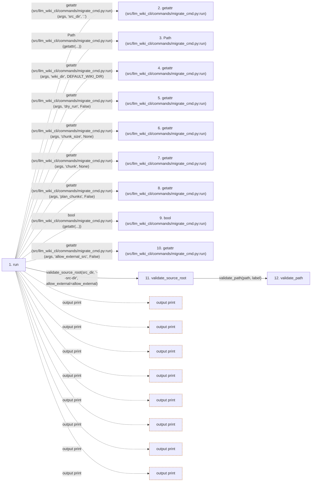

# migrate

**Entry point:** `run` (`cli`)
**Source:** [migrate_cmd](../modules/migrate_cmd.md)
**Modules touched:** [bootstrap_runtime](../modules/bootstrap_runtime.md), [common](../modules/common.md), [concept_identity](../modules/concept_identity.md), [config](../modules/config.md), and 31 more

**Complete modules touched:**

- [bootstrap_runtime](../modules/bootstrap_runtime.md)
- [common](../modules/common.md)
- [concept_identity](../modules/concept_identity.md)
- [config](../modules/config.md)
- [data_flow](../modules/data_flow.md)
- [extraction_jobs](../modules/extraction_jobs.md)
- [extraction_service](../modules/extraction_service.md)
- [filesystem_guard](../modules/filesystem_guard.md)
- [immutable](../modules/immutable.md)
- [imports](../modules/imports.md)
- [infrastructure_sync](../modules/infrastructure_sync.md)
- [inventory_cache](../modules/inventory_cache.md)
- [io](../modules/io.md)
- [knowledge_artifacts](../modules/knowledge_artifacts.md)
- [knowledge_envelope](../modules/knowledge_envelope.md)
- [knowledge_evidence](../modules/knowledge_evidence.md)
- [knowledge_generation](../modules/knowledge_generation.md)
- [knowledge_governance](../modules/knowledge_governance.md)
- [knowledge_loader](../modules/knowledge_loader.md)
- [knowledge_model](../modules/knowledge_model.md)
- [knowledge_orchestration](../modules/knowledge_orchestration.md)
- [migrate_cmd](../modules/migrate_cmd.md)
- [packages](../modules/packages.md)
- [paths](../modules/paths.md)
- [plugins](../modules/plugins.md)
- [progress](../modules/progress.md)
- [python_contracts](../modules/python_contracts.md)
- [python_imports](../modules/python_imports.md)
- [python_observations](../modules/python_observations.md)
- [resource_diagnostics](../modules/resource_diagnostics.md)
- [source_selection](../modules/source_selection.md)
- [source_snapshot](../modules/source_snapshot.md)
- [sync_manifest](../modules/sync_manifest.md)
- [validation](../modules/validation.md)
- [wiki_surface](../modules/wiki_surface.md)

## Call sequence

```mermaid
sequenceDiagram
    participant p0 as run
    participant p1 as getattr (src/llm_wiki_cli/commands/migrate_cmd.py:run)
    participant p2 as Path (src/llm_wiki_cli/commands/migrate_cmd.py:run)
    participant p3 as bool (src/llm_wiki_cli/commands/migrate_cmd.py:run)
    participant p4 as validate_source_root
    participant p5 as validate_path
    participant p6 as PathValidationError
    participant p7 as (…).resolve
    participant p8 as Path.cwd (src/llm_wiki_cli/config.py:validate_path)
    participant p9 as Path.cwd().resolve (src/llm_wiki_cli/config.py:validate_path)
    participant p10 as resolved.relative_to (src/llm_wiki_cli/config.py:validate_path)
    participant p11 as Path(…).expanduser
    participant p12 as Path (src/llm_wiki_cli/config.py:validate_source_root)
    participant p13 as candidate.is_absolute (src/llm_wiki_cli/config.py:validate_source_root)
    participant p14 as Path.cwd (src/llm_wiki_cli/config.py:validate_source_root)
    participant p15 as candidate.resolve (src/llm_wiki_cli/config.py:validate_source_root)
    participant p16 as resolved.is_dir
    participant p17 as os.path.abspath (src/llm_wiki_cli/config.py:validate_source_root)
    participant p18 as windows_current_user_sid
    participant p19 as WindowsSecurityGuardError
    p0-->>p1: getattr (src/llm_wiki_cli/commands/migrate_cmd.py:run)
    p0-->>p2: Path (src/llm_wiki_cli/commands/migrate_cmd.py:run)
    p0-->>p1: getattr (src/llm_wiki_cli/commands/migrate_cmd.py:run)
    p0-->>p1: getattr (src/llm_wiki_cli/commands/migrate_cmd.py:run)
    p0-->>p1: getattr (src/llm_wiki_cli/commands/migrate_cmd.py:run)
    p0-->>p1: getattr (src/llm_wiki_cli/commands/migrate_cmd.py:run)
    p0-->>p1: getattr (src/llm_wiki_cli/commands/migrate_cmd.py:run)
    p0-->>p3: bool (src/llm_wiki_cli/commands/migrate_cmd.py:run)
    p0-->>p1: getattr (src/llm_wiki_cli/commands/migrate_cmd.py:run)
    p0->>p4: validate_source_root
    p4->>p5: validate_path
    p5->>p6: PathValidationError
    p5-->>p7: (…).resolve
    p5-->>p8: Path.cwd (src/llm_wiki_cli/config.py:validate_path)
    p5-->>p9: Path.cwd().resolve (src/llm_wiki_cli/config.py:validate_path)
    p5-->>p8: Path.cwd (src/llm_wiki_cli/config.py:validate_path)
    p5-->>p10: resolved.relative_to (src/llm_wiki_cli/config.py:validate_path)
    p5->>p6: PathValidationError
    p4-->>p11: Path(…).expanduser
    p4-->>p12: Path (src/llm_wiki_cli/config.py:validate_source_root)
    p4-->>p13: candidate.is_absolute (src/llm_wiki_cli/config.py:validate_source_root)
    p4-->>p14: Path.cwd (src/llm_wiki_cli/config.py:validate_source_root)
    p4-->>p15: candidate.resolve (src/llm_wiki_cli/config.py:validate_source_root)
    p4->>p6: PathValidationError
    p4-->>p16: resolved.is_dir
    p4->>p6: PathValidationError
    p4-->>p12: Path (src/llm_wiki_cli/config.py:validate_source_root)
    p4-->>p17: os.path.abspath (src/llm_wiki_cli/config.py:validate_source_root)
    p4->>p18: windows_current_user_sid
    p18->>p19: WindowsSecurityGuardError
```

<!-- Auto-generated from static call edges. Dashed arrows are external or unresolved calls. Reviewed runtime conditions and side effects belong in Behavior. -->

> Call sequence diagram shows 30 of 3448 interactions; 3418 omitted to keep the visualization within the 30-interaction and generated-diagram limits.

> Trace truncated at the depth limit; deeper calls are omitted.

## Data flow

<!-- Auto-generated static analysis. Treat values and boundaries as best-effort hints, not runtime proof. -->

### Step data

| Step | Inputs | Reads | Writes | Returns |
|---|---|---|---|---|
| `run` | `args` | `DEFAULT_WIKI_DIR`, `sys`, `sys`, `sys` | - | `none`, `none`, `none` |
| `getattr (src/llm_wiki_cli/commands/migrate_cmd.py:run)` | - | - | - | - |
| `Path (src/llm_wiki_cli/commands/migrate_cmd.py:run)` | - | - | - | - |
| `getattr (src/llm_wiki_cli/commands/migrate_cmd.py:run)` | - | - | - | - |
| `getattr (src/llm_wiki_cli/commands/migrate_cmd.py:run)` | - | - | - | - |
| `getattr (src/llm_wiki_cli/commands/migrate_cmd.py:run)` | - | - | - | - |
| `getattr (src/llm_wiki_cli/commands/migrate_cmd.py:run)` | - | - | - | - |
| `getattr (src/llm_wiki_cli/commands/migrate_cmd.py:run)` | - | - | - | - |
| `bool (src/llm_wiki_cli/commands/migrate_cmd.py:run)` | - | - | - | - |
| `getattr (src/llm_wiki_cli/commands/migrate_cmd.py:run)` | - | - | - | - |
| `validate_source_root` | `path: str`, `label: str`, `allow_external: bool` | `sys`, `os`, `WindowsSecurityGuardError`, `sys` | - | `validate_path(...)`, `resolved` |
| `validate_path` | `path: str`, `label: str` | - | - | `resolved` |

### Call data

| From | To | Line | Call |
|---|---|---:|---|
| run | getattr (src/llm_wiki_cli/commands/migrate_cmd.py:run) | 1672 | `getattr(args, 'src_dir', '.')` |
| run | Path (src/llm_wiki_cli/commands/migrate_cmd.py:run) | 1673 | `Path(getattr(...))` |
| run | getattr (src/llm_wiki_cli/commands/migrate_cmd.py:run) | 1673 | `getattr(args, 'wiki_dir', DEFAULT_WIKI_DIR)` |
| run | getattr (src/llm_wiki_cli/commands/migrate_cmd.py:run) | 1674 | `getattr(args, 'dry_run', False)` |
| run | getattr (src/llm_wiki_cli/commands/migrate_cmd.py:run) | 1675 | `getattr(args, 'chunk_size', None)` |
| run | getattr (src/llm_wiki_cli/commands/migrate_cmd.py:run) | 1676 | `getattr(args, 'chunk', None)` |
| run | getattr (src/llm_wiki_cli/commands/migrate_cmd.py:run) | 1677 | `getattr(args, 'plan_chunks', False)` |
| run | bool (src/llm_wiki_cli/commands/migrate_cmd.py:run) | 1678 | `bool(getattr(...))` |
| run | getattr (src/llm_wiki_cli/commands/migrate_cmd.py:run) | 1678 | `getattr(args, 'allow_external_src', False)` |
| run | validate_source_root | 1679 | `validate_source_root(src_dir, '--src-dir', allow_external=allow_external)` |
| validate_source_root | validate_path | 158 | `validate_path(path, label)` |

### Boundary effects

| Kind | Target | Step | Line |
|---|---|---|---:|
| output | `print` | `run` | 1689 |
| output | `print` | `run` | 1693 |
| output | `print` | `run` | 1696 |
| output | `print` | `run` | 1697 |
| output | `print` | `run` | 1706 |
| output | `print` | `run` | 1714 |
| output | `print` | `run` | 1720 |
| output | `print` | `run` | 1725 |

### Static analysis gaps

| Kind | Step | Target | Line |
|---|---|---|---:|
| external_call | `run` | `getattr` | 1672 |
| external_call | `run` | `getattr` | 1673 |
| external_call | `run` | `getattr` | 1674 |
| external_call | `run` | `getattr` | 1675 |
| external_call | `run` | `getattr` | 1676 |
| external_call | `run` | `getattr` | 1677 |
| external_call | `run` | `getattr` | 1678 |
| step_limit | `run` | `first 12 steps` | 0 |
| truncated_flow | `run` | `depth limit` | 0 |

## Behavior

This flow starts at `run` and is classified as `cli`. The generated call and data-flow sections are bounded static projections; runtime conditions and side effects require source-level confirmation.
