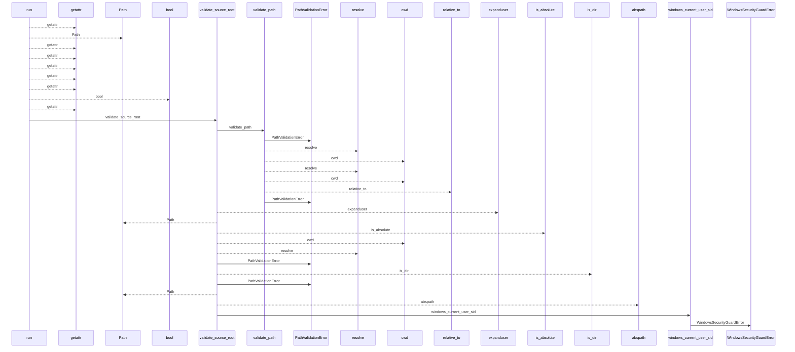
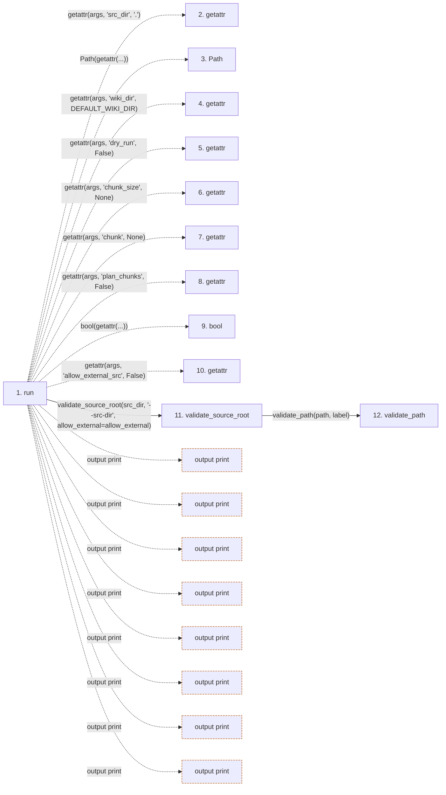

# migrate

**Entry point:** `run` (`cli`)
**Source:** [migrate_cmd](../modules/migrate_cmd.md)
**Modules touched:** [bootstrap_runtime](../modules/bootstrap_runtime.md), [common](../modules/common.md), [concept_identity](../modules/concept_identity.md), [config](../modules/config.md), and 28 more

**Complete modules touched:**

- [bootstrap_runtime](../modules/bootstrap_runtime.md)
- [common](../modules/common.md)
- [concept_identity](../modules/concept_identity.md)
- [config](../modules/config.md)
- [extraction_jobs](../modules/extraction_jobs.md)
- [extraction_service](../modules/extraction_service.md)
- [filesystem_guard](../modules/filesystem_guard.md)
- [imports](../modules/imports.md)
- [infrastructure_sync](../modules/infrastructure_sync.md)
- [inventory_cache](../modules/inventory_cache.md)
- [io](../modules/io.md)
- [knowledge_artifacts](../modules/knowledge_artifacts.md)
- [knowledge_envelope](../modules/knowledge_envelope.md)
- [knowledge_evidence](../modules/knowledge_evidence.md)
- [knowledge_generation](../modules/knowledge_generation.md)
- [knowledge_governance](../modules/knowledge_governance.md)
- [knowledge_graph](../modules/knowledge_graph.md)
- [knowledge_index](../modules/knowledge_index.md)
- [knowledge_links](../modules/knowledge_links.md)
- [knowledge_loader](../modules/knowledge_loader.md)
- [knowledge_model](../modules/knowledge_model.md)
- [knowledge_orchestration](../modules/knowledge_orchestration.md)
- [migrate_cmd](../modules/migrate_cmd.md)
- [packages](../modules/packages.md)
- [paths](../modules/paths.md)
- [plugins](../modules/plugins.md)
- [resource_diagnostics](../modules/resource_diagnostics.md)
- [section_ownership](../modules/section_ownership.md)
- [source_selection](../modules/source_selection.md)
- [source_snapshot](../modules/source_snapshot.md)
- [validation](../modules/validation.md)
- [wiki_surface](../modules/wiki_surface.md)

## Call sequence

<!-- Auto-generated from static call edges. Dashed arrows are external or unresolved calls. Reviewed runtime conditions and side effects belong in Behavior. -->

> Call sequence diagram shows 30 of 3212 interactions; 3182 omitted to keep the visualization within the 30-interaction and generated-diagram limits.

> Trace truncated at the depth limit; deeper calls are omitted.

## Data flow

<!-- Auto-generated static analysis. Treat values and boundaries as best-effort hints, not runtime proof. -->

### Step data

| Step | Inputs | Reads | Writes | Returns |
|---|---|---|---|---|
| `run` | `args` | `DEFAULT_WIKI_DIR`, `sys`, `sys`, `sys` | - | `none`, `none`, `none` |
| `getattr` | - | - | - | - |
| `Path` | - | - | - | - |
| `getattr` | - | - | - | - |
| `getattr` | - | - | - | - |
| `getattr` | - | - | - | - |
| `getattr` | - | - | - | - |
| `getattr` | - | - | - | - |
| `bool` | - | - | - | - |
| `getattr` | - | - | - | - |
| `validate_source_root` | `path: str`, `label: str`, `allow_external: bool` | `sys`, `os`, `WindowsSecurityGuardError`, `sys` | - | `validate_path(...)`, `resolved` |
| `validate_path` | `path: str`, `label: str` | - | - | `resolved` |

### Call data

| From | To | Line | Call |
|---|---|---:|---|
| run | getattr | 1631 | `getattr(args, 'src_dir', '.')` |
| run | Path | 1632 | `Path(getattr(...))` |
| run | getattr | 1632 | `getattr(args, 'wiki_dir', DEFAULT_WIKI_DIR)` |
| run | getattr | 1633 | `getattr(args, 'dry_run', False)` |
| run | getattr | 1634 | `getattr(args, 'chunk_size', None)` |
| run | getattr | 1635 | `getattr(args, 'chunk', None)` |
| run | getattr | 1636 | `getattr(args, 'plan_chunks', False)` |
| run | bool | 1637 | `bool(getattr(...))` |
| run | getattr | 1637 | `getattr(args, 'allow_external_src', False)` |
| run | validate_source_root | 1638 | `validate_source_root(src_dir, '--src-dir', allow_external=allow_external)` |
| validate_source_root | validate_path | 156 | `validate_path(path, label)` |

### Boundary effects

| Kind | Target | Step | Line |
|---|---|---|---:|
| output | `print` | `run` | 1648 |
| output | `print` | `run` | 1652 |
| output | `print` | `run` | 1655 |
| output | `print` | `run` | 1656 |
| output | `print` | `run` | 1665 |
| output | `print` | `run` | 1673 |
| output | `print` | `run` | 1679 |
| output | `print` | `run` | 1684 |

### Static analysis gaps

| Kind | Step | Target | Line |
|---|---|---|---:|
| unresolved_call | `run` | `getattr` | 1631 |
| unresolved_call | `run` | `getattr` | 1632 |
| unresolved_call | `run` | `getattr` | 1633 |
| unresolved_call | `run` | `getattr` | 1634 |
| unresolved_call | `run` | `getattr` | 1635 |
| unresolved_call | `run` | `getattr` | 1636 |
| unresolved_call | `run` | `getattr` | 1637 |
| step_limit | `run` | `first 12 steps` | 0 |
| truncated_flow | `run` | `depth limit` | 0 |

## Behavior

This flow starts at `run` and is classified as `cli`. The generated call and data-flow sections are bounded static projections; runtime conditions and side effects require source-level confirmation.
