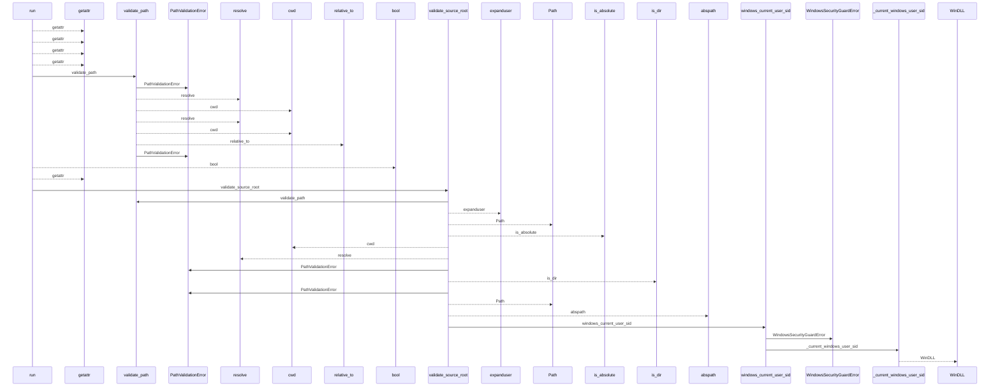
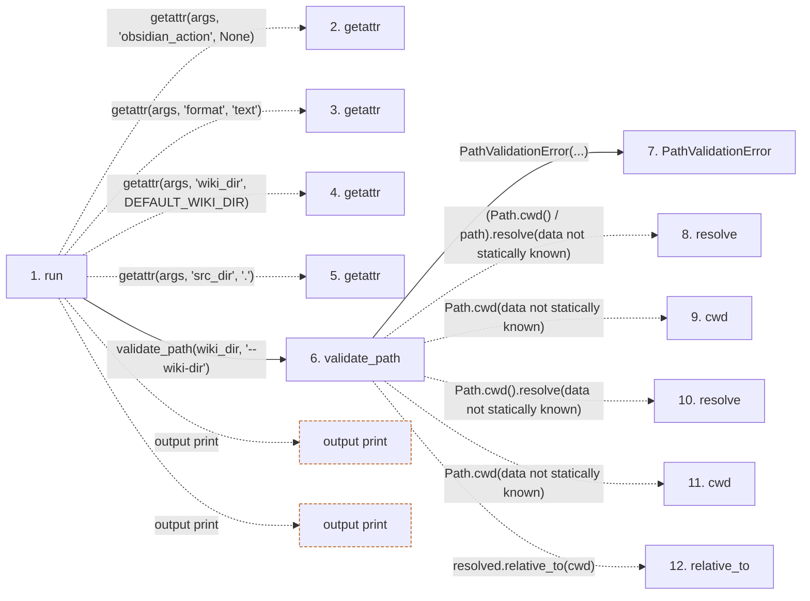

# obsidian

**Entry point:** `run` (`cli`)
**Source:** [obsidian_cmd](../modules/obsidian_cmd.md)
**Modules touched:** [bootstrap_runtime](../modules/bootstrap_runtime.md), [common](../modules/common.md), [concept_identity](../modules/concept_identity.md), [config](../modules/config.md), and 30 more

**Complete modules touched:**

- [bootstrap_runtime](../modules/bootstrap_runtime.md)
- [common](../modules/common.md)
- [concept_identity](../modules/concept_identity.md)
- [config](../modules/config.md)
- [documentation_queries](../modules/documentation_queries.md)
- [documentation_query_builder](../modules/documentation_query_builder.md)
- [extraction_jobs](../modules/extraction_jobs.md)
- [extraction_service](../modules/extraction_service.md)
- [filesystem_guard](../modules/filesystem_guard.md)
- [inventory_cache](../modules/inventory_cache.md)
- [io](../modules/io.md)
- [knowledge_artifacts](../modules/knowledge_artifacts.md)
- [knowledge_consumption](../modules/knowledge_consumption.md)
- [knowledge_envelope](../modules/knowledge_envelope.md)
- [knowledge_evidence](../modules/knowledge_evidence.md)
- [knowledge_freshness](../modules/knowledge_freshness.md)
- [knowledge_governance](../modules/knowledge_governance.md)
- [knowledge_graph](../modules/knowledge_graph.md)
- [knowledge_index](../modules/knowledge_index.md)
- [knowledge_loader](../modules/knowledge_loader.md)
- [knowledge_model](../modules/knowledge_model.md)
- [knowledge_observability](../modules/knowledge_observability.md)
- [knowledge_projection](../modules/knowledge_projection.md)
- [knowledge_verification](../modules/knowledge_verification.md)
- [obsidian](../modules/obsidian.md)
- [obsidian_cmd](../modules/obsidian_cmd.md)
- [packages](../modules/packages.md)
- [plugins](../modules/plugins.md)
- [section_ownership](../modules/section_ownership.md)
- [source_selection](../modules/source_selection.md)
- [source_snapshot](../modules/source_snapshot.md)
- [validation](../modules/validation.md)
- [verification_contracts](../modules/verification_contracts.md)
- [wiki_surface](../modules/wiki_surface.md)

## Call sequence

<!-- Auto-generated from static call edges. Dashed arrows are external or unresolved calls. Reviewed runtime conditions and side effects belong in Behavior. -->

> Call sequence diagram shows 30 of 2653 interactions; 2623 omitted to keep the visualization within the 30-interaction and generated-diagram limits.

> Trace truncated at the depth limit; deeper calls are omitted.

## Data flow

<!-- Auto-generated static analysis. Treat values and boundaries as best-effort hints, not runtime proof. -->

### Step data

| Step | Inputs | Reads | Writes | Returns |
|---|---|---|---|---|
| `run` | `args` | `DEFAULT_WIKI_DIR`, `DEFAULT_NOTES_DIR`, `DEFAULT_WIKI_DIR`, `DEFAULT_PLUGIN_SOURCE`, `ObsidianError`, `sys`, `sys` | - | `none`, `none`, `none` |
| `getattr` | - | - | - | - |
| `getattr` | - | - | - | - |
| `getattr` | - | - | - | - |
| `getattr` | - | - | - | - |
| `validate_path` | `path: str`, `label: str` | - | - | `resolved` |
| `PathValidationError` | - | - | - | - |
| `resolve` | - | - | - | - |
| `cwd` | - | - | - | - |
| `resolve` | - | - | - | - |
| `cwd` | - | - | - | - |
| `relative_to` | - | - | - | - |

### Call data

| From | To | Line | Call |
|---|---|---:|---|
| run | getattr | 74 | `getattr(args, 'obsidian_action', None)` |
| run | getattr | 75 | `getattr(args, 'format', 'text')` |
| run | getattr | 79 | `getattr(args, 'wiki_dir', DEFAULT_WIKI_DIR)` |
| run | getattr | 80 | `getattr(args, 'src_dir', '.')` |
| run | validate_path | 81 | `validate_path(wiki_dir, '--wiki-dir')` |
| validate_path | PathValidationError | 132 | `PathValidationError(...)` |
| validate_path | resolve | 133 | `(Path.cwd() / path).resolve(data not statically known)` |
| validate_path | cwd | 133 | `Path.cwd(data not statically known)` |
| validate_path | resolve | 134 | `Path.cwd().resolve(data not statically known)` |
| validate_path | cwd | 134 | `Path.cwd(data not statically known)` |
| validate_path | relative_to | 136 | `resolved.relative_to(cwd)` |

### Boundary effects

| Kind | Target | Step | Line |
|---|---|---|---:|
| output | `print` | `run` | 132 |
| output | `print` | `run` | 135 |

### Static analysis gaps

| Kind | Step | Target | Line |
|---|---|---|---:|
| unresolved_call | `run` | `getattr` | 74 |
| unresolved_call | `run` | `getattr` | 75 |
| unresolved_call | `run` | `getattr` | 79 |
| unresolved_call | `run` | `getattr` | 80 |
| unresolved_call | `validate_path` | `(Path.cwd() / path).resolve` | 133 |
| external_call | `validate_path` | `Path.cwd` | 133 |
| external_call | `validate_path` | `Path.cwd().resolve` | 134 |
| external_call | `validate_path` | `Path.cwd` | 134 |
| unresolved_call | `validate_path` | `resolved.relative_to` | 136 |
| step_limit | `run` | `first 12 steps` | 0 |
| truncated_flow | `run` | `depth limit` | 0 |

## Behavior

Dispatches one of three explicit actions. `export` validates the current source
selection and writes or previews a derived vault mirror; `check` compares an
existing mirror and exits nonzero on mismatches; `install-plugin` copies the
packaged plugin into the vault. Optional knowledge metadata is projected under
the selected disclosure profile before export, and the canonical wiki is never
replaced by mirror content.
