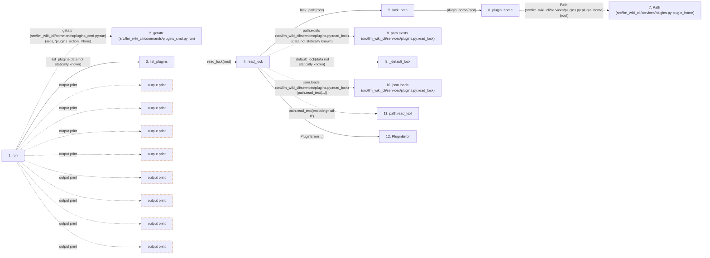

# plugins

**Entry point:** `run` (`cli`)
**Source:** [plugins_cmd](../modules/plugins_cmd.md)
**Modules touched:** [config](../modules/config.md), [io](../modules/io.md), [plugin_samples](../modules/plugin_samples.md), [plugins](../modules/plugins.md), and 3 more

**Complete modules touched:**

- [config](../modules/config.md)
- [io](../modules/io.md)
- [plugin_samples](../modules/plugin_samples.md)
- [plugins](../modules/plugins.md)
- [plugins_cmd](../modules/plugins_cmd.md)
- [services_schema](../modules/services_schema.md)
- [validation](../modules/validation.md)

## Call sequence

```mermaid
sequenceDiagram
    participant p0 as run
    participant p1 as getattr (src/llm_wiki_cli/commands/plugins_cmd.py:run)
    participant p2 as list_plugins
    participant p3 as read_lock
    participant p4 as lock_path
    participant p5 as plugin_home
    participant p6 as Path (src/llm_wiki_cli/services/plugins.py:plugin_home)
    participant p7 as path.exists (src/llm_wiki_cli/services/plugins.py:read_lock)
    participant p8 as _default_lock
    participant p9 as json.loads (src/llm_wiki_cli/services/plugins.py:read_lock)
    participant p10 as path.read_text
    participant p11 as PluginError
    participant p12 as isinstance (src/llm_wiki_cli/services/plugins.py:read_lock)
    participant p13 as data.get
    participant p14 as data.setdefault
    participant p15 as dict
    participant p16 as lock.get(…).values
    participant p17 as lock.get
    participant p18 as print
    participant p19 as _render_components
    participant p20 as plugin.get
    participant p21 as component.get
    participant p22 as parts.append
    participant p23 as ', '.join (src/llm_wiki_cli/commands…cmd.py:_render_components)
    p0-->>p1: getattr (src/llm_wiki_cli/commands/plugins_cmd.py:run)
    p0->>p2: list_plugins
    p2->>p3: read_lock
    p3->>p4: lock_path
    p4->>p5: plugin_home
    p5-->>p6: Path (src/llm_wiki_cli/services/plugins.py:plugin_home)
    p3-->>p7: path.exists (src/llm_wiki_cli/services/plugins.py:read_lock)
    p3->>p8: _default_lock
    p3-->>p9: json.loads (src/llm_wiki_cli/services/plugins.py:read_lock)
    p3-->>p10: path.read_text
    p3->>p11: PluginError
    p3-->>p12: isinstance (src/llm_wiki_cli/services/plugins.py:read_lock)
    p3-->>p12: isinstance (src/llm_wiki_cli/services/plugins.py:read_lock)
    p3-->>p13: data.get
    p3->>p11: PluginError
    p3-->>p14: data.setdefault
    p2-->>p15: dict
    p2-->>p16: lock.get(…).values
    p2-->>p17: lock.get
    p0-->>p18: print
    p0-->>p18: print
    p0-->>p18: print
    p0->>p19: _render_components
    p19-->>p20: plugin.get
    p19-->>p21: component.get
    p19-->>p21: component.get
    p19-->>p21: component.get
    p19-->>p22: parts.append
    p19-->>p23: ', '.join (src/llm_wiki_cli/commands…cmd.py:_render_components)
    p0-->>p1: getattr (src/llm_wiki_cli/commands/plugins_cmd.py:run)
```

<!-- Auto-generated from static call edges. Dashed arrows are external or unresolved calls. Reviewed runtime conditions and side effects belong in Behavior. -->

> Call sequence diagram shows 30 of 359 interactions; 329 omitted to keep the visualization within the 30-interaction and generated-diagram limits.

> Trace truncated at the depth limit; deeper calls are omitted.

## Data flow

<!-- Auto-generated static analysis. Treat values and boundaries as best-effort hints, not runtime proof. -->

### Step data

| Step | Inputs | Reads | Writes | Returns |
|---|---|---|---|---|
| `run` | `args` | `PluginError`, `sys`, `DEFAULT_WIKI_DIR`, `PluginError`, `sys`, `PluginError`, `sys`, `sys` | - | `none`, `none`, `none`, `none`, `none`, `none`, `none` |
| `getattr (src/llm_wiki_cli/commands/plugins_cmd.py:run)` | - | - | - | - |
| `list_plugins` | `root: str \| Path` | - | - | `...` |
| `read_lock` | `root: str \| Path` | `json` | - | `_default_lock(...)`, `data` |
| `lock_path` | `root: str \| Path` | `LOCK_FILENAME` | - | `...` |
| `plugin_home` | `root: str \| Path` | `PLUGIN_HOME` | - | `...` |
| `Path (src/llm_wiki_cli/services/plugins.py:plugin_home)` | - | - | - | - |
| `path.exists (src/llm_wiki_cli/services/plugins.py:read_lock)` | - | - | - | - |
| `_default_lock` | - | - | - | `{...}` |
| `json.loads (src/llm_wiki_cli/services/plugins.py:read_lock)` | - | - | - | - |
| `path.read_text` | - | - | - | - |
| `PluginError` | - | - | - | - |

### Call data

| From | To | Line | Call |
|---|---|---:|---|
| run | getattr (src/llm_wiki_cli/commands/plugins_cmd.py:run) | 26 | `getattr(args, 'plugins_action', None)` |
| run | list_plugins | 29 | `list_plugins(data not statically known)` |
| list_plugins | read_lock | 500 | `read_lock(root)` |
| read_lock | lock_path | 77 | `lock_path(root)` |
| lock_path | plugin_home | 69 | `plugin_home(root)` |
| plugin_home | Path (src/llm_wiki_cli/services/plugins.py:plugin_home) | 61 | `Path(root)` |
| read_lock | path.exists (src/llm_wiki_cli/services/plugins.py:read_lock) | 78 | `path.exists(data not statically known)` |
| read_lock | _default_lock | 79 | `_default_lock(data not statically known)` |
| read_lock | json.loads (src/llm_wiki_cli/services/plugins.py:read_lock) | 81 | `json.loads(path.read_text(...))` |
| read_lock | path.read_text | 81 | `path.read_text(encoding='utf-8')` |
| read_lock | PluginError | 83 | `PluginError(...)` |

### Boundary effects

| Kind | Target | Step | Line |
|---|---|---|---:|
| output | `print` | `run` | 31 |
| output | `print` | `run` | 34 |
| output | `print` | `run` | 35 |
| output | `print` | `run` | 43 |
| output | `print` | `run` | 46 |
| output | `print` | `run` | 58 |
| output | `print` | `run` | 60 |
| output | `print` | `run` | 61 |

### Static analysis gaps

| Kind | Step | Target | Line |
|---|---|---|---:|
| external_call | `run` | `getattr` | 26 |
| unresolved_call | `read_lock` | `path.exists` | 78 |
| external_call | `read_lock` | `json.loads` | 81 |
| unresolved_call | `read_lock` | `path.read_text` | 81 |
| step_limit | `run` | `first 12 steps` | 0 |
| truncated_flow | `run` | `depth limit` | 0 |

## Behavior

This flow starts at `run` and is classified as `cli`. The generated call and data-flow sections are bounded static projections; runtime conditions and side effects require source-level confirmation.
