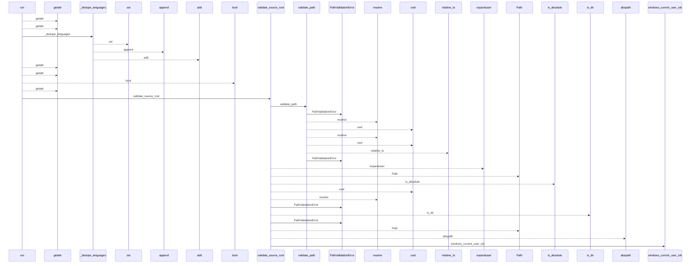
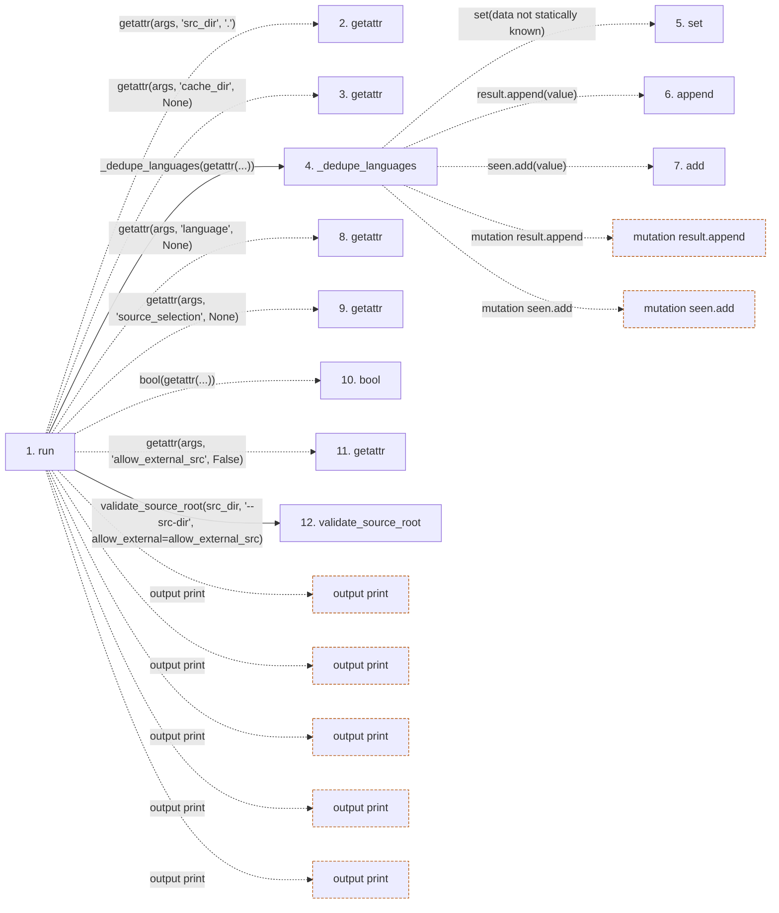

# prepare-extractors

**Entry point:** `run` (`cli`)
**Source:** [prepare_extractors_cmd](../modules/prepare_extractors_cmd.md)
**Modules touched:** [common](../modules/common.md), [config](../modules/config.md), [extractor_helpers](../modules/extractor_helpers.md), [filesystem_guard](../modules/filesystem_guard.md), and 5 more

**Complete modules touched:**

- [common](../modules/common.md)
- [config](../modules/config.md)
- [extractor_helpers](../modules/extractor_helpers.md)
- [filesystem_guard](../modules/filesystem_guard.md)
- [io](../modules/io.md)
- [prepare_extractors_cmd](../modules/prepare_extractors_cmd.md)
- [source_selection](../modules/source_selection.md)
- [source_snapshot](../modules/source_snapshot.md)
- [validation](../modules/validation.md)

## Call sequence

<!-- Auto-generated from static call edges. Dashed arrows are external or unresolved calls. Reviewed runtime conditions and side effects belong in Behavior. -->

> Call sequence diagram shows 30 of 856 interactions; 826 omitted to keep the visualization within the 30-interaction and generated-diagram limits.

> Trace truncated at the depth limit; deeper calls are omitted.

## Data flow

<!-- Auto-generated static analysis. Treat values and boundaries as best-effort hints, not runtime proof. -->

### Step data

| Step | Inputs | Reads | Writes | Returns |
|---|---|---|---|---|
| `run` | `args` | `sys`, `sys` | - | `none` |
| `getattr` | - | - | - | - |
| `getattr` | - | - | - | - |
| `_dedupe_languages` | `values: list[str] \| None` | - | - | `[...]`, `result` |
| `set` | - | - | - | - |
| `append` | - | - | - | - |
| `add` | - | - | - | - |
| `getattr` | - | - | - | - |
| `getattr` | - | - | - | - |
| `bool` | - | - | - | - |
| `getattr` | - | - | - | - |
| `validate_source_root` | `path: str`, `label: str`, `allow_external: bool` | `sys`, `os`, `WindowsSecurityGuardError`, `sys` | - | `validate_path(...)`, `resolved` |

### Call data

| From | To | Line | Call |
|---|---|---:|---|
| run | getattr | 51 | `getattr(args, 'src_dir', '.')` |
| run | getattr | 52 | `getattr(args, 'cache_dir', None)` |
| run | _dedupe_languages | 53 | `_dedupe_languages(getattr(...))` |
| _dedupe_languages | set | 20 | `set(data not statically known)` |
| _dedupe_languages | append | 24 | `result.append(value)` |
| _dedupe_languages | add | 25 | `seen.add(value)` |
| run | getattr | 53 | `getattr(args, 'language', None)` |
| run | getattr | 54 | `getattr(args, 'source_selection', None)` |
| run | bool | 55 | `bool(getattr(...))` |
| run | getattr | 55 | `getattr(args, 'allow_external_src', False)` |
| run | validate_source_root | 57 | `validate_source_root(src_dir, '--src-dir', allow_external=allow_external_src)` |

### Boundary effects

| Kind | Target | Step | Line |
|---|---|---|---:|
| output | `print` | `run` | 63 |
| output | `print` | `run` | 77 |
| output | `print` | `run` | 88 |
| output | `print` | `run` | 94 |
| output | `print` | `run` | 97 |
| mutation | `result.append` | `_dedupe_languages` | 24 |
| mutation | `seen.add` | `_dedupe_languages` | 25 |

### Static analysis gaps

| Kind | Step | Target | Line |
|---|---|---|---:|
| unresolved_call | `run` | `getattr` | 51 |
| unresolved_call | `run` | `getattr` | 52 |
| unresolved_call | `run` | `getattr` | 53 |
| unresolved_call | `run` | `getattr` | 54 |
| unresolved_call | `run` | `getattr` | 55 |
| step_limit | `run` | `first 12 steps` | 0 |
| truncated_flow | `run` | `depth limit` | 0 |

## Behavior

This flow starts at `run` and is classified as `cli`. The generated call and data-flow sections are bounded static projections; runtime conditions and side effects require source-level confirmation.
