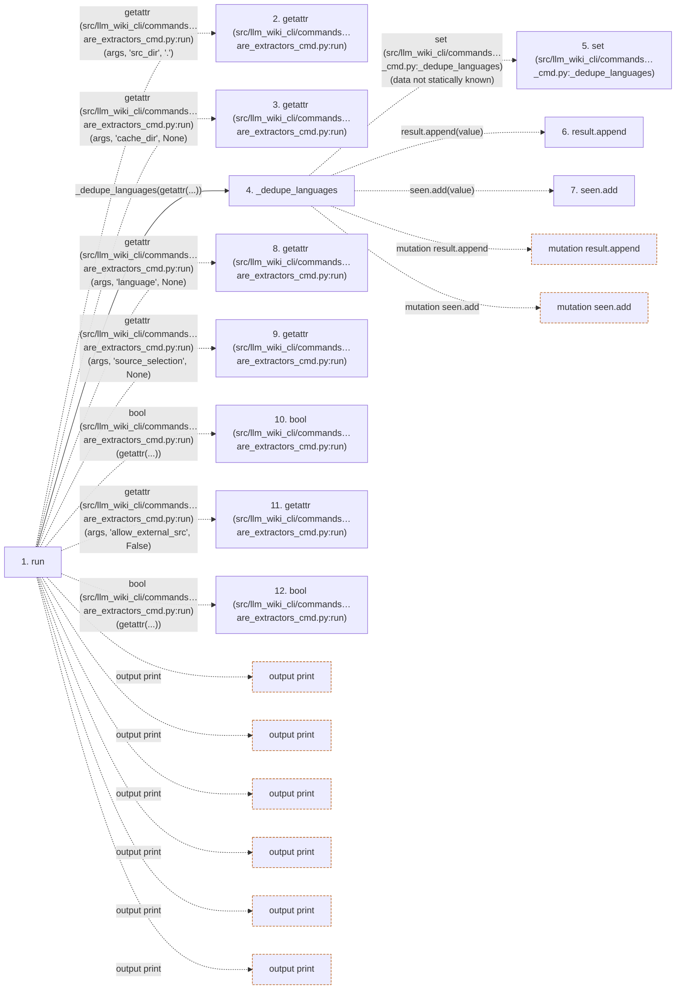

# prepare-extractors

**Entry point:** `run` (`cli`)
**Source:** [prepare_extractors_cmd](../modules/prepare_extractors_cmd.md)
**Modules touched:** [common](../modules/common.md), [config](../modules/config.md), [extractor_helpers](../modules/extractor_helpers.md), [filesystem_guard](../modules/filesystem_guard.md), and 5 more

**Complete modules touched:**

- [common](../modules/common.md)
- [config](../modules/config.md)
- [extractor_helpers](../modules/extractor_helpers.md)
- [filesystem_guard](../modules/filesystem_guard.md)
- [io](../modules/io.md)
- [prepare_extractors_cmd](../modules/prepare_extractors_cmd.md)
- [source_selection](../modules/source_selection.md)
- [source_snapshot](../modules/source_snapshot.md)
- [validation](../modules/validation.md)

## Call sequence

```mermaid
sequenceDiagram
    participant p0 as run
    participant p1 as getattr (src/llm_wiki_cli/commands…are_extractors_cmd.py:run)
    participant p2 as _dedupe_languages
    participant p3 as set (src/llm_wiki_cli/commands…_cmd.py:_dedupe_languages)
    participant p4 as result.append
    participant p5 as seen.add
    participant p6 as bool (src/llm_wiki_cli/commands…are_extractors_cmd.py:run)
    participant p7 as validate_source_root
    participant p8 as validate_path
    participant p9 as PathValidationError
    participant p10 as (…).resolve
    participant p11 as Path.cwd (src/llm_wiki_cli/config.py:validate_path)
    participant p12 as Path.cwd().resolve
    participant p13 as resolved.relative_to (src/llm_wiki_cli/config.py:validate_path)
    participant p14 as Path(…).expanduser (src/llm_wiki_cli/config.py:validate_source_root)
    participant p15 as Path (src/llm_wiki_cli/config.py:validate_source_root)
    participant p16 as candidate.is_absolute
    participant p17 as Path.cwd (src/llm_wiki_cli/config.py:validate_source_root)
    participant p18 as candidate.resolve (src/llm_wiki_cli/config.py:validate_source_root)
    participant p19 as resolved.is_dir
    p0-->>p1: getattr (src/llm_wiki_cli/commands…are_extractors_cmd.py:run)
    p0-->>p1: getattr (src/llm_wiki_cli/commands…are_extractors_cmd.py:run)
    p0->>p2: _dedupe_languages
    p2-->>p3: set (src/llm_wiki_cli/commands…_cmd.py:_dedupe_languages)
    p2-->>p4: result.append
    p2-->>p5: seen.add
    p0-->>p1: getattr (src/llm_wiki_cli/commands…are_extractors_cmd.py:run)
    p0-->>p1: getattr (src/llm_wiki_cli/commands…are_extractors_cmd.py:run)
    p0-->>p6: bool (src/llm_wiki_cli/commands…are_extractors_cmd.py:run)
    p0-->>p1: getattr (src/llm_wiki_cli/commands…are_extractors_cmd.py:run)
    p0-->>p6: bool (src/llm_wiki_cli/commands…are_extractors_cmd.py:run)
    p0-->>p1: getattr (src/llm_wiki_cli/commands…are_extractors_cmd.py:run)
    p0-->>p1: getattr (src/llm_wiki_cli/commands…are_extractors_cmd.py:run)
    p0->>p7: validate_source_root
    p7->>p8: validate_path
    p8->>p9: PathValidationError
    p8-->>p10: (…).resolve
    p8-->>p11: Path.cwd (src/llm_wiki_cli/config.py:validate_path)
    p8-->>p12: Path.cwd().resolve
    p8-->>p11: Path.cwd (src/llm_wiki_cli/config.py:validate_path)
    p8-->>p13: resolved.relative_to (src/llm_wiki_cli/config.py:validate_path)
    p8->>p9: PathValidationError
    p7-->>p14: Path(…).expanduser (src/llm_wiki_cli/config.py:validate_source_root)
    p7-->>p15: Path (src/llm_wiki_cli/config.py:validate_source_root)
    p7-->>p16: candidate.is_absolute
    p7-->>p17: Path.cwd (src/llm_wiki_cli/config.py:validate_source_root)
    p7-->>p18: candidate.resolve (src/llm_wiki_cli/config.py:validate_source_root)
    p7->>p9: PathValidationError
    p7-->>p19: resolved.is_dir
    p7->>p9: PathValidationError
```

<!-- Auto-generated from static call edges. Dashed arrows are external or unresolved calls. Reviewed runtime conditions and side effects belong in Behavior. -->

> Call sequence diagram shows 30 of 888 interactions; 858 omitted to keep the visualization within the 30-interaction and generated-diagram limits.

> Trace truncated at the depth limit; deeper calls are omitted.

## Data flow

<!-- Auto-generated static analysis. Treat values and boundaries as best-effort hints, not runtime proof. -->

### Step data

| Step | Inputs | Reads | Writes | Returns |
|---|---|---|---|---|
| `run` | `args` | `sys`, `sys`, `sys` | - | `none`, `none` |
| `getattr (src/llm_wiki_cli/commands…are_extractors_cmd.py:run)` | - | - | - | - |
| `getattr (src/llm_wiki_cli/commands…are_extractors_cmd.py:run)` | - | - | - | - |
| `_dedupe_languages` | `values: list[str] \| None` | - | - | `[...]`, `result` |
| `set (src/llm_wiki_cli/commands…_cmd.py:_dedupe_languages)` | - | - | - | - |
| `result.append` | - | - | - | - |
| `seen.add` | - | - | - | - |
| `getattr (src/llm_wiki_cli/commands…are_extractors_cmd.py:run)` | - | - | - | - |
| `getattr (src/llm_wiki_cli/commands…are_extractors_cmd.py:run)` | - | - | - | - |
| `bool (src/llm_wiki_cli/commands…are_extractors_cmd.py:run)` | - | - | - | - |
| `getattr (src/llm_wiki_cli/commands…are_extractors_cmd.py:run)` | - | - | - | - |
| `bool (src/llm_wiki_cli/commands…are_extractors_cmd.py:run)` | - | - | - | - |

### Call data

| From | To | Line | Call |
|---|---|---:|---|
| run | getattr (src/llm_wiki_cli/commands…are_extractors_cmd.py:run) | 75 | `getattr(args, 'src_dir', '.')` |
| run | getattr (src/llm_wiki_cli/commands…are_extractors_cmd.py:run) | 76 | `getattr(args, 'cache_dir', None)` |
| run | _dedupe_languages | 77 | `_dedupe_languages(getattr(...))` |
| _dedupe_languages | set (src/llm_wiki_cli/commands…_cmd.py:_dedupe_languages) | 24 | `set(data not statically known)` |
| _dedupe_languages | result.append | 28 | `result.append(value)` |
| _dedupe_languages | seen.add | 29 | `seen.add(value)` |
| run | getattr (src/llm_wiki_cli/commands…are_extractors_cmd.py:run) | 77 | `getattr(args, 'language', None)` |
| run | getattr (src/llm_wiki_cli/commands…are_extractors_cmd.py:run) | 78 | `getattr(args, 'source_selection', None)` |
| run | bool (src/llm_wiki_cli/commands…are_extractors_cmd.py:run) | 79 | `bool(getattr(...))` |
| run | getattr (src/llm_wiki_cli/commands…are_extractors_cmd.py:run) | 79 | `getattr(args, 'allow_external_src', False)` |
| run | bool (src/llm_wiki_cli/commands…are_extractors_cmd.py:run) | 80 | `bool(getattr(...))` |

### Boundary effects

| Kind | Target | Step | Line |
|---|---|---|---:|
| output | `print` | `run` | 89 |
| output | `print` | `run` | 102 |
| output | `print` | `run` | 117 |
| output | `print` | `run` | 128 |
| output | `print` | `run` | 134 |
| output | `print` | `run` | 137 |
| mutation | `result.append` | `_dedupe_languages` | 28 |
| mutation | `seen.add` | `_dedupe_languages` | 29 |

### Static analysis gaps

| Kind | Step | Target | Line |
|---|---|---|---:|
| external_call | `run` | `getattr` | 75 |
| external_call | `run` | `getattr` | 76 |
| external_call | `run` | `getattr` | 77 |
| external_call | `run` | `getattr` | 78 |
| external_call | `run` | `getattr` | 79 |
| step_limit | `run` | `first 12 steps` | 0 |
| truncated_flow | `run` | `depth limit` | 0 |

## Behavior

This flow starts at `run` and is classified as `cli`. The generated call and data-flow sections are bounded static projections; runtime conditions and side effects require source-level confirmation.
