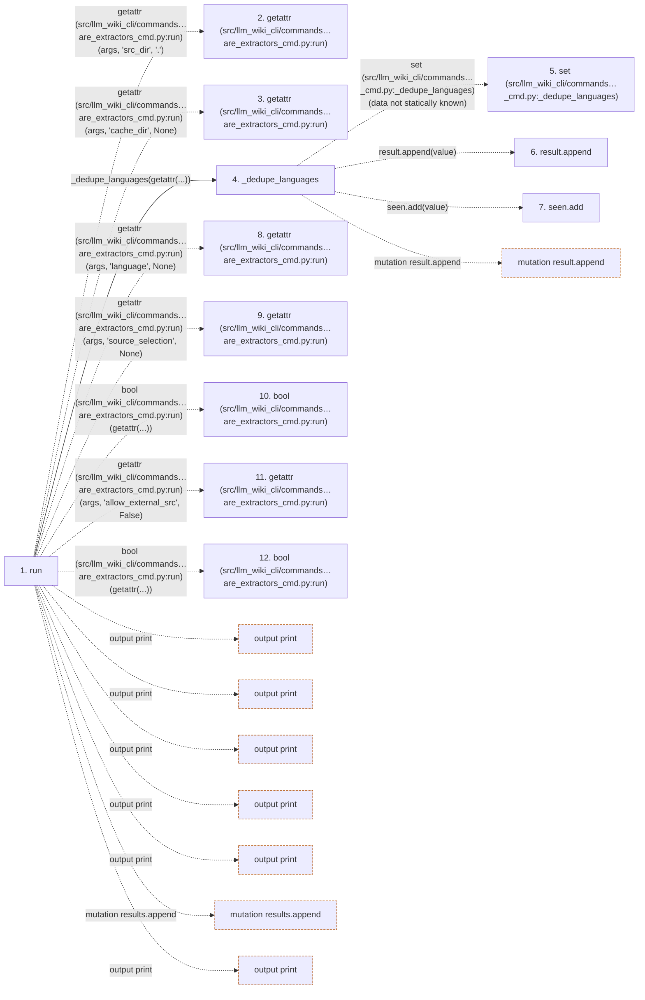

# prepare-extractors

**Entry point:** `run` (`cli`)
**Source:** [prepare_extractors_cmd](../modules/prepare_extractors_cmd.md)
**Modules touched:** [common](../modules/common.md), [config](../modules/config.md), [extractor_helpers](../modules/extractor_helpers.md), [filesystem_guard](../modules/filesystem_guard.md), and 6 more

**Complete modules touched:**

- [common](../modules/common.md)
- [config](../modules/config.md)
- [extractor_helpers](../modules/extractor_helpers.md)
- [filesystem_guard](../modules/filesystem_guard.md)
- [helper_preparation](../modules/helper_preparation.md)
- [io](../modules/io.md)
- [prepare_extractors_cmd](../modules/prepare_extractors_cmd.md)
- [source_selection](../modules/source_selection.md)
- [source_snapshot](../modules/source_snapshot.md)
- [validation](../modules/validation.md)

## Call sequence

<!-- Auto-generated from static call edges. Dashed arrows are external or unresolved calls. Reviewed runtime conditions and side effects belong in Behavior. -->

```mermaid
sequenceDiagram
    participant p0 as run
    participant p1 as getattr (src/llm_wiki_cli/commands…are_extractors_cmd.py:run)
    participant p2 as _dedupe_languages
    participant p3 as set (src/llm_wiki_cli/commands…_cmd.py:_dedupe_languages)
    participant p4 as result.append
    participant p5 as seen.add
    participant p6 as bool (src/llm_wiki_cli/commands…are_extractors_cmd.py:run)
    participant p7 as validate_source_root
    participant p8 as validate_path
    participant p9 as PathValidationError
    participant p10 as (…).resolve
    participant p11 as Path.cwd (src/llm_wiki_cli/config.py:validate_path)
    participant p12 as Path.cwd().resolve
    participant p13 as resolved.relative_to (src/llm_wiki_cli/config.py:validate_path)
    participant p14 as Path(…).expanduser (src/llm_wiki_cli/config.py:validate_source_root)
    participant p15 as Path (src/llm_wiki_cli/config.py:validate_source_root)
    participant p16 as candidate.is_absolute
    participant p17 as Path.cwd (src/llm_wiki_cli/config.py:validate_source_root)
    participant p18 as candidate.resolve (src/llm_wiki_cli/config.py:validate_source_root)
    participant p19 as resolved.is_dir
    p0-->>p1: getattr (src/llm_wiki_cli/commands…are_extractors_cmd.py:run)
    p0-->>p1: getattr (src/llm_wiki_cli/commands…are_extractors_cmd.py:run)
    p0->>p2: _dedupe_languages
    p2-->>p3: set (src/llm_wiki_cli/commands…_cmd.py:_dedupe_languages)
    p2-->>p4: result.append
    p2-->>p5: seen.add
    p0-->>p1: getattr (src/llm_wiki_cli/commands…are_extractors_cmd.py:run)
    p0-->>p1: getattr (src/llm_wiki_cli/commands…are_extractors_cmd.py:run)
    p0-->>p6: bool (src/llm_wiki_cli/commands…are_extractors_cmd.py:run)
    p0-->>p1: getattr (src/llm_wiki_cli/commands…are_extractors_cmd.py:run)
    p0-->>p6: bool (src/llm_wiki_cli/commands…are_extractors_cmd.py:run)
    p0-->>p1: getattr (src/llm_wiki_cli/commands…are_extractors_cmd.py:run)
    p0-->>p1: getattr (src/llm_wiki_cli/commands…are_extractors_cmd.py:run)
    p0->>p7: validate_source_root
    p7->>p8: validate_path
    p8->>p9: PathValidationError
    p8-->>p10: (…).resolve
    p8-->>p11: Path.cwd (src/llm_wiki_cli/config.py:validate_path)
    p8-->>p12: Path.cwd().resolve
    p8-->>p11: Path.cwd (src/llm_wiki_cli/config.py:validate_path)
    p8-->>p13: resolved.relative_to (src/llm_wiki_cli/config.py:validate_path)
    p8->>p9: PathValidationError
    p7-->>p14: Path(…).expanduser (src/llm_wiki_cli/config.py:validate_source_root)
    p7-->>p15: Path (src/llm_wiki_cli/config.py:validate_source_root)
    p7-->>p16: candidate.is_absolute
    p7-->>p17: Path.cwd (src/llm_wiki_cli/config.py:validate_source_root)
    p7-->>p18: candidate.resolve (src/llm_wiki_cli/config.py:validate_source_root)
    p7->>p9: PathValidationError
    p7-->>p19: resolved.is_dir
    p7->>p9: PathValidationError
```

> Call sequence diagram shows 30 of 987 interactions; 957 omitted to keep the visualization within the 30-interaction and generated-diagram limits.

> Trace truncated at the depth limit; deeper calls are omitted.

## Data flow

<!-- Auto-generated static analysis. Treat values and boundaries as best-effort hints, not runtime proof. -->

```mermaid
flowchart LR
    s1["1. run"]
    s2["2. getattr (src/llm_wiki_cli/commands…are_extractors_cmd.py:run)"]
    s3["3. getattr (src/llm_wiki_cli/commands…are_extractors_cmd.py:run)"]
    s4["4. _dedupe_languages"]
    s5["5. set (src/llm_wiki_cli/commands…_cmd.py:_dedupe_languages)"]
    s6["6. result.append"]
    s7["7. seen.add"]
    s8["8. getattr (src/llm_wiki_cli/commands…are_extractors_cmd.py:run)"]
    s9["9. getattr (src/llm_wiki_cli/commands…are_extractors_cmd.py:run)"]
    s10["10. bool (src/llm_wiki_cli/commands…are_extractors_cmd.py:run)"]
    s11["11. getattr (src/llm_wiki_cli/commands…are_extractors_cmd.py:run)"]
    s12["12. bool (src/llm_wiki_cli/commands…are_extractors_cmd.py:run)"]
    s1 -. "getattr (src/llm_wiki_cli/commands…are_extractors_cmd.py:run)(args, 'src_dir', '.')" .-> s2
    s1 -. "getattr (src/llm_wiki_cli/commands…are_extractors_cmd.py:run)(args, 'cache_dir', None)" .-> s3
    s1 -->|"_dedupe_languages(getattr(...))"| s4
    s4 -. "set (src/llm_wiki_cli/commands…_cmd.py:_dedupe_languages)(data not statically known)" .-> s5
    s4 -. "result.append(value)" .-> s6
    s4 -. "seen.add(value)" .-> s7
    s1 -. "getattr (src/llm_wiki_cli/commands…are_extractors_cmd.py:run)(args, 'language', None)" .-> s8
    s1 -. "getattr (src/llm_wiki_cli/commands…are_extractors_cmd.py:run)(args, 'source_selection', None)" .-> s9
    s1 -. "bool (src/llm_wiki_cli/commands…are_extractors_cmd.py:run)(getattr(...))" .-> s10
    s1 -. "getattr (src/llm_wiki_cli/commands…are_extractors_cmd.py:run)(args, 'allow_external_src', False)" .-> s11
    s1 -. "bool (src/llm_wiki_cli/commands…are_extractors_cmd.py:run)(getattr(...))" .-> s12
    b0["output print"]
    s1 -. "output print" .-> b0
    b1["output print"]
    s1 -. "output print" .-> b1
    b2["output print"]
    s1 -. "output print" .-> b2
    b3["output print"]
    s1 -. "output print" .-> b3
    b4["output print"]
    s1 -. "output print" .-> b4
    b5["mutation results.append"]
    s1 -. "mutation results.append" .-> b5
    b6["output print"]
    s1 -. "output print" .-> b6
    b7["mutation result.append"]
    s4 -. "mutation result.append" .-> b7
    click s1 "../modules/prepare_extractors_cmd.md"
    click s4 "../modules/prepare_extractors_cmd.md"
    classDef boundary stroke:#b45309,stroke-dasharray: 4 2
    class b0 boundary
    class b1 boundary
    class b2 boundary
    class b3 boundary
    class b4 boundary
    class b5 boundary
    class b6 boundary
    class b7 boundary
```

### Step data

| Step | Inputs | Reads | Writes | Returns |
|---|---|---|---|---|
| `run` | `args` | `sys`, `sys`, `sys` | - | `none`, `none` |
| `getattr (src/llm_wiki_cli/commands…are_extractors_cmd.py:run)` | - | - | - | - |
| `getattr (src/llm_wiki_cli/commands…are_extractors_cmd.py:run)` | - | - | - | - |
| `_dedupe_languages` | `values: list[str] \| None` | - | - | `[...]`, `result` |
| `set (src/llm_wiki_cli/commands…_cmd.py:_dedupe_languages)` | - | - | - | - |
| `result.append` | - | - | - | - |
| `seen.add` | - | - | - | - |
| `getattr (src/llm_wiki_cli/commands…are_extractors_cmd.py:run)` | - | - | - | - |
| `getattr (src/llm_wiki_cli/commands…are_extractors_cmd.py:run)` | - | - | - | - |
| `bool (src/llm_wiki_cli/commands…are_extractors_cmd.py:run)` | - | - | - | - |
| `getattr (src/llm_wiki_cli/commands…are_extractors_cmd.py:run)` | - | - | - | - |
| `bool (src/llm_wiki_cli/commands…are_extractors_cmd.py:run)` | - | - | - | - |

### Call data

| From | To | Line | Call |
|---|---|---:|---|
| run | getattr (src/llm_wiki_cli/commands…are_extractors_cmd.py:run) | 72 | `getattr(args, 'src_dir', '.')` |
| run | getattr (src/llm_wiki_cli/commands…are_extractors_cmd.py:run) | 73 | `getattr(args, 'cache_dir', None)` |
| run | _dedupe_languages | 74 | `_dedupe_languages(getattr(...))` |
| _dedupe_languages | set (src/llm_wiki_cli/commands…_cmd.py:_dedupe_languages) | 26 | `set(data not statically known)` |
| _dedupe_languages | result.append | 30 | `result.append(value)` |
| _dedupe_languages | seen.add | 31 | `seen.add(value)` |
| run | getattr (src/llm_wiki_cli/commands…are_extractors_cmd.py:run) | 74 | `getattr(args, 'language', None)` |
| run | getattr (src/llm_wiki_cli/commands…are_extractors_cmd.py:run) | 75 | `getattr(args, 'source_selection', None)` |
| run | bool (src/llm_wiki_cli/commands…are_extractors_cmd.py:run) | 76 | `bool(getattr(...))` |
| run | getattr (src/llm_wiki_cli/commands…are_extractors_cmd.py:run) | 76 | `getattr(args, 'allow_external_src', False)` |
| run | bool (src/llm_wiki_cli/commands…are_extractors_cmd.py:run) | 77 | `bool(getattr(...))` |

### Boundary effects

| Kind | Target | Step | Line |
|---|---|---|---:|
| output | `print` | `run` | 86 |
| output | `print` | `run` | 99 |
| output | `print` | `run` | 114 |
| output | `print` | `run` | 125 |
| output | `print` | `run` | 131 |
| mutation | `results.append` | `run` | 138 |
| output | `print` | `run` | 140 |
| mutation | `result.append` | `_dedupe_languages` | 30 |

### Static analysis gaps

| Kind | Step | Target | Line |
|---|---|---|---:|
| external_call | `run` | `getattr` | 72 |
| external_call | `run` | `getattr` | 73 |
| unresolved_call | `_dedupe_languages` | `seen.add` | 31 |
| external_call | `run` | `getattr` | 74 |
| external_call | `run` | `getattr` | 75 |
| external_call | `run` | `getattr` | 76 |
| step_limit | `run` | `first 12 steps` | 0 |
| truncated_flow | `run` | `depth limit` | 0 |

## Behavior

The command validates the source root and either detects required helpers from
the selected source snapshot or accepts an explicit language list. `--plan`
prints that selection without cache writes or toolchain execution. Preparation
resolves the helper cache, builds or installs bundled artifacts, and reports
each result. Failed toolchain or filesystem operations include recovery hints
and cause an unsuccessful exit. After recovery, callers retry their original
analysis command with its source selection and helper cache intact.
