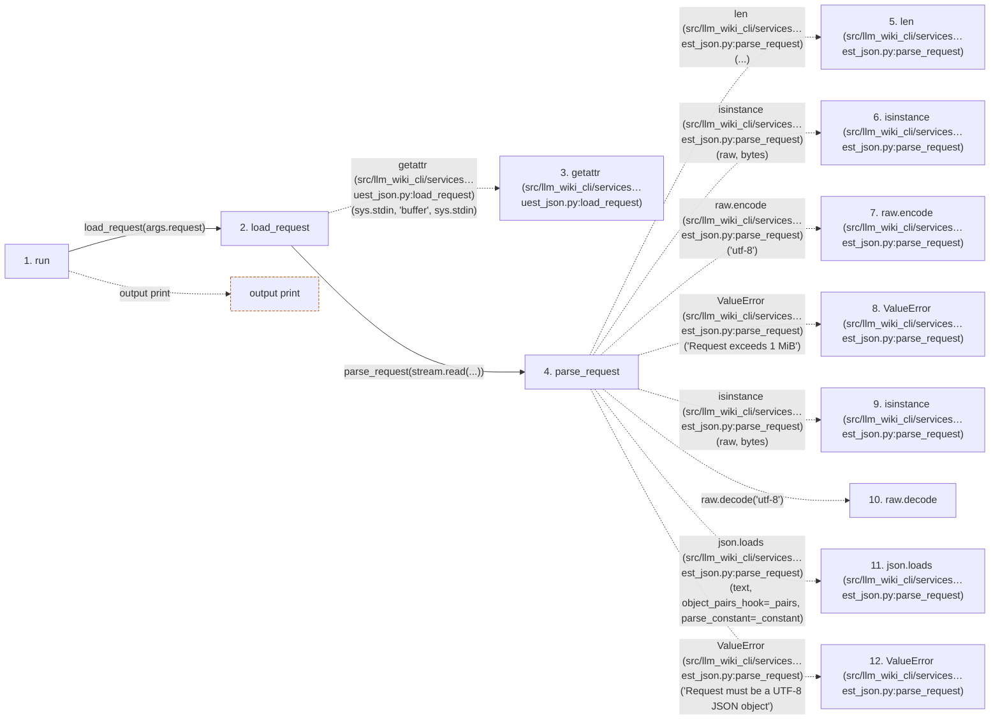

# query

**Entry point:** `run` (`cli`)
**Source:** [query_cmd](../modules/query_cmd.md)
**Modules touched:** [api](../modules/api.md), [common](../modules/common.md), [config](../modules/config.md), [context_packet](../modules/context_packet.md), and 17 more

**Complete modules touched:**

- [api](../modules/api.md)
- [common](../modules/common.md)
- [config](../modules/config.md)
- [context_packet](../modules/context_packet.md)
- [documentation_queries](../modules/documentation_queries.md)
- [documentation_query_builder](../modules/documentation_query_builder.md)
- [filesystem_guard](../modules/filesystem_guard.md)
- [io](../modules/io.md)
- [knowledge_consumption](../modules/knowledge_consumption.md)
- [knowledge_evidence](../modules/knowledge_evidence.md)
- [knowledge_loader](../modules/knowledge_loader.md)
- [knowledge_storage](../modules/knowledge_storage.md)
- [knowledge_storage_io](../modules/knowledge_storage_io.md)
- [knowledge_verification](../modules/knowledge_verification.md)
- [query_cmd](../modules/query_cmd.md)
- [request_json](../modules/request_json.md)
- [source_selection](../modules/source_selection.md)
- [source_snapshot](../modules/source_snapshot.md)
- [sync_manifest](../modules/sync_manifest.md)
- [validation](../modules/validation.md)
- [wiki_surface](../modules/wiki_surface.md)

## Call sequence

```mermaid
sequenceDiagram
    participant p0 as run
    participant p1 as load_request
    participant p2 as getattr (src/llm_wiki_cli/services…uest_json.py:load_request)
    participant p3 as parse_request
    participant p4 as len (src/llm_wiki_cli/services…est_json.py:parse_request)
    participant p5 as isinstance (src/llm_wiki_cli/services…est_json.py:parse_request)
    participant p6 as raw.encode (src/llm_wiki_cli/services…est_json.py:parse_request)
    participant p7 as ValueError (src/llm_wiki_cli/services…est_json.py:parse_request)
    participant p8 as raw.decode
    participant p9 as json.loads (src/llm_wiki_cli/services…est_json.py:parse_request)
    participant p10 as stream.read
    participant p11 as Path(…).open
    participant p12 as Path (src/llm_wiki_cli/services…uest_json.py:load_request)
    participant p13 as query_documentation
    participant p14 as _validate_documentation_query_request
    participant p15 as isinstance (src/llm_wiki_cli/api.py:_…cumentation_query_request)
    participant p16 as InvalidRequestError
    participant p17 as next (src/llm_wiki_cli/api.py:_…cumentation_query_request)
    participant p18 as request.get (src/llm_wiki_cli/api.py:_…cumentation_query_request)
    participant p19 as ', '.join (src/llm_wiki_cli/api.py:_…cumentation_query_request)
    participant p20 as repr (src/llm_wiki_cli/api.py:_…cumentation_query_request)
    p0->>p1: load_request
    p1-->>p2: getattr (src/llm_wiki_cli/services…uest_json.py:load_request)
    p1->>p3: parse_request
    p3-->>p4: len (src/llm_wiki_cli/services…est_json.py:parse_request)
    p3-->>p5: isinstance (src/llm_wiki_cli/services…est_json.py:parse_request)
    p3-->>p6: raw.encode (src/llm_wiki_cli/services…est_json.py:parse_request)
    p3-->>p7: ValueError (src/llm_wiki_cli/services…est_json.py:parse_request)
    p3-->>p5: isinstance (src/llm_wiki_cli/services…est_json.py:parse_request)
    p3-->>p8: raw.decode
    p3-->>p9: json.loads (src/llm_wiki_cli/services…est_json.py:parse_request)
    p3-->>p7: ValueError (src/llm_wiki_cli/services…est_json.py:parse_request)
    p3-->>p5: isinstance (src/llm_wiki_cli/services…est_json.py:parse_request)
    p3-->>p7: ValueError (src/llm_wiki_cli/services…est_json.py:parse_request)
    p1-->>p10: stream.read
    p1-->>p11: Path(…).open
    p1-->>p12: Path (src/llm_wiki_cli/services…uest_json.py:load_request)
    p1->>p3: parse_request
    p1-->>p10: stream.read
    p0->>p13: query_documentation
    p13->>p14: _validate_documentation_query_request
    p14-->>p15: isinstance (src/llm_wiki_cli/api.py:_…cumentation_query_request)
    p14->>p16: InvalidRequestError
    p14-->>p17: next (src/llm_wiki_cli/api.py:_…cumentation_query_request)
    p14-->>p15: isinstance (src/llm_wiki_cli/api.py:_…cumentation_query_request)
    p14->>p16: InvalidRequestError
    p14-->>p18: request.get (src/llm_wiki_cli/api.py:_…cumentation_query_request)
    p14-->>p15: isinstance (src/llm_wiki_cli/api.py:_…cumentation_query_request)
    p14-->>p19: ', '.join (src/llm_wiki_cli/api.py:_…cumentation_query_request)
    p14-->>p20: repr (src/llm_wiki_cli/api.py:_…cumentation_query_request)
    p14->>p16: InvalidRequestError
```

<!-- Auto-generated from static call edges. Dashed arrows are external or unresolved calls. Reviewed runtime conditions and side effects belong in Behavior. -->

> Call sequence diagram shows 30 of 951 interactions; 921 omitted to keep the visualization within the 30-interaction and generated-diagram limits.

> Trace truncated at the depth limit; deeper calls are omitted.

## Data flow

<!-- Auto-generated static analysis. Treat values and boundaries as best-effort hints, not runtime proof. -->

### Step data

| Step | Inputs | Reads | Writes | Returns |
|---|---|---|---|---|
| `run` | `args` | `sys` | - | - |
| `load_request` | `path: str` | `sys`, `MAX_REQUEST_BYTES`, `MAX_REQUEST_BYTES` | - | `parse_request(...)`, `parse_request(...)` |
| `getattr (src/llm_wiki_cli/services…uest_json.py:load_request)` | - | - | - | - |
| `parse_request` | `raw: bytes \| str` | `MAX_REQUEST_BYTES`, `_pairs`, `_constant`, `json` | - | `value` |
| `len (src/llm_wiki_cli/services…est_json.py:parse_request)` | - | - | - | - |
| `isinstance (src/llm_wiki_cli/services…est_json.py:parse_request)` | - | - | - | - |
| `raw.encode (src/llm_wiki_cli/services…est_json.py:parse_request)` | - | - | - | - |
| `ValueError (src/llm_wiki_cli/services…est_json.py:parse_request)` | - | - | - | - |
| `isinstance (src/llm_wiki_cli/services…est_json.py:parse_request)` | - | - | - | - |
| `raw.decode` | - | - | - | - |
| `json.loads (src/llm_wiki_cli/services…est_json.py:parse_request)` | - | - | - | - |
| `ValueError (src/llm_wiki_cli/services…est_json.py:parse_request)` | - | - | - | - |

### Call data

| From | To | Line | Call |
|---|---|---:|---|
| run | load_request | 16 | `load_request(args.request)` |
| load_request | getattr (src/llm_wiki_cli/services…uest_json.py:load_request) | 41 | `getattr(sys.stdin, 'buffer', sys.stdin)` |
| load_request | parse_request | 42 | `parse_request(stream.read(...))` |
| parse_request | len (src/llm_wiki_cli/services…est_json.py:parse_request) | 27 | `len(...)` |
| parse_request | isinstance (src/llm_wiki_cli/services…est_json.py:parse_request) | 27 | `isinstance(raw, bytes)` |
| parse_request | raw.encode (src/llm_wiki_cli/services…est_json.py:parse_request) | 27 | `raw.encode('utf-8')` |
| parse_request | ValueError (src/llm_wiki_cli/services…est_json.py:parse_request) | 28 | `ValueError('Request exceeds 1 MiB')` |
| parse_request | isinstance (src/llm_wiki_cli/services…est_json.py:parse_request) | 30 | `isinstance(raw, bytes)` |
| parse_request | raw.decode | 30 | `raw.decode('utf-8')` |
| parse_request | json.loads (src/llm_wiki_cli/services…est_json.py:parse_request) | 31 | `json.loads(text, object_pairs_hook=_pairs, parse_constant=_constant)` |
| parse_request | ValueError (src/llm_wiki_cli/services…est_json.py:parse_request) | 33 | `ValueError('Request must be a UTF-8 JSON object')` |

### Boundary effects

| Kind | Target | Step | Line |
|---|---|---|---:|
| output | `print` | `run` | 28 |

### Static analysis gaps

| Kind | Step | Target | Line |
|---|---|---|---:|
| external_call | `load_request` | `getattr` | 41 |
| external_call | `parse_request` | `isinstance` | 27 |
| unresolved_call | `parse_request` | `raw.encode` | 27 |
| external_call | `parse_request` | `ValueError` | 28 |
| external_call | `parse_request` | `isinstance` | 30 |
| unresolved_call | `parse_request` | `raw.decode` | 30 |
| external_call | `parse_request` | `json.loads` | 31 |
| external_call | `parse_request` | `ValueError` | 33 |
| step_limit | `run` | `first 12 steps` | 0 |
| truncated_flow | `run` | `depth limit` | 0 |

## Behavior

Loads a bounded explicit JSON query from a file or stdin, delegates to the public exact-query API, and writes its canonical response to stdout or an explicitly chosen output file. Invalid request data is rejected before query state is loaded.
