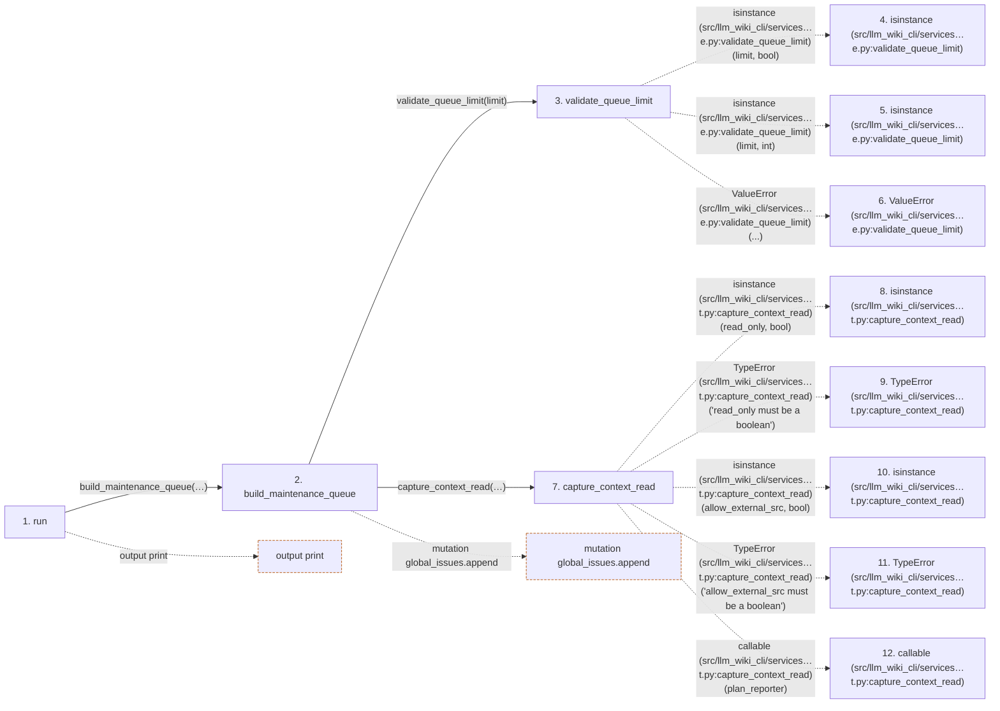

# queue

**Entry point:** `run` (`cli`)
**Source:** [queue_cmd](../modules/queue_cmd.md)
**Modules touched:** [bootstrap_runtime](../modules/bootstrap_runtime.md), [change_selection](../modules/change_selection.md), [common](../modules/common.md), [config](../modules/config.md), and 50 more

**Complete modules touched:**

- [bootstrap_runtime](../modules/bootstrap_runtime.md)
- [change_selection](../modules/change_selection.md)
- [common](../modules/common.md)
- [config](../modules/config.md)
- [context_packet](../modules/context_packet.md)
- [context_service](../modules/context_service.md)
- [data_flow](../modules/data_flow.md)
- [dependency_versions](../modules/dependency_versions.md)
- [documentation_queries](../modules/documentation_queries.md)
- [documentation_query_builder](../modules/documentation_query_builder.md)
- [documentation_worklist](../modules/documentation_worklist.md)
- [entrypoints](../modules/entrypoints.md)
- [extraction_service](../modules/extraction_service.md)
- [filesystem_guard](../modules/filesystem_guard.md)
- [go_calls](../modules/go_calls.md)
- [immutable](../modules/immutable.md)
- [imports](../modules/imports.md)
- [infrastructure_inventory](../modules/infrastructure_inventory.md)
- [infrastructure_sync](../modules/infrastructure_sync.md)
- [inventory_cache](../modules/inventory_cache.md)
- [io](../modules/io.md)
- [knowledge_artifacts](../modules/knowledge_artifacts.md)
- [knowledge_consumption](../modules/knowledge_consumption.md)
- [knowledge_envelope](../modules/knowledge_envelope.md)
- [knowledge_evidence](../modules/knowledge_evidence.md)
- [knowledge_freshness](../modules/knowledge_freshness.md)
- [knowledge_generation](../modules/knowledge_generation.md)
- [knowledge_governance](../modules/knowledge_governance.md)
- [knowledge_loader](../modules/knowledge_loader.md)
- [knowledge_model](../modules/knowledge_model.md)
- [knowledge_observability](../modules/knowledge_observability.md)
- [knowledge_orchestration](../modules/knowledge_orchestration.md)
- [knowledge_verification](../modules/knowledge_verification.md)
- [lint_service](../modules/lint_service.md)
- [maintenance_queue](../modules/maintenance_queue.md)
- [packages](../modules/packages.md)
- [plugins](../modules/plugins.md)
- [progress](../modules/progress.md)
- [python_calls](../modules/python_calls.md)
- [python_imports](../modules/python_imports.md)
- [queue_cmd](../modules/queue_cmd.md)
- [runtime_output](../modules/runtime_output.md)
- [services_dependencies](../modules/services_dependencies.md)
- [source_selection](../modules/source_selection.md)
- [source_snapshot](../modules/source_snapshot.md)
- [sync_analysis](../modules/sync_analysis.md)
- [sync_manifest](../modules/sync_manifest.md)
- [team](../modules/team.md)
- [validation](../modules/validation.md)
- [verification_contracts](../modules/verification_contracts.md)
- [wiki_lifecycle](../modules/wiki_lifecycle.md)
- [wiki_media](../modules/wiki_media.md)
- [wiki_surface](../modules/wiki_surface.md)
- [wiki_surface_index](../modules/wiki_surface_index.md)

## Call sequence

```mermaid
sequenceDiagram
    participant p0 as run
    participant p1 as build_maintenance_queue
    participant p2 as validate_queue_limit
    participant p3 as isinstance (src/llm_wiki_cli/services…e.py:validate_queue_limit)
    participant p4 as ValueError (src/llm_wiki_cli/services…e.py:validate_queue_limit)
    participant p5 as capture_context_read
    participant p6 as isinstance (src/llm_wiki_cli/services…t.py:capture_context_read)
    participant p7 as TypeError (src/llm_wiki_cli/services…t.py:capture_context_read)
    participant p8 as callable (src/llm_wiki_cli/services…t.py:capture_context_read)
    participant p9 as validate_source_root
    participant p10 as validate_path
    participant p11 as PathValidationError
    participant p12 as (…).resolve (src/llm_wiki_cli/config.py:validate_path)
    participant p13 as Path.cwd (src/llm_wiki_cli/config.py:validate_path)
    participant p14 as Path.cwd().resolve (src/llm_wiki_cli/config.py:validate_path)
    participant p15 as resolved.relative_to (src/llm_wiki_cli/config.py:validate_path)
    participant p16 as Path(…).expanduser (src/llm_wiki_cli/config.py:validate_source_root)
    participant p17 as Path (src/llm_wiki_cli/config.py:validate_source_root)
    participant p18 as candidate.is_absolute
    participant p19 as Path.cwd (src/llm_wiki_cli/config.py:validate_source_root)
    participant p20 as candidate.resolve (src/llm_wiki_cli/config.py:validate_source_root)
    p0->>p1: build_maintenance_queue
    p1->>p2: validate_queue_limit
    p2-->>p3: isinstance (src/llm_wiki_cli/services…e.py:validate_queue_limit)
    p2-->>p3: isinstance (src/llm_wiki_cli/services…e.py:validate_queue_limit)
    p2-->>p4: ValueError (src/llm_wiki_cli/services…e.py:validate_queue_limit)
    p1->>p5: capture_context_read
    p5-->>p6: isinstance (src/llm_wiki_cli/services…t.py:capture_context_read)
    p5-->>p7: TypeError (src/llm_wiki_cli/services…t.py:capture_context_read)
    p5-->>p6: isinstance (src/llm_wiki_cli/services…t.py:capture_context_read)
    p5-->>p7: TypeError (src/llm_wiki_cli/services…t.py:capture_context_read)
    p5-->>p8: callable (src/llm_wiki_cli/services…t.py:capture_context_read)
    p5-->>p7: TypeError (src/llm_wiki_cli/services…t.py:capture_context_read)
    p5-->>p6: isinstance (src/llm_wiki_cli/services…t.py:capture_context_read)
    p5-->>p7: TypeError (src/llm_wiki_cli/services…t.py:capture_context_read)
    p5-->>p6: isinstance (src/llm_wiki_cli/services…t.py:capture_context_read)
    p5-->>p7: TypeError (src/llm_wiki_cli/services…t.py:capture_context_read)
    p5->>p9: validate_source_root
    p9->>p10: validate_path
    p10->>p11: PathValidationError
    p10-->>p12: (…).resolve (src/llm_wiki_cli/config.py:validate_path)
    p10-->>p13: Path.cwd (src/llm_wiki_cli/config.py:validate_path)
    p10-->>p14: Path.cwd().resolve (src/llm_wiki_cli/config.py:validate_path)
    p10-->>p13: Path.cwd (src/llm_wiki_cli/config.py:validate_path)
    p10-->>p15: resolved.relative_to (src/llm_wiki_cli/config.py:validate_path)
    p10->>p11: PathValidationError
    p9-->>p16: Path(…).expanduser (src/llm_wiki_cli/config.py:validate_source_root)
    p9-->>p17: Path (src/llm_wiki_cli/config.py:validate_source_root)
    p9-->>p18: candidate.is_absolute
    p9-->>p19: Path.cwd (src/llm_wiki_cli/config.py:validate_source_root)
    p9-->>p20: candidate.resolve (src/llm_wiki_cli/config.py:validate_source_root)
```

<!-- Auto-generated from static call edges. Dashed arrows are external or unresolved calls. Reviewed runtime conditions and side effects belong in Behavior. -->

> Call sequence diagram shows 30 of 3563 interactions; 3533 omitted to keep the visualization within the 30-interaction and generated-diagram limits.

> Trace truncated at the depth limit; deeper calls are omitted.

## Data flow

<!-- Auto-generated static analysis. Treat values and boundaries as best-effort hints, not runtime proof. -->

### Step data

| Step | Inputs | Reads | Writes | Returns |
|---|---|---|---|---|
| `run` | `args` | - | - | - |
| `build_maintenance_queue` | `src_dir`, `wiki_dir`, `limit`, `allow_external_src`, `source_selection`, `helper_cache_dir` | - | `result[...]`, `result[...]`, `result[...]` | `result` |
| `validate_queue_limit` | `limit: object` | `MIN_QUEUE_LIMIT`, `MAX_QUEUE_LIMIT`, `MIN_QUEUE_LIMIT`, `MAX_QUEUE_LIMIT` | - | `limit` |
| `isinstance (src/llm_wiki_cli/services…e.py:validate_queue_limit)` | - | - | - | - |
| `isinstance (src/llm_wiki_cli/services…e.py:validate_queue_limit)` | - | - | - | - |
| `ValueError (src/llm_wiki_cli/services…e.py:validate_queue_limit)` | - | - | - | - |
| `capture_context_read` | `src_dir: str`, `wiki_dir: str`, `allow_external_src: bool`, `read_only: bool`, `job_request: ExtractionJobRequest \| None`, `plan_reporter: Callable[[ExtractionJobPlan], None] \| None`, `source_selection: str \| Path \| None`, `allow_selection_mismatch: bool` | `PathValidationError`, `DocumentationQueryError`, `context_service`, `os`, `InventoryResult`, `SourceSnapshot`, `DocumentationQueryError`, `DocumentationQueryError` | `capture_options[...]`, `capture_options[...]`, `capture_options[...]`, `capture_options[...]`, `capture_options[...]`, `wiki_options[...]`, `wiki_options[...]`, `wiki_check_options[...]` | `CapturedContextRead(...)` |
| `isinstance (src/llm_wiki_cli/services…t.py:capture_context_read)` | - | - | - | - |
| `TypeError (src/llm_wiki_cli/services…t.py:capture_context_read)` | - | - | - | - |
| `isinstance (src/llm_wiki_cli/services…t.py:capture_context_read)` | - | - | - | - |
| `TypeError (src/llm_wiki_cli/services…t.py:capture_context_read)` | - | - | - | - |
| `callable (src/llm_wiki_cli/services…t.py:capture_context_read)` | - | - | - | - |

### Call data

| From | To | Line | Call |
|---|---|---:|---|
| run | build_maintenance_queue | 9 | `build_maintenance_queue(args.src_dir, args.wiki_dir, limit=args.limit, allow_external_src=args.allow_external_src, source_selection=args.source_selection, helper_cache_dir=args.helper_cache_dir)` |
| build_maintenance_queue | validate_queue_limit | 193 | `validate_queue_limit(limit)` |
| validate_queue_limit | isinstance (src/llm_wiki_cli/services…e.py:validate_queue_limit) | 48 | `isinstance(limit, bool)` |
| validate_queue_limit | isinstance (src/llm_wiki_cli/services…e.py:validate_queue_limit) | 49 | `isinstance(limit, int)` |
| validate_queue_limit | ValueError (src/llm_wiki_cli/services…e.py:validate_queue_limit) | 52 | `ValueError(...)` |
| build_maintenance_queue | capture_context_read | 194 | `capture_context_read(src_dir, wiki_dir, allow_external_src=allow_external_src, read_only=True, strict_wiki_symlinks=True, allow_selection_mismatch=True, source_selection=source_selection, helper_cache_dir=helper_cache_dir)` |
| capture_context_read | isinstance (src/llm_wiki_cli/services…t.py:capture_context_read) | 755 | `isinstance(read_only, bool)` |
| capture_context_read | TypeError (src/llm_wiki_cli/services…t.py:capture_context_read) | 756 | `TypeError('read_only must be a boolean')` |
| capture_context_read | isinstance (src/llm_wiki_cli/services…t.py:capture_context_read) | 757 | `isinstance(allow_external_src, bool)` |
| capture_context_read | TypeError (src/llm_wiki_cli/services…t.py:capture_context_read) | 758 | `TypeError('allow_external_src must be a boolean')` |
| capture_context_read | callable (src/llm_wiki_cli/services…t.py:capture_context_read) | 759 | `callable(plan_reporter)` |

### Boundary effects

| Kind | Target | Step | Line |
|---|---|---|---:|
| output | `print` | `run` | 17 |
| mutation | `global_issues.append` | `build_maintenance_queue` | 250 |

### Static analysis gaps

| Kind | Step | Target | Line |
|---|---|---|---:|
| external_call | `validate_queue_limit` | `isinstance` | 48 |
| external_call | `validate_queue_limit` | `isinstance` | 49 |
| external_call | `validate_queue_limit` | `ValueError` | 52 |
| external_call | `capture_context_read` | `isinstance` | 755 |
| external_call | `capture_context_read` | `TypeError` | 756 |
| external_call | `capture_context_read` | `isinstance` | 757 |
| external_call | `capture_context_read` | `TypeError` | 758 |
| external_call | `capture_context_read` | `callable` | 759 |
| step_limit | `run` | `first 12 steps` | 0 |
| truncated_flow | `run` | `depth limit` | 0 |

## Behavior

This flow starts at `run` and is classified as `cli`. The generated call and data-flow sections are bounded static projections; runtime conditions and side effects require source-level confirmation.
