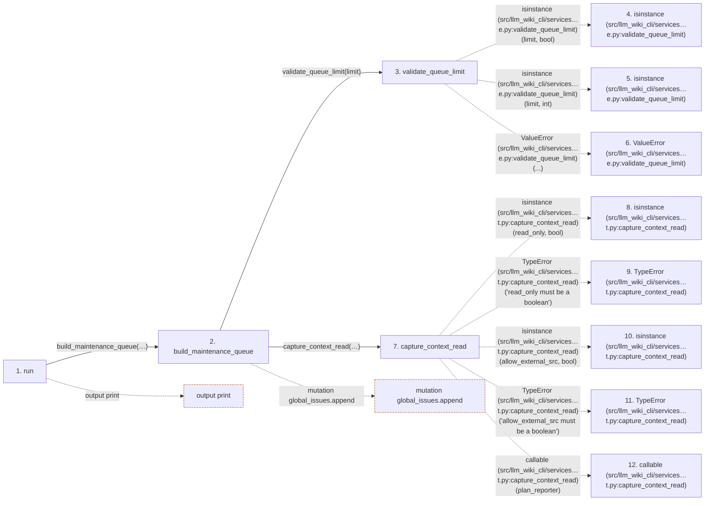

# queue

**Entry point:** `run` (`cli`)
**Source:** [queue_cmd](../modules/queue_cmd.md)
**Modules touched:** [analysis_capture](../modules/analysis_capture.md), [analysis_compatibility](../modules/analysis_compatibility.md), [bootstrap_runtime](../modules/bootstrap_runtime.md), and 67 more

**Complete modules touched:**

- [analysis_capture](../modules/analysis_capture.md)
- [analysis_compatibility](../modules/analysis_compatibility.md)
- [bootstrap_runtime](../modules/bootstrap_runtime.md)
- [change_selection](../modules/change_selection.md)
- [common](../modules/common.md)
- [config](../modules/config.md)
- [context_packet](../modules/context_packet.md)
- [context_service](../modules/context_service.md)
- [data_flow](../modules/data_flow.md)
- [dependency_versions](../modules/dependency_versions.md)
- [documentation_queries](../modules/documentation_queries.md)
- [documentation_query_builder](../modules/documentation_query_builder.md)
- [documentation_worklist](../modules/documentation_worklist.md)
- [entrypoints](../modules/entrypoints.md)
- [extraction_service](../modules/extraction_service.md)
- [filesystem_guard](../modules/filesystem_guard.md)
- [go_calls](../modules/go_calls.md)
- [health_contract](../modules/health_contract.md)
- [health_details](../modules/health_details.md)
- [immutable](../modules/immutable.md)
- [implementation_evidence](../modules/implementation_evidence.md)
- [imports](../modules/imports.md)
- [infrastructure_inventory](../modules/infrastructure_inventory.md)
- [infrastructure_sync](../modules/infrastructure_sync.md)
- [inventory_cache](../modules/inventory_cache.md)
- [io](../modules/io.md)
- [knowledge_artifacts](../modules/knowledge_artifacts.md)
- [knowledge_consumption](../modules/knowledge_consumption.md)
- [knowledge_envelope](../modules/knowledge_envelope.md)
- [knowledge_evidence](../modules/knowledge_evidence.md)
- [knowledge_freshness](../modules/knowledge_freshness.md)
- [knowledge_generation](../modules/knowledge_generation.md)
- [knowledge_governance](../modules/knowledge_governance.md)
- [knowledge_loader](../modules/knowledge_loader.md)
- [knowledge_model](../modules/knowledge_model.md)
- [knowledge_observability](../modules/knowledge_observability.md)
- [knowledge_orchestration](../modules/knowledge_orchestration.md)
- [knowledge_storage](../modules/knowledge_storage.md)
- [knowledge_storage_io](../modules/knowledge_storage_io.md)
- [knowledge_verification](../modules/knowledge_verification.md)
- [lint_service](../modules/lint_service.md)
- [maintenance_evidence](../modules/maintenance_evidence.md)
- [maintenance_protocol](../modules/maintenance_protocol.md)
- [maintenance_queue](../modules/maintenance_queue.md)
- [maintenance_service](../modules/maintenance_service.md)
- [maintenance_state](../modules/maintenance_state.md)
- [maintenance_status](../modules/maintenance_status.md)
- [manifest_storage](../modules/manifest_storage.md)
- [markdown_sections](../modules/markdown_sections.md)
- [packages](../modules/packages.md)
- [plugins](../modules/plugins.md)
- [progress](../modules/progress.md)
- [python_bindings](../modules/python_bindings.md)
- [python_calls](../modules/python_calls.md)
- [python_implementation](../modules/python_implementation.md)
- [python_imports](../modules/python_imports.md)
- [queue_cmd](../modules/queue_cmd.md)
- [runtime_output](../modules/runtime_output.md)
- [services_dependencies](../modules/services_dependencies.md)
- [source_selection](../modules/source_selection.md)
- [source_snapshot](../modules/source_snapshot.md)
- [sync_analysis](../modules/sync_analysis.md)
- [sync_manifest](../modules/sync_manifest.md)
- [team](../modules/team.md)
- [validation](../modules/validation.md)
- [verification_contracts](../modules/verification_contracts.md)
- [wiki_lifecycle](../modules/wiki_lifecycle.md)
- [wiki_media](../modules/wiki_media.md)
- [wiki_surface](../modules/wiki_surface.md)
- [wiki_surface_index](../modules/wiki_surface_index.md)

## Call sequence

> Static overview in presentation order, not runtime execution order. Arrows retain captured callers; siblings are shown before deeper helper detail.

<!-- Auto-generated from static call edges. Dashed arrows are external or unresolved calls. Reviewed runtime conditions and side effects belong in Behavior. -->

```mermaid
sequenceDiagram
    participant p0 as run
    participant p1 as build_maintenance_queue
    participant p2 as print
    participant p3 as json.dumps (src/llm_wiki_cli/commands/queue_cmd.py:run)
    participant p4 as render_queue
    participant p5 as validate_queue_limit
    participant p6 as lines.append
    participant p7 as capture_context_read
    participant p8 as lines.extend
    participant p9 as build_report
    participant p10 as str (src/llm_wiki_cli/services…y:build_maintenance_queue)
    participant p11 as '\n'.join (src/llm_wiki_cli/services…nce_queue.py:render_queue)
    participant p12 as InventoryCacheOptions
    participant p13 as build_documentation_worklist
    participant p14 as len (src/llm_wiki_cli/services…y:build_maintenance_queue)
    participant p15 as Path(…).resolve().relative_to(…).as_posix
    participant p16 as Path(…).resolve().relative_to
    participant p17 as Path(…).resolve (src/llm_wiki_cli/services…y:build_maintenance_queue)
    participant p18 as Path (src/llm_wiki_cli/services…y:build_maintenance_queue)
    participant p19 as issues.setdefault(…).append
    participant p20 as issues.setdefault
    participant p21 as global_issues.append
    participant p22 as asdict
    participant p23 as compose_queue
    participant p24 as captured.dependency_analysis.get(…).get
    participant p25 as captured.dependency_analysis.get
    participant p26 as getattr (src/llm_wiki_cli/services…y:build_maintenance_queue)
    participant p27 as result[…].append
    participant p28 as sorted (src/llm_wiki_cli/services…y:build_maintenance_queue)
    participant p29 as _assert_source_unchanged
    p0->>p1: build_maintenance_queue
    p0-->>p2: print(..., end=...)
    p0-->>p3: json.dumps (src/llm_wiki_cli/commands/queue_cmd.py:run)(queue, ensure_ascii=False, sort_keys=True, indent=2)
    p0->>p4: render_queue
    p1->>p5: validate_queue_limit
    p4-->>p6: lines.append(...)
    p1->>p7: capture_context_read
    p4-->>p8: lines.extend(...)
    p1->>p9: build_report
    p4-->>p6: lines.append(...)
    p1-->>p10: str (src/llm_wiki_cli/services…y:build_maintenance_queue)(captured.source_root)
    p4-->>p11: '\n'.join (src/llm_wiki_cli/services…nce_queue.py:render_queue)(lines)
    p1->>p12: InventoryCacheOptions
    p1->>p13: build_documentation_worklist
    p1-->>p14: len (src/llm_wiki_cli/services…y:build_maintenance_queue)(captured.surface_evaluation.pages)
    p1-->>p15: Path(…).resolve().relative_to(…).as_posix
    p1-->>p16: Path(…).resolve().relative_to(captured.wiki_root)
    p1-->>p17: Path(…).resolve (src/llm_wiki_cli/services…y:build_maintenance_queue)
    p1-->>p18: Path (src/llm_wiki_cli/services…y:build_maintenance_queue)(issue.path)
    p1-->>p19: issues.setdefault(…).append(issue)
    p1-->>p20: issues.setdefault(path, [...])
    p1-->>p21: global_issues.append(asdict(...))
    p1-->>p22: asdict(issue)
    p1->>p23: compose_queue
    p1-->>p24: captured.dependency_analysis.get(…).get('metrics', {...})
    p1-->>p25: captured.dependency_analysis.get('metrics', {...})
    p1-->>p26: getattr (src/llm_wiki_cli/services…y:build_maintenance_queue)(captured.knowledge_view, 'maintenance_report', None)
    p1-->>p27: result[…].append('The saved source-selection basis differs from current inputs page freshness remains unknown')
    p1-->>p28: sorted (src/llm_wiki_cli/services…y:build_maintenance_queue)(global_issues, key=...)
    p1->>p29: _assert_source_unchanged
```

> Call sequence diagram shows 30 of 4186 interactions; 4156 omitted to keep the visualization within the 30-interaction and generated-diagram limits, with uncertain identities omitted rather than inferred.

> Captured boundary calls: external 8 of 1320 (1312 omitted); unresolved 13 of 1425 (1412 omitted). These counts cover the captured static trace.

Omitted captured detail, grouped by actual caller occurrence and target module:

| Caller | Parent step | Target module | Kind | Omitted interactions |
| --- | --- | --- | --- | --- |
| `src/llm_wiki_cli/services/maintenance_queue.py:validate_queue_limit` | 3 | - | external | 3 |
| `src/llm_wiki_cli/services/context_packet.py:capture_context_read` | 7 | - | external | 36 |
| `src/llm_wiki_cli/services/context_packet.py:capture_context_read` | 7 | [src/llm_wiki_cli/config.py](../modules/config.md) | internal | 2 |
| `src/llm_wiki_cli/config.py:validate_source_root` | 20 | [src/llm_wiki_cli/config.py](../modules/config.md) | internal | 7 |
| `src/llm_wiki_cli/config.py:validate_path` | 21 | [src/llm_wiki_cli/config.py](../modules/config.md) | internal | 2 |
| `src/llm_wiki_cli/config.py:validate_path` | 21 | - | unresolved | 3 |
| `src/llm_wiki_cli/config.py:validate_path` | 21 | - | external | 2 |
| `src/llm_wiki_cli/config.py:validate_source_root` | 20 | - | unresolved | 5 |
> Omission summary shows 8 of 1053 groups; 1045 further groups are not expanded here. Counts above include all omitted interactions.
> Detailed flow queries retain their own coverage and limits; omitted paths may execute at runtime.

> Trace truncated at the depth limit; deeper calls are omitted.

## Data flow

<!-- Auto-generated static analysis. Treat values and boundaries as best-effort hints, not runtime proof. -->

```mermaid
flowchart LR
    s1["1. run"]
    s2["2. build_maintenance_queue"]
    s3["3. validate_queue_limit"]
    s4["4. isinstance (src/llm_wiki_cli/services…e.py:validate_queue_limit)"]
    s5["5. isinstance (src/llm_wiki_cli/services…e.py:validate_queue_limit)"]
    s6["6. ValueError (src/llm_wiki_cli/services…e.py:validate_queue_limit)"]
    s7["7. capture_context_read"]
    s8["8. isinstance (src/llm_wiki_cli/services…t.py:capture_context_read)"]
    s9["9. TypeError (src/llm_wiki_cli/services…t.py:capture_context_read)"]
    s10["10. isinstance (src/llm_wiki_cli/services…t.py:capture_context_read)"]
    s11["11. TypeError (src/llm_wiki_cli/services…t.py:capture_context_read)"]
    s12["12. callable (src/llm_wiki_cli/services…t.py:capture_context_read)"]
    s1 -->|"build_maintenance_queue(…)"| s2
    s2 -->|"validate_queue_limit(limit)"| s3
    s3 -. "isinstance (src/llm_wiki_cli/services…e.py:validate_queue_limit)(limit, bool)" .-> s4
    s3 -. "isinstance (src/llm_wiki_cli/services…e.py:validate_queue_limit)(limit, int)" .-> s5
    s3 -. "ValueError (src/llm_wiki_cli/services…e.py:validate_queue_limit)(...)" .-> s6
    s2 -->|"capture_context_read(…)"| s7
    s7 -. "isinstance (src/llm_wiki_cli/services…t.py:capture_context_read)(read_only, bool)" .-> s8
    s7 -. "TypeError (src/llm_wiki_cli/services…t.py:capture_context_read)('read_only must be a boolean')" .-> s9
    s7 -. "isinstance (src/llm_wiki_cli/services…t.py:capture_context_read)(allow_external_src, bool)" .-> s10
    s7 -. "TypeError (src/llm_wiki_cli/services…t.py:capture_context_read)('allow_external_src must be a boolean')" .-> s11
    s7 -. "callable (src/llm_wiki_cli/services…t.py:capture_context_read)(plan_reporter)" .-> s12
    b0["output print"]
    s1 -. "output print" .-> b0
    b1["mutation global_issues.append"]
    s2 -. "mutation global_issues.append" .-> b1
    click s1 "../modules/queue_cmd.md"
    click s2 "../modules/maintenance_queue.md"
    click s3 "../modules/maintenance_queue.md"
    click s7 "../modules/context_packet.md"
    classDef boundary stroke:#b45309,stroke-dasharray: 4 2
    class b0 boundary
    class b1 boundary
```

### Step data

| Step | Inputs | Reads | Writes | Returns |
|---|---|---|---|---|
| `run` | `args` | - | - | - |
| `build_maintenance_queue` | `src_dir`, `wiki_dir`, `limit`, `allow_external_src`, `source_selection`, `helper_cache_dir` | - | `result[...]`, `result[...]`, `result[...]` | `result` |
| `validate_queue_limit` | `limit: object` | `MIN_QUEUE_LIMIT`, `MAX_QUEUE_LIMIT`, `MIN_QUEUE_LIMIT`, `MAX_QUEUE_LIMIT` | - | `limit` |
| `isinstance (src/llm_wiki_cli/services…e.py:validate_queue_limit)` | - | - | - | - |
| `isinstance (src/llm_wiki_cli/services…e.py:validate_queue_limit)` | - | - | - | - |
| `ValueError (src/llm_wiki_cli/services…e.py:validate_queue_limit)` | - | - | - | - |
| `capture_context_read` | `src_dir: str`, `wiki_dir: str`, `allow_external_src: bool`, `read_only: bool`, `job_request: ExtractionJobRequest \| None`, `plan_reporter: Callable[[ExtractionJobPlan], None] \| None`, `source_selection: str \| Path \| None`, `allow_selection_mismatch: bool` | `PathValidationError`, `DocumentationQueryError`, `context_service`, `os`, `InventoryResult`, `SourceSnapshot`, `DocumentationQueryError`, `DocumentationQueryError` | `capture_options[...]`, `capture_options[...]`, `capture_options[...]`, `capture_options[...]`, `capture_options[...]`, `wiki_options[...]`, `wiki_options[...]`, `wiki_check_options[...]` | `captured` |
| `isinstance (src/llm_wiki_cli/services…t.py:capture_context_read)` | - | - | - | - |
| `TypeError (src/llm_wiki_cli/services…t.py:capture_context_read)` | - | - | - | - |
| `isinstance (src/llm_wiki_cli/services…t.py:capture_context_read)` | - | - | - | - |
| `TypeError (src/llm_wiki_cli/services…t.py:capture_context_read)` | - | - | - | - |
| `callable (src/llm_wiki_cli/services…t.py:capture_context_read)` | - | - | - | - |

### Call data

| From | To | Line | Call |
|---|---|---:|---|
| run | build_maintenance_queue | 9 | `build_maintenance_queue(args.src_dir, args.wiki_dir, limit=args.limit, allow_external_src=args.allow_external_src, source_selection=args.source_selection, helper_cache_dir=args.helper_cache_dir)` |
| build_maintenance_queue | validate_queue_limit | 263 | `validate_queue_limit(limit)` |
| validate_queue_limit | isinstance (src/llm_wiki_cli/services…e.py:validate_queue_limit) | 48 | `isinstance(limit, bool)` |
| validate_queue_limit | isinstance (src/llm_wiki_cli/services…e.py:validate_queue_limit) | 49 | `isinstance(limit, int)` |
| validate_queue_limit | ValueError (src/llm_wiki_cli/services…e.py:validate_queue_limit) | 52 | `ValueError(...)` |
| build_maintenance_queue | capture_context_read | 264 | `capture_context_read(src_dir, wiki_dir, allow_external_src=allow_external_src, read_only=True, strict_wiki_symlinks=True, allow_selection_mismatch=True, source_selection=source_selection, helper_cache_dir=helper_cache_dir)` |
| capture_context_read | isinstance (src/llm_wiki_cli/services…t.py:capture_context_read) | 759 | `isinstance(read_only, bool)` |
| capture_context_read | TypeError (src/llm_wiki_cli/services…t.py:capture_context_read) | 760 | `TypeError('read_only must be a boolean')` |
| capture_context_read | isinstance (src/llm_wiki_cli/services…t.py:capture_context_read) | 761 | `isinstance(allow_external_src, bool)` |
| capture_context_read | TypeError (src/llm_wiki_cli/services…t.py:capture_context_read) | 762 | `TypeError('allow_external_src must be a boolean')` |
| capture_context_read | callable (src/llm_wiki_cli/services…t.py:capture_context_read) | 763 | `callable(plan_reporter)` |

### Boundary effects

| Kind | Target | Step | Line |
|---|---|---|---:|
| output | `print` | `run` | 17 |
| mutation | `global_issues.append` | `build_maintenance_queue` | 322 |

### Static analysis gaps

| Kind | Step | Target | Line |
|---|---|---|---:|
| external_call | `validate_queue_limit` | `isinstance` | 48 |
| external_call | `validate_queue_limit` | `isinstance` | 49 |
| external_call | `validate_queue_limit` | `ValueError` | 52 |
| external_call | `capture_context_read` | `isinstance` | 759 |
| external_call | `capture_context_read` | `TypeError` | 760 |
| external_call | `capture_context_read` | `isinstance` | 761 |
| external_call | `capture_context_read` | `TypeError` | 762 |
| external_call | `capture_context_read` | `callable` | 763 |
| step_limit | `run` | `first 12 steps` | 0 |
| truncated_flow | `run` | `depth limit` | 0 |

## Behavior

This flow starts at `run` and is classified as `cli`. The generated call and data-flow sections are bounded static projections; runtime conditions and side effects require source-level confirmation.
