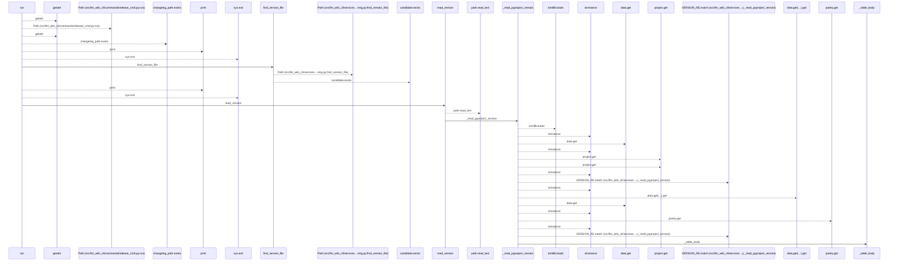
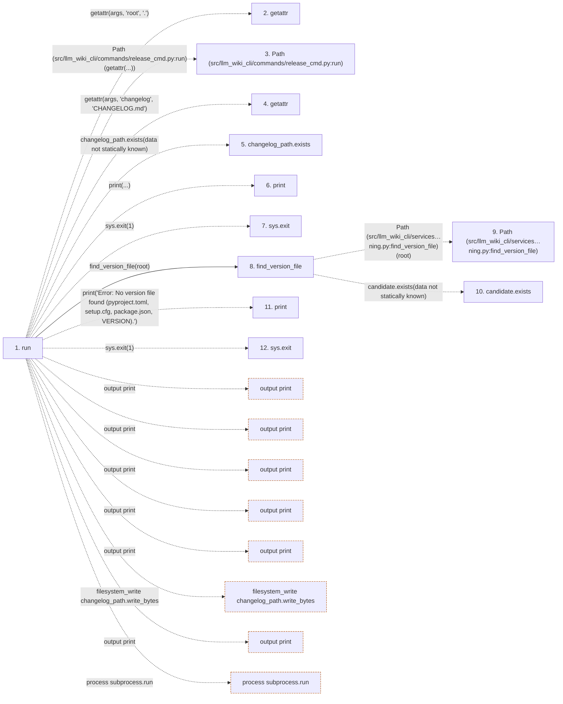

# release

**Entry point:** `run` (`cli`)
**Source:** [release_cmd](../modules/release_cmd.md)
**Modules touched:** [release_cmd](../modules/release_cmd.md), [versioning](../modules/versioning.md)

## Call sequence

<!-- Auto-generated from static call edges. Dashed arrows are external or unresolved calls. Reviewed runtime conditions and side effects belong in Behavior. -->

> Call sequence diagram shows 30 of 100 interactions; 70 omitted to keep the visualization within the 30-interaction and generated-diagram limits.

## Data flow

<!-- Auto-generated static analysis. Treat values and boundaries as best-effort hints, not runtime proof. -->

### Step data

| Step | Inputs | Reads | Writes | Returns |
|---|---|---|---|---|
| `run` | `args` | `sys`, `subprocess`, `sys`, `sys` | - | `none` |
| `getattr` | - | - | - | - |
| `Path (src/llm_wiki_cli/commands/release_cmd.py:run)` | - | - | - | - |
| `getattr` | - | - | - | - |
| `changelog_path.exists` | - | - | - | - |
| `print` | - | - | - | - |
| `sys.exit` | - | - | - | - |
| `find_version_file` | `root: str` | `VERSION_PATTERNS` | - | `candidate`, `None` |
| `Path (src/llm_wiki_cli/services…ning.py:find_version_file)` | - | - | - | - |
| `candidate.exists` | - | - | - | - |
| `print` | - | - | - | - |
| `sys.exit` | - | - | - | - |

### Call data

| From | To | Line | Call |
|---|---|---:|---|
| run | getattr | 118 | `getattr(args, 'root', '.')` |
| run | Path (src/llm_wiki_cli/commands/release_cmd.py:run) | 119 | `Path(getattr(...))` |
| run | getattr | 119 | `getattr(args, 'changelog', 'CHANGELOG.md')` |
| run | changelog_path.exists | 121 | `changelog_path.exists(data not statically known)` |
| run | print | 122 | `print(...)` |
| run | sys.exit | 123 | `sys.exit(1)` |
| run | find_version_file | 126 | `find_version_file(root)` |
| find_version_file | Path (src/llm_wiki_cli/services…ning.py:find_version_file) | 31 | `Path(root)` |
| find_version_file | candidate.exists | 34 | `candidate.exists(data not statically known)` |
| run | print | 128 | `print('Error: No version file found (pyproject.toml, setup.cfg, package.json, VERSION).')` |
| run | sys.exit | 131 | `sys.exit(1)` |

### Boundary effects

| Kind | Target | Step | Line |
|---|---|---|---:|
| output | `print` | `run` | 122 |
| output | `print` | `run` | 128 |
| output | `print` | `run` | 135 |
| output | `print` | `run` | 141 |
| output | `print` | `run` | 145 |
| filesystem_write | `changelog_path.write_bytes` | `run` | 150 |
| output | `print` | `run` | 151 |
| process | `subprocess.run` | `run` | 155 |

### Static analysis gaps

| Kind | Step | Target | Line |
|---|---|---|---:|
| external_call | `run` | `getattr` | 118 |
| external_call | `run` | `getattr` | 119 |
| unresolved_call | `run` | `changelog_path.exists` | 121 |
| external_call | `run` | `sys.exit` | 123 |
| unresolved_call | `find_version_file` | `candidate.exists` | 34 |
| external_call | `run` | `sys.exit` | 131 |
| step_limit | `run` | `first 12 steps` | 0 |

## Behavior

This flow starts at `run` and is classified as `cli`. The generated call and data-flow sections are bounded static projections; runtime conditions and side effects require source-level confirmation.
