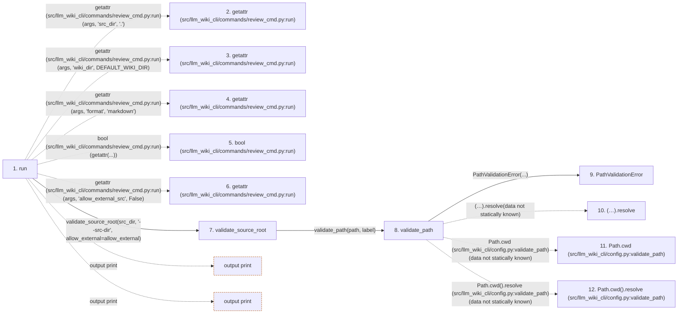

# review

**Entry point:** `run` (`cli`)
**Source:** [review_cmd](../modules/review_cmd.md)
**Modules touched:** [bootstrap_runtime](../modules/bootstrap_runtime.md), [common](../modules/common.md), [config](../modules/config.md), [data_flow](../modules/data_flow.md), and 21 more

**Complete modules touched:**

- [bootstrap_runtime](../modules/bootstrap_runtime.md)
- [common](../modules/common.md)
- [config](../modules/config.md)
- [data_flow](../modules/data_flow.md)
- [entrypoints](../modules/entrypoints.md)
- [extraction_jobs](../modules/extraction_jobs.md)
- [extraction_service](../modules/extraction_service.md)
- [filesystem_guard](../modules/filesystem_guard.md)
- [imports](../modules/imports.md)
- [inventory_cache](../modules/inventory_cache.md)
- [io](../modules/io.md)
- [knowledge_evidence](../modules/knowledge_evidence.md)
- [packages](../modules/packages.md)
- [plugins](../modules/plugins.md)
- [progress](../modules/progress.md)
- [python_contracts](../modules/python_contracts.md)
- [python_observations](../modules/python_observations.md)
- [resource_diagnostics](../modules/resource_diagnostics.md)
- [review_cmd](../modules/review_cmd.md)
- [source_selection](../modules/source_selection.md)
- [source_snapshot](../modules/source_snapshot.md)
- [sync_manifest](../modules/sync_manifest.md)
- [validation](../modules/validation.md)
- [wiki_surface](../modules/wiki_surface.md)
- [wiki_surface_index](../modules/wiki_surface_index.md)

## Call sequence

```mermaid
sequenceDiagram
    participant p0 as run
    participant p1 as getattr (src/llm_wiki_cli/commands/review_cmd.py:run)
    participant p2 as bool (src/llm_wiki_cli/commands/review_cmd.py:run)
    participant p3 as validate_source_root
    participant p4 as validate_path
    participant p5 as PathValidationError
    participant p6 as (…).resolve
    participant p7 as Path.cwd (src/llm_wiki_cli/config.py:validate_path)
    participant p8 as Path.cwd().resolve (src/llm_wiki_cli/config.py:validate_path)
    participant p9 as resolved.relative_to (src/llm_wiki_cli/config.py:validate_path)
    participant p10 as Path(…).expanduser
    participant p11 as Path (src/llm_wiki_cli/config.py:validate_source_root)
    participant p12 as candidate.is_absolute (src/llm_wiki_cli/config.py:validate_source_root)
    participant p13 as Path.cwd (src/llm_wiki_cli/config.py:validate_source_root)
    participant p14 as candidate.resolve (src/llm_wiki_cli/config.py:validate_source_root)
    participant p15 as resolved.is_dir
    participant p16 as os.path.abspath (src/llm_wiki_cli/config.py:validate_source_root)
    participant p17 as windows_current_user_sid
    participant p18 as WindowsSecurityGuardError
    participant p19 as _current_windows_user_sid
    participant p20 as ctypes.WinDLL (src/llm_wiki_cli/services…_current_windows_user_sid)
    participant p21 as ctypes.POINTER (src/llm_wiki_cli/services…_current_windows_user_sid)
    p0-->>p1: getattr (src/llm_wiki_cli/commands/review_cmd.py:run)
    p0-->>p1: getattr (src/llm_wiki_cli/commands/review_cmd.py:run)
    p0-->>p1: getattr (src/llm_wiki_cli/commands/review_cmd.py:run)
    p0-->>p2: bool (src/llm_wiki_cli/commands/review_cmd.py:run)
    p0-->>p1: getattr (src/llm_wiki_cli/commands/review_cmd.py:run)
    p0->>p3: validate_source_root
    p3->>p4: validate_path
    p4->>p5: PathValidationError
    p4-->>p6: (…).resolve
    p4-->>p7: Path.cwd (src/llm_wiki_cli/config.py:validate_path)
    p4-->>p8: Path.cwd().resolve (src/llm_wiki_cli/config.py:validate_path)
    p4-->>p7: Path.cwd (src/llm_wiki_cli/config.py:validate_path)
    p4-->>p9: resolved.relative_to (src/llm_wiki_cli/config.py:validate_path)
    p4->>p5: PathValidationError
    p3-->>p10: Path(…).expanduser
    p3-->>p11: Path (src/llm_wiki_cli/config.py:validate_source_root)
    p3-->>p12: candidate.is_absolute (src/llm_wiki_cli/config.py:validate_source_root)
    p3-->>p13: Path.cwd (src/llm_wiki_cli/config.py:validate_source_root)
    p3-->>p14: candidate.resolve (src/llm_wiki_cli/config.py:validate_source_root)
    p3->>p5: PathValidationError
    p3-->>p15: resolved.is_dir
    p3->>p5: PathValidationError
    p3-->>p11: Path (src/llm_wiki_cli/config.py:validate_source_root)
    p3-->>p16: os.path.abspath (src/llm_wiki_cli/config.py:validate_source_root)
    p3->>p17: windows_current_user_sid
    p17->>p18: WindowsSecurityGuardError
    p17->>p19: _current_windows_user_sid
    p19-->>p20: ctypes.WinDLL (src/llm_wiki_cli/services…_current_windows_user_sid)
    p19-->>p20: ctypes.WinDLL (src/llm_wiki_cli/services…_current_windows_user_sid)
    p19-->>p21: ctypes.POINTER (src/llm_wiki_cli/services…_current_windows_user_sid)
```

<!-- Auto-generated from static call edges. Dashed arrows are external or unresolved calls. Reviewed runtime conditions and side effects belong in Behavior. -->

> Call sequence diagram shows 30 of 1462 interactions; 1432 omitted to keep the visualization within the 30-interaction and generated-diagram limits.

> Trace truncated at the depth limit; deeper calls are omitted.

## Data flow

<!-- Auto-generated static analysis. Treat values and boundaries as best-effort hints, not runtime proof. -->

### Step data

| Step | Inputs | Reads | Writes | Returns |
|---|---|---|---|---|
| `run` | `args` | `DEFAULT_WIKI_DIR` | - | - |
| `getattr (src/llm_wiki_cli/commands/review_cmd.py:run)` | - | - | - | - |
| `getattr (src/llm_wiki_cli/commands/review_cmd.py:run)` | - | - | - | - |
| `getattr (src/llm_wiki_cli/commands/review_cmd.py:run)` | - | - | - | - |
| `bool (src/llm_wiki_cli/commands/review_cmd.py:run)` | - | - | - | - |
| `getattr (src/llm_wiki_cli/commands/review_cmd.py:run)` | - | - | - | - |
| `validate_source_root` | `path: str`, `label: str`, `allow_external: bool` | `sys`, `os`, `WindowsSecurityGuardError`, `sys` | - | `validate_path(...)`, `resolved` |
| `validate_path` | `path: str`, `label: str` | - | - | `resolved` |
| `PathValidationError` | - | - | - | - |
| `(…).resolve` | - | - | - | - |
| `Path.cwd (src/llm_wiki_cli/config.py:validate_path)` | - | - | - | - |
| `Path.cwd().resolve (src/llm_wiki_cli/config.py:validate_path)` | - | - | - | - |

### Call data

| From | To | Line | Call |
|---|---|---:|---|
| run | getattr (src/llm_wiki_cli/commands/review_cmd.py:run) | 588 | `getattr(args, 'src_dir', '.')` |
| run | getattr (src/llm_wiki_cli/commands/review_cmd.py:run) | 589 | `getattr(args, 'wiki_dir', DEFAULT_WIKI_DIR)` |
| run | getattr (src/llm_wiki_cli/commands/review_cmd.py:run) | 590 | `getattr(args, 'format', 'markdown')` |
| run | bool (src/llm_wiki_cli/commands/review_cmd.py:run) | 591 | `bool(getattr(...))` |
| run | getattr (src/llm_wiki_cli/commands/review_cmd.py:run) | 591 | `getattr(args, 'allow_external_src', False)` |
| run | validate_source_root | 592 | `validate_source_root(src_dir, '--src-dir', allow_external=allow_external)` |
| validate_source_root | validate_path | 158 | `validate_path(path, label)` |
| validate_path | PathValidationError | 132 | `PathValidationError(...)` |
| validate_path | (…).resolve | 133 | `(Path.cwd() / path).resolve(data not statically known)` |
| validate_path | Path.cwd (src/llm_wiki_cli/config.py:validate_path) | 133 | `Path.cwd(data not statically known)` |
| validate_path | Path.cwd().resolve (src/llm_wiki_cli/config.py:validate_path) | 134 | `Path.cwd().resolve(data not statically known)` |

### Boundary effects

| Kind | Target | Step | Line |
|---|---|---|---:|
| output | `print` | `run` | 615 |
| output | `print` | `run` | 617 |

### Static analysis gaps

| Kind | Step | Target | Line |
|---|---|---|---:|
| external_call | `run` | `getattr` | 588 |
| external_call | `run` | `getattr` | 589 |
| external_call | `run` | `getattr` | 590 |
| external_call | `run` | `getattr` | 591 |
| unresolved_call | `validate_path` | `(Path.cwd() / path).resolve` | 133 |
| external_call | `validate_path` | `Path.cwd` | 133 |
| unresolved_call | `validate_path` | `Path.cwd().resolve` | 134 |
| step_limit | `run` | `first 12 steps` | 0 |
| truncated_flow | `run` | `depth limit` | 0 |

## Behavior

This flow starts at `run` and is classified as `cli`. The generated call and data-flow sections are bounded static projections; runtime conditions and side effects require source-level confirmation.
