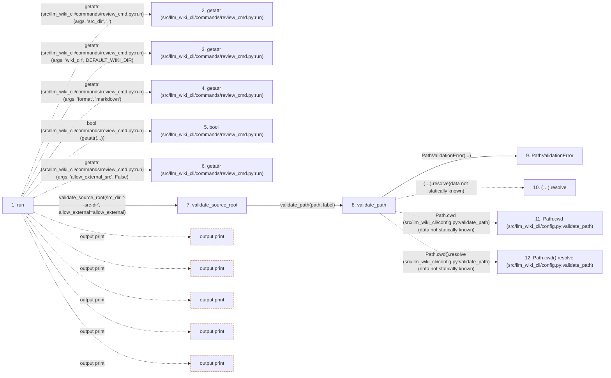

# review

**Entry point:** `run` (`cli`)
**Source:** [review_cmd](../modules/review_cmd.md)
**Modules touched:** [analysis_capture](../modules/analysis_capture.md), [api_contracts](../modules/api_contracts.md), [bootstrap_runtime](../modules/bootstrap_runtime.md), [change_selection](../modules/change_selection.md), and 34 more

**Complete modules touched:**

- [analysis_capture](../modules/analysis_capture.md)
- [api_contracts](../modules/api_contracts.md)
- [bootstrap_runtime](../modules/bootstrap_runtime.md)
- [change_selection](../modules/change_selection.md)
- [common](../modules/common.md)
- [config](../modules/config.md)
- [entrypoints](../modules/entrypoints.md)
- [extraction_jobs](../modules/extraction_jobs.md)
- [extraction_service](../modules/extraction_service.md)
- [filesystem_guard](../modules/filesystem_guard.md)
- [go_calls](../modules/go_calls.md)
- [impact](../modules/impact.md)
- [imports](../modules/imports.md)
- [inventory_cache](../modules/inventory_cache.md)
- [io](../modules/io.md)
- [knowledge_evidence](../modules/knowledge_evidence.md)
- [knowledge_storage](../modules/knowledge_storage.md)
- [knowledge_storage_io](../modules/knowledge_storage_io.md)
- [maintenance_state](../modules/maintenance_state.md)
- [manifest_storage](../modules/manifest_storage.md)
- [packages](../modules/packages.md)
- [paths](../modules/paths.md)
- [plugins](../modules/plugins.md)
- [progress](../modules/progress.md)
- [python_contracts](../modules/python_contracts.md)
- [python_implementation](../modules/python_implementation.md)
- [python_imports](../modules/python_imports.md)
- [python_observations](../modules/python_observations.md)
- [review_cmd](../modules/review_cmd.md)
- [review_service](../modules/review_service.md)
- [services_dependencies](../modules/services_dependencies.md)
- [source_selection](../modules/source_selection.md)
- [source_snapshot](../modules/source_snapshot.md)
- [sync_manifest](../modules/sync_manifest.md)
- [validation](../modules/validation.md)
- [wiki_surface](../modules/wiki_surface.md)
- [wiki_surface_index](../modules/wiki_surface_index.md)
- [wiki_write_basis](../modules/wiki_write_basis.md)

## Call sequence

> Static overview in presentation order, not runtime execution order. Arrows retain captured callers; representative internal continuations and boundary examples precede repeated helper detail.

<!-- Auto-generated from static call edges. Dashed arrows are external or unresolved calls. Reviewed runtime conditions and side effects belong in Behavior. -->

```mermaid
sequenceDiagram
    participant p0 as run
    participant p1 as validate_source_root
    participant p2 as _preflight_review_source_selection
    participant p3 as _read_patch
    participant p4 as build_impact
    participant p5 as write_text_output
    participant p6 as render_summary
    participant p7 as render_github
    participant p8 as build_findings
    participant p9 as validate_path
    participant p10 as changes_from_args
    participant p11 as render_json
    participant p12 as render_markdown
    participant p13 as resolve_source_selection
    participant p14 as source_relative_paths
    participant p15 as SyncManifest.load
    participant p16 as patch_paths
    participant p17 as build_analysis
    participant p18 as _write_utf8_text
    participant p19 as build_dependency_graph
    participant p20 as build_static_api_contracts
    participant p21 as capture_source_selection_inputs
    participant p22 as validate_persisted_source_selection_identity
    participant p23 as build_source_snapshot
    participant p24 as windows_current_user_sid
    participant p25 as source_selection_identity_from_generation_inputs
    participant p26 as _validate_capture_options
    participant p27 as _current_windows_user_sid
    participant p28 as _resolve_snapshot_selection
    participant p29 as getattr (src/llm_wiki_cli/commands/review_cmd.py:run)
    participant p30 as Path(…).expanduser (src/llm_wiki_cli/services/io.py:write_text_output)
    p0->>p1: validate_source_root
    p0->>p2: _preflight_review_source_selection
    p0->>p3: _read_patch
    p0->>p4: build_impact
    p0->>p5: write_text_output
    p0->>p6: render_summary
    p0->>p7: render_github
    p0->>p8: build_findings
    p0->>p9: validate_path
    p0->>p10: changes_from_args
    p0->>p11: render_json
    p0->>p12: render_markdown
    p2->>p13: resolve_source_selection
    p4->>p14: source_relative_paths
    p2->>p15: SyncManifest.load
    p4->>p16: patch_paths
    p4->>p17: build_analysis
    p5->>p18: _write_utf8_text
    p4->>p19: build_dependency_graph
    p4->>p20: build_static_api_contracts
    p2->>p21: capture_source_selection_inputs
    p2->>p22: validate_persisted_source_selection_identity
    p2->>p23: build_source_snapshot
    p1->>p24: windows_current_user_sid
    p22->>p25: source_selection_identity_from_generation_inputs
    p23->>p26: _validate_capture_options
    p24->>p27: _current_windows_user_sid
    p21->>p28: _resolve_snapshot_selection
    p0-->>p29: getattr (src/llm_wiki_cli/commands/review_cmd.py:run)(args, 'src_dir', '.')
    p5-->>p30: Path(…).expanduser (src/llm_wiki_cli/services/io.py:write_text_output)
```

> Call sequence diagram shows 30 of 2228 interactions; 2198 omitted to keep the visualization within the 30-interaction and generated-diagram limits, with uncertain identities omitted rather than inferred.

> Captured boundary calls: external 1 of 739 (738 omitted); unresolved 1 of 739 (738 omitted). These counts cover the captured static trace.

Omitted captured detail, grouped by actual caller occurrence and target module:

| Caller | Parent step | Target module | Kind | Omitted interactions |
| --- | --- | --- | --- | --- |
| `src/llm_wiki_cli/commands/review_cmd.py:run` | 1 | - | external | 22 |
| `src/llm_wiki_cli/config.py:validate_source_root` | 7 | [src/llm_wiki_cli/config.py](../modules/config.md) | internal | 7 |
| `src/llm_wiki_cli/config.py:validate_path` | 8 | [src/llm_wiki_cli/config.py](../modules/config.md) | internal | 2 |
| `src/llm_wiki_cli/config.py:validate_path` | 8 | - | unresolved | 3 |
| `src/llm_wiki_cli/config.py:validate_path` | 8 | - | external | 2 |
| `src/llm_wiki_cli/config.py:validate_source_root` | 7 | - | unresolved | 5 |
| `src/llm_wiki_cli/config.py:validate_source_root` | 7 | - | external | 11 |
| `src/llm_wiki_cli/services/filesystem_guard.py:windows_current_user_sid` | 26 | [src/llm_wiki_cli/services/filesystem_guard.py](../modules/filesystem_guard.md) | internal | 1 |
> Omission summary shows 8 of 579 groups; 571 further groups are not expanded here. Counts above include all omitted interactions.
> Detailed flow queries retain their own coverage and limits; omitted paths may execute at runtime.

> Trace truncated at the depth limit; deeper calls are omitted.

## Data flow

<!-- Auto-generated static analysis. Treat values and boundaries as best-effort hints, not runtime proof. -->

### Analysis coverage

**Effect analysis partially available.** Flow assembly and source effect analysis are separate; empty observations do not prove an empty handler body.

Source steps: 751; effect analysis evaluated: 517, partial: 31, unavailable: 203. Counts include steps omitted from the displayed trace.

Collector observations for 548 source steps with known totals: observed: 3119, emitted: 3009, omitted: 110. Unavailable totals are excluded.

- Callable record unavailable for one or more source steps; those steps have no represented callable body.
- Effect collector omitted observations before flow assembly; displayed effects are partial.
- Effect collector totals unavailable; observed counts cover captured records only.

| Step | Callable record | Effect analysis | Collector totals | Observed | Emitted | Omitted |
|---|---|---|---|---:|---:|---:|
| `run` | `available` | `evaluated` | `available` | `8` | `8` | `0` |
| `getattr (src/llm_wiki_cli/commands/review_cmd.py:run)` | `not_applicable` | `not_applicable` | `not_applicable` | — | — | — |
| `getattr (src/llm_wiki_cli/commands/review_cmd.py:run)` | `not_applicable` | `not_applicable` | `not_applicable` | — | — | — |
| `getattr (src/llm_wiki_cli/commands/review_cmd.py:run)` | `not_applicable` | `not_applicable` | `not_applicable` | — | — | — |
| `bool (src/llm_wiki_cli/commands/review_cmd.py:run)` | `not_applicable` | `not_applicable` | `not_applicable` | — | — | — |
| `getattr (src/llm_wiki_cli/commands/review_cmd.py:run)` | `not_applicable` | `not_applicable` | `not_applicable` | — | — | — |
| `validate_source_root` | `available` | `evaluated` | `available` | `9` | `9` | `0` |
| `validate_path` | `available` | `evaluated` | `available` | `3` | `3` | `0` |
| `PathValidationError` | `unavailable` | `unavailable` | `unavailable` | — | — | — |
| `(…).resolve` | `not_applicable` | `not_applicable` | `not_applicable` | — | — | — |
| `Path.cwd (src/llm_wiki_cli/config.py:validate_path)` | `not_applicable` | `not_applicable` | `not_applicable` | — | — | — |
| `Path.cwd().resolve (src/llm_wiki_cli/config.py:validate_path)` | `not_applicable` | `not_applicable` | `not_applicable` | — | — | — |

```mermaid
flowchart LR
    s1["1. run"]
    s2["2. getattr (src/llm_wiki_cli/commands/review_cmd.py:run)"]
    s3["3. getattr (src/llm_wiki_cli/commands/review_cmd.py:run)"]
    s4["4. getattr (src/llm_wiki_cli/commands/review_cmd.py:run)"]
    s5["5. bool (src/llm_wiki_cli/commands/review_cmd.py:run)"]
    s6["6. getattr (src/llm_wiki_cli/commands/review_cmd.py:run)"]
    s7["7. validate_source_root"]
    s8["8. validate_path"]
    s9["9. PathValidationError"]
    s10["10. (…).resolve"]
    s11["11. Path.cwd (src/llm_wiki_cli/config.py:validate_path)"]
    s12["12. Path.cwd().resolve (src/llm_wiki_cli/config.py:validate_path)"]
    s1 -. "getattr (src/llm_wiki_cli/commands/review_cmd.py:run)(args, 'src_dir', '.')" .-> s2
    s1 -. "getattr (src/llm_wiki_cli/commands/review_cmd.py:run)(args, 'wiki_dir', DEFAULT_WIKI_DIR)" .-> s3
    s1 -. "getattr (src/llm_wiki_cli/commands/review_cmd.py:run)(args, 'format', 'markdown')" .-> s4
    s1 -. "bool (src/llm_wiki_cli/commands/review_cmd.py:run)(getattr(...))" .-> s5
    s1 -. "getattr (src/llm_wiki_cli/commands/review_cmd.py:run)(args, 'allow_external_src', False)" .-> s6
    s1 -->|"validate_source_root(src_dir, '--src-dir', allow_external=allow_external)"| s7
    s7 -->|"validate_path(path, label)"| s8
    s8 -->|"PathValidationError(...)"| s9
    s8 -. "(…).resolve(data not statically known)" .-> s10
    s8 -. "Path.cwd (src/llm_wiki_cli/config.py:validate_path)(data not statically known)" .-> s11
    s8 -. "Path.cwd().resolve (src/llm_wiki_cli/config.py:validate_path)(data not statically known)" .-> s12
    b0["output print"]
    s1 -. "output print" .-> b0
    b1["output print"]
    s1 -. "output print" .-> b1
    b2["output print"]
    s1 -. "output print" .-> b2
    b3["output print"]
    s1 -. "output print" .-> b3
    b4["output print"]
    s1 -. "output print" .-> b4
    click s1 "../modules/review_cmd.md"
    click s7 "../modules/config.md"
    click s8 "../modules/config.md"
    click s9 "../modules/config.md"
    classDef boundary stroke:#b45309,stroke-dasharray: 4 2
    class b0 boundary
    class b1 boundary
    class b2 boundary
    class b3 boundary
    class b4 boundary
```

### Step data

| Step | Inputs | Reads | Writes | Returns |
|---|---|---|---|---|
| `run` | `args` | `DEFAULT_WIKI_DIR` | - | `none` |
| `getattr (src/llm_wiki_cli/commands/review_cmd.py:run)` | - | - | - | - |
| `getattr (src/llm_wiki_cli/commands/review_cmd.py:run)` | - | - | - | - |
| `getattr (src/llm_wiki_cli/commands/review_cmd.py:run)` | - | - | - | - |
| `bool (src/llm_wiki_cli/commands/review_cmd.py:run)` | - | - | - | - |
| `getattr (src/llm_wiki_cli/commands/review_cmd.py:run)` | - | - | - | - |
| `validate_source_root` | `path: str`, `label: str`, `allow_external: bool` | `sys`, `os`, `WindowsSecurityGuardError`, `sys` | - | `validate_path(...)`, `resolved` |
| `validate_path` | `path: str`, `label: str` | - | - | `resolved` |
| `PathValidationError` | - | - | - | - |
| `(…).resolve` | - | - | - | - |
| `Path.cwd (src/llm_wiki_cli/config.py:validate_path)` | - | - | - | - |
| `Path.cwd().resolve (src/llm_wiki_cli/config.py:validate_path)` | - | - | - | - |

### Call data

| From | To | Line | Call |
|---|---|---:|---|
| run | getattr (src/llm_wiki_cli/commands/review_cmd.py:run) | 97 | `getattr(args, 'src_dir', '.')` |
| run | getattr (src/llm_wiki_cli/commands/review_cmd.py:run) | 98 | `getattr(args, 'wiki_dir', DEFAULT_WIKI_DIR)` |
| run | getattr (src/llm_wiki_cli/commands/review_cmd.py:run) | 99 | `getattr(args, 'format', 'markdown')` |
| run | bool (src/llm_wiki_cli/commands/review_cmd.py:run) | 100 | `bool(getattr(...))` |
| run | getattr (src/llm_wiki_cli/commands/review_cmd.py:run) | 100 | `getattr(args, 'allow_external_src', False)` |
| run | validate_source_root | 101 | `validate_source_root(src_dir, '--src-dir', allow_external=allow_external)` |
| validate_source_root | validate_path | 160 | `validate_path(path, label)` |
| validate_path | PathValidationError | 134 | `PathValidationError(...)` |
| validate_path | (…).resolve | 135 | `(Path.cwd() / path).resolve(data not statically known)` |
| validate_path | Path.cwd (src/llm_wiki_cli/config.py:validate_path) | 135 | `Path.cwd(data not statically known)` |
| validate_path | Path.cwd().resolve (src/llm_wiki_cli/config.py:validate_path) | 136 | `Path.cwd().resolve(data not statically known)` |

### Boundary effects

| Kind | Target | Step | Line |
|---|---|---|---:|
| output | `print` | `run` | 136 |
| output | `print` | `run` | 138 |
| output | `print` | `run` | 140 |
| output | `print` | `run` | 152 |
| output | `print` | `run` | 154 |

### Static analysis gaps

| Kind | Step | Target | Line |
|---|---|---|---:|
| external_call | `run` | `getattr` | 97 |
| external_call | `run` | `getattr` | 98 |
| external_call | `run` | `getattr` | 99 |
| external_call | `run` | `getattr` | 100 |
| unresolved_call | `validate_path` | `(Path.cwd() / path).resolve` | 135 |
| external_call | `validate_path` | `Path.cwd` | 135 |
| unresolved_call | `validate_path` | `Path.cwd().resolve` | 136 |
| step_limit | `run` | `first 12 steps` | 0 |
| truncated_flow | `run` | `depth limit` | 0 |

## Behavior

This flow starts at `run` and is classified as `cli`. The generated call and data-flow sections are bounded static projections; runtime conditions and side effects require source-level confirmation.

Preflights nonempty changed paths against the persisted configured source
selection. Provably excluded-only requests return explicit unknown native
impact without unrelated deep extraction. Snapshot discovery/content capture
still run; mixed, selected, empty, boundary-changing or unclassifiable scope
retains the actual full inventory/helper requirements and failures. The legacy
plain finding envelope remains compatible.
