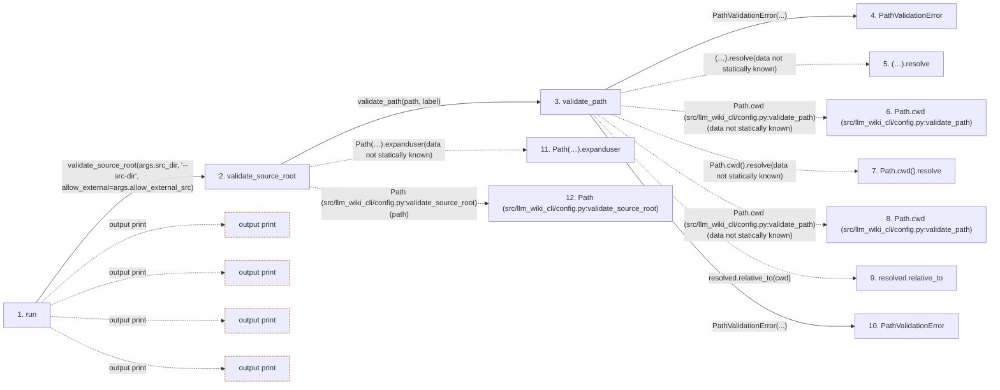

# search

**Entry point:** `run` (`cli`)
**Source:** [search_cmd](../modules/search_cmd.md)
**Modules touched:** [config](../modules/config.md), [filesystem_guard](../modules/filesystem_guard.md), [io](../modules/io.md), [mcp_server](../modules/mcp_server.md), [search_cmd](../modules/search_cmd.md)

## Call sequence

```mermaid
sequenceDiagram
    participant p0 as run
    participant p1 as validate_source_root
    participant p2 as validate_path
    participant p3 as PathValidationError
    participant p4 as (…).resolve
    participant p5 as Path.cwd (src/llm_wiki_cli/config.py:validate_path)
    participant p6 as Path.cwd().resolve
    participant p7 as resolved.relative_to
    participant p8 as Path(…).expanduser
    participant p9 as Path (src/llm_wiki_cli/config.py:validate_source_root)
    participant p10 as candidate.is_absolute
    participant p11 as Path.cwd (src/llm_wiki_cli/config.py:validate_source_root)
    participant p12 as candidate.resolve
    participant p13 as resolved.is_dir
    participant p14 as os.path.abspath (src/llm_wiki_cli/config.py:validate_source_root)
    participant p15 as windows_current_user_sid
    participant p16 as WindowsSecurityGuardError
    participant p17 as _current_windows_user_sid
    participant p18 as ctypes.WinDLL (src/llm_wiki_cli/services…_current_windows_user_sid)
    participant p19 as ctypes.POINTER (src/llm_wiki_cli/services…_current_windows_user_sid)
    participant p20 as wintypes.HANDLE (src/llm_wiki_cli/services…_current_windows_user_sid)
    participant p21 as open_process_token
    participant p22 as get_current_process
    participant p23 as ctypes.byref (src/llm_wiki_cli/services…_current_windows_user_sid)
    p0->>p1: validate_source_root
    p1->>p2: validate_path
    p2->>p3: PathValidationError
    p2-->>p4: (…).resolve
    p2-->>p5: Path.cwd (src/llm_wiki_cli/config.py:validate_path)
    p2-->>p6: Path.cwd().resolve
    p2-->>p5: Path.cwd (src/llm_wiki_cli/config.py:validate_path)
    p2-->>p7: resolved.relative_to
    p2->>p3: PathValidationError
    p1-->>p8: Path(…).expanduser
    p1-->>p9: Path (src/llm_wiki_cli/config.py:validate_source_root)
    p1-->>p10: candidate.is_absolute
    p1-->>p11: Path.cwd (src/llm_wiki_cli/config.py:validate_source_root)
    p1-->>p12: candidate.resolve
    p1->>p3: PathValidationError
    p1-->>p13: resolved.is_dir
    p1->>p3: PathValidationError
    p1-->>p9: Path (src/llm_wiki_cli/config.py:validate_source_root)
    p1-->>p14: os.path.abspath (src/llm_wiki_cli/config.py:validate_source_root)
    p1->>p15: windows_current_user_sid
    p15->>p16: WindowsSecurityGuardError
    p15->>p17: _current_windows_user_sid
    p17-->>p18: ctypes.WinDLL (src/llm_wiki_cli/services…_current_windows_user_sid)
    p17-->>p18: ctypes.WinDLL (src/llm_wiki_cli/services…_current_windows_user_sid)
    p17-->>p19: ctypes.POINTER (src/llm_wiki_cli/services…_current_windows_user_sid)
    p17-->>p19: ctypes.POINTER (src/llm_wiki_cli/services…_current_windows_user_sid)
    p17-->>p20: wintypes.HANDLE (src/llm_wiki_cli/services…_current_windows_user_sid)
    p17-->>p21: open_process_token
    p17-->>p22: get_current_process
    p17-->>p23: ctypes.byref (src/llm_wiki_cli/services…_current_windows_user_sid)
```

<!-- Auto-generated from static call edges. Dashed arrows are external or unresolved calls. Reviewed runtime conditions and side effects belong in Behavior. -->

> Call sequence diagram shows 30 of 111 interactions; 81 omitted to keep the visualization within the 30-interaction and generated-diagram limits.

## Data flow

<!-- Auto-generated static analysis. Treat values and boundaries as best-effort hints, not runtime proof. -->

### Step data

| Step | Inputs | Reads | Writes | Returns |
|---|---|---|---|---|
| `run` | `args` | - | - | - |
| `validate_source_root` | `path: str`, `label: str`, `allow_external: bool` | `sys`, `os`, `WindowsSecurityGuardError`, `sys` | - | `validate_path(...)`, `resolved` |
| `validate_path` | `path: str`, `label: str` | - | - | `resolved` |
| `PathValidationError` | - | - | - | - |
| `(…).resolve` | - | - | - | - |
| `Path.cwd (src/llm_wiki_cli/config.py:validate_path)` | - | - | - | - |
| `Path.cwd().resolve` | - | - | - | - |
| `Path.cwd (src/llm_wiki_cli/config.py:validate_path)` | - | - | - | - |
| `resolved.relative_to` | - | - | - | - |
| `PathValidationError` | - | - | - | - |
| `Path(…).expanduser` | - | - | - | - |
| `Path (src/llm_wiki_cli/config.py:validate_source_root)` | - | - | - | - |

### Call data

| From | To | Line | Call |
|---|---|---:|---|
| run | validate_source_root | 10 | `validate_source_root(args.src_dir, '--src-dir', allow_external=args.allow_external_src)` |
| validate_source_root | validate_path | 158 | `validate_path(path, label)` |
| validate_path | PathValidationError | 132 | `PathValidationError(...)` |
| validate_path | (…).resolve | 133 | `(Path.cwd() / path).resolve(data not statically known)` |
| validate_path | Path.cwd (src/llm_wiki_cli/config.py:validate_path) | 133 | `Path.cwd(data not statically known)` |
| validate_path | Path.cwd().resolve | 134 | `Path.cwd().resolve(data not statically known)` |
| validate_path | Path.cwd (src/llm_wiki_cli/config.py:validate_path) | 134 | `Path.cwd(data not statically known)` |
| validate_path | resolved.relative_to | 136 | `resolved.relative_to(cwd)` |
| validate_path | PathValidationError | 138 | `PathValidationError(...)` |
| validate_source_root | Path(…).expanduser | 161 | `Path(path).expanduser(data not statically known)` |
| validate_source_root | Path (src/llm_wiki_cli/config.py:validate_source_root) | 161 | `Path(path)` |

### Boundary effects

| Kind | Target | Step | Line |
|---|---|---|---:|
| output | `print` | `run` | 21 |
| output | `print` | `run` | 24 |
| output | `print` | `run` | 25 |
| output | `print` | `run` | 26 |

### Static analysis gaps

| Kind | Step | Target | Line |
|---|---|---|---:|
| unresolved_call | `validate_path` | `(Path.cwd() / path).resolve` | 133 |
| external_call | `validate_path` | `Path.cwd` | 133 |
| unresolved_call | `validate_path` | `Path.cwd().resolve` | 134 |
| external_call | `validate_path` | `Path.cwd` | 134 |
| unresolved_call | `validate_path` | `resolved.relative_to` | 136 |
| unresolved_call | `validate_source_root` | `Path(path).expanduser` | 161 |
| step_limit | `run` | `first 12 steps` | 0 |

## Behavior

This flow starts at `run` and is classified as `cli`. The generated call and data-flow sections are bounded static projections; runtime conditions and side effects require source-level confirmation.
