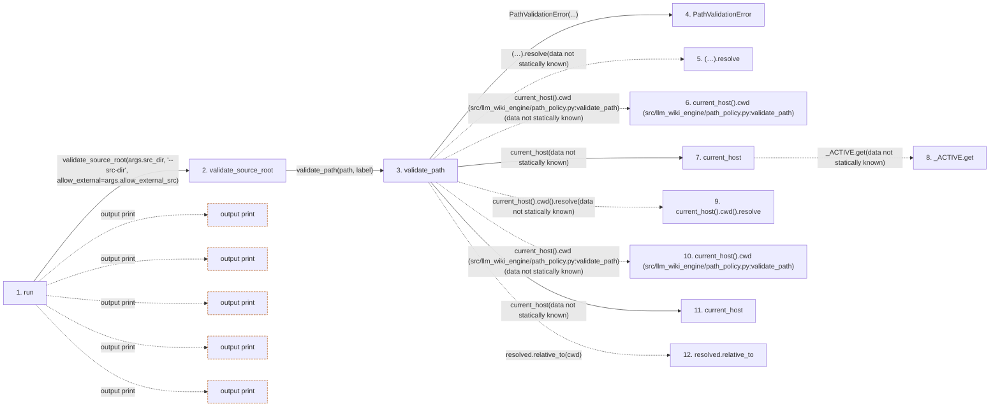

# search

**Entry point:** `run` (`cli`)
**Source:** [search_cmd](../modules/search_cmd.md)
**Modules touched:** [api](../modules/api.md), [canonical_json](../modules/canonical_json.md), [concept_identity](../modules/concept_identity.md), [filesystem_guard](../modules/filesystem_guard.md), and 29 more

**Complete modules touched:**

- [api](../modules/api.md)
- [canonical_json](../modules/canonical_json.md)
- [concept_identity](../modules/concept_identity.md)
- [filesystem_guard](../modules/filesystem_guard.md)
- [host](../modules/host.md)
- [integrations](../modules/integrations.md)
- [io](../modules/io.md)
- [knowledge_artifacts](../modules/knowledge_artifacts.md)
- [knowledge_kinds](../modules/knowledge_kinds.md)
- [knowledge_model](../modules/knowledge_model.md)
- [knowledge_storage](../modules/knowledge_storage.md)
- [knowledge_storage_access](../modules/knowledge_storage_access.md)
- [knowledge_storage_io](../modules/knowledge_storage_io.md)
- [knowledge_validators](../modules/knowledge_validators.md)
- [maintenance_evidence](../modules/maintenance_evidence.md)
- [maintenance_protocol](../modules/maintenance_protocol.md)
- [maintenance_state](../modules/maintenance_state.md)
- [maintenance_status](../modules/maintenance_status.md)
- [markdown_sections](../modules/markdown_sections.md)
- [path_policy](../modules/path_policy.md)
- [query_request_format](../modules/query_request_format.md)
- [search_cmd](../modules/search_cmd.md)
- [search_discovery](../modules/search_discovery.md)
- [search_discovery_capture](../modules/search_discovery_capture.md)
- [search_lexical](../modules/search_lexical.md)
- [search_rank](../modules/search_rank.md)
- [search_service](../modules/search_service.md)
- [search_source](../modules/search_source.md)
- [section_ownership](../modules/section_ownership.md)
- [source_selection](../modules/source_selection.md)
- [sync_manifest](../modules/sync_manifest.md)
- [validation](../modules/validation.md)
- [wiki_surface](../modules/wiki_surface.md)

## Call sequence

> Static overview in presentation order, not runtime execution order. Arrows retain captured callers; representative internal continuations and boundary examples precede repeated helper detail.

<!-- Auto-generated from static call edges. Dashed arrows are external or unresolved calls. Reviewed runtime conditions and side effects belong in Behavior. -->

```mermaid
sequenceDiagram
    participant p0 as run
    participant p1 as validate_source_root
    participant p2 as search_wiki (src/llm_wiki_cli/api.py)
    participant p3 as validate_path
    participant p4 as search_wiki (src/llm_wiki_engine/search_service.py)
    participant p5 as windows_current_user_sid
    participant p6 as first_unsafe_path_component
    participant p7 as _current_windows_user_sid
    participant p8 as normalize_search
    participant p9 as search_prevalidated_roots
    participant p10 as normalize_documentation_query_limit
    participant p11 as resolve_source_selection
    participant p12 as capture_source_selection_inputs
    participant p13 as validate_live_query_source_selection
    participant p14 as build_source_snapshot
    participant p15 as search_records
    participant p16 as captured_manifest
    participant p17 as _windows_sid_string
    participant p18 as capture_source_index
    participant p19 as capture_discovery
    participant p20 as enrich_search
    participant p21 as compact_line_bytes
    participant p22 as source_snapshot_matches_current_files
    participant p23 as SyncManifest.load
    participant p24 as rank_pages (src/llm_wiki_engine/search_rank.py)
    participant p25 as _object
    participant p26 as provider
    participant p27 as rank_pages (src/llm_wiki_engine/search_lexical.py)
    participant p28 as _decode_json_object
    participant p29 as getattr (src/llm_wiki_cli/commands/search_cmd.py:run)
    participant p30 as Path(…).expanduser
    p0->>p1: validate_source_root
    p0->>p2: search_wiki (src/llm_wiki_cli/api.py)
    p0->>p3: validate_path
    p2->>p4: search_wiki (src/llm_wiki_engine/search_service.py)
    p1->>p5: windows_current_user_sid
    p1->>p6: first_unsafe_path_component
    p5->>p7: _current_windows_user_sid
    p4->>p8: normalize_search
    p4->>p9: search_prevalidated_roots
    p8->>p10: normalize_documentation_query_limit
    p9->>p11: resolve_source_selection
    p9->>p12: capture_source_selection_inputs
    p9->>p13: validate_live_query_source_selection
    p9->>p14: build_source_snapshot
    p9->>p15: search_records
    p9->>p16: captured_manifest
    p7->>p17: _windows_sid_string
    p9->>p18: capture_source_index
    p9->>p19: capture_discovery
    p9->>p20: enrich_search
    p9->>p21: compact_line_bytes
    p9->>p22: source_snapshot_matches_current_files
    p13->>p23: SyncManifest.load
    p15->>p24: rank_pages (src/llm_wiki_engine/search_rank.py)
    p20->>p25: _object
    p12->>p26: provider
    p15->>p27: rank_pages (src/llm_wiki_engine/search_lexical.py)
    p16->>p28: _decode_json_object
    p0-->>p29: getattr (src/llm_wiki_cli/commands/search_cmd.py:run)(args, 'include_source', False)
    p1-->>p30: Path(…).expanduser
```

> Call sequence diagram shows 30 of 1068 interactions; 1038 omitted to keep the visualization within the 30-interaction and generated-diagram limits, with uncertain identities omitted rather than inferred.

> Captured boundary calls: external 1 of 432 (431 omitted); unresolved 1 of 307 (306 omitted). These counts cover the captured static trace.

Omitted captured detail, grouped by actual caller occurrence and target module:

| Caller | Parent step | Target module | Kind | Omitted interactions |
| --- | --- | --- | --- | --- |
| `src/llm_wiki_engine/path_policy.py:validate_source_root` | 2 | [src/llm_wiki_engine/path_policy.py](../modules/path_policy.md) | internal | 7 |
| `src/llm_wiki_engine/path_policy.py:validate_path` | 3 | [src/llm_wiki_engine/path_policy.py](../modules/path_policy.md) | internal | 2 |
| `src/llm_wiki_engine/path_policy.py:validate_path` | 3 | - | unresolved | 5 |
| `src/llm_wiki_engine/path_policy.py:validate_path` | 3 | [src/llm_wiki_engine/host.py](../modules/host.md) | internal | 2 |
| `src/llm_wiki_engine/host.py:current_host` | 7 | - | unresolved | 1 |
| `src/llm_wiki_engine/path_policy.py:validate_source_root` | 2 | - | external | 10 |
| `src/llm_wiki_engine/path_policy.py:validate_source_root` | 2 | - | unresolved | 5 |
| `src/llm_wiki_engine/path_policy.py:validate_source_root` | 2 | [src/llm_wiki_engine/host.py](../modules/host.md) | internal | 1 |
> Omission summary shows 8 of 173 groups; 165 further groups are not expanded here. Counts above include all omitted interactions.
> Detailed flow queries retain their own coverage and limits; omitted paths may execute at runtime.

> Trace truncated at the depth limit; deeper calls are omitted.

## Data flow

<!-- Auto-generated static analysis. Treat values and boundaries as best-effort hints, not runtime proof. -->

### Analysis coverage

**Effect analysis partially available.** Flow assembly and source effect analysis are separate; empty observations do not prove an empty handler body.

Source steps: 330; effect analysis evaluated: 238, partial: 11, unavailable: 81. Counts include steps omitted from the displayed trace.

Collector observations for 249 source steps with known totals: observed: 1217, emitted: 1183, omitted: 34. Unavailable totals are excluded.

- Callable record unavailable for one or more source steps; those steps have no represented callable body.
- Effect collector omitted observations before flow assembly; displayed effects are partial.
- Effect collector totals unavailable; observed counts cover captured records only.

| Step | Callable record | Effect analysis | Collector totals | Observed | Emitted | Omitted |
|---|---|---|---|---:|---:|---:|
| `run` | `available` | `evaluated` | `available` | `6` | `6` | `0` |
| `validate_source_root` | `available` | `evaluated` | `available` | `9` | `9` | `0` |
| `validate_path` | `available` | `evaluated` | `available` | `3` | `3` | `0` |
| `PathValidationError` | `unavailable` | `unavailable` | `unavailable` | — | — | — |
| `(…).resolve` | `not_applicable` | `not_applicable` | `not_applicable` | — | — | — |
| `current_host().cwd (src/llm_wiki_engine/path_policy.py:validate_path)` | `not_applicable` | `not_applicable` | `not_applicable` | — | — | — |
| `current_host` | `available` | `evaluated` | `available` | `2` | `2` | `0` |
| `_ACTIVE.get` | `not_applicable` | `not_applicable` | `not_applicable` | — | — | — |
| `current_host().cwd().resolve` | `not_applicable` | `not_applicable` | `not_applicable` | — | — | — |
| `current_host().cwd (src/llm_wiki_engine/path_policy.py:validate_path)` | `not_applicable` | `not_applicable` | `not_applicable` | — | — | — |
| `current_host` | `available` | `evaluated` | `available` | `2` | `2` | `0` |
| `resolved.relative_to` | `not_applicable` | `not_applicable` | `not_applicable` | — | — | — |

```mermaid
flowchart LR
    s1["1. run"]
    s2["2. validate_source_root"]
    s3["3. validate_path"]
    s4["4. PathValidationError"]
    s5["5. (…).resolve"]
    s6["6. current_host().cwd (src/llm_wiki_engine/path_policy.py:validate_path)"]
    s7["7. current_host"]
    s8["8. _ACTIVE.get"]
    s9["9. current_host().cwd().resolve"]
    s10["10. current_host().cwd (src/llm_wiki_engine/path_policy.py:validate_path)"]
    s11["11. current_host"]
    s12["12. resolved.relative_to"]
    s1 -->|"validate_source_root(args.src_dir, '--src-dir', allow_external=args.allow_external_src)"| s2
    s2 -->|"validate_path(path, label)"| s3
    s3 -->|"PathValidationError(...)"| s4
    s3 -. "(…).resolve(data not statically known)" .-> s5
    s3 -. "current_host().cwd (src/llm_wiki_engine/path_policy.py:validate_path)(data not statically known)" .-> s6
    s3 -->|"current_host(data not statically known)"| s7
    s7 -. "_ACTIVE.get(data not statically known)" .-> s8
    s3 -. "current_host().cwd().resolve(data not statically known)" .-> s9
    s3 -. "current_host().cwd (src/llm_wiki_engine/path_policy.py:validate_path)(data not statically known)" .-> s10
    s3 -->|"current_host(data not statically known)"| s11
    s3 -. "resolved.relative_to(cwd)" .-> s12
    b0["output print"]
    s1 -. "output print" .-> b0
    b1["output print"]
    s1 -. "output print" .-> b1
    b2["output print"]
    s1 -. "output print" .-> b2
    b3["output print"]
    s1 -. "output print" .-> b3
    b4["output print"]
    s1 -. "output print" .-> b4
    click s1 "../modules/search_cmd.md"
    click s2 "../modules/path_policy.md"
    click s3 "../modules/path_policy.md"
    click s4 "../modules/path_policy.md"
    click s7 "../modules/host.md"
    click s11 "../modules/host.md"
    classDef boundary stroke:#b45309,stroke-dasharray: 4 2
    class b0 boundary
    class b1 boundary
    class b2 boundary
    class b3 boundary
    class b4 boundary
```

### Step data

| Step | Inputs | Reads | Writes | Returns |
|---|---|---|---|---|
| `run` | `args` | - | - | - |
| `validate_source_root` | `path: str`, `label: str`, `allow_external: bool` | `sys`, `os`, `WindowsSecurityGuardError`, `sys` | - | `validate_path(...)`, `resolved` |
| `validate_path` | `path: str`, `label: str` | - | - | `resolved` |
| `PathValidationError` | - | - | - | - |
| `(…).resolve` | - | - | - | - |
| `current_host().cwd (src/llm_wiki_engine/path_policy.py:validate_path)` | - | - | - | - |
| `current_host` | - | `_DEFAULT` | - | `...` |
| `_ACTIVE.get` | - | - | - | - |
| `current_host().cwd().resolve` | - | - | - | - |
| `current_host().cwd (src/llm_wiki_engine/path_policy.py:validate_path)` | - | - | - | - |
| `current_host` | - | `_DEFAULT` | - | `...` |
| `resolved.relative_to` | - | - | - | - |

### Call data

| From | To | Line | Call |
|---|---|---:|---|
| run | validate_source_root | 10 | `validate_source_root(args.src_dir, '--src-dir', allow_external=args.allow_external_src)` |
| validate_source_root | validate_path | 127 | `validate_path(path, label)` |
| validate_path | PathValidationError | 102 | `PathValidationError(...)` |
| validate_path | (…).resolve | 103 | `(current_host().cwd() / path).resolve(data not statically known)` |
| validate_path | current_host().cwd (src/llm_wiki_engine/path_policy.py:validate_path) | 103 | `current_host().cwd(data not statically known)` |
| validate_path | current_host | 103 | `current_host(data not statically known)` |
| current_host | _ACTIVE.get | 166 | `_ACTIVE.get(data not statically known)` |
| validate_path | current_host().cwd().resolve | 104 | `current_host().cwd().resolve(data not statically known)` |
| validate_path | current_host().cwd (src/llm_wiki_engine/path_policy.py:validate_path) | 104 | `current_host().cwd(data not statically known)` |
| validate_path | current_host | 104 | `current_host(data not statically known)` |
| validate_path | resolved.relative_to | 106 | `resolved.relative_to(cwd)` |

### Boundary effects

| Kind | Target | Step | Line |
|---|---|---|---:|
| output | `print` | `run` | 24 |
| output | `print` | `run` | 27 |
| output | `print` | `run` | 28 |
| output | `print` | `run` | 29 |
| output | `print` | `run` | 31 |

### Static analysis gaps

| Kind | Step | Target | Line |
|---|---|---|---:|
| unresolved_call | `validate_path` | `(current_host().cwd() / path).resolve` | 103 |
| unresolved_call | `validate_path` | `current_host().cwd` | 103 |
| unresolved_call | `current_host` | `_ACTIVE.get` | 166 |
| unresolved_call | `validate_path` | `current_host().cwd().resolve` | 104 |
| unresolved_call | `validate_path` | `current_host().cwd` | 104 |
| unresolved_call | `validate_path` | `resolved.relative_to` | 106 |
| step_limit | `run` | `first 12 steps` | 0 |
| truncated_flow | `run` | `depth limit` | 0 |

## Behavior

This flow starts at `run` and is classified as `cli`. The generated call and data-flow sections are bounded static projections; runtime conditions and side effects require source-level confirmation.

The command validates the query options and configured roots, then delegates to
the shared search service. Default ranked discovery scores captured canonical
text with section-local relevance and qualified one-hop declaration leads.
Literal identities retain precedence; a declared flow link establishes neither
runtime invocation nor source correctness. Legacy ranked and substring modes
keep their separate matching contracts. Source-text indexing remains explicit.
