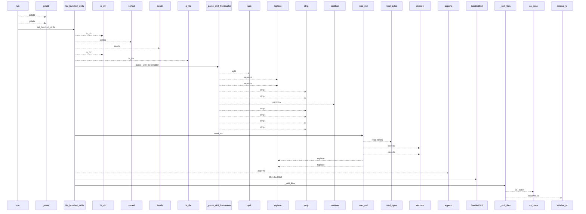
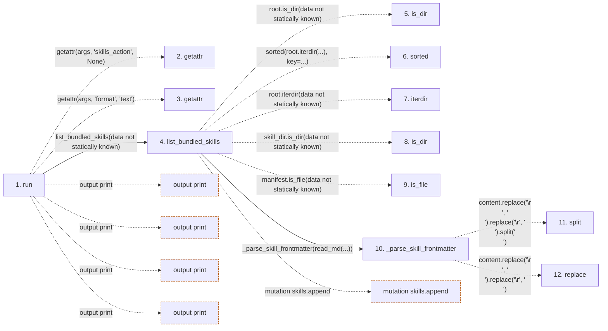

# skills

**Entry point:** `run` (`cli`)
**Source:** [skills_cmd](../modules/skills_cmd.md)
**Modules touched:** [config](../modules/config.md), [io](../modules/io.md), [skills](../modules/skills.md), [skills_cmd](../modules/skills_cmd.md), [validation](../modules/validation.md)

## Call sequence

<!-- Auto-generated from static call edges. Dashed arrows are external or unresolved calls. Reviewed runtime conditions and side effects belong in Behavior. -->

> Call sequence diagram shows 30 of 274 interactions; 244 omitted to keep the visualization within the 30-interaction and generated-diagram limits.

> Trace truncated at the depth limit; deeper calls are omitted.

## Data flow

<!-- Auto-generated static analysis. Treat values and boundaries as best-effort hints, not runtime proof. -->

### Step data

| Step | Inputs | Reads | Writes | Returns |
|---|---|---|---|---|
| `run` | `args` | `SkillsError`, `sys`, `sys` | - | `none`, `none`, `none` |
| `getattr` | - | - | - | - |
| `getattr` | - | - | - | - |
| `list_bundled_skills` | `skills_root: Path \| None` | `BUNDLED_SKILLS_ROOT`, `SKILL_MANIFEST_NAME` | - | `[...]`, `skills` |
| `is_dir` | - | - | - | - |
| `sorted` | - | - | - | - |
| `iterdir` | - | - | - | - |
| `is_dir` | - | - | - | - |
| `is_file` | - | - | - | - |
| `_parse_skill_frontmatter` | `content: str` | - | - | `(...)`, `(...)` |
| `split` | - | - | - | - |
| `replace` | - | - | - | - |

### Call data

| From | To | Line | Call |
|---|---|---:|---|
| run | getattr | 46 | `getattr(args, 'skills_action', None)` |
| run | getattr | 47 | `getattr(args, 'format', 'text')` |
| run | list_bundled_skills | 51 | `list_bundled_skills(data not statically known)` |
| list_bundled_skills | is_dir | 245 | `root.is_dir(data not statically known)` |
| list_bundled_skills | sorted | 249 | `sorted(root.iterdir(...), key=...)` |
| list_bundled_skills | iterdir | 249 | `root.iterdir(data not statically known)` |
| list_bundled_skills | is_dir | 251 | `skill_dir.is_dir(data not statically known)` |
| list_bundled_skills | is_file | 251 | `manifest.is_file(data not statically known)` |
| list_bundled_skills | _parse_skill_frontmatter | 253 | `_parse_skill_frontmatter(read_md(...))` |
| _parse_skill_frontmatter | split | 1269 | `content.replace('\r\n', '\n').replace('\r', '\n').split('\n')` |
| _parse_skill_frontmatter | replace | 1269 | `content.replace('\r\n', '\n').replace('\r', '\n')` |

### Boundary effects

| Kind | Target | Step | Line |
|---|---|---|---:|
| output | `print` | `run` | 53 |
| output | `print` | `run` | 55 |
| output | `print` | `run` | 83 |
| output | `print` | `run` | 86 |
| mutation | `skills.append` | `list_bundled_skills` | 254 |

### Static analysis gaps

| Kind | Step | Target | Line |
|---|---|---|---:|
| unresolved_call | `run` | `getattr` | 46 |
| unresolved_call | `run` | `getattr` | 47 |
| unresolved_call | `list_bundled_skills` | `root.is_dir` | 245 |
| unresolved_call | `list_bundled_skills` | `sorted` | 249 |
| unresolved_call | `list_bundled_skills` | `root.iterdir` | 249 |
| unresolved_call | `list_bundled_skills` | `skill_dir.is_dir` | 251 |
| unresolved_call | `list_bundled_skills` | `manifest.is_file` | 251 |
| unresolved_call | `_parse_skill_frontmatter` | `content.replace('\r\n', '\n').replace('\r', '\n').split` | 1269 |
| unresolved_call | `_parse_skill_frontmatter` | `content.replace('\r\n', '\n').replace` | 1269 |
| step_limit | `run` | `first 12 steps` | 0 |
| truncated_flow | `run` | `depth limit` | 0 |

## Behavior

This flow starts at `run` and is classified as `cli`. The generated call and data-flow sections are bounded static projections; runtime conditions and side effects require source-level confirmation.
