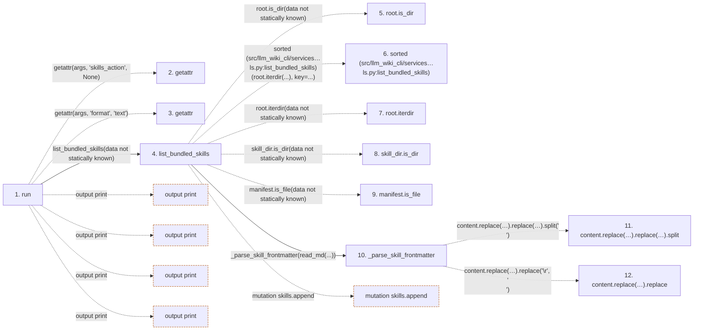

# skills

**Entry point:** `run` (`cli`)
**Source:** [skills_cmd](../modules/skills_cmd.md)
**Modules touched:** [config](../modules/config.md), [io](../modules/io.md), [skills](../modules/skills.md), [skills_cmd](../modules/skills_cmd.md), [validation](../modules/validation.md)

## Call sequence

```mermaid
sequenceDiagram
    participant p0 as run
    participant p1 as getattr
    participant p2 as list_bundled_skills
    participant p3 as root.is_dir
    participant p4 as sorted (src/llm_wiki_cli/services…ls.py:list_bundled_skills)
    participant p5 as root.iterdir
    participant p6 as skill_dir.is_dir
    participant p7 as manifest.is_file
    participant p8 as _parse_skill_frontmatter
    participant p9 as content.replace(…).replace(…).split
    participant p10 as content.replace(…).replace
    participant p11 as content.replace
    participant p12 as lines[…].strip
    participant p13 as line.strip
    participant p14 as line.partition
    participant p15 as key.strip
    participant p16 as value.strip
    participant p17 as read_md
    participant p18 as path.read_bytes
    participant p19 as data.decode
    participant p20 as text.replace(…).replace (src/llm_wiki_cli/services/io.py:read_md)
    participant p21 as text.replace (src/llm_wiki_cli/services/io.py:read_md)
    participant p22 as skills.append
    participant p23 as BundledSkill
    participant p24 as _skill_files
    participant p25 as path.relative_to(…).as_posix
    participant p26 as path.relative_to (src/llm_wiki_cli/services/skills.py:_skill_files)
    p0-->>p1: getattr
    p0-->>p1: getattr
    p0->>p2: list_bundled_skills
    p2-->>p3: root.is_dir
    p2-->>p4: sorted (src/llm_wiki_cli/services…ls.py:list_bundled_skills)
    p2-->>p5: root.iterdir
    p2-->>p6: skill_dir.is_dir
    p2-->>p7: manifest.is_file
    p2->>p8: _parse_skill_frontmatter
    p8-->>p9: content.replace(…).replace(…).split
    p8-->>p10: content.replace(…).replace
    p8-->>p11: content.replace
    p8-->>p12: lines[…].strip
    p8-->>p13: line.strip
    p8-->>p14: line.partition
    p8-->>p15: key.strip
    p8-->>p16: value.strip
    p8-->>p15: key.strip
    p8-->>p16: value.strip
    p2->>p17: read_md
    p17-->>p18: path.read_bytes
    p17-->>p19: data.decode
    p17-->>p19: data.decode
    p17-->>p20: text.replace(…).replace (src/llm_wiki_cli/services/io.py:read_md)
    p17-->>p21: text.replace (src/llm_wiki_cli/services/io.py:read_md)
    p2-->>p22: skills.append
    p2->>p23: BundledSkill
    p2->>p24: _skill_files
    p24-->>p25: path.relative_to(…).as_posix
    p24-->>p26: path.relative_to (src/llm_wiki_cli/services/skills.py:_skill_files)
```

<!-- Auto-generated from static call edges. Dashed arrows are external or unresolved calls. Reviewed runtime conditions and side effects belong in Behavior. -->

> Call sequence diagram shows 30 of 289 interactions; 259 omitted to keep the visualization within the 30-interaction and generated-diagram limits.

> Trace truncated at the depth limit; deeper calls are omitted.

## Data flow

<!-- Auto-generated static analysis. Treat values and boundaries as best-effort hints, not runtime proof. -->

### Step data

| Step | Inputs | Reads | Writes | Returns |
|---|---|---|---|---|
| `run` | `args` | `SkillsError`, `sys`, `sys` | - | `none`, `none`, `none` |
| `getattr` | - | - | - | - |
| `getattr` | - | - | - | - |
| `list_bundled_skills` | `skills_root: Path \| None` | `BUNDLED_SKILLS_ROOT`, `SKILL_MANIFEST_NAME` | - | `[...]`, `skills` |
| `root.is_dir` | - | - | - | - |
| `sorted (src/llm_wiki_cli/services…ls.py:list_bundled_skills)` | - | - | - | - |
| `root.iterdir` | - | - | - | - |
| `skill_dir.is_dir` | - | - | - | - |
| `manifest.is_file` | - | - | - | - |
| `_parse_skill_frontmatter` | `content: str` | - | - | `(...)`, `(...)` |
| `content.replace(…).replace(…).split` | - | - | - | - |
| `content.replace(…).replace` | - | - | - | - |

### Call data

| From | To | Line | Call |
|---|---|---:|---|
| run | getattr | 46 | `getattr(args, 'skills_action', None)` |
| run | getattr | 47 | `getattr(args, 'format', 'text')` |
| run | list_bundled_skills | 51 | `list_bundled_skills(data not statically known)` |
| list_bundled_skills | root.is_dir | 266 | `root.is_dir(data not statically known)` |
| list_bundled_skills | sorted (src/llm_wiki_cli/services…ls.py:list_bundled_skills) | 270 | `sorted(root.iterdir(...), key=...)` |
| list_bundled_skills | root.iterdir | 270 | `root.iterdir(data not statically known)` |
| list_bundled_skills | skill_dir.is_dir | 272 | `skill_dir.is_dir(data not statically known)` |
| list_bundled_skills | manifest.is_file | 272 | `manifest.is_file(data not statically known)` |
| list_bundled_skills | _parse_skill_frontmatter | 274 | `_parse_skill_frontmatter(read_md(...))` |
| _parse_skill_frontmatter | content.replace(…).replace(…).split | 1343 | `content.replace('\r\n', '\n').replace('\r', '\n').split('\n')` |
| _parse_skill_frontmatter | content.replace(…).replace | 1343 | `content.replace('\r\n', '\n').replace('\r', '\n')` |

### Boundary effects

| Kind | Target | Step | Line |
|---|---|---|---:|
| output | `print` | `run` | 53 |
| output | `print` | `run` | 55 |
| output | `print` | `run` | 83 |
| output | `print` | `run` | 86 |
| mutation | `skills.append` | `list_bundled_skills` | 275 |

### Static analysis gaps

| Kind | Step | Target | Line |
|---|---|---|---:|
| external_call | `run` | `getattr` | 46 |
| external_call | `run` | `getattr` | 47 |
| unresolved_call | `list_bundled_skills` | `root.is_dir` | 266 |
| external_call | `list_bundled_skills` | `sorted` | 270 |
| unresolved_call | `list_bundled_skills` | `root.iterdir` | 270 |
| unresolved_call | `list_bundled_skills` | `skill_dir.is_dir` | 272 |
| unresolved_call | `list_bundled_skills` | `manifest.is_file` | 272 |
| unresolved_call | `_parse_skill_frontmatter` | `content.replace('\r\n', '\n').replace('\r', '\n').split` | 1343 |
| unresolved_call | `_parse_skill_frontmatter` | `content.replace('\r\n', '\n').replace` | 1343 |
| step_limit | `run` | `first 12 steps` | 0 |
| truncated_flow | `run` | `depth limit` | 0 |

## Behavior

This flow starts at `run` and is classified as `cli`. The generated call and data-flow sections are bounded static projections; runtime conditions and side effects require source-level confirmation.
