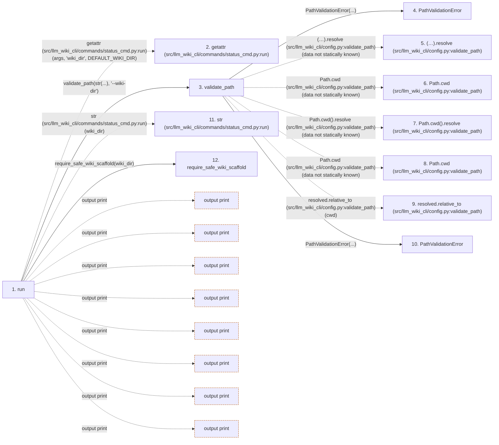

# status

**Entry point:** `run` (`cli`)
**Source:** [status_cmd](../modules/status_cmd.md)
**Modules touched:** [circuit_breaker](../modules/circuit_breaker.md), [common](../modules/common.md), [config](../modules/config.md), [filesystem_guard](../modules/filesystem_guard.md), and 28 more

**Complete modules touched:**

- [circuit_breaker](../modules/circuit_breaker.md)
- [common](../modules/common.md)
- [config](../modules/config.md)
- [filesystem_guard](../modules/filesystem_guard.md)
- [immutable](../modules/immutable.md)
- [io](../modules/io.md)
- [knowledge_artifacts](../modules/knowledge_artifacts.md)
- [knowledge_consumption](../modules/knowledge_consumption.md)
- [knowledge_envelope](../modules/knowledge_envelope.md)
- [knowledge_evidence](../modules/knowledge_evidence.md)
- [knowledge_freshness](../modules/knowledge_freshness.md)
- [knowledge_governance](../modules/knowledge_governance.md)
- [knowledge_graph](../modules/knowledge_graph.md)
- [knowledge_index](../modules/knowledge_index.md)
- [knowledge_loader](../modules/knowledge_loader.md)
- [knowledge_observability](../modules/knowledge_observability.md)
- [knowledge_reuse](../modules/knowledge_reuse.md)
- [legacy_hooks](../modules/legacy_hooks.md)
- [paths](../modules/paths.md)
- [rendering_lifecycle](../modules/rendering_lifecycle.md)
- [section_ownership](../modules/section_ownership.md)
- [services_schema](../modules/services_schema.md)
- [skills](../modules/skills.md)
- [source_selection](../modules/source_selection.md)
- [source_snapshot](../modules/source_snapshot.md)
- [status_cmd](../modules/status_cmd.md)
- [sync_manifest](../modules/sync_manifest.md)
- [validation](../modules/validation.md)
- [wiki_lifecycle](../modules/wiki_lifecycle.md)
- [wiki_media](../modules/wiki_media.md)
- [wiki_surface](../modules/wiki_surface.md)
- [wiki_surface_index](../modules/wiki_surface_index.md)

## Call sequence

```mermaid
sequenceDiagram
    participant p0 as run
    participant p1 as getattr (src/llm_wiki_cli/commands/status_cmd.py:run)
    participant p2 as validate_path
    participant p3 as PathValidationError
    participant p4 as (…).resolve (src/llm_wiki_cli/config.py:validate_path)
    participant p5 as Path.cwd (src/llm_wiki_cli/config.py:validate_path)
    participant p6 as Path.cwd().resolve (src/llm_wiki_cli/config.py:validate_path)
    participant p7 as resolved.relative_to (src/llm_wiki_cli/config.py:validate_path)
    participant p8 as str (src/llm_wiki_cli/commands/status_cmd.py:run)
    participant p9 as require_safe_wiki_scaffold
    participant p10 as Path (src/llm_wiki_cli/services…equire_safe_wiki_scaffold)
    participant p11 as tuple (src/llm_wiki_cli/services…equire_safe_wiki_scaffold)
    participant p12 as iter_directory_kinds
    participant p13 as tuple (src/llm_wiki_cli/services…e.py:iter_directory_kinds)
    participant p14 as first_unsafe_path_component
    participant p15 as Path (src/llm_wiki_cli/services…rst_unsafe_path_component)
    participant p16 as os.fspath (src/llm_wiki_cli/services…rst_unsafe_path_component)
    participant p17 as os.path.abspath (src/llm_wiki_cli/services…rst_unsafe_path_component)
    participant p18 as lexical.is_absolute
    participant p19 as Path.cwd (src/llm_wiki_cli/services…rst_unsafe_path_component)
    participant p20 as list (src/llm_wiki_cli/services…rst_unsafe_path_component)
    participant p21 as pending_parts.pop
    participant p22 as current.lstat (src/llm_wiki_cli/services…rst_unsafe_path_component)
    participant p23 as getattr (src/llm_wiki_cli/services…rst_unsafe_path_component)
    participant p24 as stat.S_ISLNK (src/llm_wiki_cli/services…rst_unsafe_path_component)
    p0-->>p1: getattr (src/llm_wiki_cli/commands/status_cmd.py:run)
    p0->>p2: validate_path
    p2->>p3: PathValidationError
    p2-->>p4: (…).resolve (src/llm_wiki_cli/config.py:validate_path)
    p2-->>p5: Path.cwd (src/llm_wiki_cli/config.py:validate_path)
    p2-->>p6: Path.cwd().resolve (src/llm_wiki_cli/config.py:validate_path)
    p2-->>p5: Path.cwd (src/llm_wiki_cli/config.py:validate_path)
    p2-->>p7: resolved.relative_to (src/llm_wiki_cli/config.py:validate_path)
    p2->>p3: PathValidationError
    p0-->>p8: str (src/llm_wiki_cli/commands/status_cmd.py:run)
    p0->>p9: require_safe_wiki_scaffold
    p9-->>p10: Path (src/llm_wiki_cli/services…equire_safe_wiki_scaffold)
    p9-->>p11: tuple (src/llm_wiki_cli/services…equire_safe_wiki_scaffold)
    p9->>p12: iter_directory_kinds
    p12-->>p13: tuple (src/llm_wiki_cli/services…e.py:iter_directory_kinds)
    p9-->>p11: tuple (src/llm_wiki_cli/services…equire_safe_wiki_scaffold)
    p9->>p14: first_unsafe_path_component
    p14-->>p15: Path (src/llm_wiki_cli/services…rst_unsafe_path_component)
    p14-->>p16: os.fspath (src/llm_wiki_cli/services…rst_unsafe_path_component)
    p14-->>p15: Path (src/llm_wiki_cli/services…rst_unsafe_path_component)
    p14-->>p17: os.path.abspath (src/llm_wiki_cli/services…rst_unsafe_path_component)
    p14-->>p18: lexical.is_absolute
    p14-->>p19: Path.cwd (src/llm_wiki_cli/services…rst_unsafe_path_component)
    p14-->>p15: Path (src/llm_wiki_cli/services…rst_unsafe_path_component)
    p14-->>p20: list (src/llm_wiki_cli/services…rst_unsafe_path_component)
    p14-->>p21: pending_parts.pop
    p14-->>p22: current.lstat (src/llm_wiki_cli/services…rst_unsafe_path_component)
    p14-->>p23: getattr (src/llm_wiki_cli/services…rst_unsafe_path_component)
    p14-->>p23: getattr (src/llm_wiki_cli/services…rst_unsafe_path_component)
    p14-->>p24: stat.S_ISLNK (src/llm_wiki_cli/services…rst_unsafe_path_component)
```

<!-- Auto-generated from static call edges. Dashed arrows are external or unresolved calls. Reviewed runtime conditions and side effects belong in Behavior. -->

> Call sequence diagram shows 30 of 1837 interactions; 1807 omitted to keep the visualization within the 30-interaction and generated-diagram limits.

> Trace truncated at the depth limit; deeper calls are omitted.

## Data flow

<!-- Auto-generated static analysis. Treat values and boundaries as best-effort hints, not runtime proof. -->

### Step data

| Step | Inputs | Reads | Writes | Returns |
|---|---|---|---|---|
| `run` | `args` | `DEFAULT_WIKI_DIR`, `WikiScaffoldPathError`, `AgentConfigState`, `IDE_AGENTS`, `AgentConfigState`, `LegacyHookError` | - | `none` |
| `getattr (src/llm_wiki_cli/commands/status_cmd.py:run)` | - | - | - | - |
| `validate_path` | `path: str`, `label: str` | - | - | `resolved` |
| `PathValidationError` | - | - | - | - |
| `(…).resolve (src/llm_wiki_cli/config.py:validate_path)` | - | - | - | - |
| `Path.cwd (src/llm_wiki_cli/config.py:validate_path)` | - | - | - | - |
| `Path.cwd().resolve (src/llm_wiki_cli/config.py:validate_path)` | - | - | - | - |
| `Path.cwd (src/llm_wiki_cli/config.py:validate_path)` | - | - | - | - |
| `resolved.relative_to (src/llm_wiki_cli/config.py:validate_path)` | - | - | - | - |
| `PathValidationError` | - | - | - | - |
| `str (src/llm_wiki_cli/commands/status_cmd.py:run)` | - | - | - | - |
| `require_safe_wiki_scaffold` | `wiki_dir: Union[str, Path]` | - | - | - |

### Call data

| From | To | Line | Call |
|---|---|---:|---|
| run | getattr (src/llm_wiki_cli/commands/status_cmd.py:run) | 855 | `getattr(args, 'wiki_dir', DEFAULT_WIKI_DIR)` |
| run | validate_path | 856 | `validate_path(str(...), '--wiki-dir')` |
| validate_path | PathValidationError | 132 | `PathValidationError(...)` |
| validate_path | (…).resolve (src/llm_wiki_cli/config.py:validate_path) | 133 | `(Path.cwd() / path).resolve(data not statically known)` |
| validate_path | Path.cwd (src/llm_wiki_cli/config.py:validate_path) | 133 | `Path.cwd(data not statically known)` |
| validate_path | Path.cwd().resolve (src/llm_wiki_cli/config.py:validate_path) | 134 | `Path.cwd().resolve(data not statically known)` |
| validate_path | Path.cwd (src/llm_wiki_cli/config.py:validate_path) | 134 | `Path.cwd(data not statically known)` |
| validate_path | resolved.relative_to (src/llm_wiki_cli/config.py:validate_path) | 136 | `resolved.relative_to(cwd)` |
| validate_path | PathValidationError | 138 | `PathValidationError(...)` |
| run | str (src/llm_wiki_cli/commands/status_cmd.py:run) | 856 | `str(wiki_dir)` |
| run | require_safe_wiki_scaffold | 858 | `require_safe_wiki_scaffold(wiki_dir)` |

### Boundary effects

| Kind | Target | Step | Line |
|---|---|---|---:|
| output | `print` | `run` | 874 |
| output | `print` | `run` | 875 |
| output | `print` | `run` | 879 |
| output | `print` | `run` | 884 |
| output | `print` | `run` | 888 |
| output | `print` | `run` | 889 |
| output | `print` | `run` | 891 |
| output | `print` | `run` | 894 |

### Static analysis gaps

| Kind | Step | Target | Line |
|---|---|---|---:|
| external_call | `run` | `getattr` | 855 |
| unresolved_call | `validate_path` | `(Path.cwd() / path).resolve` | 133 |
| external_call | `validate_path` | `Path.cwd` | 133 |
| unresolved_call | `validate_path` | `Path.cwd().resolve` | 134 |
| external_call | `validate_path` | `Path.cwd` | 134 |
| unresolved_call | `validate_path` | `resolved.relative_to` | 136 |
| step_limit | `run` | `first 12 steps` | 0 |
| truncated_flow | `run` | `depth limit` | 0 |

## Behavior

This flow starts at `run` and is classified as `cli`. The generated call and data-flow sections are bounded static projections; runtime conditions and side effects require source-level confirmation.
