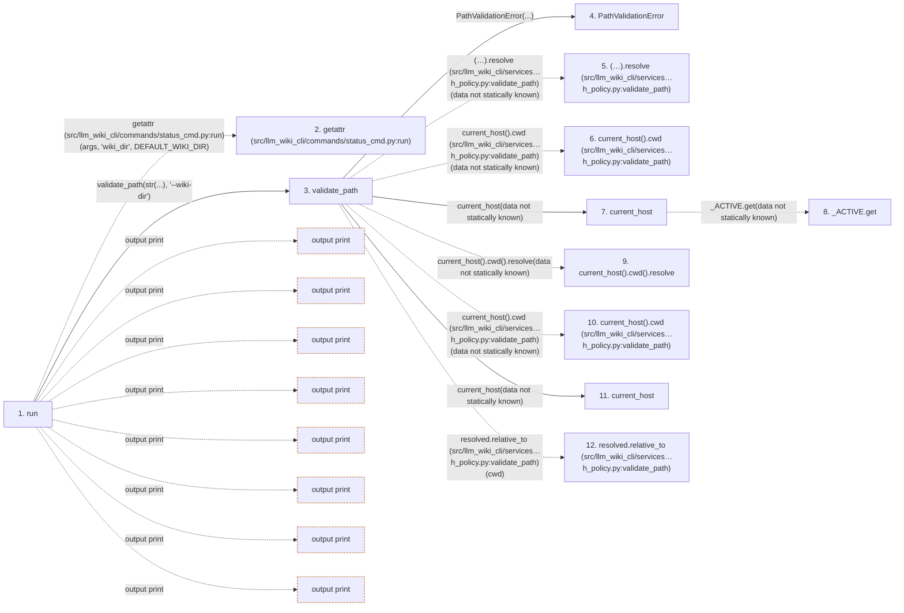

# status

**Entry point:** `run` (`cli`)
**Source:** [status_cmd](../modules/status_cmd.md)
**Modules touched:** [bootstrap_recovery](../modules/bootstrap_recovery.md), [canonical_json](../modules/canonical_json.md), [circuit_breaker](../modules/circuit_breaker.md), [common](../modules/common.md), and 39 more

**Complete modules touched:**

- [bootstrap_recovery](../modules/bootstrap_recovery.md)
- [canonical_json](../modules/canonical_json.md)
- [circuit_breaker](../modules/circuit_breaker.md)
- [common](../modules/common.md)
- [config](../modules/config.md)
- [domain_pack](../modules/domain_pack.md)
- [filesystem_guard](../modules/filesystem_guard.md)
- [gitignore](../modules/gitignore.md)
- [host](../modules/host.md)
- [immutable](../modules/immutable.md)
- [implementation_evidence](../modules/implementation_evidence.md)
- [io](../modules/io.md)
- [knowledge_artifacts](../modules/knowledge_artifacts.md)
- [knowledge_consumption](../modules/knowledge_consumption.md)
- [knowledge_envelope](../modules/knowledge_envelope.md)
- [knowledge_freshness](../modules/knowledge_freshness.md)
- [knowledge_governance](../modules/knowledge_governance.md)
- [knowledge_index](../modules/knowledge_index.md)
- [knowledge_loader](../modules/knowledge_loader.md)
- [knowledge_observability](../modules/knowledge_observability.md)
- [knowledge_packs](../modules/knowledge_packs.md)
- [knowledge_storage](../modules/knowledge_storage.md)
- [knowledge_storage_io](../modules/knowledge_storage_io.md)
- [legacy_hooks](../modules/legacy_hooks.md)
- [maintenance_protocol](../modules/maintenance_protocol.md)
- [maintenance_state](../modules/maintenance_state.md)
- [maintenance_status](../modules/maintenance_status.md)
- [manifest_storage](../modules/manifest_storage.md)
- [path_policy](../modules/path_policy.md)
- [paths](../modules/paths.md)
- [rendering_lifecycle](../modules/rendering_lifecycle.md)
- [services_schema](../modules/services_schema.md)
- [skills](../modules/skills.md)
- [source_retirement](../modules/source_retirement.md)
- [source_selection](../modules/source_selection.md)
- [source_snapshot](../modules/source_snapshot.md)
- [status_cmd](../modules/status_cmd.md)
- [sync_manifest](../modules/sync_manifest.md)
- [validation](../modules/validation.md)
- [wiki_lifecycle](../modules/wiki_lifecycle.md)
- [wiki_media](../modules/wiki_media.md)
- [wiki_surface](../modules/wiki_surface.md)
- [wiki_surface_index](../modules/wiki_surface_index.md)

## Call sequence

> Static overview in presentation order, not runtime execution order. Arrows retain captured callers; representative internal continuations and boundary examples precede repeated helper detail.

<!-- Auto-generated from static call edges. Dashed arrows are external or unresolved calls. Reviewed runtime conditions and side effects belong in Behavior. -->

```mermaid
sequenceDiagram
    participant p0 as run
    participant p1 as validate_path
    participant p2 as require_safe_wiki_scaffold
    participant p3 as validate_source_root
    participant p4 as display_project_path
    participant p5 as _count_surface_pages
    participant p6 as _architecture_page_count
    participant p7 as _print_knowledge_status
    participant p8 as inspect_config
    participant p9 as _print_managed_lifecycle
    participant p10 as inspect_legacy_hooks
    participant p11 as load_state
    participant p12 as breaker_ttl_seconds
    participant p13 as iter_page_kinds
    participant p14 as _status_label
    participant p15 as _configured_agent
    participant p16 as shell_quote
    participant p17 as first_unsafe_path_component
    participant p18 as load_snapshot_knowledge_observability
    participant p19 as _hook_directories
    participant p20 as knowledge_status_payload
    participant p21 as _diagnostic_schema_target
    participant p22 as canonical_path
    participant p23 as verify_reference_skill
    participant p24 as classify_lifecycle_status
    participant p25 as windows_current_user_sid
    participant p26 as inspect_config_path
    participant p27 as is_managed_hook_content
    participant p28 as _print_reference_summary
    participant p29 as getattr (src/llm_wiki_cli/commands/status_cmd.py:run)
    participant p30 as wiki_path.exists
    p0->>p1: validate_path
    p0->>p2: require_safe_wiki_scaffold
    p0->>p3: validate_source_root
    p0->>p4: display_project_path
    p0->>p5: _count_surface_pages
    p0->>p6: _architecture_page_count
    p0->>p7: _print_knowledge_status
    p0->>p8: inspect_config
    p0->>p9: _print_managed_lifecycle
    p0->>p10: inspect_legacy_hooks
    p0->>p11: load_state
    p0->>p12: breaker_ttl_seconds
    p0->>p13: iter_page_kinds
    p0->>p14: _status_label
    p0->>p15: _configured_agent
    p0->>p16: shell_quote
    p0->>p17: first_unsafe_path_component
    p7->>p18: load_snapshot_knowledge_observability
    p10->>p19: _hook_directories
    p7->>p20: knowledge_status_payload
    p9->>p21: _diagnostic_schema_target
    p5->>p22: canonical_path
    p9->>p23: verify_reference_skill
    p9->>p24: classify_lifecycle_status
    p3->>p25: windows_current_user_sid
    p8->>p26: inspect_config_path
    p10->>p27: is_managed_hook_content
    p9->>p28: _print_reference_summary
    p0-->>p29: getattr (src/llm_wiki_cli/commands/status_cmd.py:run)(args, 'wiki_dir', DEFAULT_WIKI_DIR)
    p0-->>p30: wiki_path.exists
```

> Call sequence diagram shows 30 of 2083 interactions; 2053 omitted to keep the visualization within the 30-interaction and generated-diagram limits, with uncertain identities omitted rather than inferred.

> Captured boundary calls: external 1 of 703 (702 omitted); unresolved 1 of 530 (529 omitted). These counts cover the captured static trace.

Omitted captured detail, grouped by actual caller occurrence and target module:

| Caller | Parent step | Target module | Kind | Omitted interactions |
| --- | --- | --- | --- | --- |
| `src/llm_wiki_cli/services/path_policy.py:validate_path` | 3 | [src/llm_wiki_cli/services/path_policy.py](../modules/path_policy.md) | internal | 2 |
| `src/llm_wiki_cli/services/path_policy.py:validate_path` | 3 | - | unresolved | 5 |
| `src/llm_wiki_cli/services/path_policy.py:validate_path` | 3 | [src/llm_wiki_cli/services/host.py](../modules/host.md) | internal | 2 |
| `src/llm_wiki_cli/services/host.py:current_host` | 7 | - | unresolved | 1 |
| `src/llm_wiki_cli/commands/status_cmd.py:run` | 1 | - | external | 43 |
| `src/llm_wiki_cli/services/wiki_lifecycle.py:require_safe_wiki_scaffold` | 15 | - | external | 3 |
| `src/llm_wiki_cli/services/wiki_lifecycle.py:require_safe_wiki_scaffold` | 15 | [src/llm_wiki_cli/services/wiki_surface.py](../modules/wiki_surface.md) | internal | 1 |
| `src/llm_wiki_cli/services/wiki_surface.py:iter_directory_kinds` | 18 | - | external | 1 |
> Omission summary shows 8 of 539 groups; 531 further groups are not expanded here. Counts above include all omitted interactions.
> Detailed flow queries retain their own coverage and limits; omitted paths may execute at runtime.

> Trace truncated at the depth limit; deeper calls are omitted.

## Data flow

<!-- Auto-generated static analysis. Treat values and boundaries as best-effort hints, not runtime proof. -->

### Analysis coverage

**Effect analysis partially available.** Flow assembly and source effect analysis are separate; empty observations do not prove an empty handler body.

Source steps: 851; effect analysis evaluated: 519, partial: 42, unavailable: 290. Counts include steps omitted from the displayed trace.

Collector observations for 561 source steps with known totals: observed: 3747, emitted: 3387, omitted: 360. Unavailable totals are excluded.

- Callable record unavailable for one or more source steps; those steps have no represented callable body.
- Effect collector omitted observations before flow assembly; displayed effects are partial.
- Effect collector totals unavailable; observed counts cover captured records only.

| Step | Callable record | Effect analysis | Collector totals | Observed | Emitted | Omitted |
|---|---|---|---|---:|---:|---:|
| `run` | `available` | `partial` | `available` | `43` | `16` | `27` |
| `getattr (src/llm_wiki_cli/commands/status_cmd.py:run)` | `not_applicable` | `not_applicable` | `not_applicable` | — | — | — |
| `validate_path` | `available` | `evaluated` | `available` | `3` | `3` | `0` |
| `PathValidationError` | `unavailable` | `unavailable` | `unavailable` | — | — | — |
| `(…).resolve (src/llm_wiki_cli/services…h_policy.py:validate_path)` | `not_applicable` | `not_applicable` | `not_applicable` | — | — | — |
| `current_host().cwd (src/llm_wiki_cli/services…h_policy.py:validate_path)` | `not_applicable` | `not_applicable` | `not_applicable` | — | — | — |
| `current_host` | `available` | `evaluated` | `available` | `2` | `2` | `0` |
| `_ACTIVE.get` | `not_applicable` | `not_applicable` | `not_applicable` | — | — | — |
| `current_host().cwd().resolve` | `not_applicable` | `not_applicable` | `not_applicable` | — | — | — |
| `current_host().cwd (src/llm_wiki_cli/services…h_policy.py:validate_path)` | `not_applicable` | `not_applicable` | `not_applicable` | — | — | — |
| `current_host` | `available` | `evaluated` | `available` | `2` | `2` | `0` |
| `resolved.relative_to (src/llm_wiki_cli/services…h_policy.py:validate_path)` | `not_applicable` | `not_applicable` | `not_applicable` | — | — | — |

```mermaid
flowchart LR
    s1["1. run"]
    s2["2. getattr (src/llm_wiki_cli/commands/status_cmd.py:run)"]
    s3["3. validate_path"]
    s4["4. PathValidationError"]
    s5["5. (…).resolve (src/llm_wiki_cli/services…h_policy.py:validate_path)"]
    s6["6. current_host().cwd (src/llm_wiki_cli/services…h_policy.py:validate_path)"]
    s7["7. current_host"]
    s8["8. _ACTIVE.get"]
    s9["9. current_host().cwd().resolve"]
    s10["10. current_host().cwd (src/llm_wiki_cli/services…h_policy.py:validate_path)"]
    s11["11. current_host"]
    s12["12. resolved.relative_to (src/llm_wiki_cli/services…h_policy.py:validate_path)"]
    s1 -. "getattr (src/llm_wiki_cli/commands/status_cmd.py:run)(args, 'wiki_dir', DEFAULT_WIKI_DIR)" .-> s2
    s1 -->|"validate_path(str(...), '--wiki-dir')"| s3
    s3 -->|"PathValidationError(...)"| s4
    s3 -. "(…).resolve (src/llm_wiki_cli/services…h_policy.py:validate_path)(data not statically known)" .-> s5
    s3 -. "current_host().cwd (src/llm_wiki_cli/services…h_policy.py:validate_path)(data not statically known)" .-> s6
    s3 -->|"current_host(data not statically known)"| s7
    s7 -. "_ACTIVE.get(data not statically known)" .-> s8
    s3 -. "current_host().cwd().resolve(data not statically known)" .-> s9
    s3 -. "current_host().cwd (src/llm_wiki_cli/services…h_policy.py:validate_path)(data not statically known)" .-> s10
    s3 -->|"current_host(data not statically known)"| s11
    s3 -. "resolved.relative_to (src/llm_wiki_cli/services…h_policy.py:validate_path)(cwd)" .-> s12
    b0["output print"]
    s1 -. "output print" .-> b0
    b1["output print"]
    s1 -. "output print" .-> b1
    b2["output print"]
    s1 -. "output print" .-> b2
    b3["output print"]
    s1 -. "output print" .-> b3
    b4["output print"]
    s1 -. "output print" .-> b4
    b5["output print"]
    s1 -. "output print" .-> b5
    b6["output print"]
    s1 -. "output print" .-> b6
    b7["output print"]
    s1 -. "output print" .-> b7
    click s1 "../modules/status_cmd.md"
    click s3 "../modules/path_policy.md"
    click s4 "../modules/path_policy.md"
    click s7 "../modules/host.md"
    click s11 "../modules/host.md"
    classDef boundary stroke:#b45309,stroke-dasharray: 4 2
    class b0 boundary
    class b1 boundary
    class b2 boundary
    class b3 boundary
    class b4 boundary
    class b5 boundary
    class b6 boundary
    class b7 boundary
```

### Step data

| Step | Inputs | Reads | Writes | Returns |
|---|---|---|---|---|
| `run` | `args` | `DEFAULT_WIKI_DIR`, `WikiScaffoldPathError`, `AgentConfigState`, `IDE_AGENTS`, `AgentConfigState`, `LegacyHookError` | - | `none` |
| `getattr (src/llm_wiki_cli/commands/status_cmd.py:run)` | - | - | - | - |
| `validate_path` | `path: str`, `label: str` | - | - | `resolved` |
| `PathValidationError` | - | - | - | - |
| `(…).resolve (src/llm_wiki_cli/services…h_policy.py:validate_path)` | - | - | - | - |
| `current_host().cwd (src/llm_wiki_cli/services…h_policy.py:validate_path)` | - | - | - | - |
| `current_host` | - | `_DEFAULT` | - | `...` |
| `_ACTIVE.get` | - | - | - | - |
| `current_host().cwd().resolve` | - | - | - | - |
| `current_host().cwd (src/llm_wiki_cli/services…h_policy.py:validate_path)` | - | - | - | - |
| `current_host` | - | `_DEFAULT` | - | `...` |
| `resolved.relative_to (src/llm_wiki_cli/services…h_policy.py:validate_path)` | - | - | - | - |

### Call data

| From | To | Line | Call |
|---|---|---:|---|
| run | getattr (src/llm_wiki_cli/commands/status_cmd.py:run) | 855 | `getattr(args, 'wiki_dir', DEFAULT_WIKI_DIR)` |
| run | validate_path | 856 | `validate_path(str(...), '--wiki-dir')` |
| validate_path | PathValidationError | 100 | `PathValidationError(...)` |
| validate_path | (…).resolve (src/llm_wiki_cli/services…h_policy.py:validate_path) | 101 | `(current_host().cwd() / path).resolve(data not statically known)` |
| validate_path | current_host().cwd (src/llm_wiki_cli/services…h_policy.py:validate_path) | 101 | `current_host().cwd(data not statically known)` |
| validate_path | current_host | 101 | `current_host(data not statically known)` |
| current_host | _ACTIVE.get | 166 | `_ACTIVE.get(data not statically known)` |
| validate_path | current_host().cwd().resolve | 102 | `current_host().cwd().resolve(data not statically known)` |
| validate_path | current_host().cwd (src/llm_wiki_cli/services…h_policy.py:validate_path) | 102 | `current_host().cwd(data not statically known)` |
| validate_path | current_host | 102 | `current_host(data not statically known)` |
| validate_path | resolved.relative_to (src/llm_wiki_cli/services…h_policy.py:validate_path) | 104 | `resolved.relative_to(cwd)` |

### Boundary effects

| Kind | Target | Step | Line |
|---|---|---|---:|
| output | `print` | `run` | 874 |
| output | `print` | `run` | 875 |
| output | `print` | `run` | 879 |
| output | `print` | `run` | 884 |
| output | `print` | `run` | 888 |
| output | `print` | `run` | 889 |
| output | `print` | `run` | 891 |
| output | `print` | `run` | 894 |

### Static analysis gaps

| Kind | Step | Target | Line |
|---|---|---|---:|
| external_call | `run` | `getattr` | 855 |
| unresolved_call | `validate_path` | `(current_host().cwd() / path).resolve` | 101 |
| unresolved_call | `validate_path` | `current_host().cwd` | 101 |
| unresolved_call | `current_host` | `_ACTIVE.get` | 166 |
| unresolved_call | `validate_path` | `current_host().cwd().resolve` | 102 |
| unresolved_call | `validate_path` | `current_host().cwd` | 102 |
| unresolved_call | `validate_path` | `resolved.relative_to` | 104 |
| step_limit | `run` | `first 12 steps` | 0 |
| truncated_flow | `run` | `depth limit` | 0 |

## Behavior

This flow starts at `run` and is classified as `cli`. The generated call and data-flow sections are bounded static projections; runtime conditions and side effects require source-level confirmation.
