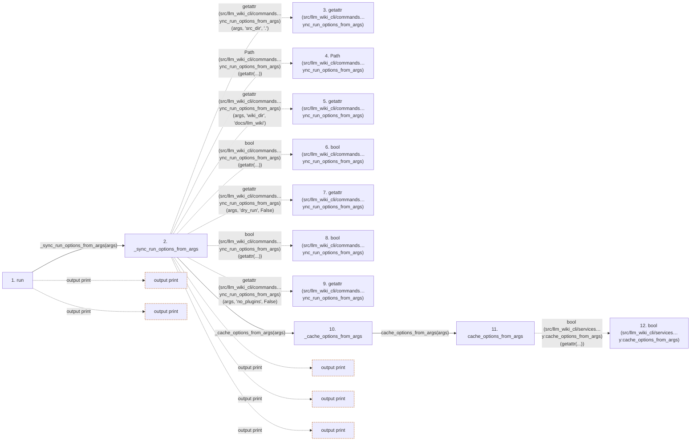

# sync

**Entry point:** `run` (`cli`)
**Source:** [sync_cmd](../modules/sync_cmd.md)
**Modules touched:** [api_contracts](../modules/api_contracts.md), [bootstrap_runtime](../modules/bootstrap_runtime.md), [common](../modules/common.md), [concept_identity](../modules/concept_identity.md), and 47 more

**Complete modules touched:**

- [api_contracts](../modules/api_contracts.md)
- [bootstrap_runtime](../modules/bootstrap_runtime.md)
- [common](../modules/common.md)
- [concept_identity](../modules/concept_identity.md)
- [config](../modules/config.md)
- [data_flow](../modules/data_flow.md)
- [dependency_versions](../modules/dependency_versions.md)
- [entrypoints](../modules/entrypoints.md)
- [extraction_jobs](../modules/extraction_jobs.md)
- [extraction_service](../modules/extraction_service.md)
- [filesystem_guard](../modules/filesystem_guard.md)
- [immutable](../modules/immutable.md)
- [imports](../modules/imports.md)
- [infrastructure_inventory](../modules/infrastructure_inventory.md)
- [infrastructure_sync](../modules/infrastructure_sync.md)
- [inventory_cache](../modules/inventory_cache.md)
- [io](../modules/io.md)
- [knowledge_artifacts](../modules/knowledge_artifacts.md)
- [knowledge_envelope](../modules/knowledge_envelope.md)
- [knowledge_evidence](../modules/knowledge_evidence.md)
- [knowledge_generation](../modules/knowledge_generation.md)
- [knowledge_governance](../modules/knowledge_governance.md)
- [knowledge_graph](../modules/knowledge_graph.md)
- [knowledge_index](../modules/knowledge_index.md)
- [knowledge_model](../modules/knowledge_model.md)
- [knowledge_orchestration](../modules/knowledge_orchestration.md)
- [knowledge_reuse](../modules/knowledge_reuse.md)
- [markdown_sections](../modules/markdown_sections.md)
- [module_maps](../modules/module_maps.md)
- [packages](../modules/packages.md)
- [paths](../modules/paths.md)
- [plugins](../modules/plugins.md)
- [progress](../modules/progress.md)
- [python_calls](../modules/python_calls.md)
- [python_contracts](../modules/python_contracts.md)
- [python_imports](../modules/python_imports.md)
- [python_observations](../modules/python_observations.md)
- [relationships](../modules/relationships.md)
- [runtime_output](../modules/runtime_output.md)
- [section_ownership](../modules/section_ownership.md)
- [services_dependencies](../modules/services_dependencies.md)
- [source_selection](../modules/source_selection.md)
- [source_snapshot](../modules/source_snapshot.md)
- [sync_analysis](../modules/sync_analysis.md)
- [sync_cmd](../modules/sync_cmd.md)
- [sync_manifest](../modules/sync_manifest.md)
- [validation](../modules/validation.md)
- [wiki_lifecycle](../modules/wiki_lifecycle.md)
- [wiki_media](../modules/wiki_media.md)
- [wiki_surface](../modules/wiki_surface.md)
- [wiki_surface_index](../modules/wiki_surface_index.md)

## Call sequence

```mermaid
sequenceDiagram
    participant p0 as run
    participant p1 as _sync_run_options_from_args
    participant p2 as getattr (src/llm_wiki_cli/commands…ync_run_options_from_args)
    participant p3 as Path (src/llm_wiki_cli/commands…ync_run_options_from_args)
    participant p4 as bool (src/llm_wiki_cli/commands…ync_run_options_from_args)
    participant p5 as _cache_options_from_args
    participant p6 as cache_options_from_args
    participant p7 as bool (src/llm_wiki_cli/services…y:cache_options_from_args)
    participant p8 as getattr (src/llm_wiki_cli/services…y:cache_options_from_args)
    participant p9 as str(…).strip (src/llm_wiki_cli/services…y:cache_options_from_args)
    participant p10 as str (src/llm_wiki_cli/services…y:cache_options_from_args)
    participant p11 as RuntimeOutputError
    participant p12 as InventoryCacheOptions
    participant p13 as extraction_job_request_from_args
    participant p14 as max (src/llm_wiki_cli/services…ion_job_request_from_args)
    participant p15 as int (src/llm_wiki_cli/services…ion_job_request_from_args)
    participant p16 as getattr (src/llm_wiki_cli/services…ion_job_request_from_args)
    p0->>p1: _sync_run_options_from_args
    p1-->>p2: getattr (src/llm_wiki_cli/commands…ync_run_options_from_args)
    p1-->>p3: Path (src/llm_wiki_cli/commands…ync_run_options_from_args)
    p1-->>p2: getattr (src/llm_wiki_cli/commands…ync_run_options_from_args)
    p1-->>p4: bool (src/llm_wiki_cli/commands…ync_run_options_from_args)
    p1-->>p2: getattr (src/llm_wiki_cli/commands…ync_run_options_from_args)
    p1-->>p4: bool (src/llm_wiki_cli/commands…ync_run_options_from_args)
    p1-->>p2: getattr (src/llm_wiki_cli/commands…ync_run_options_from_args)
    p1->>p5: _cache_options_from_args
    p5->>p6: cache_options_from_args
    p6-->>p7: bool (src/llm_wiki_cli/services…y:cache_options_from_args)
    p6-->>p8: getattr (src/llm_wiki_cli/services…y:cache_options_from_args)
    p6-->>p7: bool (src/llm_wiki_cli/services…y:cache_options_from_args)
    p6-->>p8: getattr (src/llm_wiki_cli/services…y:cache_options_from_args)
    p6-->>p8: getattr (src/llm_wiki_cli/services…y:cache_options_from_args)
    p6-->>p9: str(…).strip (src/llm_wiki_cli/services…y:cache_options_from_args)
    p6-->>p10: str (src/llm_wiki_cli/services…y:cache_options_from_args)
    p6->>p11: RuntimeOutputError
    p6->>p11: RuntimeOutputError
    p6->>p12: InventoryCacheOptions
    p6-->>p7: bool (src/llm_wiki_cli/services…y:cache_options_from_args)
    p6-->>p8: getattr (src/llm_wiki_cli/services…y:cache_options_from_args)
    p1->>p12: InventoryCacheOptions
    p1-->>p4: bool (src/llm_wiki_cli/commands…ync_run_options_from_args)
    p1-->>p2: getattr (src/llm_wiki_cli/commands…ync_run_options_from_args)
    p1-->>p2: getattr (src/llm_wiki_cli/commands…ync_run_options_from_args)
    p1->>p13: extraction_job_request_from_args
    p13-->>p14: max (src/llm_wiki_cli/services…ion_job_request_from_args)
    p13-->>p15: int (src/llm_wiki_cli/services…ion_job_request_from_args)
    p13-->>p16: getattr (src/llm_wiki_cli/services…ion_job_request_from_args)
```

<!-- Auto-generated from static call edges. Dashed arrows are external or unresolved calls. Reviewed runtime conditions and side effects belong in Behavior. -->

> Call sequence diagram shows 30 of 6273 interactions; 6243 omitted to keep the visualization within the 30-interaction and generated-diagram limits.

> Trace truncated at the depth limit; deeper calls are omitted.

## Data flow

<!-- Auto-generated static analysis. Treat values and boundaries as best-effort hints, not runtime proof. -->

### Step data

| Step | Inputs | Reads | Writes | Returns |
|---|---|---|---|---|
| `run` | `args` | `ApiContractError`, `GeneratedSurfacePruneError`, `GovernanceError`, `InfrastructureSyncError`, `SyncRuntimeRefreshError`, `sys`, `_ReusedSync`, `options.dry_run` | - | `none`, `none`, `none` |
| `_sync_run_options_from_args` | `args` | `sys`, `sys`, `sys`, `print_extraction_job_plan` | - | `_SyncRunOptions(...)` |
| `getattr (src/llm_wiki_cli/commands…ync_run_options_from_args)` | - | - | - | - |
| `Path (src/llm_wiki_cli/commands…ync_run_options_from_args)` | - | - | - | - |
| `getattr (src/llm_wiki_cli/commands…ync_run_options_from_args)` | - | - | - | - |
| `bool (src/llm_wiki_cli/commands…ync_run_options_from_args)` | - | - | - | - |
| `getattr (src/llm_wiki_cli/commands…ync_run_options_from_args)` | - | - | - | - |
| `bool (src/llm_wiki_cli/commands…ync_run_options_from_args)` | - | - | - | - |
| `getattr (src/llm_wiki_cli/commands…ync_run_options_from_args)` | - | - | - | - |
| `_cache_options_from_args` | `args` | - | - | `cache_options_from_args(...)` |
| `cache_options_from_args` | `args` | `stderr_warning` | - | `InventoryCacheOptions(...)` |
| `bool (src/llm_wiki_cli/services…y:cache_options_from_args)` | - | - | - | - |

### Call data

| From | To | Line | Call |
|---|---|---:|---|
| run | _sync_run_options_from_args | 4648 | `_sync_run_options_from_args(args)` |
| _sync_run_options_from_args | getattr (src/llm_wiki_cli/commands…ync_run_options_from_args) | 2271 | `getattr(args, 'src_dir', '.')` |
| _sync_run_options_from_args | Path (src/llm_wiki_cli/commands…ync_run_options_from_args) | 2272 | `Path(getattr(...))` |
| _sync_run_options_from_args | getattr (src/llm_wiki_cli/commands…ync_run_options_from_args) | 2272 | `getattr(args, 'wiki_dir', 'docs/llm_wiki')` |
| _sync_run_options_from_args | bool (src/llm_wiki_cli/commands…ync_run_options_from_args) | 2273 | `bool(getattr(...))` |
| _sync_run_options_from_args | getattr (src/llm_wiki_cli/commands…ync_run_options_from_args) | 2273 | `getattr(args, 'dry_run', False)` |
| _sync_run_options_from_args | bool (src/llm_wiki_cli/commands…ync_run_options_from_args) | 2274 | `bool(getattr(...))` |
| _sync_run_options_from_args | getattr (src/llm_wiki_cli/commands…ync_run_options_from_args) | 2274 | `getattr(args, 'no_plugins', False)` |
| _sync_run_options_from_args | _cache_options_from_args | 2275 | `_cache_options_from_args(args)` |
| _cache_options_from_args | cache_options_from_args | 275 | `cache_options_from_args(args)` |
| cache_options_from_args | bool (src/llm_wiki_cli/services…y:cache_options_from_args) | 303 | `bool(getattr(...))` |

### Boundary effects

| Kind | Target | Step | Line |
|---|---|---|---:|
| output | `print` | `run` | 4658 |
| output | `print` | `run` | 4664 |
| output | `print` | `_sync_run_options_from_args` | 2292 |
| output | `print` | `_sync_run_options_from_args` | 2298 |
| output | `print` | `_sync_run_options_from_args` | 2304 |

### Static analysis gaps

| Kind | Step | Target | Line |
|---|---|---|---:|
| external_call | `_sync_run_options_from_args` | `getattr` | 2271 |
| external_call | `_sync_run_options_from_args` | `getattr` | 2272 |
| external_call | `_sync_run_options_from_args` | `getattr` | 2273 |
| external_call | `_sync_run_options_from_args` | `getattr` | 2274 |
| step_limit | `run` | `first 12 steps` | 0 |
| truncated_flow | `run` | `depth limit` | 0 |

## Behavior

Classifies the wiki lifecycle, validates the persisted source-selection and
generation policy, captures one live source snapshot, and computes source,
infrastructure, and optional-surface changes. Dry-run prints the complete plan;
broad unforced updates stop before writes. An applied run preserves supported
semantic prose, rebuilds navigation, appends the log, and commits mutually
consistent generated state so repeating the same command converges to no work.
