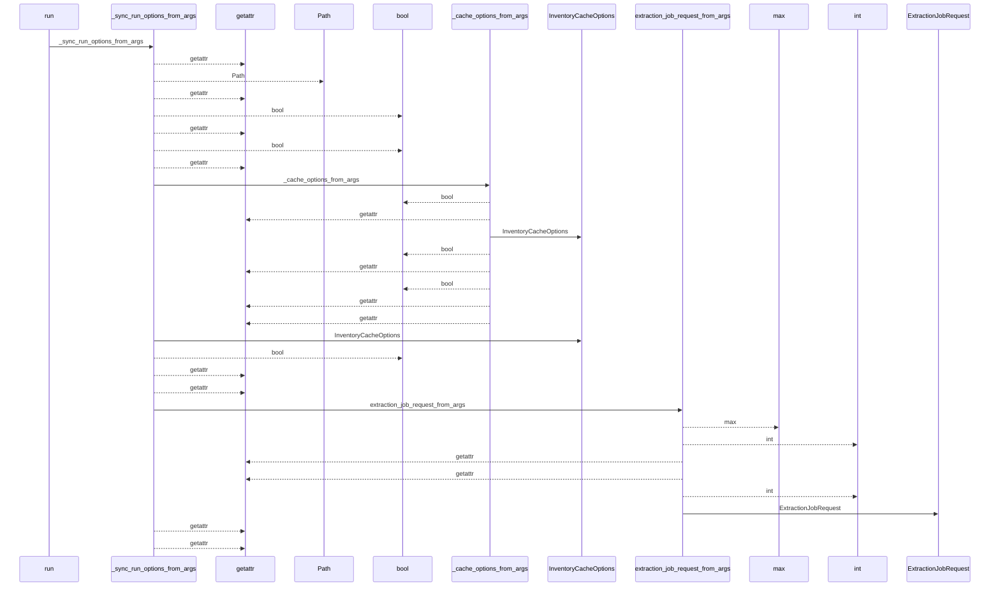
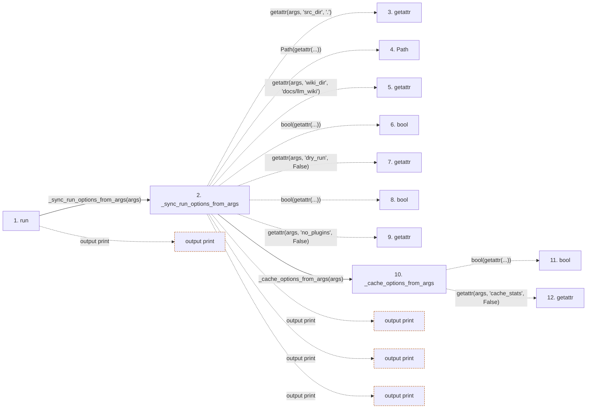

# sync

**Entry point:** `run` (`cli`)
**Source:** [sync_cmd](../modules/sync_cmd.md)
**Modules touched:** [api_contracts](../modules/api_contracts.md), [bootstrap_runtime](../modules/bootstrap_runtime.md), [common](../modules/common.md), [concept_identity](../modules/concept_identity.md), and 39 more

**Complete modules touched:**

- [api_contracts](../modules/api_contracts.md)
- [bootstrap_runtime](../modules/bootstrap_runtime.md)
- [common](../modules/common.md)
- [concept_identity](../modules/concept_identity.md)
- [config](../modules/config.md)
- [data_flow](../modules/data_flow.md)
- [dependency_versions](../modules/dependency_versions.md)
- [entrypoints](../modules/entrypoints.md)
- [extraction_jobs](../modules/extraction_jobs.md)
- [extraction_service](../modules/extraction_service.md)
- [filesystem_guard](../modules/filesystem_guard.md)
- [imports](../modules/imports.md)
- [infrastructure_inventory](../modules/infrastructure_inventory.md)
- [infrastructure_sync](../modules/infrastructure_sync.md)
- [inventory_cache](../modules/inventory_cache.md)
- [io](../modules/io.md)
- [knowledge_artifacts](../modules/knowledge_artifacts.md)
- [knowledge_envelope](../modules/knowledge_envelope.md)
- [knowledge_evidence](../modules/knowledge_evidence.md)
- [knowledge_generation](../modules/knowledge_generation.md)
- [knowledge_governance](../modules/knowledge_governance.md)
- [knowledge_graph](../modules/knowledge_graph.md)
- [knowledge_index](../modules/knowledge_index.md)
- [knowledge_model](../modules/knowledge_model.md)
- [knowledge_orchestration](../modules/knowledge_orchestration.md)
- [markdown_sections](../modules/markdown_sections.md)
- [module_maps](../modules/module_maps.md)
- [packages](../modules/packages.md)
- [paths](../modules/paths.md)
- [plugins](../modules/plugins.md)
- [relationships](../modules/relationships.md)
- [section_ownership](../modules/section_ownership.md)
- [services_dependencies](../modules/services_dependencies.md)
- [source_selection](../modules/source_selection.md)
- [source_snapshot](../modules/source_snapshot.md)
- [sync_analysis](../modules/sync_analysis.md)
- [sync_cmd](../modules/sync_cmd.md)
- [sync_manifest](../modules/sync_manifest.md)
- [validation](../modules/validation.md)
- [wiki_lifecycle](../modules/wiki_lifecycle.md)
- [wiki_media](../modules/wiki_media.md)
- [wiki_surface](../modules/wiki_surface.md)
- [wiki_surface_index](../modules/wiki_surface_index.md)

## Call sequence

<!-- Auto-generated from static call edges. Dashed arrows are external or unresolved calls. Reviewed runtime conditions and side effects belong in Behavior. -->

> Call sequence diagram shows 30 of 5498 interactions; 5468 omitted to keep the visualization within the 30-interaction and generated-diagram limits.

> Trace truncated at the depth limit; deeper calls are omitted.

## Data flow

<!-- Auto-generated static analysis. Treat values and boundaries as best-effort hints, not runtime proof. -->

### Step data

| Step | Inputs | Reads | Writes | Returns |
|---|---|---|---|---|
| `run` | `args` | `ApiContractError`, `GeneratedSurfacePruneError`, `GovernanceError`, `InfrastructureSyncError`, `SyncRuntimeRefreshError`, `sys`, `options.dry_run` | - | `none`, `none` |
| `_sync_run_options_from_args` | `args` | `sys`, `sys`, `sys`, `print_extraction_job_plan` | - | `_SyncRunOptions(...)` |
| `getattr` | - | - | - | - |
| `Path` | - | - | - | - |
| `getattr` | - | - | - | - |
| `bool` | - | - | - | - |
| `getattr` | - | - | - | - |
| `bool` | - | - | - | - |
| `getattr` | - | - | - | - |
| `_cache_options_from_args` | `args` | - | - | `InventoryCacheOptions(...)` |
| `bool` | - | - | - | - |
| `getattr` | - | - | - | - |

### Call data

| From | To | Line | Call |
|---|---|---:|---|
| run | _sync_run_options_from_args | 4464 | `_sync_run_options_from_args(args)` |
| _sync_run_options_from_args | getattr | 2272 | `getattr(args, 'src_dir', '.')` |
| _sync_run_options_from_args | Path | 2273 | `Path(getattr(...))` |
| _sync_run_options_from_args | getattr | 2273 | `getattr(args, 'wiki_dir', 'docs/llm_wiki')` |
| _sync_run_options_from_args | bool | 2274 | `bool(getattr(...))` |
| _sync_run_options_from_args | getattr | 2274 | `getattr(args, 'dry_run', False)` |
| _sync_run_options_from_args | bool | 2275 | `bool(getattr(...))` |
| _sync_run_options_from_args | getattr | 2275 | `getattr(args, 'no_plugins', False)` |
| _sync_run_options_from_args | _cache_options_from_args | 2276 | `_cache_options_from_args(args)` |
| _cache_options_from_args | bool | 264 | `bool(getattr(...))` |
| _cache_options_from_args | getattr | 264 | `getattr(args, 'cache_stats', False)` |

### Boundary effects

| Kind | Target | Step | Line |
|---|---|---|---:|
| output | `print` | `run` | 4474 |
| output | `print` | `_sync_run_options_from_args` | 2293 |
| output | `print` | `_sync_run_options_from_args` | 2299 |
| output | `print` | `_sync_run_options_from_args` | 2305 |

### Static analysis gaps

| Kind | Step | Target | Line |
|---|---|---|---:|
| unresolved_call | `_sync_run_options_from_args` | `getattr` | 2272 |
| unresolved_call | `_sync_run_options_from_args` | `getattr` | 2273 |
| unresolved_call | `_sync_run_options_from_args` | `getattr` | 2274 |
| unresolved_call | `_sync_run_options_from_args` | `getattr` | 2275 |
| unresolved_call | `_cache_options_from_args` | `getattr` | 264 |
| step_limit | `run` | `first 12 steps` | 0 |
| truncated_flow | `run` | `depth limit` | 0 |

## Behavior

Classifies the wiki lifecycle, validates the persisted source-selection and
generation policy, captures one live source snapshot, and computes source,
infrastructure, and optional-surface changes. Dry-run prints the complete plan;
broad unforced updates stop before writes. An applied run preserves supported
semantic prose, rebuilds navigation, appends the log, and commits mutually
consistent generated state so repeating the same command converges to no work.
