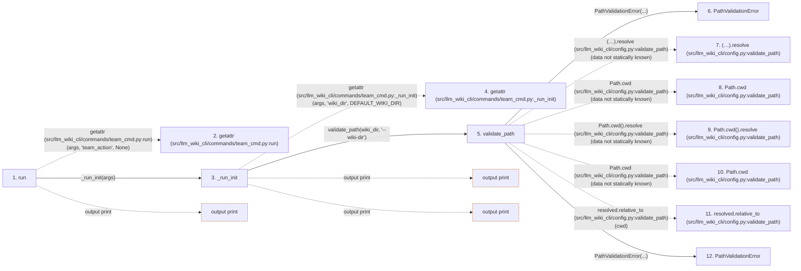

# team

**Entry point:** `run` (`cli`)
**Source:** [team_cmd](../modules/team_cmd.md)
**Modules touched:** [bootstrap_runtime](../modules/bootstrap_runtime.md), [canonical_pages](../modules/canonical_pages.md), [common](../modules/common.md), [config](../modules/config.md), and 24 more

**Complete modules touched:**

- [bootstrap_runtime](../modules/bootstrap_runtime.md)
- [canonical_pages](../modules/canonical_pages.md)
- [common](../modules/common.md)
- [config](../modules/config.md)
- [data_flow](../modules/data_flow.md)
- [extraction_jobs](../modules/extraction_jobs.md)
- [extraction_service](../modules/extraction_service.md)
- [filesystem_guard](../modules/filesystem_guard.md)
- [immutable](../modules/immutable.md)
- [imports](../modules/imports.md)
- [infrastructure_inventory](../modules/infrastructure_inventory.md)
- [infrastructure_sync](../modules/infrastructure_sync.md)
- [inventory_cache](../modules/inventory_cache.md)
- [io](../modules/io.md)
- [knowledge_evidence](../modules/knowledge_evidence.md)
- [packages](../modules/packages.md)
- [plugins](../modules/plugins.md)
- [progress](../modules/progress.md)
- [python_contracts](../modules/python_contracts.md)
- [python_imports](../modules/python_imports.md)
- [python_observations](../modules/python_observations.md)
- [resource_diagnostics](../modules/resource_diagnostics.md)
- [source_selection](../modules/source_selection.md)
- [source_snapshot](../modules/source_snapshot.md)
- [sync_manifest](../modules/sync_manifest.md)
- [team](../modules/team.md)
- [team_cmd](../modules/team_cmd.md)
- [validation](../modules/validation.md)

## Call sequence

```mermaid
sequenceDiagram
    participant p0 as run
    participant p1 as getattr (src/llm_wiki_cli/commands/team_cmd.py:run)
    participant p2 as _run_init
    participant p3 as getattr (src/llm_wiki_cli/commands/team_cmd.py:_run_init)
    participant p4 as validate_path
    participant p5 as PathValidationError
    participant p6 as (…).resolve (src/llm_wiki_cli/config.py:validate_path)
    participant p7 as Path.cwd (src/llm_wiki_cli/config.py:validate_path)
    participant p8 as Path.cwd().resolve (src/llm_wiki_cli/config.py:validate_path)
    participant p9 as resolved.relative_to (src/llm_wiki_cli/config.py:validate_path)
    participant p10 as team_config_path
    participant p11 as Path (src/llm_wiki_cli/services/team.py:team_config_path)
    participant p12 as path.exists (src/llm_wiki_cli/commands/team_cmd.py:_run_init)
    participant p13 as print (src/llm_wiki_cli/commands/team_cmd.py:_run_init)
    participant p14 as write_default_team_config
    participant p15 as write_json_atomic
    participant p16 as Path (src/llm_wiki_cli/services/io.py:write_json_atomic)
    participant p17 as formatted_json_bytes
    participant p18 as formatted_json_text(…).encode
    participant p19 as formatted_json_text
    participant p20 as json.dumps (src/llm_wiki_cli/services…ce.py:formatted_json_text)
    participant p21 as write_bytes_atomic
    participant p22 as isinstance (src/llm_wiki_cli/services/io.py:write_bytes_atomic)
    participant p23 as TypeError (src/llm_wiki_cli/services/io.py:write_bytes_atomic)
    participant p24 as Path (src/llm_wiki_cli/services/io.py:write_bytes_atomic)
    participant p25 as target.parent.mkdir
    participant p26 as tempfile.mkstemp
    participant p27 as os.fdopen
    p0-->>p1: getattr (src/llm_wiki_cli/commands/team_cmd.py:run)
    p0->>p2: _run_init
    p2-->>p3: getattr (src/llm_wiki_cli/commands/team_cmd.py:_run_init)
    p2->>p4: validate_path
    p4->>p5: PathValidationError
    p4-->>p6: (…).resolve (src/llm_wiki_cli/config.py:validate_path)
    p4-->>p7: Path.cwd (src/llm_wiki_cli/config.py:validate_path)
    p4-->>p8: Path.cwd().resolve (src/llm_wiki_cli/config.py:validate_path)
    p4-->>p7: Path.cwd (src/llm_wiki_cli/config.py:validate_path)
    p4-->>p9: resolved.relative_to (src/llm_wiki_cli/config.py:validate_path)
    p4->>p5: PathValidationError
    p2->>p10: team_config_path
    p10-->>p11: Path (src/llm_wiki_cli/services/team.py:team_config_path)
    p2-->>p12: path.exists (src/llm_wiki_cli/commands/team_cmd.py:_run_init)
    p2-->>p13: print (src/llm_wiki_cli/commands/team_cmd.py:_run_init)
    p2->>p14: write_default_team_config
    p14->>p10: team_config_path
    p14->>p15: write_json_atomic
    p15-->>p16: Path (src/llm_wiki_cli/services/io.py:write_json_atomic)
    p15->>p17: formatted_json_bytes
    p17-->>p18: formatted_json_text(…).encode
    p17->>p19: formatted_json_text
    p19-->>p20: json.dumps (src/llm_wiki_cli/services…ce.py:formatted_json_text)
    p15->>p21: write_bytes_atomic
    p21-->>p22: isinstance (src/llm_wiki_cli/services/io.py:write_bytes_atomic)
    p21-->>p23: TypeError (src/llm_wiki_cli/services/io.py:write_bytes_atomic)
    p21-->>p24: Path (src/llm_wiki_cli/services/io.py:write_bytes_atomic)
    p21-->>p25: target.parent.mkdir
    p21-->>p26: tempfile.mkstemp
    p21-->>p27: os.fdopen
```

<!-- Auto-generated from static call edges. Dashed arrows are external or unresolved calls. Reviewed runtime conditions and side effects belong in Behavior. -->

> Call sequence diagram shows 30 of 2101 interactions; 2071 omitted to keep the visualization within the 30-interaction and generated-diagram limits.

> Trace truncated at the depth limit; deeper calls are omitted.

## Data flow

<!-- Auto-generated static analysis. Treat values and boundaries as best-effort hints, not runtime proof. -->

### Step data

| Step | Inputs | Reads | Writes | Returns |
|---|---|---|---|---|
| `run` | `args` | `sys` | - | - |
| `getattr (src/llm_wiki_cli/commands/team_cmd.py:run)` | - | - | - | - |
| `_run_init` | `args` | `DEFAULT_WIKI_DIR` | - | `none` |
| `getattr (src/llm_wiki_cli/commands/team_cmd.py:_run_init)` | - | - | - | - |
| `validate_path` | `path: str`, `label: str` | - | - | `resolved` |
| `PathValidationError` | - | - | - | - |
| `(…).resolve (src/llm_wiki_cli/config.py:validate_path)` | - | - | - | - |
| `Path.cwd (src/llm_wiki_cli/config.py:validate_path)` | - | - | - | - |
| `Path.cwd().resolve (src/llm_wiki_cli/config.py:validate_path)` | - | - | - | - |
| `Path.cwd (src/llm_wiki_cli/config.py:validate_path)` | - | - | - | - |
| `resolved.relative_to (src/llm_wiki_cli/config.py:validate_path)` | - | - | - | - |
| `PathValidationError` | - | - | - | - |

### Call data

| From | To | Line | Call |
|---|---|---:|---|
| run | getattr (src/llm_wiki_cli/commands/team_cmd.py:run) | 262 | `getattr(args, 'team_action', None)` |
| run | _run_init | 264 | `_run_init(args)` |
| _run_init | getattr (src/llm_wiki_cli/commands/team_cmd.py:_run_init) | 61 | `getattr(args, 'wiki_dir', DEFAULT_WIKI_DIR)` |
| _run_init | validate_path | 62 | `validate_path(wiki_dir, '--wiki-dir')` |
| validate_path | PathValidationError | 132 | `PathValidationError(...)` |
| validate_path | (…).resolve (src/llm_wiki_cli/config.py:validate_path) | 133 | `(Path.cwd() / path).resolve(data not statically known)` |
| validate_path | Path.cwd (src/llm_wiki_cli/config.py:validate_path) | 133 | `Path.cwd(data not statically known)` |
| validate_path | Path.cwd().resolve (src/llm_wiki_cli/config.py:validate_path) | 134 | `Path.cwd().resolve(data not statically known)` |
| validate_path | Path.cwd (src/llm_wiki_cli/config.py:validate_path) | 134 | `Path.cwd(data not statically known)` |
| validate_path | resolved.relative_to (src/llm_wiki_cli/config.py:validate_path) | 136 | `resolved.relative_to(cwd)` |
| validate_path | PathValidationError | 138 | `PathValidationError(...)` |

### Boundary effects

| Kind | Target | Step | Line |
|---|---|---|---:|
| output | `print` | `run` | 270 |
| output | `print` | `_run_init` | 65 |
| output | `print` | `_run_init` | 68 |

### Static analysis gaps

| Kind | Step | Target | Line |
|---|---|---|---:|
| external_call | `run` | `getattr` | 262 |
| external_call | `_run_init` | `getattr` | 61 |
| unresolved_call | `validate_path` | `(Path.cwd() / path).resolve` | 133 |
| external_call | `validate_path` | `Path.cwd` | 133 |
| unresolved_call | `validate_path` | `Path.cwd().resolve` | 134 |
| external_call | `validate_path` | `Path.cwd` | 134 |
| unresolved_call | `validate_path` | `resolved.relative_to` | 136 |
| step_limit | `run` | `first 12 steps` | 0 |
| truncated_flow | `run` | `depth limit` | 0 |

## Behavior

This flow starts at `run` and is classified as `cli`. The generated call and data-flow sections are bounded static projections; runtime conditions and side effects require source-level confirmation.
