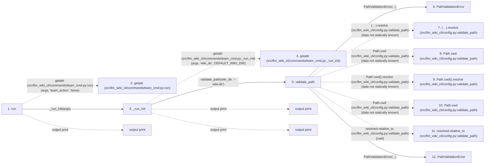

# team

**Entry point:** `run` (`cli`)
**Source:** [team_cmd](../modules/team_cmd.md)
**Modules touched:** [analysis_capture](../modules/analysis_capture.md), [analysis_compatibility](../modules/analysis_compatibility.md), [bootstrap_runtime](../modules/bootstrap_runtime.md), and 37 more

**Complete modules touched:**

- [analysis_capture](../modules/analysis_capture.md)
- [analysis_compatibility](../modules/analysis_compatibility.md)
- [bootstrap_runtime](../modules/bootstrap_runtime.md)
- [canonical_pages](../modules/canonical_pages.md)
- [common](../modules/common.md)
- [config](../modules/config.md)
- [data_flow](../modules/data_flow.md)
- [extraction_jobs](../modules/extraction_jobs.md)
- [extraction_service](../modules/extraction_service.md)
- [extractor_helpers](../modules/extractor_helpers.md)
- [filesystem_guard](../modules/filesystem_guard.md)
- [go_calls](../modules/go_calls.md)
- [immutable](../modules/immutable.md)
- [imports](../modules/imports.md)
- [infrastructure_inventory](../modules/infrastructure_inventory.md)
- [infrastructure_sync](../modules/infrastructure_sync.md)
- [inventory_cache](../modules/inventory_cache.md)
- [io](../modules/io.md)
- [knowledge_evidence](../modules/knowledge_evidence.md)
- [knowledge_storage](../modules/knowledge_storage.md)
- [knowledge_storage_io](../modules/knowledge_storage_io.md)
- [maintenance_state](../modules/maintenance_state.md)
- [manifest_storage](../modules/manifest_storage.md)
- [packages](../modules/packages.md)
- [plugins](../modules/plugins.md)
- [progress](../modules/progress.md)
- [python_contracts](../modules/python_contracts.md)
- [python_implementation](../modules/python_implementation.md)
- [python_imports](../modules/python_imports.md)
- [python_observations](../modules/python_observations.md)
- [resource_diagnostics](../modules/resource_diagnostics.md)
- [source_selection](../modules/source_selection.md)
- [source_snapshot](../modules/source_snapshot.md)
- [sync_manifest](../modules/sync_manifest.md)
- [team](../modules/team.md)
- [team_cmd](../modules/team_cmd.md)
- [validation](../modules/validation.md)
- [wiki_write_basis](../modules/wiki_write_basis.md)
- [yaml_formats](../modules/yaml_formats.md)
- [yaml_syntax](../modules/yaml_syntax.md)

## Call sequence

> Static overview in presentation order, not runtime execution order. Arrows retain captured callers; representative internal continuations and boundary examples precede repeated helper detail.

<!-- Auto-generated from static call edges. Dashed arrows are external or unresolved calls. Reviewed runtime conditions and side effects belong in Behavior. -->

```mermaid
sequenceDiagram
    participant p0 as run
    participant p1 as _run_init
    participant p2 as _run_check
    participant p3 as _run_resolve_conflicts
    participant p4 as validate_path
    participant p5 as write_default_team_config
    participant p6 as validate_source_root
    participant p7 as resolve_team_policy
    participant p8 as _finish_check
    participant p9 as team_config_issue
    participant p10 as resolve_conflicts
    participant p11 as _preflight_team_source_selection
    participant p12 as get_inventory_result
    participant p13 as extraction_job_request_from_args
    participant p14 as get_docker_inventory
    participant p15 as get_yaml_infrastructure_inventory
    participant p16 as build_team_issues
    participant p17 as resolve_source_selection
    participant p18 as _build_inventory_result
    participant p19 as write_json_atomic
    participant p20 as _print_payload
    participant p21 as SyncManifest.load
    participant p22 as _coerce_inventory_request
    participant p23 as load_team_config
    participant p24 as _parse_compose
    participant p25 as parse_github_actions_workflow
    participant p26 as check_plugin_requirements
    participant p27 as _looks_like_compose
    participant p28 as check_team_conventions
    participant p29 as getattr (src/llm_wiki_cli/commands/team_cmd.py:run)
    participant p30 as path.exists (src/llm_wiki_cli/commands/team_cmd.py:_run_init)
    p0->>p1: _run_init
    p0->>p2: _run_check
    p0->>p3: _run_resolve_conflicts
    p1->>p4: validate_path
    p1->>p5: write_default_team_config
    p2->>p6: validate_source_root
    p2->>p7: resolve_team_policy
    p2->>p8: _finish_check
    p2->>p9: team_config_issue
    p3->>p10: resolve_conflicts
    p2->>p11: _preflight_team_source_selection
    p2->>p12: get_inventory_result
    p2->>p13: extraction_job_request_from_args
    p2->>p14: get_docker_inventory
    p2->>p15: get_yaml_infrastructure_inventory
    p2->>p16: build_team_issues
    p11->>p17: resolve_source_selection
    p12->>p18: _build_inventory_result
    p5->>p19: write_json_atomic
    p8->>p20: _print_payload
    p11->>p21: SyncManifest.load
    p12->>p22: _coerce_inventory_request
    p7->>p23: load_team_config
    p14->>p24: _parse_compose
    p15->>p25: parse_github_actions_workflow
    p16->>p26: check_plugin_requirements
    p14->>p27: _looks_like_compose
    p16->>p28: check_team_conventions
    p0-->>p29: getattr (src/llm_wiki_cli/commands/team_cmd.py:run)(args, 'team_action', None)
    p1-->>p30: path.exists (src/llm_wiki_cli/commands/team_cmd.py:_run_init)
```

> Call sequence diagram shows 30 of 2412 interactions; 2382 omitted to keep the visualization within the 30-interaction and generated-diagram limits, with uncertain identities omitted rather than inferred.

> Captured boundary calls: external 1 of 685 (684 omitted); unresolved 1 of 817 (816 omitted). These counts cover the captured static trace.

Omitted captured detail, grouped by actual caller occurrence and target module:

| Caller | Parent step | Target module | Kind | Omitted interactions |
| --- | --- | --- | --- | --- |
| `src/llm_wiki_cli/commands/team_cmd.py:_run_init` | 3 | - | external | 3 |
| `src/llm_wiki_cli/config.py:validate_path` | 5 | [src/llm_wiki_cli/config.py](../modules/config.md) | internal | 2 |
| `src/llm_wiki_cli/config.py:validate_path` | 5 | - | unresolved | 3 |
| `src/llm_wiki_cli/config.py:validate_path` | 5 | - | external | 2 |
| `src/llm_wiki_cli/commands/team_cmd.py:_run_init` | 3 | [src/llm_wiki_cli/services/team.py](../modules/team.md) | internal | 1 |
| `src/llm_wiki_cli/services/team.py:team_config_path` | 13 | - | external | 1 |
| `src/llm_wiki_cli/services/team.py:write_default_team_config` | 17 | [src/llm_wiki_cli/services/team.py](../modules/team.md) | internal | 2 |
| `src/llm_wiki_cli/services/io.py:write_json_atomic` | 19 | - | external | 1 |
> Omission summary shows 8 of 613 groups; 605 further groups are not expanded here. Counts above include all omitted interactions.
> Detailed flow queries retain their own coverage and limits; omitted paths may execute at runtime.

> Trace truncated at the depth limit; deeper calls are omitted.

## Data flow

<!-- Auto-generated static analysis. Treat values and boundaries as best-effort hints, not runtime proof. -->

```mermaid
flowchart LR
    s1["1. run"]
    s2["2. getattr (src/llm_wiki_cli/commands/team_cmd.py:run)"]
    s3["3. _run_init"]
    s4["4. getattr (src/llm_wiki_cli/commands/team_cmd.py:_run_init)"]
    s5["5. validate_path"]
    s6["6. PathValidationError"]
    s7["7. (…).resolve (src/llm_wiki_cli/config.py:validate_path)"]
    s8["8. Path.cwd (src/llm_wiki_cli/config.py:validate_path)"]
    s9["9. Path.cwd().resolve (src/llm_wiki_cli/config.py:validate_path)"]
    s10["10. Path.cwd (src/llm_wiki_cli/config.py:validate_path)"]
    s11["11. resolved.relative_to (src/llm_wiki_cli/config.py:validate_path)"]
    s12["12. PathValidationError"]
    s1 -. "getattr (src/llm_wiki_cli/commands/team_cmd.py:run)(args, 'team_action', None)" .-> s2
    s1 -->|"_run_init(args)"| s3
    s3 -. "getattr (src/llm_wiki_cli/commands/team_cmd.py:_run_init)(args, 'wiki_dir', DEFAULT_WIKI_DIR)" .-> s4
    s3 -->|"validate_path(wiki_dir, '--wiki-dir')"| s5
    s5 -->|"PathValidationError(...)"| s6
    s5 -. "(…).resolve (src/llm_wiki_cli/config.py:validate_path)(data not statically known)" .-> s7
    s5 -. "Path.cwd (src/llm_wiki_cli/config.py:validate_path)(data not statically known)" .-> s8
    s5 -. "Path.cwd().resolve (src/llm_wiki_cli/config.py:validate_path)(data not statically known)" .-> s9
    s5 -. "Path.cwd (src/llm_wiki_cli/config.py:validate_path)(data not statically known)" .-> s10
    s5 -. "resolved.relative_to (src/llm_wiki_cli/config.py:validate_path)(cwd)" .-> s11
    s5 -->|"PathValidationError(...)"| s12
    b0["output print"]
    s1 -. "output print" .-> b0
    b1["output print"]
    s3 -. "output print" .-> b1
    b2["output print"]
    s3 -. "output print" .-> b2
    click s1 "../modules/team_cmd.md"
    click s3 "../modules/team_cmd.md"
    click s5 "../modules/config.md"
    click s6 "../modules/config.md"
    click s12 "../modules/config.md"
    classDef boundary stroke:#b45309,stroke-dasharray: 4 2
    class b0 boundary
    class b1 boundary
    class b2 boundary
```

### Step data

| Step | Inputs | Reads | Writes | Returns |
|---|---|---|---|---|
| `run` | `args` | `sys` | - | - |
| `getattr (src/llm_wiki_cli/commands/team_cmd.py:run)` | - | - | - | - |
| `_run_init` | `args` | `DEFAULT_WIKI_DIR` | - | `none` |
| `getattr (src/llm_wiki_cli/commands/team_cmd.py:_run_init)` | - | - | - | - |
| `validate_path` | `path: str`, `label: str` | - | - | `resolved` |
| `PathValidationError` | - | - | - | - |
| `(…).resolve (src/llm_wiki_cli/config.py:validate_path)` | - | - | - | - |
| `Path.cwd (src/llm_wiki_cli/config.py:validate_path)` | - | - | - | - |
| `Path.cwd().resolve (src/llm_wiki_cli/config.py:validate_path)` | - | - | - | - |
| `Path.cwd (src/llm_wiki_cli/config.py:validate_path)` | - | - | - | - |
| `resolved.relative_to (src/llm_wiki_cli/config.py:validate_path)` | - | - | - | - |
| `PathValidationError` | - | - | - | - |

### Call data

| From | To | Line | Call |
|---|---|---:|---|
| run | getattr (src/llm_wiki_cli/commands/team_cmd.py:run) | 262 | `getattr(args, 'team_action', None)` |
| run | _run_init | 264 | `_run_init(args)` |
| _run_init | getattr (src/llm_wiki_cli/commands/team_cmd.py:_run_init) | 61 | `getattr(args, 'wiki_dir', DEFAULT_WIKI_DIR)` |
| _run_init | validate_path | 62 | `validate_path(wiki_dir, '--wiki-dir')` |
| validate_path | PathValidationError | 134 | `PathValidationError(...)` |
| validate_path | (…).resolve (src/llm_wiki_cli/config.py:validate_path) | 135 | `(Path.cwd() / path).resolve(data not statically known)` |
| validate_path | Path.cwd (src/llm_wiki_cli/config.py:validate_path) | 135 | `Path.cwd(data not statically known)` |
| validate_path | Path.cwd().resolve (src/llm_wiki_cli/config.py:validate_path) | 136 | `Path.cwd().resolve(data not statically known)` |
| validate_path | Path.cwd (src/llm_wiki_cli/config.py:validate_path) | 136 | `Path.cwd(data not statically known)` |
| validate_path | resolved.relative_to (src/llm_wiki_cli/config.py:validate_path) | 138 | `resolved.relative_to(cwd)` |
| validate_path | PathValidationError | 140 | `PathValidationError(...)` |

### Boundary effects

| Kind | Target | Step | Line |
|---|---|---|---:|
| output | `print` | `run` | 270 |
| output | `print` | `_run_init` | 65 |
| output | `print` | `_run_init` | 68 |

### Static analysis gaps

| Kind | Step | Target | Line |
|---|---|---|---:|
| external_call | `run` | `getattr` | 262 |
| external_call | `_run_init` | `getattr` | 61 |
| unresolved_call | `validate_path` | `(Path.cwd() / path).resolve` | 135 |
| external_call | `validate_path` | `Path.cwd` | 135 |
| unresolved_call | `validate_path` | `Path.cwd().resolve` | 136 |
| external_call | `validate_path` | `Path.cwd` | 136 |
| unresolved_call | `validate_path` | `resolved.relative_to` | 138 |
| step_limit | `run` | `first 12 steps` | 0 |
| truncated_flow | `run` | `depth limit` | 0 |

## Behavior

This flow starts at `run` and is classified as `cli`. The generated call and data-flow sections are bounded static projections; runtime conditions and side effects require source-level confirmation.
