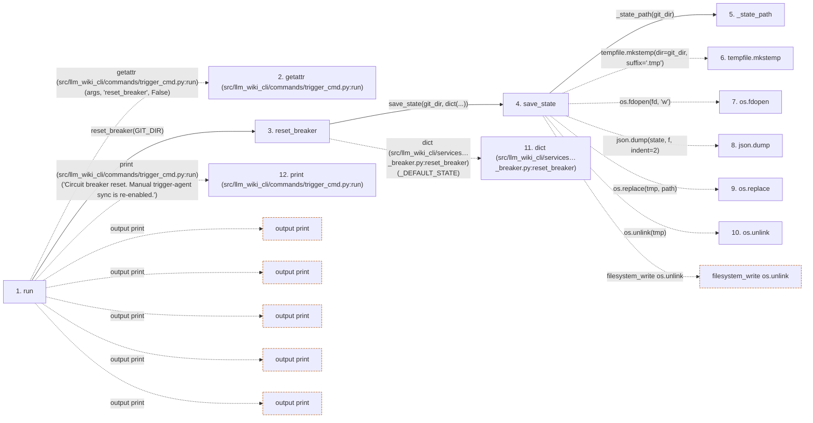

# trigger-agent

**Entry point:** `run` (`cli`)
**Source:** [trigger_cmd](../modules/trigger_cmd.md)
**Modules touched:** [circuit_breaker](../modules/circuit_breaker.md), [common](../modules/common.md), [config](../modules/config.md), [documentation_query_builder](../modules/documentation_query_builder.md), and 27 more

**Complete modules touched:**

- [circuit_breaker](../modules/circuit_breaker.md)
- [common](../modules/common.md)
- [config](../modules/config.md)
- [documentation_query_builder](../modules/documentation_query_builder.md)
- [extraction_jobs](../modules/extraction_jobs.md)
- [extraction_service](../modules/extraction_service.md)
- [filesystem_guard](../modules/filesystem_guard.md)
- [generate_prompt_cmd](../modules/generate_prompt_cmd.md)
- [imports](../modules/imports.md)
- [inventory_cache](../modules/inventory_cache.md)
- [io](../modules/io.md)
- [knowledge_observability](../modules/knowledge_observability.md)
- [lockfile](../modules/lockfile.md)
- [metrics](../modules/metrics.md)
- [packages](../modules/packages.md)
- [paths](../modules/paths.md)
- [plugins](../modules/plugins.md)
- [progress](../modules/progress.md)
- [python_calls](../modules/python_calls.md)
- [python_contracts](../modules/python_contracts.md)
- [python_imports](../modules/python_imports.md)
- [python_observations](../modules/python_observations.md)
- [redaction](../modules/redaction.md)
- [secure_file](../modules/secure_file.md)
- [source_selection](../modules/source_selection.md)
- [source_snapshot](../modules/source_snapshot.md)
- [sync_manifest](../modules/sync_manifest.md)
- [team](../modules/team.md)
- [trigger_cmd](../modules/trigger_cmd.md)
- [validation](../modules/validation.md)
- [wiki_git_policy](../modules/wiki_git_policy.md)

## Call sequence

```mermaid
sequenceDiagram
    participant p0 as run
    participant p1 as getattr (src/llm_wiki_cli/commands/trigger_cmd.py:run)
    participant p2 as reset_breaker
    participant p3 as save_state
    participant p4 as _state_path
    participant p5 as tempfile.mkstemp
    participant p6 as os.fdopen
    participant p7 as json.dump
    participant p8 as os.replace
    participant p9 as os.unlink
    participant p10 as dict (src/llm_wiki_cli/services…_breaker.py:reset_breaker)
    participant p11 as print (src/llm_wiki_cli/commands/trigger_cmd.py:run)
    participant p12 as sys.exit
    participant p13 as WikiLock
    participant p14 as _lock_wait_seconds
    participant p15 as os.environ.get (src/llm_wiki_cli/commands…cmd.py:_lock_wait_seconds)
    participant p16 as raw_value.strip
    participant p17 as float (src/llm_wiki_cli/commands…cmd.py:_lock_wait_seconds)
    participant p18 as ValueError (src/llm_wiki_cli/commands…cmd.py:_lock_wait_seconds)
    participant p19 as math.isfinite (src/llm_wiki_cli/commands…cmd.py:_lock_wait_seconds)
    participant p20 as _run_sync
    participant p21 as getattr (src/llm_wiki_cli/commands/trigger_cmd.py:_run_sync)
    participant p22 as validate_path
    participant p23 as PathValidationError
    participant p24 as (…).resolve
    participant p25 as Path.cwd (src/llm_wiki_cli/config.py:validate_path)
    participant p26 as Path.cwd().resolve
    p0-->>p1: getattr (src/llm_wiki_cli/commands/trigger_cmd.py:run)
    p0->>p2: reset_breaker
    p2->>p3: save_state
    p3->>p4: _state_path
    p3-->>p5: tempfile.mkstemp
    p3-->>p6: os.fdopen
    p3-->>p7: json.dump
    p3-->>p8: os.replace
    p3-->>p9: os.unlink
    p2-->>p10: dict (src/llm_wiki_cli/services…_breaker.py:reset_breaker)
    p0-->>p11: print (src/llm_wiki_cli/commands/trigger_cmd.py:run)
    p0-->>p11: print (src/llm_wiki_cli/commands/trigger_cmd.py:run)
    p0-->>p11: print (src/llm_wiki_cli/commands/trigger_cmd.py:run)
    p0-->>p11: print (src/llm_wiki_cli/commands/trigger_cmd.py:run)
    p0-->>p12: sys.exit
    p0->>p13: WikiLock
    p0->>p14: _lock_wait_seconds
    p14-->>p15: os.environ.get (src/llm_wiki_cli/commands…cmd.py:_lock_wait_seconds)
    p14-->>p16: raw_value.strip
    p14-->>p17: float (src/llm_wiki_cli/commands…cmd.py:_lock_wait_seconds)
    p14-->>p18: ValueError (src/llm_wiki_cli/commands…cmd.py:_lock_wait_seconds)
    p14-->>p19: math.isfinite (src/llm_wiki_cli/commands…cmd.py:_lock_wait_seconds)
    p14-->>p18: ValueError (src/llm_wiki_cli/commands…cmd.py:_lock_wait_seconds)
    p0->>p20: _run_sync
    p20-->>p21: getattr (src/llm_wiki_cli/commands/trigger_cmd.py:_run_sync)
    p20->>p22: validate_path
    p22->>p23: PathValidationError
    p22-->>p24: (…).resolve
    p22-->>p25: Path.cwd (src/llm_wiki_cli/config.py:validate_path)
    p22-->>p26: Path.cwd().resolve
```

<!-- Auto-generated from static call edges. Dashed arrows are external or unresolved calls. Reviewed runtime conditions and side effects belong in Behavior. -->

> Call sequence diagram shows 30 of 1340 interactions; 1310 omitted to keep the visualization within the 30-interaction and generated-diagram limits.

> Trace truncated at the depth limit; deeper calls are omitted.

## Data flow

<!-- Auto-generated static analysis. Treat values and boundaries as best-effort hints, not runtime proof. -->

### Step data

| Step | Inputs | Reads | Writes | Returns |
|---|---|---|---|---|
| `run` | `args` | `GIT_DIR`, `IDE_AGENTS`, `GIT_DIR`, `LockAcquisitionError` | - | `none` |
| `getattr (src/llm_wiki_cli/commands/trigger_cmd.py:run)` | - | - | - | - |
| `reset_breaker` | `git_dir: Path` | `_DEFAULT_STATE` | - | - |
| `save_state` | `git_dir: Path`, `state: dict` | - | - | - |
| `_state_path` | `git_dir: Path` | `_STATE_FILE` | - | `...` |
| `tempfile.mkstemp` | - | - | - | - |
| `os.fdopen` | - | - | - | - |
| `json.dump` | - | - | - | - |
| `os.replace` | - | - | - | - |
| `os.unlink` | - | - | - | - |
| `dict (src/llm_wiki_cli/services…_breaker.py:reset_breaker)` | - | - | - | - |
| `print (src/llm_wiki_cli/commands/trigger_cmd.py:run)` | - | - | - | - |

### Call data

| From | To | Line | Call |
|---|---|---:|---|
| run | getattr (src/llm_wiki_cli/commands/trigger_cmd.py:run) | 41 | `getattr(args, 'reset_breaker', False)` |
| run | reset_breaker | 42 | `circuit_breaker.reset_breaker(GIT_DIR)` |
| reset_breaker | save_state | 139 | `save_state(git_dir, dict(...))` |
| save_state | _state_path | 55 | `_state_path(git_dir)` |
| save_state | tempfile.mkstemp | 56 | `tempfile.mkstemp(dir=git_dir, suffix='.tmp')` |
| save_state | os.fdopen | 58 | `os.fdopen(fd, 'w')` |
| save_state | json.dump | 59 | `json.dump(state, f, indent=2)` |
| save_state | os.replace | 60 | `os.replace(tmp, path)` |
| save_state | os.unlink | 63 | `os.unlink(tmp)` |
| reset_breaker | dict (src/llm_wiki_cli/services…_breaker.py:reset_breaker) | 139 | `dict(_DEFAULT_STATE)` |
| run | print (src/llm_wiki_cli/commands/trigger_cmd.py:run) | 43 | `print('Circuit breaker reset. Manual trigger-agent sync is re-enabled.')` |

### Boundary effects

| Kind | Target | Step | Line |
|---|---|---|---:|
| output | `print` | `run` | 43 |
| output | `print` | `run` | 47 |
| output | `print` | `run` | 48 |
| output | `print` | `run` | 51 |
| output | `print` | `run` | 59 |
| filesystem_write | `os.unlink` | `save_state` | 63 |

### Static analysis gaps

| Kind | Step | Target | Line |
|---|---|---|---:|
| external_call | `run` | `getattr` | 41 |
| external_call | `save_state` | `tempfile.mkstemp` | 56 |
| external_call | `save_state` | `os.fdopen` | 58 |
| external_call | `save_state` | `json.dump` | 59 |
| external_call | `save_state` | `os.replace` | 60 |
| step_limit | `run` | `first 12 steps` | 0 |
| truncated_flow | `run` | `depth limit` | 0 |

## Behavior

This flow starts at `run` and is classified as `cli`. The generated call and data-flow sections are bounded static projections; runtime conditions and side effects require source-level confirmation.
