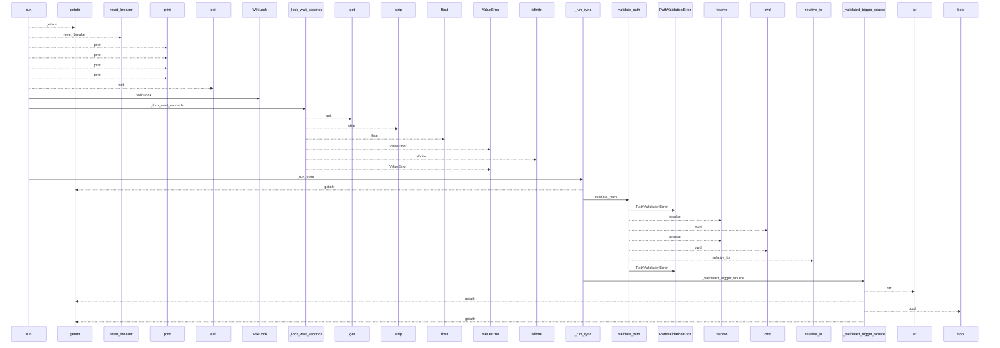
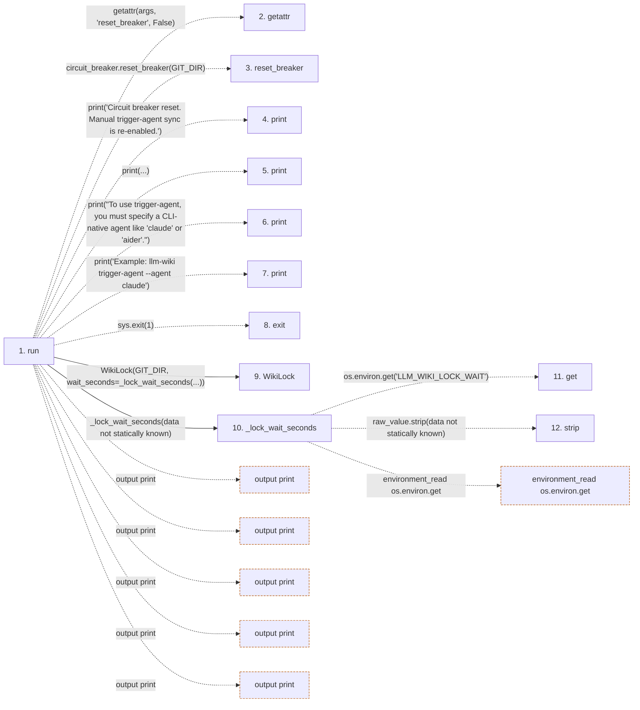

# trigger-agent

**Entry point:** `run` (`cli`)
**Source:** [trigger_cmd](../modules/trigger_cmd.md)
**Modules touched:** [common](../modules/common.md), [config](../modules/config.md), [documentation_query_builder](../modules/documentation_query_builder.md), [extraction_jobs](../modules/extraction_jobs.md), and 20 more

**Complete modules touched:**

- [common](../modules/common.md)
- [config](../modules/config.md)
- [documentation_query_builder](../modules/documentation_query_builder.md)
- [extraction_jobs](../modules/extraction_jobs.md)
- [extraction_service](../modules/extraction_service.md)
- [filesystem_guard](../modules/filesystem_guard.md)
- [generate_prompt_cmd](../modules/generate_prompt_cmd.md)
- [imports](../modules/imports.md)
- [inventory_cache](../modules/inventory_cache.md)
- [io](../modules/io.md)
- [knowledge_observability](../modules/knowledge_observability.md)
- [lockfile](../modules/lockfile.md)
- [metrics](../modules/metrics.md)
- [packages](../modules/packages.md)
- [paths](../modules/paths.md)
- [plugins](../modules/plugins.md)
- [redaction](../modules/redaction.md)
- [secure_file](../modules/secure_file.md)
- [source_selection](../modules/source_selection.md)
- [source_snapshot](../modules/source_snapshot.md)
- [team](../modules/team.md)
- [trigger_cmd](../modules/trigger_cmd.md)
- [validation](../modules/validation.md)
- [wiki_git_policy](../modules/wiki_git_policy.md)

## Call sequence

<!-- Auto-generated from static call edges. Dashed arrows are external or unresolved calls. Reviewed runtime conditions and side effects belong in Behavior. -->

> Call sequence diagram shows 30 of 1094 interactions; 1064 omitted to keep the visualization within the 30-interaction and generated-diagram limits.

> Trace truncated at the depth limit; deeper calls are omitted.

## Data flow

<!-- Auto-generated static analysis. Treat values and boundaries as best-effort hints, not runtime proof. -->

### Step data

| Step | Inputs | Reads | Writes | Returns |
|---|---|---|---|---|
| `run` | `args` | `GIT_DIR`, `IDE_AGENTS`, `GIT_DIR`, `LockAcquisitionError` | - | `none` |
| `getattr` | - | - | - | - |
| `reset_breaker` | - | - | - | - |
| `print` | - | - | - | - |
| `print` | - | - | - | - |
| `print` | - | - | - | - |
| `print` | - | - | - | - |
| `exit` | - | - | - | - |
| `WikiLock` | - | - | - | - |
| `_lock_wait_seconds` | - | - | - | `0.0`, `wait_seconds` |
| `get` | - | - | - | - |
| `strip` | - | - | - | - |

### Call data

| From | To | Line | Call |
|---|---|---:|---|
| run | getattr | 41 | `getattr(args, 'reset_breaker', False)` |
| run | reset_breaker | 42 | `circuit_breaker.reset_breaker(GIT_DIR)` |
| run | print | 43 | `print('Circuit breaker reset. Manual trigger-agent sync is re-enabled.')` |
| run | print | 47 | `print(...)` |
| run | print | 48 | `print("To use trigger-agent, you must specify a CLI-native agent like 'claude' or 'aider'.")` |
| run | print | 51 | `print('Example: llm-wiki trigger-agent --agent claude')` |
| run | exit | 52 | `sys.exit(1)` |
| run | WikiLock | 56 | `WikiLock(GIT_DIR, wait_seconds=_lock_wait_seconds(...))` |
| run | _lock_wait_seconds | 56 | `_lock_wait_seconds(data not statically known)` |
| _lock_wait_seconds | get | 481 | `os.environ.get('LLM_WIKI_LOCK_WAIT')` |
| _lock_wait_seconds | strip | 482 | `raw_value.strip(data not statically known)` |

### Boundary effects

| Kind | Target | Step | Line |
|---|---|---|---:|
| output | `print` | `run` | 43 |
| output | `print` | `run` | 47 |
| output | `print` | `run` | 48 |
| output | `print` | `run` | 51 |
| output | `print` | `run` | 59 |
| environment_read | `os.environ.get` | `_lock_wait_seconds` | 481 |

### Static analysis gaps

| Kind | Step | Target | Line |
|---|---|---|---:|
| unresolved_call | `run` | `getattr` | 41 |
| external_call | `run` | `circuit_breaker.reset_breaker` | 42 |
| external_call | `run` | `sys.exit` | 52 |
| unresolved_call | `_lock_wait_seconds` | `raw_value.strip` | 482 |
| step_limit | `run` | `first 12 steps` | 0 |
| truncated_flow | `run` | `depth limit` | 0 |

## Behavior

This flow starts at `run` and is classified as `cli`. The generated call and data-flow sections are bounded static projections; runtime conditions and side effects require source-level confirmation.
