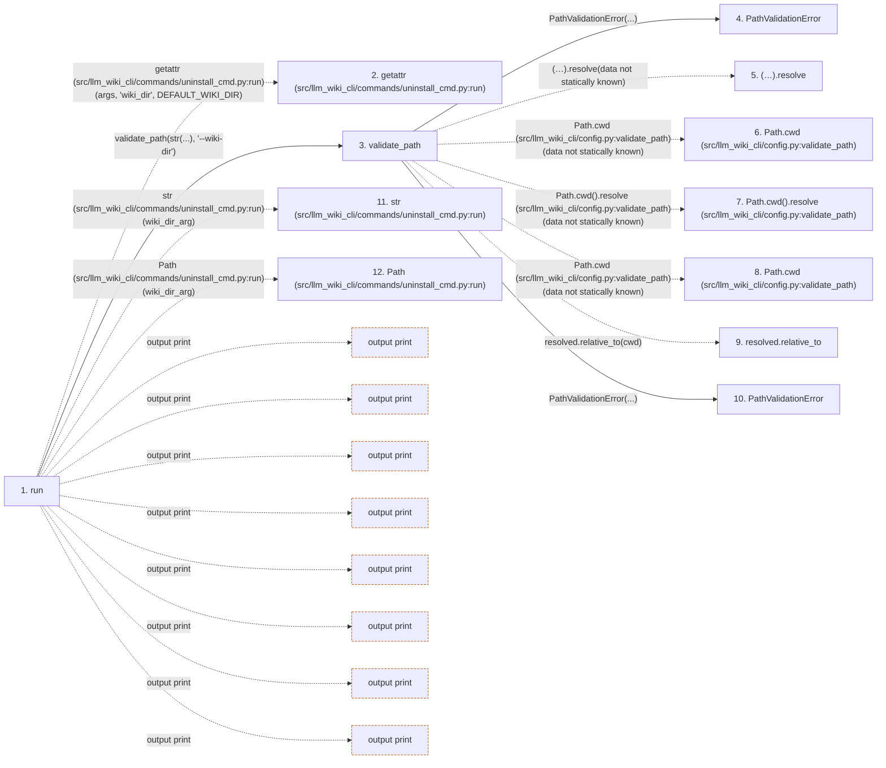

# uninstall

**Entry point:** `run` (`cli`)
**Source:** [uninstall_cmd](../modules/uninstall_cmd.md)
**Modules touched:** [ci_installer](../modules/ci_installer.md), [config](../modules/config.md), [filesystem_guard](../modules/filesystem_guard.md), [io](../modules/io.md), and 5 more

**Complete modules touched:**

- [ci_installer](../modules/ci_installer.md)
- [config](../modules/config.md)
- [filesystem_guard](../modules/filesystem_guard.md)
- [io](../modules/io.md)
- [legacy_hooks](../modules/legacy_hooks.md)
- [paths](../modules/paths.md)
- [services_schema](../modules/services_schema.md)
- [skills](../modules/skills.md)
- [uninstall_cmd](../modules/uninstall_cmd.md)

## Call sequence

```mermaid
sequenceDiagram
    participant p0 as run
    participant p1 as getattr (src/llm_wiki_cli/commands/uninstall_cmd.py:run)
    participant p2 as validate_path
    participant p3 as PathValidationError
    participant p4 as (…).resolve
    participant p5 as Path.cwd (src/llm_wiki_cli/config.py:validate_path)
    participant p6 as Path.cwd().resolve (src/llm_wiki_cli/config.py:validate_path)
    participant p7 as resolved.relative_to
    participant p8 as str (src/llm_wiki_cli/commands/uninstall_cmd.py:run)
    participant p9 as Path (src/llm_wiki_cli/commands/uninstall_cmd.py:run)
    participant p10 as _preflight_hooks
    participant p11 as inspect_legacy_hooks
    participant p12 as _hook_directories
    participant p13 as Path.cwd().resolve (src/llm_wiki_cli/services…ooks.py:_hook_directories)
    participant p14 as Path.cwd (src/llm_wiki_cli/services…ooks.py:_hook_directories)
    participant p15 as _require_safe_path
    participant p16 as first_unsafe_path_component
    participant p17 as Path (src/llm_wiki_cli/services…rst_unsafe_path_component)
    participant p18 as os.fspath (src/llm_wiki_cli/services…rst_unsafe_path_component)
    participant p19 as os.path.abspath (src/llm_wiki_cli/services…rst_unsafe_path_component)
    participant p20 as lexical.is_absolute
    participant p21 as Path.cwd (src/llm_wiki_cli/services…rst_unsafe_path_component)
    participant p22 as list
    participant p23 as pending_parts.pop
    participant p24 as current.lstat
    p0-->>p1: getattr (src/llm_wiki_cli/commands/uninstall_cmd.py:run)
    p0->>p2: validate_path
    p2->>p3: PathValidationError
    p2-->>p4: (…).resolve
    p2-->>p5: Path.cwd (src/llm_wiki_cli/config.py:validate_path)
    p2-->>p6: Path.cwd().resolve (src/llm_wiki_cli/config.py:validate_path)
    p2-->>p5: Path.cwd (src/llm_wiki_cli/config.py:validate_path)
    p2-->>p7: resolved.relative_to
    p2->>p3: PathValidationError
    p0-->>p8: str (src/llm_wiki_cli/commands/uninstall_cmd.py:run)
    p0-->>p9: Path (src/llm_wiki_cli/commands/uninstall_cmd.py:run)
    p0-->>p1: getattr (src/llm_wiki_cli/commands/uninstall_cmd.py:run)
    p0-->>p1: getattr (src/llm_wiki_cli/commands/uninstall_cmd.py:run)
    p0->>p10: _preflight_hooks
    p10->>p11: inspect_legacy_hooks
    p11->>p12: _hook_directories
    p12-->>p13: Path.cwd().resolve (src/llm_wiki_cli/services…ooks.py:_hook_directories)
    p12-->>p14: Path.cwd (src/llm_wiki_cli/services…ooks.py:_hook_directories)
    p12->>p15: _require_safe_path
    p15->>p16: first_unsafe_path_component
    p16-->>p17: Path (src/llm_wiki_cli/services…rst_unsafe_path_component)
    p16-->>p18: os.fspath (src/llm_wiki_cli/services…rst_unsafe_path_component)
    p16-->>p17: Path (src/llm_wiki_cli/services…rst_unsafe_path_component)
    p16-->>p19: os.path.abspath (src/llm_wiki_cli/services…rst_unsafe_path_component)
    p16-->>p20: lexical.is_absolute
    p16-->>p21: Path.cwd (src/llm_wiki_cli/services…rst_unsafe_path_component)
    p16-->>p17: Path (src/llm_wiki_cli/services…rst_unsafe_path_component)
    p16-->>p22: list
    p16-->>p23: pending_parts.pop
    p16-->>p24: current.lstat
```

<!-- Auto-generated from static call edges. Dashed arrows are external or unresolved calls. Reviewed runtime conditions and side effects belong in Behavior. -->

> Call sequence diagram shows 30 of 1150 interactions; 1120 omitted to keep the visualization within the 30-interaction and generated-diagram limits.

> Trace truncated at the depth limit; deeper calls are omitted.

## Data flow

<!-- Auto-generated static analysis. Treat values and boundaries as best-effort hints, not runtime proof. -->

### Step data

| Step | Inputs | Reads | Writes | Returns |
|---|---|---|---|---|
| `run` | `args` | `DEFAULT_WIKI_DIR`, `ReferenceSkillState`, `BUNDLED_SKILLS_ROOT`, `REFERENCE_SKILL_ID`, `ManagedSchemaBlockError`, `ManagedSchemaPathError`, `UnsafeUninstallPathError`, `sys` | - | `none`, `none`, `none` |
| `getattr (src/llm_wiki_cli/commands/uninstall_cmd.py:run)` | - | - | - | - |
| `validate_path` | `path: str`, `label: str` | - | - | `resolved` |
| `PathValidationError` | - | - | - | - |
| `(…).resolve` | - | - | - | - |
| `Path.cwd (src/llm_wiki_cli/config.py:validate_path)` | - | - | - | - |
| `Path.cwd().resolve (src/llm_wiki_cli/config.py:validate_path)` | - | - | - | - |
| `Path.cwd (src/llm_wiki_cli/config.py:validate_path)` | - | - | - | - |
| `resolved.relative_to` | - | - | - | - |
| `PathValidationError` | - | - | - | - |
| `str (src/llm_wiki_cli/commands/uninstall_cmd.py:run)` | - | - | - | - |
| `Path (src/llm_wiki_cli/commands/uninstall_cmd.py:run)` | - | - | - | - |

### Call data

| From | To | Line | Call |
|---|---|---:|---|
| run | getattr (src/llm_wiki_cli/commands/uninstall_cmd.py:run) | 811 | `getattr(args, 'wiki_dir', DEFAULT_WIKI_DIR)` |
| run | validate_path | 812 | `validate_path(str(...), '--wiki-dir')` |
| validate_path | PathValidationError | 132 | `PathValidationError(...)` |
| validate_path | (…).resolve | 133 | `(Path.cwd() / path).resolve(data not statically known)` |
| validate_path | Path.cwd (src/llm_wiki_cli/config.py:validate_path) | 133 | `Path.cwd(data not statically known)` |
| validate_path | Path.cwd().resolve (src/llm_wiki_cli/config.py:validate_path) | 134 | `Path.cwd().resolve(data not statically known)` |
| validate_path | Path.cwd (src/llm_wiki_cli/config.py:validate_path) | 134 | `Path.cwd(data not statically known)` |
| validate_path | resolved.relative_to | 136 | `resolved.relative_to(cwd)` |
| validate_path | PathValidationError | 138 | `PathValidationError(...)` |
| run | str (src/llm_wiki_cli/commands/uninstall_cmd.py:run) | 812 | `str(wiki_dir_arg)` |
| run | Path (src/llm_wiki_cli/commands/uninstall_cmd.py:run) | 813 | `Path(wiki_dir_arg)` |

### Boundary effects

| Kind | Target | Step | Line |
|---|---|---|---:|
| output | `print` | `run` | 839 |
| output | `print` | `run` | 843 |
| output | `print` | `run` | 846 |
| output | `print` | `run` | 847 |
| output | `print` | `run` | 850 |
| output | `print` | `run` | 853 |
| output | `print` | `run` | 856 |
| output | `print` | `run` | 859 |

### Static analysis gaps

| Kind | Step | Target | Line |
|---|---|---|---:|
| external_call | `run` | `getattr` | 811 |
| unresolved_call | `validate_path` | `(Path.cwd() / path).resolve` | 133 |
| external_call | `validate_path` | `Path.cwd` | 133 |
| unresolved_call | `validate_path` | `Path.cwd().resolve` | 134 |
| external_call | `validate_path` | `Path.cwd` | 134 |
| unresolved_call | `validate_path` | `resolved.relative_to` | 136 |
| step_limit | `run` | `first 12 steps` | 0 |
| truncated_flow | `run` | `depth limit` | 0 |

## Behavior

This flow starts at `run` and is classified as `cli`. The generated call and data-flow sections are bounded static projections; runtime conditions and side effects require source-level confirmation.
