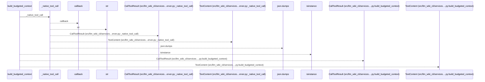
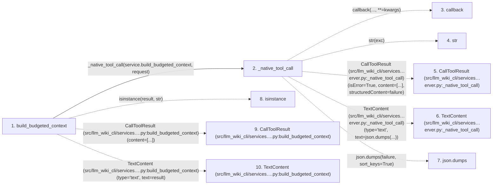

# build_budgeted_context

**Entry point:** `build_budgeted_context` (`mcp`)
**Source:** [mcp_server](../modules/mcp_server.md)
**Modules touched:** [mcp_server](../modules/mcp_server.md)

## Call sequence

<!-- Auto-generated from static call edges. Dashed arrows are external or unresolved calls. Reviewed runtime conditions and side effects belong in Behavior. -->

## Data flow

<!-- Auto-generated static analysis. Treat values and boundaries as best-effort hints, not runtime proof. -->

### Step data

| Step | Inputs | Reads | Writes | Returns |
|---|---|---|---|---|
| `build_budgeted_context` | `request: dict` | - | - | `CallToolResult(...)`, `result` |
| `_native_tool_call` | `callback: Callable[..., Any]`, `args`, `kwargs` | `McpWikiError` | - | `callback(...)`, `CallToolResult(...)` |
| `callback` | - | - | - | - |
| `str` | - | - | - | - |
| `CallToolResult (src/llm_wiki_cli/services…erver.py:_native_tool_call)` | - | - | - | - |
| `TextContent (src/llm_wiki_cli/services…erver.py:_native_tool_call)` | - | - | - | - |
| `json.dumps` | - | - | - | - |
| `isinstance` | - | - | - | - |
| `CallToolResult (src/llm_wiki_cli/services….py:build_budgeted_context)` | - | - | - | - |
| `TextContent (src/llm_wiki_cli/services….py:build_budgeted_context)` | - | - | - | - |

### Call data

| From | To | Line | Call |
|---|---|---:|---|
| build_budgeted_context | _native_tool_call | 1490 | `_native_tool_call(service.build_budgeted_context, request)` |
| _native_tool_call | callback | 1275 | `callback(..., **=kwargs)` |
| _native_tool_call | str | 1283 | `str(exc)` |
| _native_tool_call | CallToolResult (src/llm_wiki_cli/services…erver.py:_native_tool_call) | 1287 | `CallToolResult(isError=True, content=[...], structuredContent=failure)` |
| _native_tool_call | TextContent (src/llm_wiki_cli/services…erver.py:_native_tool_call) | 1289 | `TextContent(type='text', text=json.dumps(...))` |
| _native_tool_call | json.dumps | 1289 | `json.dumps(failure, sort_keys=True)` |
| build_budgeted_context | isinstance | 1491 | `isinstance(result, str)` |
| build_budgeted_context | CallToolResult (src/llm_wiki_cli/services….py:build_budgeted_context) | 1492 | `CallToolResult(content=[...])` |
| build_budgeted_context | TextContent (src/llm_wiki_cli/services….py:build_budgeted_context) | 1492 | `TextContent(type='text', text=result)` |

### Boundary effects

*No boundary effects detected.*

### Static analysis gaps

| Kind | Step | Target | Line |
|---|---|---|---:|
| unresolved_call | `_native_tool_call` | `callback` | 1275 |
| external_call | `_native_tool_call` | `CallToolResult` | 1287 |
| external_call | `_native_tool_call` | `TextContent` | 1289 |
| external_call | `_native_tool_call` | `json.dumps` | 1289 |
| external_call | `build_budgeted_context` | `isinstance` | 1491 |
| external_call | `build_budgeted_context` | `CallToolResult` | 1492 |
| external_call | `build_budgeted_context` | `TextContent` | 1492 |

## Behavior

Requires a versioned v3 request with explicit change selection. Trusted server configuration supplies any exact counter. One canonical text representation preserves the declared count; cannot-fit and capability errors never return a partial successful context. Transport and host framing remain outside that count.
