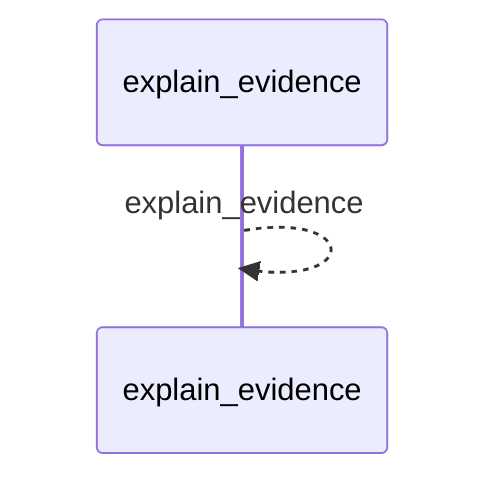
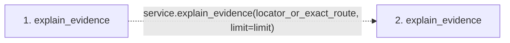

# explain_evidence

**Entry point:** `explain_evidence` (`mcp`)
**Source:** [mcp_server](../modules/mcp_server.md)
**Modules touched:** [mcp_server](../modules/mcp_server.md)

## Call sequence

<!-- Auto-generated from static call edges. Dashed arrows are external or unresolved calls. Reviewed runtime conditions and side effects belong in Behavior. -->

## Data flow

<!-- Auto-generated static analysis. Treat values and boundaries as best-effort hints, not runtime proof. -->

### Step data

| Step | Inputs | Reads | Writes | Returns |
|---|---|---|---|---|
| `explain_evidence` | `locator_or_exact_route: str`, `limit: int` | - | - | `service.explain_evidence(...)` |
| `explain_evidence` | - | - | - | - |

### Call data

| From | To | Line | Call |
|---|---|---:|---|
| explain_evidence | explain_evidence | 1018 | `service.explain_evidence(locator_or_exact_route, limit=limit)` |

### Boundary effects

*No boundary effects detected.*

### Static analysis gaps

| Kind | Step | Target | Line |
|---|---|---|---:|
| unresolved_call | `explain_evidence` | `service.explain_evidence` | 1018 |

## Behavior

This flow starts at `explain_evidence` and is classified as `mcp`. The generated call and data-flow sections are bounded static projections; runtime conditions and side effects require source-level confirmation.
