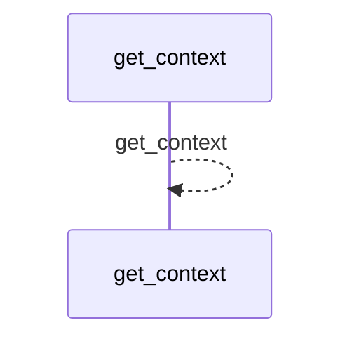
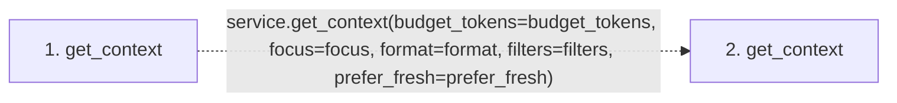

# get_context

**Entry point:** `get_context` (`mcp`)
**Source:** [mcp_server](../modules/mcp_server.md)
**Modules touched:** [mcp_server](../modules/mcp_server.md)

## Call sequence

<!-- Auto-generated from static call edges. Dashed arrows are external or unresolved calls. Reviewed runtime conditions and side effects belong in Behavior. -->

## Data flow

<!-- Auto-generated static analysis. Treat values and boundaries as best-effort hints, not runtime proof. -->

### Step data

| Step | Inputs | Reads | Writes | Returns |
|---|---|---|---|---|
| `get_context` | `budget_tokens: int`, `focus: list[str] \| None`, `format: str`, `filters: dict \| None`, `prefer_fresh: bool` | - | - | `service.get_context(...)` |
| `get_context` | - | - | - | - |

### Call data

| From | To | Line | Call |
|---|---|---:|---|
| get_context | get_context | 1036 | `service.get_context(budget_tokens=budget_tokens, focus=focus, format=format, filters=filters, prefer_fresh=prefer_fresh)` |

### Boundary effects

*No boundary effects detected.*

### Static analysis gaps

| Kind | Step | Target | Line |
|---|---|---|---:|
| unresolved_call | `get_context` | `service.get_context` | 1036 |

## Behavior

Builds and validates the versioned context request from budget, focus, format,
filters, and freshness preference, using `changed` and `neighbors` when focus is
omitted. It revalidates the pinned source selection through the service options
and returns the protocol success envelope with payload and warnings. Invalid
requests become `McpWikiError` without mutating source or wiki files.
