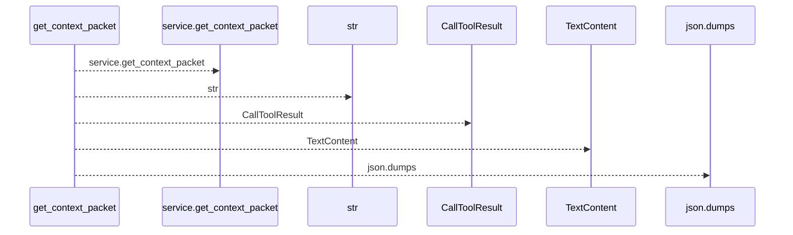
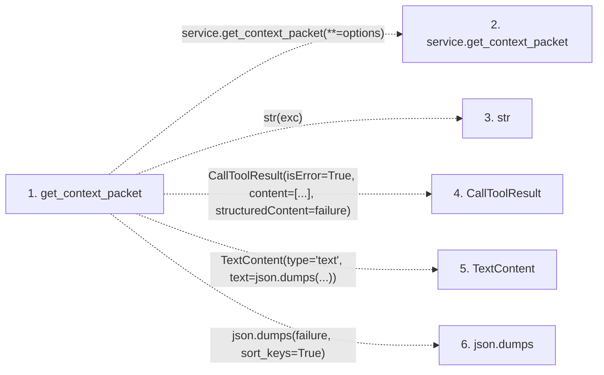

# get_context_packet

**Entry point:** `get_context_packet` (`mcp`)
**Source:** [mcp_server](../modules/mcp_server.md)
**Modules touched:** [mcp_server](../modules/mcp_server.md)

## Call sequence

<!-- Auto-generated from static call edges. Dashed arrows are external or unresolved calls. Reviewed runtime conditions and side effects belong in Behavior. -->

## Data flow

<!-- Auto-generated static analysis. Treat values and boundaries as best-effort hints, not runtime proof. -->

### Step data

| Step | Inputs | Reads | Writes | Returns |
|---|---|---|---|---|
| `get_context_packet` | `budget_tokens: int`, `focus: list[str] \| None`, `format: str`, `filters: dict \| None`, `prefer_fresh: bool`, `if_packet_id: str \| None`, `knowledge_mode: KnowledgeMode \| None` | `McpWikiError` | `options[...]` | `service.get_context_packet(...)`, `CallToolResult(...)` |
| `service.get_context_packet` | - | - | - | - |
| `str` | - | - | - | - |
| `CallToolResult` | - | - | - | - |
| `TextContent` | - | - | - | - |
| `json.dumps` | - | - | - | - |

### Call data

| From | To | Line | Call |
|---|---|---:|---|
| get_context_packet | service.get_context_packet | 1288 | `service.get_context_packet(**=options)` |
| get_context_packet | str | 1298 | `str(exc)` |
| get_context_packet | CallToolResult | 1302 | `CallToolResult(isError=True, content=[...], structuredContent=failure)` |
| get_context_packet | TextContent | 1304 | `TextContent(type='text', text=json.dumps(...))` |
| get_context_packet | json.dumps | 1304 | `json.dumps(failure, sort_keys=True)` |

### Boundary effects

*No boundary effects detected.*

### Static analysis gaps

| Kind | Step | Target | Line |
|---|---|---|---:|
| unresolved_call | `get_context_packet` | `service.get_context_packet` | 1288 |
| external_call | `get_context_packet` | `CallToolResult` | 1302 |
| external_call | `get_context_packet` | `TextContent` | 1304 |
| external_call | `get_context_packet` | `json.dumps` | 1304 |

## Behavior

This flow starts at `get_context_packet` and is classified as `mcp`. The generated call and data-flow sections are bounded static projections; runtime conditions and side effects require source-level confirmation.
