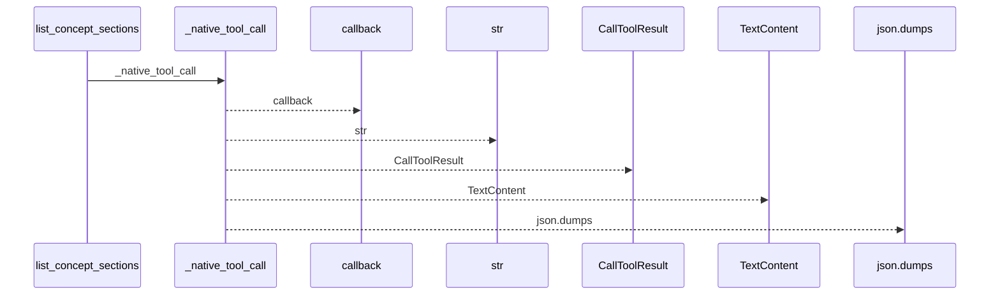
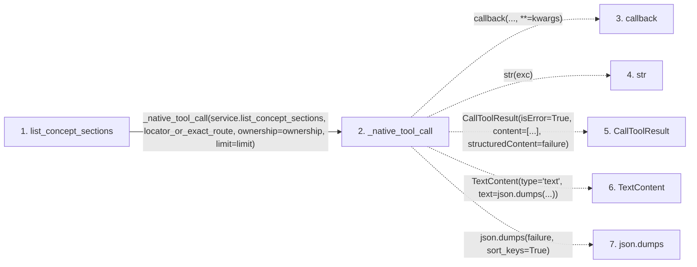

# list_concept_sections

**Entry point:** `list_concept_sections` (`mcp`)
**Source:** [mcp_server](../modules/mcp_server.md)
**Modules touched:** [mcp_server](../modules/mcp_server.md)

## Call sequence

<!-- Auto-generated from static call edges. Dashed arrows are external or unresolved calls. Reviewed runtime conditions and side effects belong in Behavior. -->

## Data flow

<!-- Auto-generated static analysis. Treat values and boundaries as best-effort hints, not runtime proof. -->

### Step data

| Step | Inputs | Reads | Writes | Returns |
|---|---|---|---|---|
| `list_concept_sections` | `locator_or_exact_route: str`, `ownership: str \| None`, `limit: int` | - | - | `_native_tool_call(...)` |
| `_native_tool_call` | `callback: Callable[..., Any]`, `args`, `kwargs` | `McpWikiError` | - | `callback(...)`, `CallToolResult(...)` |
| `callback` | - | - | - | - |
| `str` | - | - | - | - |
| `CallToolResult` | - | - | - | - |
| `TextContent` | - | - | - | - |
| `json.dumps` | - | - | - | - |

### Call data

| From | To | Line | Call |
|---|---|---:|---|
| list_concept_sections | _native_tool_call | 1358 | `_native_tool_call(service.list_concept_sections, locator_or_exact_route, ownership=ownership, limit=limit)` |
| _native_tool_call | callback | 1275 | `callback(..., **=kwargs)` |
| _native_tool_call | str | 1283 | `str(exc)` |
| _native_tool_call | CallToolResult | 1287 | `CallToolResult(isError=True, content=[...], structuredContent=failure)` |
| _native_tool_call | TextContent | 1289 | `TextContent(type='text', text=json.dumps(...))` |
| _native_tool_call | json.dumps | 1289 | `json.dumps(failure, sort_keys=True)` |

### Boundary effects

*No boundary effects detected.*

### Static analysis gaps

| Kind | Step | Target | Line |
|---|---|---|---:|
| unresolved_call | `_native_tool_call` | `callback` | 1275 |
| external_call | `_native_tool_call` | `CallToolResult` | 1287 |
| external_call | `_native_tool_call` | `TextContent` | 1289 |
| external_call | `_native_tool_call` | `json.dumps` | 1289 |

## Behavior

This flow starts at `list_concept_sections` and is classified as `mcp`. The generated call and data-flow sections are bounded static projections; runtime conditions and side effects require source-level confirmation.
