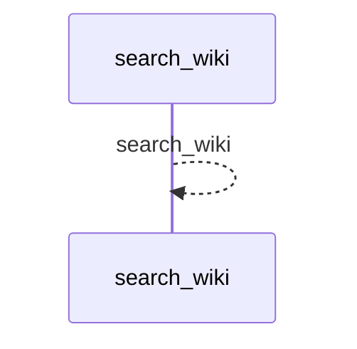
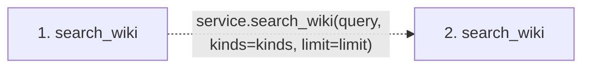

# search_wiki

**Entry point:** `search_wiki` (`mcp`)
**Source:** [mcp_server](../modules/mcp_server.md)
**Modules touched:** [mcp_server](../modules/mcp_server.md)

## Call sequence

<!-- Auto-generated from static call edges. Dashed arrows are external or unresolved calls. Reviewed runtime conditions and side effects belong in Behavior. -->

## Data flow

<!-- Auto-generated static analysis. Treat values and boundaries as best-effort hints, not runtime proof. -->

### Step data

| Step | Inputs | Reads | Writes | Returns |
|---|---|---|---|---|
| `search_wiki` | `query: str`, `kinds: list[str] \| None`, `limit: int` | - | - | `service.search_wiki(...)` |
| `search_wiki` | - | - | - | - |

### Call data

| From | To | Line | Call |
|---|---|---:|---|
| search_wiki | search_wiki | 1025 | `service.search_wiki(query, kinds=kinds, limit=limit)` |

### Boundary effects

*No boundary effects detected.*

### Static analysis gaps

| Kind | Step | Target | Line |
|---|---|---|---:|
| unresolved_call | `search_wiki` | `service.search_wiki` | 1025 |

## Behavior

Checks that the live source-selection boundary still matches the server pin,
validates the nonempty query, requested surface kinds, and bounded limit, then
performs a case-insensitive scan of registered Markdown pages. Results contain
the canonical kind, id, URI, path, title, and a local snippet. Exact total and
returned counts disclose whether the bounded result was truncated.
