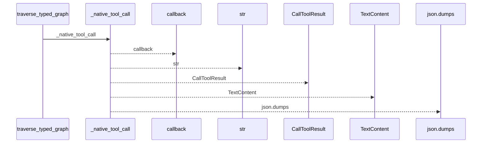
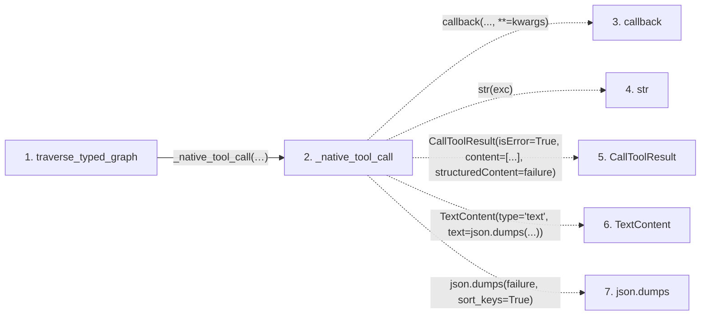

# traverse_typed_graph

**Entry point:** `traverse_typed_graph` (`mcp`)
**Source:** [mcp_server](../modules/mcp_server.md)
**Modules touched:** [mcp_server](../modules/mcp_server.md)

## Call sequence

<!-- Auto-generated from static call edges. Dashed arrows are external or unresolved calls. Reviewed runtime conditions and side effects belong in Behavior. -->

## Data flow

<!-- Auto-generated static analysis. Treat values and boundaries as best-effort hints, not runtime proof. -->

### Step data

| Step | Inputs | Reads | Writes | Returns |
|---|---|---|---|---|
| `traverse_typed_graph` | `locator_or_exact_route: str`, `direction: str`, `kinds: list[str] \| None`, `origins: list[str] \| None`, `resolutions: list[str] \| None`, `include_evidence: bool`, `limit: int` | - | - | `_native_tool_call(...)` |
| `_native_tool_call` | `callback: Callable[..., Any]`, `args`, `kwargs` | `McpWikiError` | - | `callback(...)`, `CallToolResult(...)` |
| `callback` | - | - | - | - |
| `str` | - | - | - | - |
| `CallToolResult` | - | - | - | - |
| `TextContent` | - | - | - | - |
| `json.dumps` | - | - | - | - |

### Call data

| From | To | Line | Call |
|---|---|---:|---|
| traverse_typed_graph | _native_tool_call | 1272 | `_native_tool_call(service.traverse_typed_graph, locator_or_exact_route, direction=direction, kinds=kinds, origins=origins, resolutions=resolutions, include_evidence=include_evidence, limit=limit)` |
| _native_tool_call | callback | 1175 | `callback(..., **=kwargs)` |
| _native_tool_call | str | 1183 | `str(exc)` |
| _native_tool_call | CallToolResult | 1187 | `CallToolResult(isError=True, content=[...], structuredContent=failure)` |
| _native_tool_call | TextContent | 1189 | `TextContent(type='text', text=json.dumps(...))` |
| _native_tool_call | json.dumps | 1189 | `json.dumps(failure, sort_keys=True)` |

### Boundary effects

*No boundary effects detected.*

### Static analysis gaps

| Kind | Step | Target | Line |
|---|---|---|---:|
| unresolved_call | `_native_tool_call` | `callback` | 1175 |
| external_call | `_native_tool_call` | `CallToolResult` | 1187 |
| external_call | `_native_tool_call` | `TextContent` | 1189 |
| external_call | `_native_tool_call` | `json.dumps` | 1189 |

## Behavior

This flow starts at `traverse_typed_graph` and is classified as `mcp`. The generated call and data-flow sections are bounded static projections; runtime conditions and side effects require source-level confirmation.
