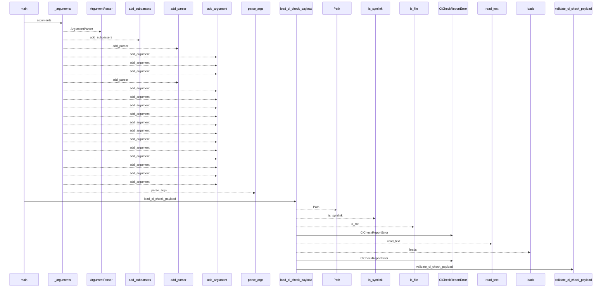
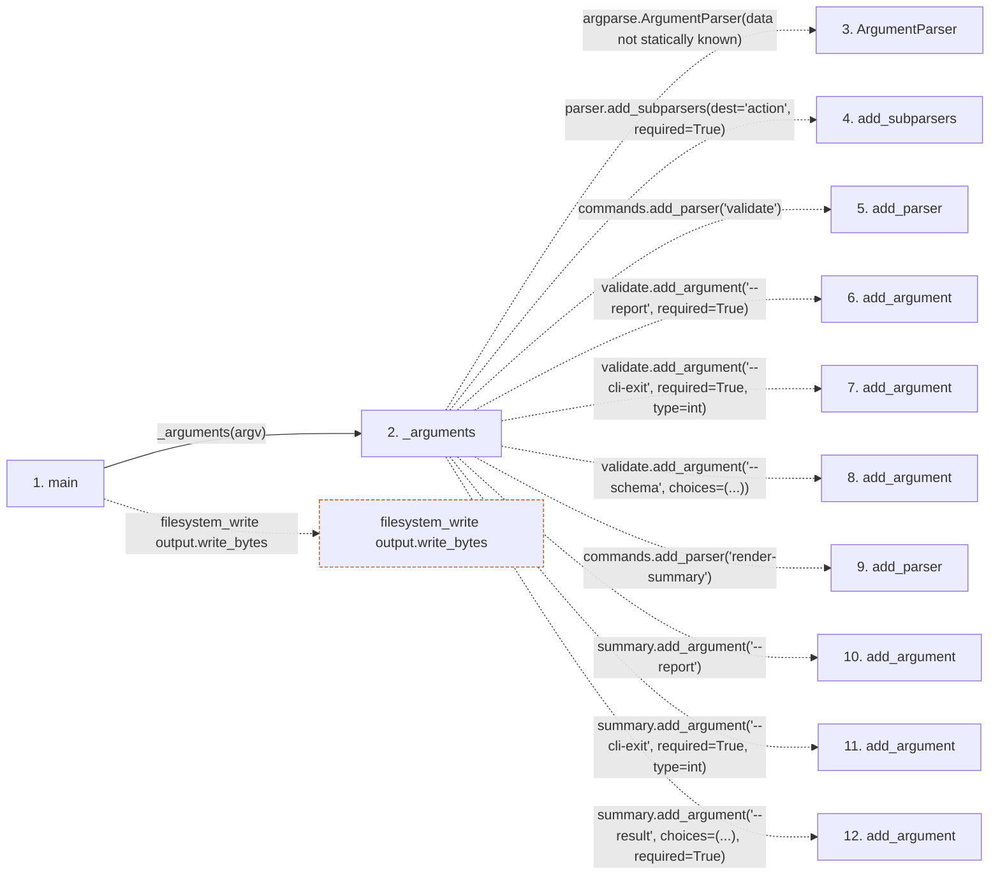

# ci_report

**Entry point:** `main` (`process`)
**Source:** [ci_report](../modules/ci_report.md)
**Modules touched:** [ci_report](../modules/ci_report.md), [knowledge_observability](../modules/knowledge_observability.md)

**Related modules:** [doctor_service](../modules/doctor_service.md), [knowledge_observability](../modules/knowledge_observability.md), [lint_service](../modules/lint_service.md), [services_contracts](../modules/services_contracts.md)

## Call sequence

<!-- Auto-generated from static call edges. Dashed arrows are external or unresolved calls. Reviewed runtime conditions and side effects belong in Behavior. -->

> Call sequence diagram shows 30 of 382 interactions; 352 omitted to keep the visualization within the 30-interaction and generated-diagram limits.

## Data flow

<!-- Auto-generated static analysis. Treat values and boundaries as best-effort hints, not runtime proof. -->

### Step data

| Step | Inputs | Reads | Writes | Returns |
|---|---|---|---|---|
| `main` | `argv: Sequence[str] \| None` | `CiCheckReportError` | - | `0`, `0` |
| `_arguments` | `argv: Sequence[str] \| None` | - | - | `parser.parse_args(...)` |
| `ArgumentParser` | - | - | - | - |
| `add_subparsers` | - | - | - | - |
| `add_parser` | - | - | - | - |
| `add_argument` | - | - | - | - |
| `add_argument` | - | - | - | - |
| `add_argument` | - | - | - | - |
| `add_parser` | - | - | - | - |
| `add_argument` | - | - | - | - |
| `add_argument` | - | - | - | - |
| `add_argument` | - | - | - | - |

### Call data

| From | To | Line | Call |
|---|---|---:|---|
| main | _arguments | 1451 | `_arguments(argv)` |
| _arguments | ArgumentParser | 1425 | `argparse.ArgumentParser(data not statically known)` |
| _arguments | add_subparsers | 1426 | `parser.add_subparsers(dest='action', required=True)` |
| _arguments | add_parser | 1427 | `commands.add_parser('validate')` |
| _arguments | add_argument | 1428 | `validate.add_argument('--report', required=True)` |
| _arguments | add_argument | 1429 | `validate.add_argument('--cli-exit', required=True, type=int)` |
| _arguments | add_argument | 1430 | `validate.add_argument('--schema', choices=(...))` |
| _arguments | add_parser | 1432 | `commands.add_parser('render-summary')` |
| _arguments | add_argument | 1433 | `summary.add_argument('--report')` |
| _arguments | add_argument | 1434 | `summary.add_argument('--cli-exit', required=True, type=int)` |
| _arguments | add_argument | 1435 | `summary.add_argument('--result', choices=(...), required=True)` |

### Boundary effects

| Kind | Target | Step | Line |
|---|---|---|---:|
| filesystem_write | `output.write_bytes` | `main` | 1489 |

### Static analysis gaps

| Kind | Step | Target | Line |
|---|---|---|---:|
| external_call | `_arguments` | `argparse.ArgumentParser` | 1425 |
| unresolved_call | `_arguments` | `parser.add_subparsers` | 1426 |
| unresolved_call | `_arguments` | `commands.add_parser` | 1427 |
| unresolved_call | `_arguments` | `validate.add_argument` | 1428 |
| unresolved_call | `_arguments` | `validate.add_argument` | 1429 |
| unresolved_call | `_arguments` | `validate.add_argument` | 1430 |
| unresolved_call | `_arguments` | `commands.add_parser` | 1432 |
| unresolved_call | `_arguments` | `summary.add_argument` | 1433 |
| unresolved_call | `_arguments` | `summary.add_argument` | 1434 |
| unresolved_call | `_arguments` | `summary.add_argument` | 1435 |
| step_limit | `main` | `first 12 steps` | 0 |

## Behavior

This flow starts at `main` and is classified as `process`. The generated call and data-flow sections are bounded static projections; runtime conditions and side effects require source-level confirmation.
