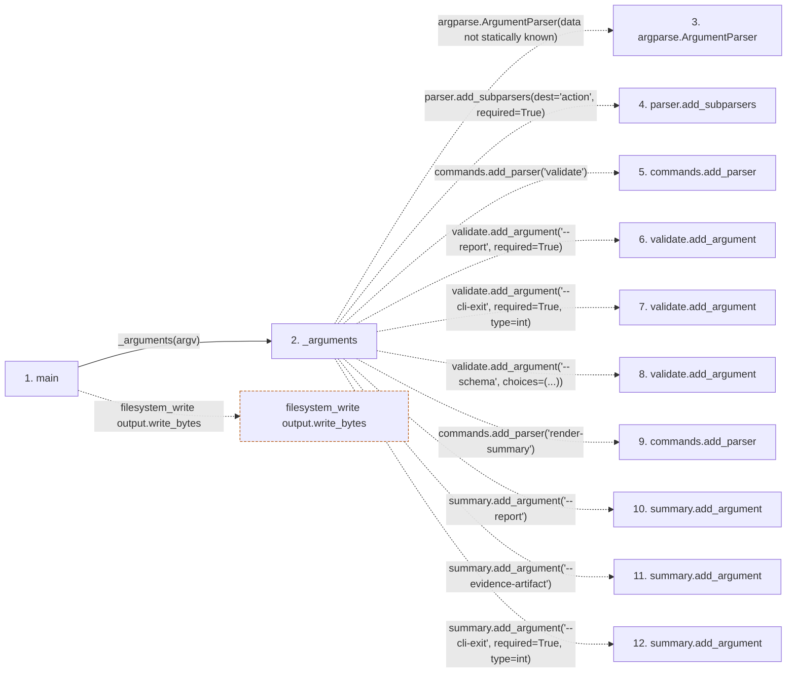

# ci_report

**Entry point:** `main` (`process`)
**Source:** [ci_report](../modules/ci_report.md)
**Modules touched:** [analysis_compatibility](../modules/analysis_compatibility.md), [ci_report](../modules/ci_report.md), [health_contract](../modules/health_contract.md), [health_summary](../modules/health_summary.md), and 1 more

**Complete modules touched:**

- [analysis_compatibility](../modules/analysis_compatibility.md)
- [ci_report](../modules/ci_report.md)
- [health_contract](../modules/health_contract.md)
- [health_summary](../modules/health_summary.md)
- [knowledge_observability](../modules/knowledge_observability.md)

**Related modules:** [doctor_service](../modules/doctor_service.md), [health_contract](../modules/health_contract.md), [health_summary](../modules/health_summary.md), and 3 more

**Complete related modules:**

- [doctor_service](../modules/doctor_service.md)
- [health_contract](../modules/health_contract.md)
- [health_summary](../modules/health_summary.md)
- [knowledge_observability](../modules/knowledge_observability.md)
- [lint_service](../modules/lint_service.md)
- [services_contracts](../modules/services_contracts.md)

## Call sequence

> Static overview in presentation order, not runtime execution order. Arrows retain captured callers; representative internal continuations and boundary examples precede repeated helper detail.

<!-- Auto-generated from static call edges. Dashed arrows are external or unresolved calls. Reviewed runtime conditions and side effects belong in Behavior. -->

```mermaid
sequenceDiagram
    participant p0 as main
    participant p1 as load_ci_check_payload
    participant p2 as render_ci_summary
    participant p3 as _arguments
    participant p4 as CiCheckReportError
    participant p5 as validate_ci_check_payload
    participant p6 as assurance_rows
    participant p7 as _health_detail_lines
    participant p8 as _bounded_summary
    participant p9 as detailed_health_rows
    participant p10 as _validate_ci_v3
    participant p11 as _validate_lint_findings
    participant p12 as _validate_execution
    participant p13 as _validate_knowledge_summary
    participant p14 as diagnostic_groups
    participant p15 as validate_doctor_payload
    participant p16 as _array
    participant p17 as captured_analysis_diagnostic
    participant p18 as _positive_integer
    participant p19 as _validate_ci_v2
    participant p20 as _count_mapping
    participant p21 as _canonical_plan_ids
    participant p22 as analysis_diagnostic
    participant p23 as _exact_object
    participant p24 as captured_components
    participant p25 as validate_health_details
    participant p26 as _contract_object
    participant p27 as _string
    participant p28 as _validate_doctor
    participant p29 as Path (src/llm_wiki_cli/services/ci_report.py:main)
    participant p30 as status_path.is_symlink
    p0->>p1: load_ci_check_payload
    p0->>p2: render_ci_summary
    p0->>p3: _arguments
    p0->>p4: CiCheckReportError
    p1->>p5: validate_ci_check_payload
    p2->>p6: assurance_rows
    p2->>p7: _health_detail_lines
    p2->>p8: _bounded_summary
    p7->>p9: detailed_health_rows
    p5->>p10: _validate_ci_v3
    p5->>p11: _validate_lint_findings
    p5->>p12: _validate_execution
    p5->>p13: _validate_knowledge_summary
    p7->>p14: diagnostic_groups
    p10->>p15: validate_doctor_payload
    p11->>p16: _array
    p9->>p17: captured_analysis_diagnostic
    p12->>p18: _positive_integer
    p10->>p19: _validate_ci_v2
    p13->>p20: _count_mapping
    p12->>p21: _canonical_plan_ids
    p17->>p22: analysis_diagnostic
    p15->>p23: _exact_object
    p17->>p24: captured_components
    p15->>p25: validate_health_details
    p15->>p26: _contract_object
    p15->>p27: _string
    p15->>p28: _validate_doctor
    p0-->>p29: Path (src/llm_wiki_cli/services/ci_report.py:main)(args.status_path)
    p0-->>p30: status_path.is_symlink
```

> Call sequence diagram shows 30 of 636 interactions; 606 omitted to keep the visualization within the 30-interaction and generated-diagram limits, with uncertain identities omitted rather than inferred.

> Captured boundary calls: external 1 of 159 (158 omitted); unresolved 1 of 130 (129 omitted). These counts cover the captured static trace.

Omitted captured detail, grouped by actual caller occurrence and target module:

| Caller | Parent step | Target module | Kind | Omitted interactions |
| --- | --- | --- | --- | --- |
| `src/llm_wiki_cli/services/ci_report.py:_arguments` | 2 | - | external | 1 |
| `src/llm_wiki_cli/services/ci_report.py:_arguments` | 2 | - | unresolved | 20 |
| `src/llm_wiki_cli/services/ci_report.py:load_ci_check_payload` | 24 | - | external | 2 |
| `src/llm_wiki_cli/services/ci_report.py:load_ci_check_payload` | 24 | - | unresolved | 3 |
| `src/llm_wiki_cli/services/ci_report.py:load_ci_check_payload` | 24 | [src/llm_wiki_cli/services/ci_report.py](../modules/ci_report.md) | internal | 2 |
| `src/llm_wiki_cli/services/ci_report.py:validate_ci_check_payload` | 32 | - | external | 9 |
| `src/llm_wiki_cli/services/ci_report.py:validate_ci_check_payload` | 32 | - | unresolved | 2 |
| `src/llm_wiki_cli/services/ci_report.py:validate_doctor_payload` | 36 | - | external | 2 |
> Omission summary shows 8 of 92 groups; 84 further groups are not expanded here. Counts above include all omitted interactions.
> Detailed flow queries retain their own coverage and limits; omitted paths may execute at runtime.

> Trace truncated at the depth limit; deeper calls are omitted.

## Data flow

<!-- Auto-generated static analysis. Treat values and boundaries as best-effort hints, not runtime proof. -->

```mermaid
flowchart LR
    s1["1. main"]
    s2["2. _arguments"]
    s3["3. argparse.ArgumentParser"]
    s4["4. parser.add_subparsers"]
    s5["5. commands.add_parser"]
    s6["6. validate.add_argument"]
    s7["7. validate.add_argument"]
    s8["8. validate.add_argument"]
    s9["9. commands.add_parser"]
    s10["10. summary.add_argument"]
    s11["11. summary.add_argument"]
    s12["12. summary.add_argument"]
    s1 -->|"_arguments(argv)"| s2
    s2 -. "argparse.ArgumentParser(data not statically known)" .-> s3
    s2 -. "parser.add_subparsers(dest='action', required=True)" .-> s4
    s2 -. "commands.add_parser('validate')" .-> s5
    s2 -. "validate.add_argument('--report', required=True)" .-> s6
    s2 -. "validate.add_argument('--cli-exit', required=True, type=int)" .-> s7
    s2 -. "validate.add_argument('--schema', choices=(...))" .-> s8
    s2 -. "commands.add_parser('render-summary')" .-> s9
    s2 -. "summary.add_argument('--report')" .-> s10
    s2 -. "summary.add_argument('--evidence-artifact')" .-> s11
    s2 -. "summary.add_argument('--cli-exit', required=True, type=int)" .-> s12
    b0["filesystem_write output.write_bytes"]
    s1 -. "filesystem_write output.write_bytes" .-> b0
    click s1 "../modules/ci_report.md"
    click s2 "../modules/ci_report.md"
    classDef boundary stroke:#b45309,stroke-dasharray: 4 2
    class b0 boundary
```

### Step data

| Step | Inputs | Reads | Writes | Returns |
|---|---|---|---|---|
| `main` | `argv: Sequence[str] \| None` | `CiCheckReportError` | - | `0`, `0` |
| `_arguments` | `argv: Sequence[str] \| None` | - | - | `parser.parse_args(...)` |
| `argparse.ArgumentParser` | - | - | - | - |
| `parser.add_subparsers` | - | - | - | - |
| `commands.add_parser` | - | - | - | - |
| `validate.add_argument` | - | - | - | - |
| `validate.add_argument` | - | - | - | - |
| `validate.add_argument` | - | - | - | - |
| `commands.add_parser` | - | - | - | - |
| `summary.add_argument` | - | - | - | - |
| `summary.add_argument` | - | - | - | - |
| `summary.add_argument` | - | - | - | - |

### Call data

| From | To | Line | Call |
|---|---|---:|---|
| main | _arguments | 1607 | `_arguments(argv)` |
| _arguments | argparse.ArgumentParser | 1580 | `argparse.ArgumentParser(data not statically known)` |
| _arguments | parser.add_subparsers | 1581 | `parser.add_subparsers(dest='action', required=True)` |
| _arguments | commands.add_parser | 1582 | `commands.add_parser('validate')` |
| _arguments | validate.add_argument | 1583 | `validate.add_argument('--report', required=True)` |
| _arguments | validate.add_argument | 1584 | `validate.add_argument('--cli-exit', required=True, type=int)` |
| _arguments | validate.add_argument | 1585 | `validate.add_argument('--schema', choices=(...))` |
| _arguments | commands.add_parser | 1587 | `commands.add_parser('render-summary')` |
| _arguments | summary.add_argument | 1588 | `summary.add_argument('--report')` |
| _arguments | summary.add_argument | 1589 | `summary.add_argument('--evidence-artifact')` |
| _arguments | summary.add_argument | 1590 | `summary.add_argument('--cli-exit', required=True, type=int)` |

### Boundary effects

| Kind | Target | Step | Line |
|---|---|---|---:|
| filesystem_write | `output.write_bytes` | `main` | 1647 |

### Static analysis gaps

| Kind | Step | Target | Line |
|---|---|---|---:|
| external_call | `_arguments` | `argparse.ArgumentParser` | 1580 |
| unresolved_call | `_arguments` | `parser.add_subparsers` | 1581 |
| unresolved_call | `_arguments` | `commands.add_parser` | 1582 |
| unresolved_call | `_arguments` | `validate.add_argument` | 1583 |
| unresolved_call | `_arguments` | `validate.add_argument` | 1584 |
| unresolved_call | `_arguments` | `validate.add_argument` | 1585 |
| unresolved_call | `_arguments` | `commands.add_parser` | 1587 |
| unresolved_call | `_arguments` | `summary.add_argument` | 1588 |
| unresolved_call | `_arguments` | `summary.add_argument` | 1589 |
| unresolved_call | `_arguments` | `summary.add_argument` | 1590 |
| step_limit | `main` | `first 12 steps` | 0 |
| truncated_flow | `main` | `depth limit` | 0 |

## Behavior

This flow starts at `main` and is classified as `process`. The generated call and data-flow sections are bounded static projections; runtime conditions and side effects require source-level confirmation.
