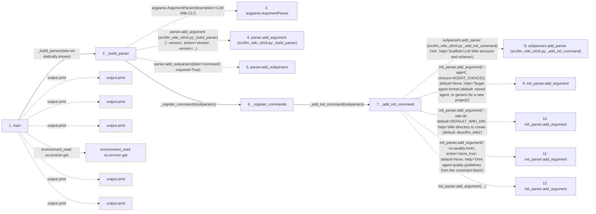

# cli

**Entry point:** `main` (`process`)
**Source:** [cli](../modules/cli.md)
**Modules touched:** [cli](../modules/cli.md), [progress](../modules/progress.md), [resource_diagnostics](../modules/resource_diagnostics.md)

**Related modules:** [config](../modules/config.md), [extraction_jobs](../modules/extraction_jobs.md), [llm_wiki_cli___init__](../modules/llm_wiki_cli___init__.md), [progress](../modules/progress.md), and 3 more

**Complete related modules:**

- [config](../modules/config.md)
- [extraction_jobs](../modules/extraction_jobs.md)
- [llm_wiki_cli___init__](../modules/llm_wiki_cli___init__.md)
- [progress](../modules/progress.md)
- [resource_diagnostics](../modules/resource_diagnostics.md)
- [runtime_output](../modules/runtime_output.md)
- [services_contracts](../modules/services_contracts.md)

## Call sequence

```mermaid
sequenceDiagram
    participant p0 as main
    participant p1 as _build_parser
    participant p2 as argparse.ArgumentParser
    participant p3 as parser.add_argument (src/llm_wiki_cli/cli.py:_build_parser)
    participant p4 as parser.add_subparsers
    participant p5 as _register_commands
    participant p6 as _add_init_command
    participant p7 as subparsers.add_parser (src/llm_wiki_cli/cli.py:_add_init_command)
    participant p8 as init_parser.add_argument
    participant p9 as init_parser.add_mutually_exclusive_group
    participant p10 as init_issue_reporting.add_argument
    participant p11 as _add_source_selection_argument
    participant p12 as parser.add_argument (src/llm_wiki_cli/cli.py:_…source_selection_argument)
    participant p13 as _add_extract_command
    participant p14 as subparsers.add_parser (src/llm_wiki_cli/cli.py:_add_extract_command)
    participant p15 as extract_parser.add_argument
    participant p16 as _add_include_tests_argument
    participant p17 as parser.add_argument (src/llm_wiki_cli/cli.py:_add_include_tests_argument)
    participant p18 as _add_helper_cache_argument
    participant p19 as parser.add_argument (src/llm_wiki_cli/cli.py:_add_helper_cache_argument)
    p0->>p1: _build_parser
    p1-->>p2: argparse.ArgumentParser
    p1-->>p3: parser.add_argument (src/llm_wiki_cli/cli.py:_build_parser)
    p1-->>p4: parser.add_subparsers
    p1->>p5: _register_commands
    p5->>p6: _add_init_command
    p6-->>p7: subparsers.add_parser (src/llm_wiki_cli/cli.py:_add_init_command)
    p6-->>p8: init_parser.add_argument
    p6-->>p8: init_parser.add_argument
    p6-->>p8: init_parser.add_argument
    p6-->>p8: init_parser.add_argument
    p6-->>p9: init_parser.add_mutually_exclusive_group
    p6-->>p10: init_issue_reporting.add_argument
    p6-->>p10: init_issue_reporting.add_argument
    p6->>p11: _add_source_selection_argument
    p11-->>p12: parser.add_argument (src/llm_wiki_cli/cli.py:_…source_selection_argument)
    p5->>p13: _add_extract_command
    p13-->>p14: subparsers.add_parser (src/llm_wiki_cli/cli.py:_add_extract_command)
    p13-->>p15: extract_parser.add_argument
    p13-->>p15: extract_parser.add_argument
    p13-->>p15: extract_parser.add_argument
    p13-->>p15: extract_parser.add_argument
    p13-->>p15: extract_parser.add_argument
    p13-->>p15: extract_parser.add_argument
    p13-->>p15: extract_parser.add_argument
    p13-->>p15: extract_parser.add_argument
    p13->>p16: _add_include_tests_argument
    p16-->>p17: parser.add_argument (src/llm_wiki_cli/cli.py:_add_include_tests_argument)
    p13->>p18: _add_helper_cache_argument
    p18-->>p19: parser.add_argument (src/llm_wiki_cli/cli.py:_add_helper_cache_argument)
```

<!-- Auto-generated from static call edges. Dashed arrows are external or unresolved calls. Reviewed runtime conditions and side effects belong in Behavior. -->

> Call sequence diagram shows 30 of 548 interactions; 518 omitted to keep the visualization within the 30-interaction and generated-diagram limits.

## Data flow

<!-- Auto-generated static analysis. Treat values and boundaries as best-effort hints, not runtime proof. -->

### Step data

| Step | Inputs | Reads | Writes | Returns |
|---|---|---|---|---|
| `main` | - | `PathValidationError`, `sys`, `RuntimeOutputError`, `sys`, `sys`, `sys` | - | - |
| `_build_parser` | - | `__version__` | - | `parser` |
| `argparse.ArgumentParser` | - | - | - | - |
| `parser.add_argument (src/llm_wiki_cli/cli.py:_build_parser)` | - | - | - | - |
| `parser.add_subparsers` | - | - | - | - |
| `_register_commands` | `subparsers` | - | - | - |
| `_add_init_command` | `subparsers` | `AGENT_CHOICES`, `DEFAULT_WIKI_DIR` | - | - |
| `subparsers.add_parser (src/llm_wiki_cli/cli.py:_add_init_command)` | - | - | - | - |
| `init_parser.add_argument` | - | - | - | - |
| `init_parser.add_argument` | - | - | - | - |
| `init_parser.add_argument` | - | - | - | - |
| `init_parser.add_argument` | - | - | - | - |

### Call data

| From | To | Line | Call |
|---|---|---:|---|
| main | _build_parser | 2346 | `_build_parser(data not statically known)` |
| _build_parser | argparse.ArgumentParser | 162 | `argparse.ArgumentParser(description='LLM Wiki CLI')` |
| _build_parser | parser.add_argument (src/llm_wiki_cli/cli.py:_build_parser) | 163 | `parser.add_argument('--version', action='version', version=...)` |
| _build_parser | parser.add_subparsers | 166 | `parser.add_subparsers(dest='command', required=True)` |
| _build_parser | _register_commands | 167 | `_register_commands(subparsers)` |
| _register_commands | _add_init_command | 172 | `_add_init_command(subparsers)` |
| _add_init_command | subparsers.add_parser (src/llm_wiki_cli/cli.py:_add_init_command) | 241 | `subparsers.add_parser('init', help='Scaffold LLM Wiki structure and schema')` |
| _add_init_command | init_parser.add_argument | 244 | `init_parser.add_argument('--agent', choices=AGENT_CHOICES, default=None, help='Target agent format (default: stored agent, or generic for a new project)')` |
| _add_init_command | init_parser.add_argument | 250 | `init_parser.add_argument('--wiki-dir', default=DEFAULT_WIKI_DIR, help='Wiki directory to create (default: docs/llm_wiki)')` |
| _add_init_command | init_parser.add_argument | 255 | `init_parser.add_argument('--no-quality-hints', action='store_true', default=None, help='Omit agent quality guidelines from the constraint block')` |
| _add_init_command | init_parser.add_argument | 261 | `init_parser.add_argument('--no-skills', action='store_true', default=None, help="Skip installing the wiki-reference skill into the agent's skills directory (.claude/skills for claude, .llm-wiki/skills otherwise)")` |

### Boundary effects

| Kind | Target | Step | Line |
|---|---|---|---:|
| output | `print` | `main` | 2352 |
| output | `print` | `main` | 2355 |
| output | `print` | `main` | 2358 |
| environment_read | `os.environ.get` | `main` | 2361 |
| output | `print` | `main` | 2363 |
| output | `print` | `main` | 2366 |

### Static analysis gaps

| Kind | Step | Target | Line |
|---|---|---|---:|
| external_call | `_build_parser` | `argparse.ArgumentParser` | 162 |
| unresolved_call | `_build_parser` | `parser.add_argument` | 163 |
| unresolved_call | `_build_parser` | `parser.add_subparsers` | 166 |
| unresolved_call | `_add_init_command` | `subparsers.add_parser` | 241 |
| unresolved_call | `_add_init_command` | `init_parser.add_argument` | 244 |
| unresolved_call | `_add_init_command` | `init_parser.add_argument` | 250 |
| unresolved_call | `_add_init_command` | `init_parser.add_argument` | 255 |
| unresolved_call | `_add_init_command` | `init_parser.add_argument` | 261 |
| step_limit | `main` | `first 12 steps` | 0 |

## Behavior

This flow starts at `main` and is classified as `process`. The generated call and data-flow sections are bounded static projections; runtime conditions and side effects require source-level confirmation.
