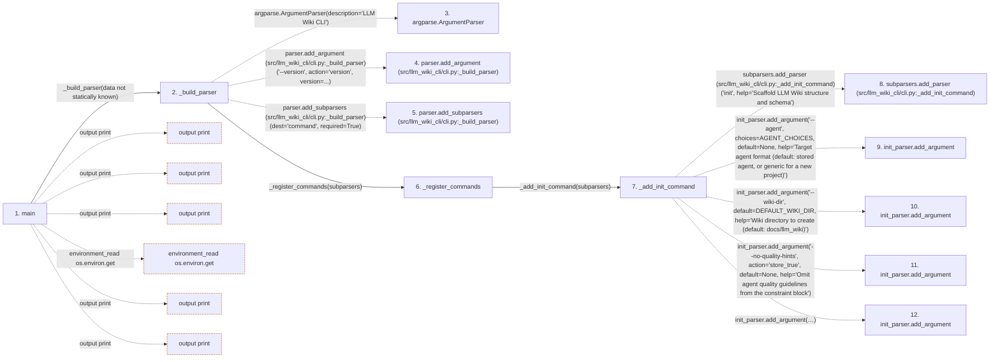

# cli

**Entry point:** `main` (`process`)
**Source:** [cli](../modules/cli.md)
**Modules touched:** [analysis_compatibility](../modules/analysis_compatibility.md), [cli](../modules/cli.md), [progress](../modules/progress.md), [resource_diagnostics](../modules/resource_diagnostics.md)

**Related modules:** [analysis_compatibility](../modules/analysis_compatibility.md), [commands___init__](../modules/commands___init__.md), [config](../modules/config.md), [extraction_jobs](../modules/extraction_jobs.md), and 6 more

**Complete related modules:**

- [analysis_compatibility](../modules/analysis_compatibility.md)
- [commands___init__](../modules/commands___init__.md)
- [config](../modules/config.md)
- [extraction_jobs](../modules/extraction_jobs.md)
- [llm_wiki_cli___init__](../modules/llm_wiki_cli___init__.md)
- [maintenance_queue](../modules/maintenance_queue.md)
- [progress](../modules/progress.md)
- [resource_diagnostics](../modules/resource_diagnostics.md)
- [runtime_output](../modules/runtime_output.md)
- [services_contracts](../modules/services_contracts.md)

## Call sequence

> Static overview in presentation order, not runtime execution order. Arrows retain captured callers; representative internal continuations and boundary examples precede repeated helper detail.

<!-- Auto-generated from static call edges. Dashed arrows are external or unresolved calls. Reviewed runtime conditions and side effects belong in Behavior. -->

```mermaid
sequenceDiagram
    participant p0 as main
    participant p1 as _build_parser
    participant p2 as comparison_scope
    participant p3 as _dispatch_command
    participant p4 as resource_failure_hint
    participant p5 as _register_commands
    participant p6 as _add_init_command
    participant p7 as _add_extract_command
    participant p8 as _add_lint_command
    participant p9 as _add_prepare_extractors_command
    participant p10 as _add_ci_check_command
    participant p11 as _add_knowledge_command
    participant p12 as _add_team_command
    participant p13 as _add_trigger_agent_command
    participant p14 as _add_bootstrap_command
    participant p15 as _add_generate_prompt_command
    participant p16 as _add_metrics_command
    participant p17 as _add_review_command
    participant p18 as _add_search_command
    participant p19 as _add_status_command
    participant p20 as _add_queue_command
    participant p21 as _add_maintenance_command
    participant p22 as _add_query_command
    participant p23 as _add_task_context_command
    participant p24 as _add_mcp_command
    participant p25 as _add_obsidian_command
    participant p26 as _add_site_command
    participant p27 as _add_skills_command
    participant p28 as _add_upgrade_command
    participant p29 as getattr
    participant p30 as parser.parse_args
    p0->>p1: _build_parser
    p0->>p2: comparison_scope
    p0->>p3: _dispatch_command
    p0->>p4: resource_failure_hint
    p1->>p5: _register_commands
    p5->>p6: _add_init_command
    p5->>p7: _add_extract_command
    p5->>p8: _add_lint_command
    p5->>p9: _add_prepare_extractors_command
    p5->>p10: _add_ci_check_command
    p5->>p11: _add_knowledge_command
    p5->>p12: _add_team_command
    p5->>p13: _add_trigger_agent_command
    p5->>p14: _add_bootstrap_command
    p5->>p15: _add_generate_prompt_command
    p5->>p16: _add_metrics_command
    p5->>p17: _add_review_command
    p5->>p18: _add_search_command
    p5->>p19: _add_status_command
    p5->>p20: _add_queue_command
    p5->>p21: _add_maintenance_command
    p5->>p22: _add_query_command
    p5->>p23: _add_task_context_command
    p5->>p24: _add_mcp_command
    p5->>p25: _add_obsidian_command
    p5->>p26: _add_site_command
    p5->>p27: _add_skills_command
    p5->>p28: _add_upgrade_command
    p0-->>p29: getattr(args, 'comparison_policy', 'auto')
    p0-->>p30: parser.parse_args
```

> Call sequence diagram shows 30 of 723 interactions; 693 omitted to keep the visualization within the 30-interaction and generated-diagram limits, with uncertain identities omitted rather than inferred.

> Captured boundary calls: external 1 of 24 (23 omitted); unresolved 1 of 564 (563 omitted). These counts cover the captured static trace.

Omitted captured detail, grouped by actual caller occurrence and target module:

| Caller | Parent step | Target module | Kind | Omitted interactions |
| --- | --- | --- | --- | --- |
| `src/llm_wiki_cli/cli.py:_build_parser` | 2 | - | external | 1 |
| `src/llm_wiki_cli/cli.py:_build_parser` | 2 | - | unresolved | 2 |
| `src/llm_wiki_cli/cli.py:_add_init_command` | 7 | - | unresolved | 9 |
| `src/llm_wiki_cli/cli.py:_add_init_command` | 7 | [src/llm_wiki_cli/cli.py](../modules/cli.md) | internal | 2 |
| `src/llm_wiki_cli/cli.py:_add_helper_cache_argument` | 14 | - | unresolved | 1 |
| `src/llm_wiki_cli/cli.py:_add_source_selection_argument` | 19 | - | unresolved | 1 |
| `src/llm_wiki_cli/cli.py:_add_extract_command` | 21 | - | unresolved | 12 |
| `src/llm_wiki_cli/cli.py:_add_extract_command` | 21 | [src/llm_wiki_cli/cli.py](../modules/cli.md) | internal | 3 |
> Omission summary shows 8 of 91 groups; 83 further groups are not expanded here. Counts above include all omitted interactions.
> Detailed flow queries retain their own coverage and limits; omitted paths may execute at runtime.

## Data flow

<!-- Auto-generated static analysis. Treat values and boundaries as best-effort hints, not runtime proof. -->

### Analysis coverage

**Effect analysis partially available.** Flow assembly and source effect analysis are separate; empty observations do not prove an empty handler body.

Source steps: 136; effect analysis evaluated: 134, partial: 1, unavailable: 1. Counts include steps omitted from the displayed trace.

Collector observations for 135 source steps with known totals: observed: 313, emitted: 309, omitted: 4. Unavailable totals are excluded.

- Callable record unavailable; the selected entry symbol has no represented callable body.
- Effect collector omitted observations before flow assembly; displayed effects are partial.
- Effect collector totals unavailable; observed counts cover captured records only.

| Step | Callable record | Effect analysis | Collector totals | Observed | Emitted | Omitted |
|---|---|---|---|---:|---:|---:|
| `main` | `available` | `evaluated` | `available` | `12` | `12` | `0` |
| `_build_parser` | `available` | `evaluated` | `available` | `2` | `2` | `0` |
| `argparse.ArgumentParser` | `not_applicable` | `not_applicable` | `not_applicable` | — | — | — |
| `parser.add_argument (src/llm_wiki_cli/cli.py:_build_parser)` | `not_applicable` | `not_applicable` | `not_applicable` | — | — | — |
| `parser.add_subparsers (src/llm_wiki_cli/cli.py:_build_parser)` | `not_applicable` | `not_applicable` | `not_applicable` | — | — | — |
| `_register_commands` | `available` | `evaluated` | `available` | `1` | `1` | `0` |
| `_add_init_command` | `available` | `evaluated` | `available` | `3` | `3` | `0` |
| `subparsers.add_parser (src/llm_wiki_cli/cli.py:_add_init_command)` | `not_applicable` | `not_applicable` | `not_applicable` | — | — | — |
| `init_parser.add_argument` | `not_applicable` | `not_applicable` | `not_applicable` | — | — | — |
| `init_parser.add_argument` | `not_applicable` | `not_applicable` | `not_applicable` | — | — | — |
| `init_parser.add_argument` | `not_applicable` | `not_applicable` | `not_applicable` | — | — | — |
| `init_parser.add_argument` | `not_applicable` | `not_applicable` | `not_applicable` | — | — | — |

```mermaid
flowchart LR
    s1["1. main"]
    s2["2. _build_parser"]
    s3["3. argparse.ArgumentParser"]
    s4["4. parser.add_argument (src/llm_wiki_cli/cli.py:_build_parser)"]
    s5["5. parser.add_subparsers (src/llm_wiki_cli/cli.py:_build_parser)"]
    s6["6. _register_commands"]
    s7["7. _add_init_command"]
    s8["8. subparsers.add_parser (src/llm_wiki_cli/cli.py:_add_init_command)"]
    s9["9. init_parser.add_argument"]
    s10["10. init_parser.add_argument"]
    s11["11. init_parser.add_argument"]
    s12["12. init_parser.add_argument"]
    s1 -->|"_build_parser(data not statically known)"| s2
    s2 -. "argparse.ArgumentParser(description='LLM Wiki CLI')" .-> s3
    s2 -. "parser.add_argument (src/llm_wiki_cli/cli.py:_build_parser)('--version', action='version', version=...)" .-> s4
    s2 -. "parser.add_subparsers (src/llm_wiki_cli/cli.py:_build_parser)(dest='command', required=True)" .-> s5
    s2 -->|"_register_commands(subparsers)"| s6
    s6 -->|"_add_init_command(subparsers)"| s7
    s7 -. "subparsers.add_parser (src/llm_wiki_cli/cli.py:_add_init_command)('init', help='Scaffold LLM Wiki structure and schema')" .-> s8
    s7 -. "init_parser.add_argument('--agent', choices=AGENT_CHOICES, default=None, help='Target agent format (default: stored agent, or generic for a new project)')" .-> s9
    s7 -. "init_parser.add_argument('--wiki-dir', default=DEFAULT_WIKI_DIR, help='Wiki directory to create (default: docs/llm_wiki)')" .-> s10
    s7 -. "init_parser.add_argument('--no-quality-hints', action='store_true', default=None, help='Omit agent quality guidelines from the constraint block')" .-> s11
    s7 -. "init_parser.add_argument(…)" .-> s12
    b0["output print"]
    s1 -. "output print" .-> b0
    b1["output print"]
    s1 -. "output print" .-> b1
    b2["output print"]
    s1 -. "output print" .-> b2
    b3["environment_read os.environ.get"]
    s1 -. "environment_read os.environ.get" .-> b3
    b4["output print"]
    s1 -. "output print" .-> b4
    b5["output print"]
    s1 -. "output print" .-> b5
    click s1 "../modules/cli.md"
    click s2 "../modules/cli.md"
    click s6 "../modules/cli.md"
    click s7 "../modules/cli.md"
    classDef boundary stroke:#b45309,stroke-dasharray: 4 2
    class b0 boundary
    class b1 boundary
    class b2 boundary
    class b3 boundary
    class b4 boundary
    class b5 boundary
```

### Step data

| Step | Inputs | Reads | Writes | Returns |
|---|---|---|---|---|
| `main` | - | `PathValidationError`, `sys`, `RuntimeOutputError`, `sys`, `sys`, `sys` | - | - |
| `_build_parser` | - | `__version__` | - | `parser` |
| `argparse.ArgumentParser` | - | - | - | - |
| `parser.add_argument (src/llm_wiki_cli/cli.py:_build_parser)` | - | - | - | - |
| `parser.add_subparsers (src/llm_wiki_cli/cli.py:_build_parser)` | - | - | - | - |
| `_register_commands` | `subparsers` | - | - | - |
| `_add_init_command` | `subparsers` | `AGENT_CHOICES`, `DEFAULT_WIKI_DIR` | - | - |
| `subparsers.add_parser (src/llm_wiki_cli/cli.py:_add_init_command)` | - | - | - | - |
| `init_parser.add_argument` | - | - | - | - |
| `init_parser.add_argument` | - | - | - | - |
| `init_parser.add_argument` | - | - | - | - |
| `init_parser.add_argument` | - | - | - | - |

### Call data

| From | To | Line | Call |
|---|---|---:|---|
| main | _build_parser | 2656 | `_build_parser(data not statically known)` |
| _build_parser | argparse.ArgumentParser | 266 | `argparse.ArgumentParser(description='LLM Wiki CLI')` |
| _build_parser | parser.add_argument (src/llm_wiki_cli/cli.py:_build_parser) | 267 | `parser.add_argument('--version', action='version', version=...)` |
| _build_parser | parser.add_subparsers (src/llm_wiki_cli/cli.py:_build_parser) | 270 | `parser.add_subparsers(dest='command', required=True)` |
| _build_parser | _register_commands | 271 | `_register_commands(subparsers)` |
| _register_commands | _add_init_command | 310 | `_add_init_command(subparsers)` |
| _add_init_command | subparsers.add_parser (src/llm_wiki_cli/cli.py:_add_init_command) | 391 | `subparsers.add_parser('init', help='Scaffold LLM Wiki structure and schema')` |
| _add_init_command | init_parser.add_argument | 394 | `init_parser.add_argument('--agent', choices=AGENT_CHOICES, default=None, help='Target agent format (default: stored agent, or generic for a new project)')` |
| _add_init_command | init_parser.add_argument | 400 | `init_parser.add_argument('--wiki-dir', default=DEFAULT_WIKI_DIR, help='Wiki directory to create (default: docs/llm_wiki)')` |
| _add_init_command | init_parser.add_argument | 405 | `init_parser.add_argument('--no-quality-hints', action='store_true', default=None, help='Omit agent quality guidelines from the constraint block')` |
| _add_init_command | init_parser.add_argument | 411 | `init_parser.add_argument('--no-skills', action='store_true', default=None, help="Skip installing the wiki-reference skill into the agent's skills directory (.claude/skills for claude, .llm-wiki/skills otherwise)")` |

### Boundary effects

| Kind | Target | Step | Line |
|---|---|---|---:|
| output | `print` | `main` | 2664 |
| output | `print` | `main` | 2667 |
| output | `print` | `main` | 2670 |
| environment_read | `os.environ.get` | `main` | 2673 |
| output | `print` | `main` | 2675 |
| output | `print` | `main` | 2678 |

### Static analysis gaps

| Kind | Step | Target | Line |
|---|---|---|---:|
| external_call | `_build_parser` | `argparse.ArgumentParser` | 266 |
| unresolved_call | `_build_parser` | `parser.add_argument` | 267 |
| unresolved_call | `_build_parser` | `parser.add_subparsers` | 270 |
| unresolved_call | `_add_init_command` | `subparsers.add_parser` | 391 |
| unresolved_call | `_add_init_command` | `init_parser.add_argument` | 394 |
| unresolved_call | `_add_init_command` | `init_parser.add_argument` | 400 |
| unresolved_call | `_add_init_command` | `init_parser.add_argument` | 405 |
| unresolved_call | `_add_init_command` | `init_parser.add_argument` | 411 |
| step_limit | `main` | `first 12 steps` | 0 |

## Behavior

This flow starts at `main` and is classified as `process`. The generated call and data-flow sections are bounded static projections; runtime conditions and side effects require source-level confirmation.

The knowledge inspection/comparison parsers accept continuation, exact review identity, record ordinal and byte offset. These arguments reach the same storage review owner; they do not enable setup, mutation or broader validation than the requested read scope. Compact JSON byte limits include the final CLI newline.

The doctor target-runtime branch routes to the bounded committed-metadata diagnostic. Its declaration file is data and cannot supply executable commands. Known mismatch/unknown results return status 2; matching declarations return 0 while preserving the requirement for fresh target-native proof. This branch does not inventory application sources or mutate wiki data.
